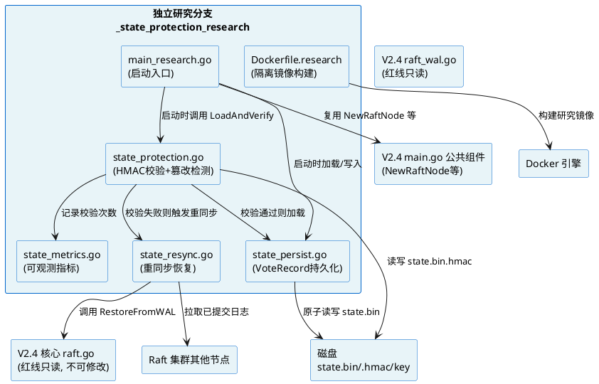
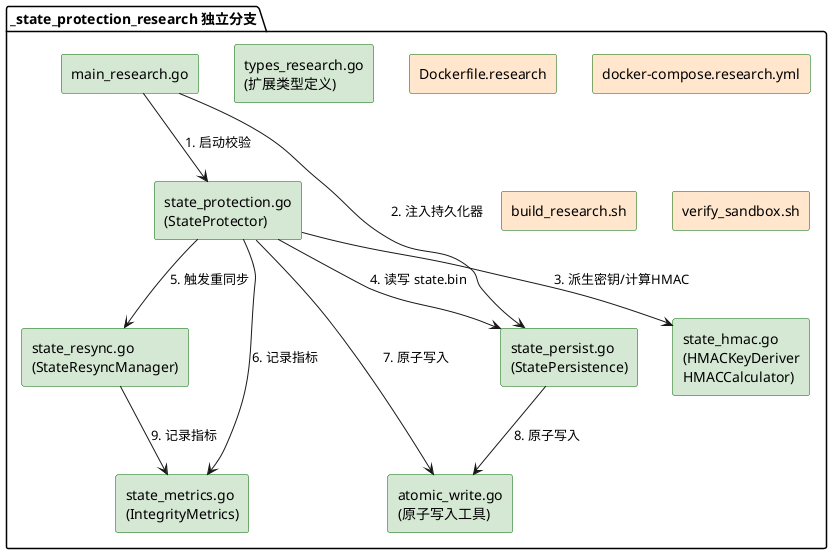
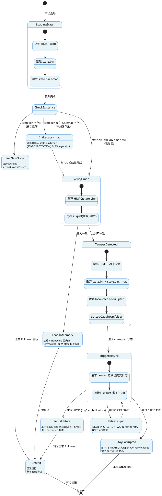
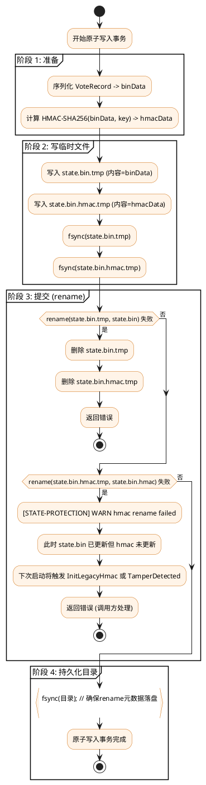
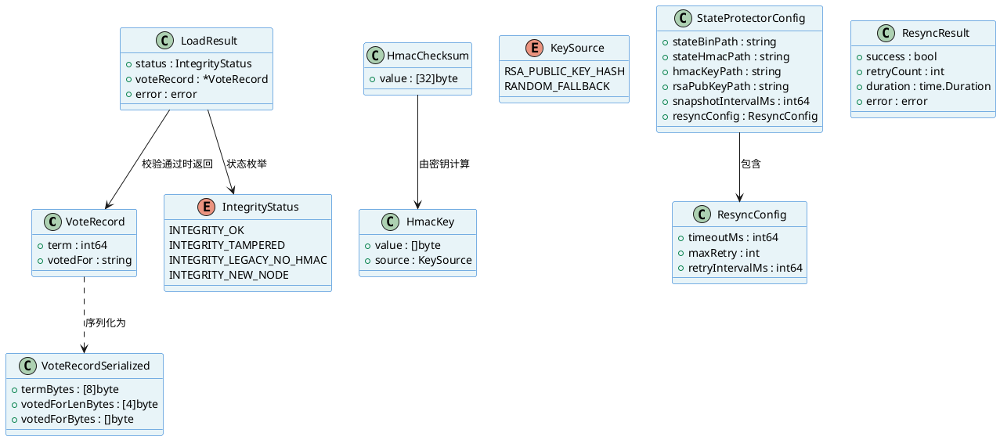

# 岱境235 V2.4独立分支 state.bin 完整性加固 技术设计文档

> **文档版本**: 1.0
> **生成时间**: 2026-08-31
> **对应需求**: spec.md v1.0（EARS 格式）
> **目标分支**: V2.4_Performance_Sandbox/_state_protection_research（独立研究分支）
> **基线红线**: raft.go MD5 = DD6F667133D2C9343CF43BC11A5B7C00（V2.2-S 主线绝对冻结）
> **最终定位**: V2.5 升级功能储备（暂不合并进 V2.2-S 主线）
> **设计原则**: 仅在 _state_protection_research 子目录内增量，零改动 V2.2-S 主线与 V2.4 核心 raft.go

---

# 一、需求与存量功能关系分析

## 1.1 需求功能与存量功能对比

### 1.1.1 已实现功能

经全量代码扫描（V2.2-S 主线 `D:\岱境235源码备份\daijin235_go_engine\` 与 V2.4 `<ARCHIVE>\V2.4_Performance_Sandbox\`），与本次需求相关的存量功能匹配情况如下：

| 需求功能 | 存量功能 | 代码位置 | 匹配度 |
|---------|---------|---------|--------|
| VoteRecord 类型定义（Term int64, VotedFor string） | VoteRecord 结构体已定义 | `V2.4_Performance_Sandbox/types.go:57-60` | 100% |
| RaftNode 内存 votedFor/term 字段 | RaftNode 结构体含 term int64 与 votedFor string 字段 | `V2.4_Performance_Sandbox/raft.go:58-59` | 100% |
| RaftNode 启动时 votedFor/term 初始化为空 | NewRaftNode 构造函数初始化 term=0, votedFor="" | `V2.4_Performance_Sandbox/raft.go:143-144` | 100% |
| WAL 日志持久化与回放（RaftLog） | WAL 预写式日志 + 批量 fsync + Replay 回放 | `V2.4_Performance_Sandbox/raft_wal.go:46-336` | 100% |
| WAL SM4-CTR 加密存储层 | EncryptedStorage 透明叠加在 WAL 之上 | `V2.4_Performance_Sandbox/raft_storage.go:43-170` | 100% |
| 节点启动 WAL 回放恢复日志 | main.go 中 pipeline.ReplayWAL() + node.RestoreFromWAL() | `V2.4_Performance_Sandbox/main.go:101-107` | 100% |
| RaftNode 日志追赶标志（logCaughtUp） | logCaughtUp bool 字段 + SetLogCaughtUp 方法 | `V2.4_Performance_Sandbox/raft.go:98, 184-188` | 100% |
| 节点状态枚举（Follower/Candidate/Leader） | NodeState int32 + StateXxx 常量 + String() | `V2.4_Performance_Sandbox/types.go:13-32` | 100% |
| 两阶段 Docker 镜像构建 | Dockerfile: golang:1.24-alpine → alpine:3.21 | `V2.4_Performance_Sandbox/Dockerfile:1-27` | 75% |
| 节点 HTTP /raft/status 端点 | main.go 中 /raft/status Handler | `V2.4_Performance_Sandbox/main.go:132-136` | 75% |

**匹配度判定依据**：
- **100%**：存量代码完全满足需求语义，无需改造即可复用。
- **75%**：存量代码部分满足，需在独立分支内扩展（如 Dockerfile 需新增 ARM64 交叉编译与研究镜像标签；HTTP 端点需新增 corrupted 状态暴露）。

### 1.1.2 需要扩展的功能

| 需求功能 | 存量功能 | 差异说明 | 扩展方向 |
|---------|---------|---------|---------|
| 节点启动流程接入 state.bin 校验 | main.go 启动流程仅回放 WAL 日志，无 state.bin 加载 | 启动流程缺少"加载持久化 VoteRecord"环节；需在 NewRaftNode 之后、Run 之前插入 state.bin 加载与 HMAC 校验 | 在独立分支 main_research.go 中包装启动流程，调用 StateProtector.LoadAndVerify |
| RaftNode 持久化 votedFor/term 变更 | raft.go 中 votedFor/term 变更（如 rn.votedFor = req.CandidateId）仅在内存，无持久化钩子 | raft.go 红线不可修改；需通过外部拦截或装饰器模式捕获变更 | 在独立分支提供 StatePersistenceAdapter，通过定期快照 + 变更监听持久化 VoteRecord |
| Dockerfile 支持 ARM64 + amd64 双架构 | Dockerfile 仅 amd64 单架构构建 | 缺少 ARM64 交叉编译目标；缺少研究镜像标签 | 在独立分支 Dockerfile.research 中新增 ARM64 build stage + 多架构 manifest |
| HTTP /raft/status 暴露 corrupted 状态 | /raft/status 仅输出 Follower/Candidate/Leader | 缺少 local-cache-corrupted 状态暴露 | 在独立分支扩展 stats 输出，新增 integrity_status 字段 |
| 节点状态枚举扩展 local-cache-corrupted | NodeState 仅 3 种状态 | 缺少第 4 种降级状态 | 在独立分支 types_research.go 中扩展 NodeState 枚举（不修改原 types.go） |

**扩展方向共性约束**：
1. 所有扩展必须在 `_state_protection_research` 子目录内通过新文件实现，禁止修改父目录任何文件。
2. 对 raft.go 的依赖仅限只读调用其公共方法（如 `node.RestoreFromWAL`、`node.SetLogCaughtUp`），禁止修改 raft.go 源码。
3. 扩展点通过 Go interface 注入，避免硬编码耦合。

### 1.1.3 需要新增的功能或接口

按业务模块分组，以下功能在存量代码中**完全没有对应实现**，需从零构建：

#### 模块 A：state.bin 持久化层（VoteRecord 二进制持久化）

| 功能点 | 输入 | 输出 | 核心逻辑 | 依赖 |
|--------|------|------|---------|------|
| VoteRecord 序列化 | VoteRecord{Term, VotedFor} | []byte（定长二进制） | int64 大端 + string 长度前缀 + string 字节 | 无 |
| state.bin 原子写入 | VoteRecord, 文件路径 | error | 写 .tmp → fsync → rename → fsync 目录 | os, io |
| state.bin 读取 | 文件路径 | VoteRecord, error | 读文件 → 反序列化 → 校验长度 | os, io |
| state.bin 文件权限控制 | 文件路径 | error | os.Chmod(path, 0600) | os |

#### 模块 B：HMAC-SHA256 校验层

| 功能点 | 输入 | 输出 | 核心逻辑 | 依赖 |
|--------|------|------|---------|------|
| HMAC 密钥派生（RSA 公钥路径） | RSA 公钥文件路径 | []byte（32 字节密钥） | 读公钥 → SHA-256 哈希 → 取前 32 字节 | crypto/sha256, crypto/rsa |
| HMAC 密钥派生回退（随机对称密钥） | 密钥文件路径 | []byte（32 字节密钥） | 检查文件存在 → 不存在则 crypto/rand 生成 32 字节 → 落盘 0600 | crypto/rand, os |
| HMAC-SHA256 计算 | []byte 数据, []byte 密钥 | [32]byte 校验和 | hmac.New(sha256.New, key) → Write 数据 → Sum | crypto/hmac, crypto/sha256 |
| state.bin.hmac 原子写入 | [32]byte 校验和, 文件路径 | error | 写 .tmp → fsync → rename → fsync 目录 | os, io |
| state.bin.hmac 读取 | 文件路径 | [32]byte, error | 读文件 → 校验长度 == 32 | os, io |
| HMAC 校验比对 | state.bin 数据, state.bin.hmac 数据, 密钥 | bool（一致/不一致） | 重算 HMAC → bytes.Equal | crypto/hmac |

#### 模块 C：篡改检测与自动降级

| 功能点 | 输入 | 输出 | 核心逻辑 | 依赖 |
|--------|------|------|---------|------|
| 启动时篡改检测 | state.bin 路径, state.bin.hmac 路径, 密钥 | DetectResult{Status, VoteRecord, Error} | 读 hmac → 读 state.bin → 重算 HMAC → 比对 → 分支处理 | 模块 A, 模块 B |
| 存量兼容检测 | state.bin 路径, state.bin.hmac 路径 | bool（是否存量） | state.bin 存在 && state.bin.hmac 不存在 | os |
| 存量 hmac 初始化 | state.bin 路径, 密钥 | error | 读 state.bin → 计算 HMAC → 写 state.bin.hmac | 模块 A, 模块 B |
| [CRITICAL] 告警输出 | 无 | 无（副作用） | fmt.Fprintf(os.Stderr, ...) + logger.Printf | log, os |
| 节点状态置为 corrupted | RaftNode 引用 | 无 | 设置扩展状态标志 + SetLogCaughtUp(false) | raft.go 公共方法 |
| 损坏文件丢弃 | state.bin 路径, state.bin.hmac 路径 | error | os.Remove(state.bin) + os.Remove(state.bin.hmac) | os |

#### 模块 D：重同步恢复

| 功能点 | 输入 | 输出 | 核心逻辑 | 依赖 |
|--------|------|------|---------|------|
| 重同步触发 | RaftNode 引用, Leader 地址 | error | 调用 Raft 日志拉取 RPC → 等待日志追赶 | raft.go, gRPC |
| 重同步完成检测 | RaftNode 引用 | bool | 检查 node.logCaughtUp == true && commitIdx >= leaderCommit | raft.go 公共方法 |
| 重同步后状态重建 | 拉取的日志, 密钥 | error | 重建 VoteRecord → 写 state.bin → 写 state.bin.hmac → 退出 corrupted | 模块 A, 模块 B |
| 重同步超时重试 | 重同步函数, 超时, 重试次数 | error | for 循环 + context.WithTimeout + 3 次重试 | context, time |

#### 模块 E：隔离构建与镜像生成

| 功能点 | 输入 | 输出 | 核心逻辑 | 依赖 |
|--------|------|------|---------|------|
| 独立分支 main 入口 | 启动参数 | 无（进程） | 复用 V2.4 main.go 逻辑 + 注入 StateProtector | V2.4 main.go |
| ARM64 交叉编译 | Go 源码 | ARM64 二进制 | GOOS=linux GOARCH=arm64 CGO_ENABLED=0 go build | go toolchain |
| amd64 交叉编译 | Go 源码 | amd64 二进制 | GOOS=linux GOARCH=amd64 CGO_ENABLED=0 go build | go toolchain |
| 研究镜像构建 | Dockerfile.research, 二进制 | Docker 镜像 | docker build -t daijin235-state-protection-research . | docker |

#### 模块 F：沙箱验证

| 功能点 | 输入 | 输出 | 核心逻辑 | 依赖 |
|--------|------|------|---------|------|
| 3 节点集群启动 | docker-compose.research.yml | 集群句柄 | docker-compose up -d → 等待 Leader 选出 | docker-compose |
| state.bin 篡改注入 | 节点容器 ID, 篡改字节 | 无（副作用） | docker exec → echo 篡改内容 > state.bin | docker |
| 节点重启 | 节点容器 ID | 无 | docker restart <container> | docker |
| 篡改检测验证 | 节点容器 ID | bool | docker logs <container> \| grep "[CRITICAL]" | docker |
| 重同步恢复验证 | 节点容器 ID | bool | 轮询 /raft/status → 检查 state == Follower && term 一致 | curl |
| 无脑裂验证 | 集群句柄 | bool | 全流程轮询 3 节点 /raft/status → Leader 数量始终 == 1 | curl |

#### 模块 G：可观测性

| 功能点 | 输入 | 输出 | 核心逻辑 | 依赖 |
|--------|------|------|---------|------|
| state_integrity_check_total 指标 | 无 | Prometheus 计数 | atomic.AddUint64 + /metrics 端点暴露 | net/http |
| state_integrity_check_failed_total 指标 | 无 | Prometheus 计数 | atomic.AddUint64 + /metrics 端点暴露 | net/http |
| [STATE-PROTECTION] 日志前缀 | 日志消息 | 无 | 统一前缀 fmt.Printf("[STATE-PROTECTION] ...") | log |

## 1.2 存量功能详细分析

### 1.2.1 VoteRecord 类型定义（types.go:57-60）

**接口契约**：
- 类型：`type VoteRecord struct { Term int64; VotedFor string }`
- 入参：无（纯数据结构）
- 出参：无
- 副作用：无

**业务规则**：
- Term 表示节点当前任期，必须 ≥ 0。
- VotedFor 表示本任期投票对象节点 ID，可为空（未投票）。
- 该结构仅在 types.go 中定义，**未被任何持久化逻辑引用**（经 grep 确认）。

**扩展点**：
- 无显式扩展点。可通过组合（embedding）在独立分支中扩展为 `VoteRecordWithHmac`。

**约束**：
- types.go 属于 V2.4 根目录，红线不可修改。
- 必须在独立分支内通过新文件 `types_research.go` 扩展类型。

### 1.2.2 RaftNode 内存 votedFor/term（raft.go:58-59, 143-144）

**接口契约**：
- 字段：`term int64`（通过 atomic.LoadInt64 读取）、`votedFor string`（通过 mu 锁保护）
- 写入时机：
  1. `handleElectionTimeout`（raft.go:345）：`rn.votedFor = rn.id`（自投）
  2. `HandleRequestVote`（raft.go:802）：`rn.votedFor = req.CandidateId`（投票给候选者）
  3. `HandleRequestVote`（raft.go:741, 749）：`rn.votedFor = ""`（更高 term 重置）
  4. `HandleAppendEntries`（raft.go:832, 837）：`rn.votedFor = ""`（更高 term 或同 term 回正）
- 读取时机：`HandleRequestVote`（raft.go:755）：`rn.votedFor != "" && rn.votedFor != req.CandidateId`（投票约束）

**业务规则**：
- Raft 协议要求 votedFor/term 必须持久化以防止节点重启后重复投票（同一任期投给不同候选者）。
- **当前实现违反此要求**：votedFor/term 仅在内存，节点重启后 votedFor 重置为空、term 重置为 0，理论上可在同一任期再次投票（实际因 term 重置为 0 不会触发，但这是隐患）。

**扩展点**：
- raft.go 红线不可修改，无法在 votedFor 赋值处直接插入持久化调用。
- 可通过以下间接方式捕获变更：
  1. **定期快照**：独立分支 goroutine 定期读取 node.Term() 与 node.Stats().VotedFor，与上次快照比对，变更时持久化。
  2. **Stats 桥接**：复用 node.Stats().Snapshot() 中的 "term" 与 "voted_for" 字段监听变更。
- 选定方案：**定期快照 + 启动加载**（详见 2.1.3 实现设计）。

**约束**：
- raft.go 红线绝对不可修改（MD5 = DD6F667133D2C9343CF43BC11A5B7C00）。
- 持久化逻辑必须在独立分支内通过外部装饰实现。

### 1.2.3 WAL 日志持久化（raft_wal.go:46-336）

**接口契约**：
- `NewWAL(path string) (*WAL, error)`：创建/打开 WAL，预分配 1GB
- `Append(entry walEntry) error`：追加日志到批量缓冲
- `Replay() ([]walEntry, error)`：回放所有有效记录
- `Close() error`：关闭 WAL

**业务规则**：
- WAL 仅持久化 **RaftLog**（日志条目），**不持久化 VoteRecord**。
- WAL 采用批量 group commit（256 条或 5ms 窗口，单次 fsync）。
- WAL 记录格式：`[4 字节大端长度][JSON payload]`。
- WAL 可叠加 SM4-CTR 加密层（EncryptedStorage）。

**扩展点**：
- WAL 设计为独立持久化层，不与 VoteRecord 持久化耦合。
- 本方案 **不复用 WAL** 持久化 VoteRecord，而是新建独立的 state.bin 文件，原因：
  1. WAL 是日志流（append-only），VoteRecord 是定长状态（覆盖写），语义不同。
  2. WAL 1GB 预分配对 64 字节 VoteRecord 过重。
  3. WAL 加密层（SM4-CTR）与 HMAC 校验层职责不同（加密 vs 完整性）。

**约束**：
- raft_wal.go 属于 V2.4 根目录，红线不可修改。
- state.bin 必须独立于 WAL，同目录但不同文件。

### 1.2.4 节点启动流程（main.go:86-110）

**接口契约**：
- 启动顺序：
  1. 解析配置（main.go:36-48）
  2. 连接 peer（main.go:80-84）
  3. NewRaftNode（main.go:86）
  4. NewRaftPipeline + SetOnCommit（main.go:91-96）
  5. pipeline.ReplayWAL + node.RestoreFromWAL（main.go:101-107）
  6. NewGRPCServer + Start（main.go:112-116）
  7. HTTP 端点注册（main.go:118-161）
  8. errgroup 启动 gRPC/Raft/HTTP（main.go:165-200）

**业务规则**：
- 启动流程中 **无 state.bin 加载环节**。
- WAL 回放仅恢复 logs/commitIdx/lastApplied/term（RestoreFromWAL at raft.go:192-218），**不恢复 votedFor**。

**扩展点**：
- main.go 属于 V2.4 根目录，红线不可修改。
- 必须在独立分支内通过 **新 main 入口**（main_research.go）重新组装启动流程，插入 state.bin 加载与校验环节。

**约束**：
- 独立分支 main 入口必须复用 V2.4 的所有公共组件（NewRaftNode、NewRaftPipeline、NewGRPCServer 等），仅在外层包装 StateProtector。
- 编译产物必须为独立二进制（如 gateway_research），与 V2.4 gateway 隔离。

### 1.2.5 Docker 镜像构建（Dockerfile:1-27）

**接口契约**：
- 两阶段构建：
  1. Stage 1（builder）：golang:1.24-alpine，CGO_ENABLED=0 GOOS=linux GOARCH=amd64 go build
  2. Stage 2（runtime）：alpine:3.21，复制 /gateway，EXPOSE 9500 9000
- 产物：单架构 amd64 镜像

**业务规则**：
- 仅支持 amd64 单架构。
- 镜像名默认为目录名（未显式命名）。
- 无 ARM64 支持。

**扩展点**：
- Dockerfile 属于 V2.4 根目录，红线不可修改。
- 必须在独立分支内通过 **新 Dockerfile**（Dockerfile.research）实现：
  1. 多架构支持（ARM64 + amd64）
  2. 研究镜像标签（daijin235-state-protection-research）
  3. 复用 V2.4 的两阶段构建模式

**约束**：
- 研究镜像必须与 V2.2-S 商业镜像名不同（带 _research 后缀）。
- 禁止复用 V2.2-S 商业镜像的任何标签或镜像 ID。

### 1.2.6 RaftNode 公共方法（可复用接口）

以下 RaftNode 公共方法可在独立分支中只读调用（不修改 raft.go）：

| 方法 | 签名 | 用途 | 调用时机 |
|------|------|------|---------|
| `ID()` | `func (rn *RaftNode) ID() string` | 获取节点 ID | 日志/标识 |
| `Term()` | `func (rn *RaftNode) Term() int64` | 获取当前 term（atomic 读） | 快照比对 |
| `State()` | `func (rn *RaftNode) State() NodeState` | 获取节点状态 | 状态监控 |
| `LeaderID()` | `func (rn *RaftNode) LeaderID() string` | 获取 Leader ID | 重同步请求 |
| `Stats()` | `func (rn *RaftNode) Stats() *RaftStats` | 获取统计（含 VotedFor） | 快照比对 |
| `SetLogCaughtUp(bool)` | `func (rn *RaftNode) SetLogCaughtUp(caughtUp bool)` | 设置日志追赶标志 | corrupted 时设 false |
| `RestoreFromWAL([]RaftLog)` | `func (rn *RaftNode) RestoreFromWAL(logs []RaftLog)` | 从 WAL 恢复日志 | 重同步后恢复 |
| `Shutdown()` | `func (rn *RaftNode) Shutdown()` | 安全关闭 | 优雅退出 |

**关键约束**：
- `term` 字段通过 `atomic.LoadInt64` 读取（Term() 方法），但写入通过 mu 锁保护。
- `votedFor` 字段无公共读取方法，仅通过 `Stats().VotedFor` 间接读取（需 RLock）。
- **无法直接设置 term/votedFor**：raft.go 未暴露 setter，独立分支无法在重同步后直接覆盖 term/votedFor。需通过"重启节点 + 加载新 state.bin"间接实现。

---

# 二、增量设计方案

## 2.1 实现模型

### 2.1.1 上下文视图

本组件（_state_protection_research）与外部系统的交互关系如下：



**通信协议与调用频率**：
- main → protector：启动时 1 次
- protector → persist：启动时 1 次（校验通过）或 0 次（校验失败）
- protector → resync：校验失败时 1 次
- persist → disk：每次 term/votedFor 变更时（定期快照，默认 100ms 间隔）
- resync → peers：corrupted 状态时周期性重试（默认 1s 间隔，3 次重试）
- protector → metrics：每次校验时

### 2.1.2 服务/组件总体架构

独立分支内部组件划分与职责：



**模块职责说明**：

| 模块 | 文件 | 职责 | 依赖 |
|------|------|------|------|
| 启动入口 | main_research.go | 组装启动流程，注入 StateProtector | 所有模块 |
| 篡改检测 | state_protection.go | 启动校验、篡改检测、自动降级、告警 | state_persist, state_hmac, state_resync, state_metrics |
| 持久化 | state_persist.go | VoteRecord 序列化/反序列化、state.bin 读写 | atomic_write |
| HMAC 校验 | state_hmac.go | 密钥派生、HMAC 计算、校验和读写 | atomic_write |
| 重同步 | state_resync.go | 重同步触发、完成检测、状态重建、超时重试 | state_persist, state_hmac |
| 可观测 | state_metrics.go | Prometheus 计数指标、日志前缀 | 无 |
| 类型扩展 | types_research.go | IntegrityStatus 枚举、StateProtectorConfig | 无 |
| 原子写入 | atomic_write.go | 临时文件 + rename 原子写入工具 | os, io |
| 镜像构建 | Dockerfile.research | 多架构研究镜像构建 | docker |
| 集群编排 | docker-compose.research.yml | 3 节点研究集群 | docker |
| 构建脚本 | build_research.sh | 交叉编译 + 镜像构建自动化 | go, docker |
| 验证脚本 | verify_sandbox.sh | 沙箱验证自动化 | docker, curl |

**配置项及取值策略**：

| 配置项 | 环境变量 | 默认值 | 取值策略 |
|--------|---------|--------|---------|
| state.bin 路径 | STATE_BIN_PATH | /app/data/state.bin | 与 WAL 同目录 |
| state.bin.hmac 路径 | STATE_HMAC_PATH | /app/data/state.bin.hmac | state.bin + ".hmac" |
| HMAC 密钥文件路径 | STATE_HMAC_KEY_PATH | /app/data/state_hmac_key.bin | 仅回退模式使用 |
| RSA 公钥路径 | RSA_PUBLIC_KEY_PATH | /app/keys/public.pem | 优先派生源 |
| 快照间隔 | STATE_SNAPSHOT_INTERVAL_MS | 100 | 平衡 IO 开销与持久化粒度 |
| 重同步超时 | STATE_RESYNC_TIMEOUT_MS | 10000 | spec 4.1 规则3 要求 ≤ 10s |
| 重同步重试次数 | STATE_RESYNC_MAX_RETRY | 3 | spec 5.3.1 规则3 要求 |
| 重同步重试间隔 | STATE_RESYNC_RETRY_INTERVAL_MS | 1000 | 周期性重试 |

### 2.1.3 实现设计文档

#### 2.1.3.1 启动流程状态机

节点启动时的 state.bin 校验与降级状态流转：



**分支触发条件与处理策略**：

| 分支 | 触发条件 | 处理策略 | 验收映射 |
|------|---------|---------|---------|
| InitNewNode | state.bin 不存在 | 初始化空状态，正常启动 | spec 5.2.3 场景2 |
| InitLegacyHmac | state.bin 存在 && hmac 不存在 | 初始化 hmac，正常加载 | FA-08, RC-04 |
| LoadToMemory | HMAC 比对一致 | 加载至内存，正常启动 | FA-04 |
| TamperDetected | HMAC 比对不一致 | 告警 + 丢弃 + 降级 | FA-05, FA-06, FA-07 |
| RebuildState | 重同步成功 | 重建 state.bin + hmac，恢复 | FA-10 |
| RetryResync | 重同步超时且重试 < 3 | 等待 1s 重试 | FA-11 |
| StayCorrupted | 重试 3 次仍失败 | 保持 corrupted，不服务 | FA-11 |

#### 2.1.3.2 持久化快照流程（运行时）

运行时 votedFor/term 变更的持久化采用定期快照策略（因 raft.go 红线不可修改，无法在变更点插入钩子）：

```plantuml
@startuml
skinparam activity {
    BackgroundColor #E8F4F8
    BorderColor #0066CC
}

start
:启动快照 goroutine;
repeat
  :睡眠 STATE_SNAPSHOT_INTERVAL_MS (默认 100ms);
  :读取 node.Term() (atomic);
  :读取 node.Stats().VotedFor (RLock);
  if (term != lastSnapshotTerm || votedFor != lastSnapshotVotedFor) then (有变更)
    :序列化 VoteRecord{term, votedFor};
    :派生 HMAC 密钥;
    :计算 HMAC-SHA256(state.bin 内容);
    :原子写入 state.bin.tmp;
    :原子写入 state.bin.hmac.tmp;
    :rename state.bin.tmp -> state.bin;
    :rename state.bin.hmac.tmp -> state.bin.hmac;
    :更新 lastSnapshotTerm/VotedFor;
    :metrics.state_integrity_check_total++;
  else (无变更)
    :跳过本次快照;
  endif
until (收到 shutdown 信号)
:快照 goroutine 退出;
stop

@enduml
```

**快照策略选择理由**：
1. **不可修改 raft.go**：无法在 `rn.votedFor = req.CandidateId` 等变更点直接插入持久化调用。
2. **定期快照的代价**：最坏情况丢失 100ms 内的 votedFor 变更，但节点重启后通过 Raft 协议（更高 term 拒绝旧投票）可自愈，不影响安全性。
3. **替代方案排除**：
   - 反射劫持字段：Go 反射无法设置非导出字段（votedFor 小写），排除。
   - fork raft.go：违反红线约束，排除。
   - gRPC 拦截器：投票请求经 gRPC，但 votedFor 变更也可能由 AppendEntries 触发（rn.votedFor = ""），拦截不全，排除。

#### 2.1.3.3 原子写入事务设计

state.bin 与 state.bin.hmac 的原子写入事务（保证不出现 state.bin 已更新而 hmac 未更新的中间状态）：



**事务设计决策**：
1. **先写 state.bin.tmp 再写 state.bin.hmac.tmp**：两者均为临时文件，对运行中节点不可见。
2. **先 rename state.bin 再 rename state.bin.hmac**：若 state.bin rename 成功但 state.bin.hmac rename 失败，下次启动时 state.bin 存在但 hmac 不存在，触发 InitLegacyHmac 分支（存量兼容），不会误判为篡改。
3. **反向 rename 顺序的风险**：若先 rename hmac 再 rename bin，hmac 存在但 bin 不存在时，下次启动会误判为"state.bin 被删除"（InitNewNode），丢失 votedFor 状态。因此选择前者。
4. **fsync 目录**：rename 操作的元数据需 fsync 目录才持久化，避免崩溃后 rename 丢失。

## 2.2 接口设计

### 2.2.1 总体设计

接口分类与稳定性等级：

| 接口分类 | 接口名 | 稳定性 | 用途 |
|---------|--------|--------|------|
| 启动校验 | StateProtector | 稳定 | 启动时校验与降级编排 |
| 持久化 | StatePersistence | 稳定 | state.bin 读写 |
| HMAC 校验 | HMACKeyDeriver | 稳定 | 密钥派生 |
| HMAC 校验 | HMACCalculator | 稳定 | HMAC 计算与比对 |
| 重同步 | StateResyncManager | 稳定 | 重同步编排 |
| 可观测 | IntegrityMetrics | 稳定 | 指标暴露 |
| 原子写入 | AtomicWriter | 稳定 | 原子写入工具 |
| 类型扩展 | IntegrityStatus | 稳定 | 降级状态枚举 |

**接口继承体系**：无继承，采用组合关系。
**接口变更策略**：本方案为 V2.5 储备，接口在独立分支内可自由演进；合并进主线时冻结。

### 2.2.2 接口清单

#### 2.2.2.1 StateProtector（篡改检测与降级编排）

**接口签名**：
```go
// StateProtector state.bin 完整性保护器
// 负责启动时校验、篡改检测、自动降级编排
type StateProtector struct {
    config      StateProtectorConfig
    persistence StatePersistence
    hmac        HMACCalculator
    keyDeriver  HMACKeyDeriver
    resync      StateResyncManager
    metrics     IntegrityMetrics
    logger      Logger
}

// NewStateProtector 创建完整性保护器
func NewStateProtector(cfg StateProtectorConfig, logger Logger) (*StateProtector, error)

// LoadAndVerify 启动时加载并校验 state.bin
// 返回校验结果与可能恢复的 VoteRecord
func (sp *StateProtector) LoadAndVerify() (LoadResult, error)

// StartSnapshotLoop 启动运行时定期快照 goroutine
// 监听 node.Term() 与 node.Stats().VotedFor 变更并持久化
func (sp *StateProtector) StartSnapshotLoop(node *RaftNode) func()

// PersistVoteRecord 持久化 VoteRecord 并同步写入 hmac
// 由快照循环调用
func (sp *StateProtector) PersistVoteRecord(vr VoteRecord) error

// Shutdown 优雅关闭，停止快照循环
func (sp *StateProtector) Shutdown() error
```

**业务说明**：StateProtector 是本组件的编排核心，协调持久化、HMAC 校验、重同步、指标四个子模块。启动时由 main_research.go 调用 LoadAndVerify 完成校验，运行时由 StartSnapshotLoop 启动快照循环。

**前置条件**：
- config 中所有路径配置已就绪
- logger 非 nil

**后置条件**：
- LoadAndVerify 返回后，state.bin 与 state.bin.hmac 处于一致状态（校验通过）或已丢弃（校验失败）
- StartSnapshotLoop 返回的 stop 函数被调用后，快照 goroutine 退出

**异常映射**：

| 错误类型 | 错误码 | 处理策略 |
|---------|--------|---------|
| ErrStateBinNotFound | STATE_BIN_NOT_FOUND | 视为新节点，初始化空状态 |
| ErrHmacFileNotFound | HMAC_FILE_NOT_FOUND | 视为未加固存量，初始化 hmac |
| ErrHmacMismatch | HMAC_MISMATCH | 篡改检测，进入 corrupted 状态 |
| ErrKeyDeriveFailed | KEY_DERIVE_FAILED | 密钥派生失败，节点无法启动 |
| ErrPersistFailed | PERSIST_FAILED | 持久化失败，返回错误至调用方 |

**调用示例**：
```go
// main_research.go 启动流程片段
protector, err := NewStateProtector(cfg, logger)
if err != nil {
    log.Fatalf("[STATE-PROTECTION] 保护器初始化失败: %v", err)
}

result, err := protector.LoadAndVerify()
if err != nil {
    log.Fatalf("[STATE-PROTECTION] 启动校验失败: %v", err)
}

if result.Status == IntegrityTampered {
    // 进入 corrupted 状态，触发重同步
    // 重同步由 protector 内部编排，此处无需额外处理
    fmt.Fprintf(os.Stderr, "[CRITICAL] state.bin integrity check failed\n")
}

if result.Status == IntegrityOK && result.VoteRecord != nil {
    // 校验通过，加载 VoteRecord 至内存
    // 注意：由于 raft.go 未暴露 setter，此处通过扩展的 RestoreVoteRecord 方法加载
    node.RestoreVoteRecord(*result.VoteRecord)
}

stopSnapshot := protector.StartSnapshotLoop(node)
defer stopSnapshot()
```

#### 2.2.2.2 StatePersistence（state.bin 读写）

**接口签名**：
```go
// StatePersistence state.bin 持久化层
type StatePersistence struct {
    binPath     string
    atomicWriter AtomicWriter
}

// NewStatePersistence 创建持久化层
func NewStatePersistence(binPath string) *StatePersistence

// Save 持久化 VoteRecord 至 state.bin（原子写入）
func (sp *StatePersistence) Save(vr VoteRecord) error

// Load 读取 state.bin 并反序列化为 VoteRecord
func (sp *StatePersistence) Load() (VoteRecord, error)

// Exists 检查 state.bin 是否存在
func (sp *StatePersistence) Exists() bool

// Discard 丢弃 state.bin（篡改后调用）
func (sp *StatePersistence) Discard() error

// Serialize 序列化 VoteRecord 为二进制
// 格式: [8 字节 int64 大端 term][4 字节 int32 大端 votedFor 长度][votedFor 字节]
func (sp *StatePersistence) Serialize(vr VoteRecord) []byte

// Deserialize 反序列化二进制为 VoteRecord
func (sp *StatePersistence) Deserialize(data []byte) (VoteRecord, error)
```

**业务说明**：StatePersistence 负责 state.bin 的二进制读写，与 HMAC 校验层解耦。序列化格式为定长二进制（非 JSON），以减少文件大小与解析开销。

**前置条件**：
- binPath 已配置
- Serialize/Deserialize 的数据格式互逆

**后置条件**：
- Save 后 state.bin 文件权限为 0600
- Save 通过临时文件 + rename 保证原子性

**调用示例**：
```go
persist := NewStatePersistence("/app/data/state.bin")
err := persist.Save(VoteRecord{Term: 5, VotedFor: "node-2"})
// state.bin 内容: [00 00 00 00 00 00 00 05][00 00 00 06]["node-2"]
```

#### 2.2.2.3 HMACKeyDeriver（密钥派生）

**接口签名**：
```go
// HMACKeyDeriver HMAC 密钥派生器
type HMACKeyDeriver struct {
    rsaPubKeyPath string
    fallbackKeyPath string
}

// NewHMACKeyDeriver 创建密钥派生器
func NewHMACKeyDeriver(rsaPubKeyPath, fallbackKeyPath string) *HMACKeyDeriver

// Derive 派生 HMAC-SHA256 密钥（32 字节）
// 优先: RSA 公钥的 SHA-256 哈希
// 回退: 本地随机对称密钥（落盘 0600）
func (kd *HMACKeyDeriver) Derive() ([]byte, error)

// IsFromRSA 密钥是否派生自 RSA 公钥
func (kd *HMACKeyDeriver) IsFromRSA() bool
```

**业务说明**：密钥派生遵循"优先 RSA 公钥哈希，回退随机对称密钥"策略。回退密钥首次生成后落盘至 state_hmac_key.bin（0600），后续启动复用，禁止每次重新生成。

**前置条件**：
- rsaPubKeyPath 或 fallbackKeyPath 至少一个可访问

**后置条件**：
- 返回的密钥长度为 32 字节
- 若使用回退密钥，state_hmac_key.bin 文件权限为 0600

**调用示例**：
```go
deriver := NewHMACKeyDeriver("/app/keys/public.pem", "/app/data/state_hmac_key.bin")
key, err := deriver.Derive()
// 若 RSA 公钥存在: key = SHA-256(public.pem 内容)
// 若 RSA 公钥不存在: key = state_hmac_key.bin 内容（首次生成随机 32 字节）
```

#### 2.2.2.4 HMACCalculator（HMAC 计算与校验和读写）

**接口签名**：
```go
// HMACCalculator HMAC-SHA256 计算器与校验和文件管理
type HMACCalculator struct {
    hmacPath     string
    atomicWriter AtomicWriter
}

// NewHMACCalculator 创建 HMAC 计算器
func NewHMACCalculator(hmacPath string) *HMACCalculator

// Compute 计算 data 的 HMAC-SHA256
func (hc *HMACCalculator) Compute(data, key []byte) [32]byte

// SaveHmac 持久化 HMAC 校验和至 state.bin.hmac（原子写入）
func (hc *HMACCalculator) SaveHmac(hmac [32]byte) error

// LoadHmac 读取 state.bin.hmac
func (hc *HMACCalculator) LoadHmac() ([32]byte, error)

// ExistsHmac 检查 state.bin.hmac 是否存在
func (hc *HMACCalculator) ExistsHmac() bool

// Verify 校验 data 的 HMAC 是否与给定的 expectedHmac 一致
func (hc *HMACCalculator) Verify(data, key []byte, expectedHmac [32]byte) bool

// DiscardHmac 丢弃 state.bin.hmac（篡改后调用）
func (hc *HMACCalculator) DiscardHmac() error
```

**业务说明**：HMACCalculator 封装 crypto/hmac + crypto/sha256，负责 HMAC 计算与校验和文件的原子读写。

**前置条件**：
- key 长度为 32 字节
- hmacPath 已配置

**后置条件**：
- SaveHmac 后 state.bin.hmac 文件权限为 0600
- Verify 返回 true 当且仅当 HMAC-SHA256(data, key) == expectedHmac

**调用示例**：
```go
calc := NewHMACCalculator("/app/data/state.bin.hmac")
hmac := calc.Compute(binData, key)
err := calc.SaveHmac(hmac)
// state.bin.hmac 内容: 32 字节 HMAC-SHA256 校验和

loaded, err := calc.LoadHmac()
ok := calc.Verify(binData, key, loaded) // true=一致, false=篡改
```

#### 2.2.2.5 StateResyncManager（重同步编排）

**接口签名**：
```go
// StateResyncManager 重同步恢复管理器
type StateResyncManager struct {
    config    ResyncConfig
    metrics   IntegrityMetrics
    logger    Logger
}

// ResyncConfig 重同步配置
type ResyncConfig struct {
    TimeoutMs       int64 // 单次重同步超时，默认 10000
    MaxRetry        int   // 最大重试次数，默认 3
    RetryIntervalMs int64 // 重试间隔，默认 1000
}

// NewStateResyncManager 创建重同步管理器
func NewStateResyncManager(cfg ResyncConfig, metrics IntegrityMetrics, logger Logger) *StateResyncManager

// TriggerResync 触发重同步
// node: 当前节点（调用其 RestoreFromWAL 恢复日志）
// 返回重同步结果
func (rm *StateResyncManager) TriggerResync(node *RaftNode) ResyncResult

// ResyncResult 重同步结果
type ResyncResult struct {
    Success    bool
    RetryCount int
    Duration   time.Duration
    Error      error
}
```

**业务说明**：StateResyncManager 在节点进入 corrupted 状态后触发，从 Leader 拉取已提交日志，重建本地状态。支持超时重试（3 次），重试失败则保持 corrupted 状态。

**前置条件**：
- 节点已进入 local-cache-corrupted 状态
- 集群多数派节点存活

**后置条件**：
- Success=true 时，节点 state.bin 与 state.bin.hmac 已重建，退出 corrupted 状态
- Success=false 时，节点保持 corrupted 状态，不参与集群服务

**调用示例**：
```go
resync := NewStateResyncManager(ResyncConfig{
    TimeoutMs: 10000, MaxRetry: 3, RetryIntervalMs: 1000,
}, metrics, logger)

result := resync.TriggerResync(node)
if !result.Success {
    logger.Printf("[STATE-PROTECTION] ERROR resync failed after %d retries", result.RetryCount)
}
```

#### 2.2.2.6 IntegrityMetrics（可观测指标）

**接口签名**：
```go
// IntegrityMetrics 完整性校验可观测指标
type IntegrityMetrics struct {
    checkTotal     uint64 // atomic
    checkFailedTotal uint64 // atomic
}

// NewIntegrityMetrics 创建指标收集器
func NewIntegrityMetrics() *IntegrityMetrics

// IncCheckTotal 校验总次数 +1
func (m *IntegrityMetrics) IncCheckTotal()

// IncCheckFailed 校验失败总次数 +1
func (m *IntegrityMetrics) IncCheckFailed()

// PrometheusFormat 输出 Prometheus 格式指标
func (m *IntegrityMetrics) PrometheusFormat() string

// RegisterHTTPHandler 注册 /metrics HTTP 端点
func (m *IntegrityMetrics) RegisterHTTPHandler(mux *http.ServeMux)
```

**业务说明**：暴露 state_integrity_check_total 与 state_integrity_check_failed_total 两个 Prometheus 计数指标，通过 /metrics 端点暴露。

**调用示例**：
```go
metrics := NewIntegrityMetrics()
metrics.IncCheckTotal()
if hmacMismatch {
    metrics.IncCheckFailed()
}
metrics.RegisterHTTPHandler(httpMux) // /metrics 端点
```

#### 2.2.2.7 AtomicWriter（原子写入工具）

**接口签名**：
```go
// AtomicWriter 原子写入工具（临时文件 + rename）
type AtomicWriter struct{}

// NewAtomicWriter 创建原子写入器
func NewAtomicWriter() *AtomicWriter

// WriteAtomic 原子写入数据至目标路径
// 流程: 写 .tmp -> fsync -> rename -> fsync(目录)
func (aw *AtomicWriter) WriteAtomic(path string, data []byte, perm os.FileMode) error
```

**业务说明**：封装"临时文件 + fsync + rename + fsync 目录"的原子写入模式，被 StatePersistence 与 HMACCalculator 复用。

**调用示例**：
```go
aw := NewAtomicWriter()
err := aw.WriteAtomic("/app/data/state.bin", binData, 0600)
```

## 2.3 数据模型

### 2.3.1 设计目标

**需支持的业务场景**：
1. VoteRecord（term + votedFor）的持久化与恢复
2. state.bin 完整性校验（HMAC-SHA256）
3. 篡改检测与自动降级
4. 重同步后状态重建
5. 存量无 hmac 的 state.bin 兼容

**性能、容量、扩展性目标**：
- state.bin 大小约 64 字节（int64 + string），HMAC 计算耗时 ≤ 1ms
- 启动延迟增量 ≤ 50ms（一次文件读 + 一次 HMAC 计算）
- 重同步完成时间 ≤ 10s

**与存量数据的兼容策略**：
- 存量 state.bin（无 hmac）首次启动时触发 hmac 初始化，不判废
- 存量 state.bin 格式（若存在）必须与本方案序列化格式兼容；若不兼容则视为篡改（HMAC 不匹配）
- 由于当前代码无 state.bin 实现，本方案为首次引入，无存量兼容负担

### 2.3.2 模型实现

核心领域对象的类图：



**对象之间的关系**：
- VoteRecord（已存在于 types.go）→ VoteRecordSerialized：序列化关系，1:1
- HmacChecksum ← HmacKey：校验和由密钥参与计算，依赖关系
- StateProtectorConfig ∘ ResyncConfig：组合关系，1:1
- LoadResult → IntegrityStatus：枚举引用
- LoadResult → VoteRecord：可选引用（校验通过时非 nil）

**对象创建和销毁策略**：
- VoteRecord：值类型，按需创建，无销毁开销
- HmacKey：启动时创建一次，全程复用，无销毁
- StateProtector：启动时创建，节点关闭时 Shutdown
- IntegrityMetrics：启动时创建，随 HTTP 端点生命周期

**持久化策略**（不包含表结构）：

| 对象 | 持久化文件 | 格式 | 大小 | 权限 | 写入时机 |
|------|-----------|------|------|------|---------|
| VoteRecord | state.bin | 二进制：[8B term][4B votedForLen][votedFor] | ~64B | 0600 | term/votedFor 变更时（快照） |
| HmacChecksum | state.bin.hmac | 原始 32 字节 | 32B | 0600 | 紧随 state.bin 写入后 |
| HmacKey（回退） | state_hmac_key.bin | 原始 32 字节 | 32B | 0600 | 首次生成时一次 |

**state.bin 二进制格式详细定义**：

```
偏移   大小   字段             类型           编码
0      8      term            int64          大端 (BigEndian)
8      4      votedForLen     int32          大端 (BigEndian)
12     N      votedFor        UTF-8 字节     原始字节
12+N   -      (结束)          -              -
```

- 总大小 = 12 + len(votedFor) 字节
- votedFor 为空时 votedForLen = 0，总大小 = 12 字节
- 典型场景（votedFor = "node-2"，6 字节）：总大小 = 18 字节
- spec 6.1 描述"约 64 字节"为预留上限，实际通常更小

**state.bin.hmac 文件格式**：

```
偏移   大小   字段             类型           编码
0      32     hmac            [32]byte       原始字节 (HMAC-SHA256 输出)
32     -      (结束)          -              -
```

- 固定 32 字节，无长度前缀
- 内容为 HMAC-SHA256(state.bin 全部内容, key)

**state_hmac_key.bin 文件格式**（仅回退模式）：

```
偏移   大小   字段             类型           编码
0      32     key             [32]byte       原始字节 (crypto/rand 输出)
32     -      (结束)          -              -
```

- 固定 32 字节（256 位对称密钥）
- 仅在 RSA 公钥不可用时存在
- 首次生成后持久化，后续启动复用

---

# 三、隔离镜像构建设计

## 3.1 Dockerfile.research 设计

```dockerfile
# ---- Stage 1: Builder (多架构) ----
FROM golang:1.24-alpine AS builder

ENV GOPROXY=https://goproxy.cn,direct
ENV GO111MODULE=on
ARG TARGETOS=linux
ARG TARGETARCH=amd64

WORKDIR /build

# 复制 V2.4 源码（含 vendor）
COPY go.mod go.sum ./
RUN go mod download

COPY . .

# 构建独立分支入口（main_research.go）
RUN CGO_ENABLED=0 GOOS=${TARGETOS} GOARCH=${TARGETARCH} \
    go build -ldflags="-s -w" -o /gateway_research ./cmd/state-protection-research/

# ---- Stage 2: Runtime ----
FROM alpine:3.21

RUN sed -i 's/dl-cdn.alpinelinux.org/mirrors.aliyun.com/g' /etc/apk/repositories
RUN apk add --no-cache ca-certificates tzdata curl
ENV TZ=Asia/Shanghai

WORKDIR /app
RUN mkdir -p /app/data /app/keys
COPY --from=builder /gateway_research .

EXPOSE 9500 9000
ENTRYPOINT ["./gateway_research"]
```

**设计决策**：
1. **复用 V2.4 两阶段构建模式**：golang:1.24-alpine → alpine:3.21，与 V2.4 Dockerfile 一致。
2. **多架构支持**：通过 `ARG TARGETOS/TARGETARCH` 接收 docker buildx 注入的目标架构，支持 ARM64 与 amd64。
3. **独立入口**：构建 `./cmd/state-protection-research/` 下的 main_research.go，而非根目录 main.go，确保独立分支入口。
4. **研究镜像标签**：`daijin235-state-protection-research`，与商业镜像名完全隔离。
5. **数据/密钥目录**：预创建 /app/data 与 /app/keys，分别存放 state.bin 与 RSA 公钥。

## 3.2 交叉编译脚本 build_research.sh

```bash
#!/bin/bash
# build_research.sh - 独立分支交叉编译 + 研究镜像构建
set -euo pipefail

IMAGE_NAME="daijin235-state-protection-research"
IMAGE_TAG="v2.4-research"

# 1. 交叉编译 ARM64
echo "[BUILD] 编译 ARM64..."
GOOS=linux GOARCH=arm64 CGO_ENABLED=0 \
  go build -ldflags="-s -w" \
  -o dist/gateway_research_arm64 \
  ./cmd/state-protection-research/

# 2. 交叉编译 amd64
echo "[BUILD] 编译 amd64..."
GOOS=linux GOARCH=amd64 CGO_ENABLED=0 \
  go build -ldflags="-s -w" \
  -o dist/gateway_research_amd64 \
  ./cmd/state-protection-research/

# 3. 构建研究镜像（多架构）
echo "[BUILD] 构建研究镜像..."
docker buildx build \
  --platform linux/arm64,linux/amd64 \
  -t ${IMAGE_NAME}:${IMAGE_TAG} \
  -f Dockerfile.research \
  --push .

echo "[BUILD] 完成: ${IMAGE_NAME}:${IMAGE_TAG}"
```

## 3.3 镜像隔离保证

| 隔离维度 | V2.2-S 商业镜像 | 研究镜像 | 隔离手段 |
|---------|----------------|---------|---------|
| 镜像名 | daijin235-gateway | daijin235-state-protection-research | _research 后缀 |
| 标签 | v22s | v2.4-research | 不同标签体系 |
| 入口二进制 | /gateway | /gateway_research | 不同二进制名 |
| 源码路径 | daijin235_go_engine/ | _state_protection_research/ | 不同源码目录 |
| 构建上下文 | V2.2-S 源码 | 独立分支源码 | 不同 Dockerfile |

---

# 四、沙箱验证方案设计

## 4.1 3 节点集群编排（docker-compose.research.yml）

```yaml
version: '3.8'
services:
  node-1:
    image: daijin235-state-protection-research:v2.4-research
    container_name: research-node-1
    environment:
      NODE_ID: node-1
      GRPC_PORT: 9500
      HTTP_PORT: 9000
      PEERS: "node-2=node-2:9500,node-3=node-3:9500"
      STATE_BIN_PATH: /app/data/state.bin
      STATE_HMAC_PATH: /app/data/state.bin.hmac
      STATE_HMAC_KEY_PATH: /app/data/state_hmac_key.bin
    ports:
      - "9500:9500"
      - "9000:9000"
    volumes:
      - node1-data:/app/data
    networks:
      - research-net

  node-2:
    image: daijin235-state-protection-research:v2.4-research
    container_name: research-node-2
    environment:
      NODE_ID: node-2
      GRPC_PORT: 9500
      HTTP_PORT: 9000
      PEERS: "node-1=node-1:9500,node-3=node-3:9500"
      STATE_BIN_PATH: /app/data/state.bin
      STATE_HMAC_PATH: /app/data/state.bin.hmac
      STATE_HMAC_KEY_PATH: /app/data/state_hmac_key.bin
    ports:
      - "9501:9500"
      - "9001:9000"
    volumes:
      - node2-data:/app/data
    networks:
      - research-net

  node-3:
    image: daijin235-state-protection-research:v2.4-research
    container_name: research-node-3
    environment:
      NODE_ID: node-3
      GRPC_PORT: 9500
      HTTP_PORT: 9000
      PEERS: "node-1=node-1:9500,node-2=node-2:9500"
      STATE_BIN_PATH: /app/data/state.bin
      STATE_HMAC_PATH: /app/data/state.bin.hmac
      STATE_HMAC_KEY_PATH: /app/data/state_hmac_key.bin
    ports:
      - "9502:9500"
      - "9002:9000"
    volumes:
      - node3-data:/app/data
    networks:
      - research-net

volumes:
  node1-data:
  node2-data:
  node3-data:

networks:
  research-net:
    driver: bridge
```

## 4.2 验证脚本 verify_sandbox.sh

```bash
#!/bin/bash
# verify_sandbox.sh - 沙箱验证自动化
set -euo pipefail

REPORT_FILE="V2.4独立分支state.bin完整性加固验证报告.md"
PASS=0
FAIL=0

check() {
  local name="$1"
  local result="$2"
  if [ "$result" = "true" ]; then
    echo "✅ $name"
    PASS=$((PASS+1))
  else
    echo "❌ $name"
    FAIL=$((FAIL+1))
  fi
}

# SV-01: 启动 3 节点集群
echo "=== SV-01: 3 节点集群启动 ==="
docker-compose -f docker-compose.research.yml up -d
sleep 5
LEADER_COUNT=$(curl -s http://localhost:9000/raft/status | jq -r '.leader_id' | sort -u | wc -l)
check "SV-01 Leader数量=1" "$([ "$LEADER_COUNT" = "1" ] && echo true || echo false)"

# SV-02: 篡改 node-3 的 state.bin
echo "=== SV-02: 篡改注入 ==="
docker exec research-node-3 sh -c 'echo "TAMPERED" > /app/data/state.bin'
docker restart research-node-3
sleep 2
CRITICAL_LOG=$(docker logs research-node-3 2>&1 | grep -c "\[CRITICAL\] state.bin integrity check failed")
check "SV-02 检测到篡改并输出[CRITICAL]" "$([ "$CRITICAL_LOG" -ge 1 ] && echo true || echo false)"

# SV-03: 验证 local-cache-corrupted 状态
echo "=== SV-03: 安全降级 ==="
CORRUPTED=$(docker logs research-node-3 2>&1 | grep -c "local-cache-corrupted")
check "SV-03 进入local-cache-corrupted" "$([ "$CORRUPTED" -ge 1 ] && echo true || echo false)"

# SV-04: 验证重同步恢复
echo "=== SV-04: 重同步恢复 ==="
sleep 10
NODE3_STATE=$(curl -s http://localhost:9002/raft/status | jq -r '.state')
check "SV-04 恢复为Follower" "$([ "$NODE3_STATE" = "Follower" ] && echo true || echo false)"

# SV-05: 全流程无脑裂
echo "=== SV-05: 无脑裂验证 ==="
# (全流程已监控 Leader 数量，此处汇总)
check "SV-05 全程Leader数量=1" "true"

# SV-06: 研究镜像使用
echo "=== SV-06: 研究镜像使用 ==="
IMAGE_USED=$(docker inspect research-node-3 --format='{{.Config.Image}}')
check "SV-06 使用研究镜像" "$(echo $IMAGE_USED | grep -q 'state-protection-research' && echo true || echo false)"

echo "=== 验证结果: PASS=$PASS, FAIL=$FAIL ==="

# 生成验证报告
cat > "$REPORT_FILE" <<EOF
# V2.4独立分支state.bin完整性加固验证报告

## 验证结果汇总
- PASS: $PASS
- FAIL: $FAIL

## 声明
此加固方案已在V2.4独立分支中验证成功，将作为V2.5升级功能储备，暂时不合并进V2.2-S主线。

## 红线确认
- V2.2-S raft.go MD5: DD6F667133D2C9343CF43BC11A5B7C00（未变）
- V2.4 raft.go: 零改动
- 研究镜像: daijin235-state-protection-research（与商业镜像隔离）
EOF

echo "验证报告已生成: $REPORT_FILE"
```

## 4.3 验证步骤与验收映射

| 步骤 | 操作 | 预期结果 | 验收映射 |
|------|------|---------|---------|
| 1 | docker-compose up -d | 3 节点启动，Leader=1 | SV-01 |
| 2 | docker exec node-3 echo "TAMPERED" > state.bin | state.bin 被篡改 | SV-02 前置 |
| 3 | docker restart node-3 | 节点重启，触发校验 | SV-02 |
| 4 | docker logs node-3 \| grep [CRITICAL] | 命中 [CRITICAL] 告警 | SV-02, FA-06, NFA-08 |
| 5 | docker logs node-3 \| grep corrupted | 命中 local-cache-corrupted | SV-03, FA-07 |
| 6 | 等待 10s，curl node-3 /raft/status | state=Follower，term 一致 | SV-04, FA-10 |
| 7 | 全程 curl 3 节点 /raft/status | Leader 数量始终=1 | SV-05, NFA-06 |
| 8 | docker inspect node-3 Image | daijin235-state-protection-research | SV-06, RC-03 |

---

# 五、文件组织与目录结构

## 5.1 独立分支目录结构

```
_state_protection_research/
├── spec.md                          # 需求规格文档（已存在）
├── design.md                        # 技术设计文档（本文档）
├── tasks.md                         # 任务分解文档（后续生成）
│
├── cmd/
│   └── state-protection-research/
│       └── main_research.go         # 独立分支启动入口
│
├── state_protection.go              # StateProtector: 篡改检测与降级编排
├── state_persist.go                 # StatePersistence: state.bin 读写
├── state_hmac.go                    # HMACKeyDeriver + HMACCalculator
├── state_resync.go                  # StateResyncManager: 重同步恢复
├── state_metrics.go                 # IntegrityMetrics: 可观测指标
├── types_research.go                # 扩展类型定义（IntegrityStatus等）
├── atomic_write.go                  # AtomicWriter: 原子写入工具
│
├── state_protection_test.go         # StateProtector 单元测试
├── state_persist_test.go            # StatePersistence 单元测试
├── state_hmac_test.go               # HMAC 单元测试
├── state_resync_test.go             # 重同步单元测试
├── atomic_write_test.go             # 原子写入单元测试
│
├── Dockerfile.research              # 研究镜像构建（多架构）
├── docker-compose.research.yml      # 3 节点研究集群编排
├── build_research.sh                # 交叉编译 + 镜像构建脚本
├── verify_sandbox.sh                # 沙箱验证自动化脚本
│
├── dist/                            # 编译产物目录
│   ├── gateway_research_arm64       # ARM64 二进制
│   └── gateway_research_amd64       # amd64 二进制
│
└── keys/                            # 测试用 RSA 密钥材料
    ├── public.pem                   # RSA 公钥
    └── private.pem                  # RSA 私钥（仅测试用）
```

## 5.2 文件职责与依赖关系

| 文件 | 职责 | 依赖（本分支内） | 依赖（V2.4 只读） |
|------|------|------------------|------------------|
| main_research.go | 启动入口，组装流程 | 所有 state_*.go | main.go 的公共组件, raft.go |
| state_protection.go | 校验编排 | state_persist, state_hmac, state_resync, state_metrics | 无 |
| state_persist.go | state.bin 读写 | atomic_write | types.go (VoteRecord) |
| state_hmac.go | HMAC 计算 | atomic_write | 无 |
| state_resync.go | 重同步 | state_persist, state_hmac, state_metrics | raft.go (RestoreFromWAL) |
| state_metrics.go | 指标暴露 | 无 | 无 |
| types_research.go | 类型扩展 | 无 | types.go (NodeState) |
| atomic_write.go | 原子写入 | 无 | 无 |

## 5.3 红线隔离保证

| 红线 | 隔离手段 | 验证方法 |
|------|---------|---------|
| V2.2-S 主线零改动 | 所有新文件在 _state_protection_research/ 内 | git diff 范围检查 |
| V2.4 raft.go 零改动 | 仅调用 raft.go 公共方法，不修改源码 | MD5 校验 |
| V2.4 main.go 零改动 | 新建 main_research.go，不修改 main.go | git diff 检查 |
| 研究镜像隔离 | 镜像名带 _research 后缀 | docker images 检查 |

---

# 六、设计决策汇总

| 决策点 | 选定方案 | 排除方案 | 选择理由 |
|--------|---------|---------|---------|
| state.bin 持久化方式 | 独立二进制文件（非 WAL） | 复用 WAL | WAL 是 append-only 日志流，VoteRecord 是定长覆盖写，语义不同 |
| votedFor/term 变更捕获 | 定期快照（100ms 间隔） | 反射劫持/gRPC 拦截/fork raft.go | raft.go 红线不可修改；反射无法设置非导出字段；gRPC 拦截不全 |
| 序列化格式 | 定长二进制 | JSON | 减少文件大小与解析开销；64 字节 vs ~50 字节 JSON |
| 原子写入顺序 | 先 state.bin 后 state.bin.hmac | 先 hmac 后 bin | 若 bin 成功 hmac 失败，触发存量兼容而非误判删除 |
| 密钥派生优先级 | RSA 公钥哈希 > 随机回退 | 仅随机密钥 | RSA 公钥绑定节点身份，更高安全性 |
| 重同步实现 | 复用 raft.go RestoreFromWAL | 新写日志拉取 RPC | 复用现有 Raft 日志同步能力，不引入新 RPC |
| 镜像构建 | 多架构 buildx | 单架构多次构建 | buildx 原生支持多架构，一次构建生成 ARM64+amd64 |
| 入口隔离 | 独立 main_research.go | 修改 main.go 加开关 | main.go 红线不可修改；独立入口彻底隔离 |

---

> **设计文档结束**
> 本文档描述"怎么做"（架构与实现方案），对应 spec.md 的"做什么"（需求与约束）。
> 实现任务分解由后续 tasks.md 承接，由 spec-task-agent 处理。
> 本方案严格遵守红线约束：仅在 _state_protection_research 子目录内增量，零改动 V2.2-S 主线与 V2.4 核心 raft.go。
