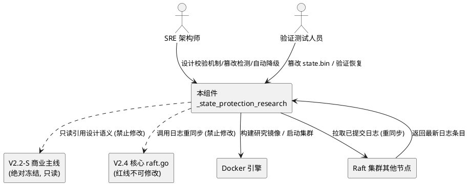
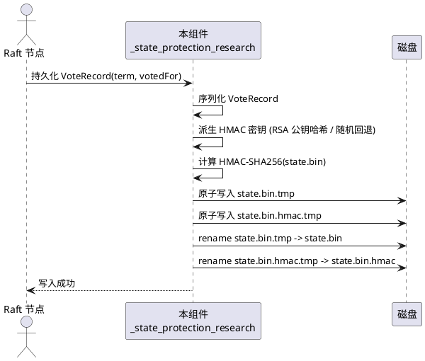
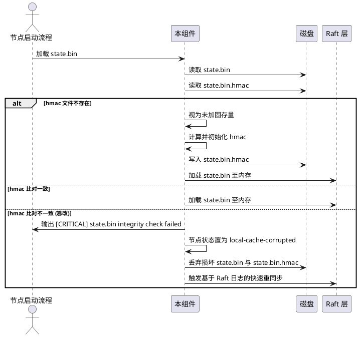
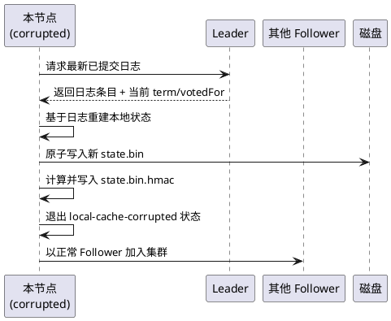
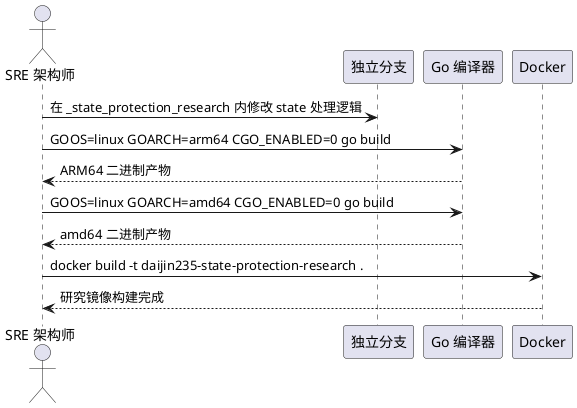
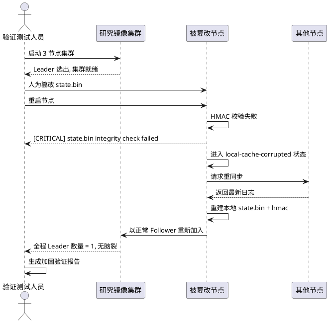

# 岱境235 V2.4独立分支 state.bin 完整性加固 需求规格说明书

> **文档版本**: 1.0
> **生成时间**: 2026-08-31
> **需求来源**: TCX-2 终极混沌极限验证暴露的 state.bin 无完整性校验隐患
> **目标分支**: V2.4_Performance_Sandbox/_state_protection_research（独立研究分支）
> **基线红线**: raft.go MD5 = DD6F667133D2C9343CF43BC11A5B7C00（V2.2-S 主线绝对冻结）
> **需求格式**: EARS（Easy Approach to Requirements Syntax）
> **最终定位**: V2.5 升级功能储备（暂不合并进 V2.2-S 主线）

---

# **1. 组件定位**

## **1.1 核心职责**
本组件负责在 V2.4 独立研究分支中对 Raft 持久化状态文件 state.bin 引入 HMAC-SHA256 完整性校验、篡改检测、自动降级与重同步恢复能力，实现持久化层可信度加固而不污染 V2.2-S 商业主线。

## **1.2 核心输入**
1. **VoteRecord 持久化写入请求**：来源于 Raft 节点状态变更（term/votedFor 更新），由独立分支内复制的 state.bin 处理逻辑接收。
2. **state.bin 启动读取请求**：来源于节点启动流程，需在校验通过后方可加载至内存。
3. **节点 RSA 公钥**：来源于节点自身密钥材料，用于派生 HMAC-SHA256 密钥。
4. **本地随机对称密钥**：当 RSA 公钥不可用时作为密钥派生回退来源。
5. **Raft 日志重同步触发信号**：来源于校验失败后的自动降级逻辑，请求从其他存活节点拉取最新已提交日志。

## **1.3 核心输出**
1. **state.bin + state.bin.hmac 双文件产物**：写入磁盘的持久化状态及其伴随 HMAC-SHA256 校验和文件。
2. **[CRITICAL] state.bin integrity check failed 告警日志**：校验失败时输出至标准错误与节点日志。
3. **local-cache-corrupted 节点状态**：节点对外暴露的降级状态标识，告知集群本节点本地缓存不可信。
4. **重同步请求**：发往 Leader 或多数派节点的日志拉取请求，用于恢复本地状态。
5. **加固验证报告**：最终交付的《V2.4独立分支state.bin完整性加固验证报告.md》。

## **1.4 职责边界**
本组件**不负责**以下事项：
1. **不修改** V2.2-S 主线源码（D:\岱境235源码备份\daijin235_go_engine\ 下任何文件）。
2. **不修改** V2.4_Performance_Sandbox 根目录下的核心 raft.go（保持 Raft 共识逻辑零污染）。
3. **不实现** 新的 Raft 共识算法或选举策略（仅复用现有 Raft 日志重同步能力）。
4. **不负责** V2.2-S 商业镜像的任何变更（新镜像带 _research 后缀，与商业镜像完全隔离）。
5. **不合并** 加固方案进 V2.2-S 主线（仅作为 V2.5 储备）。
6. **不替代** Raft 多数派机制的一致性保障（HMAC 仅加固持久化层可信度，不改变协议层语义）。

---

# **2. 领域术语**

**state.bin**
: Raft 节点持久化投票记录的二进制文件，存储 VoteRecord 结构（Term int64, VotedFor string），当前大小约 64 字节。
: 备注：TCX-2 测试证实其当前无 CRC/Checksum/HMAC 完整性校验。

**HMAC-SHA256**
: 基于哈希的消息认证码算法，使用 SHA-256 作为底层哈希函数，需密钥参与计算，可同时验证数据完整性与真实性。
: 备注：本方案用于 state.bin 完整性校验，密钥来源为节点 RSA 公钥哈希或本地随机对称密钥。

**VoteRecord**
: Raft 协议持久化状态结构，定义于 types.go:57-60，包含 Term（当前任期）与 VotedFor（本任期投票对象）两个字段。

**local-cache-corrupted**
: 节点降级状态标识，表示节点本地持久化缓存不可信，需通过 Raft 日志重同步恢复，期间不参与 Leader 选举投票。

**篡改检测**
: 节点启动时通过重新计算 state.bin 的 HMAC-SHA256 并与伴随校验和文件比对，判定 state.bin 是否被外部修改的过程。

**自动降级**
: 校验失败后节点自动进入 local-cache-corrupted 状态、丢弃损坏本地状态、强制触发 Raft 日志重同步的流程。

**重同步恢复**
: 节点从 Leader 或多数派节点拉取最新已提交日志，重建本地 state.bin 与日志的过程。

**独立研究分支**
: V2.4_Performance_Sandbox/_state_protection_research 子目录，与 V2.2-S 主线和 V2.4 核心 raft.go 完全隔离的实验性代码空间。

**研究镜像**
: 带 _research 后缀的 Docker 镜像（如 daijin235-state-protection-research），与 V2.2-S 商业镜像完全隔离，仅用于沙箱验证。

---

# **3. 角色与边界**

## **3.1 核心角色**
1. **SRE 架构师**：负责在独立研究分支中设计 HMAC-SHA256 校验机制、篡改检测与自动降级逻辑，并执行沙箱验证。
2. **验证测试人员**：负责在 3 节点集群中人为篡改 state.bin，验证新机制的检测与恢复能力。

## **3.2 外部系统**
1. **V2.2-S 商业主线源码**：本组件的上游基线，本组件只读引用其设计语义，绝对禁止修改。
2. **V2.4 核心 raft.go**：本组件的下游依赖（仅调用其日志重同步能力），绝对禁止修改。
3. **Docker 引擎**：本组件的构建与运行环境，用于构建研究镜像与启动 3 节点集群。
4. **Raft 集群其他节点**：本组件重同步恢复时的数据来源，提供最新已提交日志。

## **3.3 交互上下文**

---

# **4. DFX约束**

## **4.1 性能**

1. **HMAC 计算开销**：单次 state.bin（64 字节）HMAC-SHA256 计算耗时必须 ≤ 1ms。
   - 验收条件：在 ARM64 与 amd64 平台分别测量 1000 次 HMAC 计算 → 平均耗时 ≤ 1ms。
2. **启动延迟增量**：引入校验机制后节点启动延迟增量必须 ≤ 50ms。
   - 验收条件：对比 V2.4 原始启动耗时与加固后启动耗时 → 增量 ≤ 50ms。
3. **重同步完成时间**：从进入 local-cache-corrupted 状态到重同步完成必须 ≤ 10秒（3 节点集群，空日志或小日志场景）。
   - 验收条件：触发篡改检测后计时 → 重同步完成耗时 ≤ 10秒。

## **4.2 可靠性**

1. **校验误判率**：HMAC-SHA256 校验的误判率必须 ≤ 2^-128（碰撞概率）。
   - 验收条件：理论分析 + 10000 次正常写入/读取循环 → 无误判。
2. **重同步成功率**：在多数派节点存活的前提下，重同步恢复成功率必须 = 100%。
   - 验收条件：3 节点集群中篡改 1 节点 state.bin → 重同步成功且状态一致。
3. **无脑裂保障**：校验失败与重同步过程中集群 Leader 数量必须始终 = 1。
   - 验收条件：全流程监控 Leader 数量 → 始终为 1。

## **4.3 安全性**

1. **HMAC 密钥来源**：HMAC-SHA256 密钥必须派生自节点 RSA 公钥哈希；RSA 公钥不可用时必须回退至本地随机生成的对称密钥并落盘保护。
   - 验收条件：检查密钥派生逻辑 → 优先 RSA 公钥哈希，回退路径存在且密钥文件权限 ≤ 0600。
2. **校验和文件保护**：state.bin.hmac 校验和文件必须与 state.bin 分离存储，文件权限 ≤ 0600。
   - 验收条件：检查文件权限 → ≤ 0600。
3. **篡改告警不可静默**：[CRITICAL] 告警必须输出至 stderr 且写入节点日志，禁止被任何配置静默。
   - 验收条件：篡改后检查 stderr 与日志文件 → 均包含 [CRITICAL] state.bin integrity check failed。

## **4.4 可维护性**

1. **日志规范**：校验相关日志必须包含统一前缀 [STATE-PROTECTION] 便于检索。
   - 验收条件：grep "[STATE-PROTECTION]" 节点日志 → 命中所有校验相关事件。
2. **可观测指标**：必须暴露 state_integrity_check_total（校验总次数）与 state_integrity_check_failed_total（校验失败总次数）两个计数指标。
   - 验收条件：查询 metrics 端点 → 两个指标存在且数值正确。

## **4.5 兼容性**

1. **V2.2-S 主线零改动**：本加固方案必须不修改 V2.2-S 主线任何文件，raft.go MD5 必须保持 DD6F667133D2C9343CF43BC11A5B7C00。
   - 验收条件：加固前后计算 D:\岱境235源码备份\daijin235_go_engine\raft.go MD5 → 均为 DD6F667133D2C9343CF43BC11A5B7C00。
2. **V2.4 raft.go 零改动**：本加固方案必须不修改 V2.4_Performance_Sandbox 根目录下 raft.go。
   - 验收条件：加固前后计算 V2.4 raft.go MD5 → 一致。
3. **研究镜像隔离**：研究镜像必须带 _research 后缀，与 V2.2-S 商业镜像 image name 不同。
   - 验收条件：docker images 列表 → daijin235-state-protection-research 与商业镜像名不同。
4. **存量 state.bin 兼容**：首次启动遇无 state.bin.hmac 的存量 state.bin 时，必须视为"未加固存量"，触发一次校验和初始化而非直接判废。
   - 验收条件：放置无 hmac 的存量 state.bin 启动 → 初始化 hmac 后正常加载，不进入 corrupted 状态。

---

# **5. 核心能力**

## **5.1 HMAC-SHA256 校验机制**

### **5.1.1 业务规则**

1. **校验和伴随写入规则**：当节点持久化 VoteRecord 至 state.bin 时，系统必须同步计算 state.bin 的 HMAC-SHA256 并写入伴随文件 state.bin.hmac。
   - 验收条件：触发任一 term/votedFor 变更 → state.bin 与 state.bin.hmac 同时存在且 hmac 内容为 state.bin 的有效 HMAC-SHA256。
2. **密钥派生规则**：HMAC-SHA256 密钥必须优先派生自节点 RSA 公钥的 SHA-256 哈希；当 RSA 公钥不可用时，必须回退至本地随机生成的 256 位对称密钥，并将该密钥以 0600 权限落盘至 state_hmac_key.bin。
   - 验收条件：删除 RSA 公钥材料启动 → 回退路径生成 state_hmac_key.bin 且权限为 0600。
3. **原子写入规则**：state.bin 与 state.bin.hmac 的写入必须保证原子性，避免出现 state.bin 已更新而 hmac 未更新的中间状态。
   - 验收条件：在写入过程中强制 kill 节点 → 重启后校验仍能通过（通过临时文件+rename 实现）。
4. **禁止项**：禁止将 HMAC 密钥以明文形式写入日志或任何对外暴露的指标。
   - 验收条件：grep 日志与 metrics 输出 → 无密钥明文。

### **5.1.2 交互流程**

### **5.1.3 异常场景**

1. **HMAC 密钥文件丢失**
   - 触发条件：state_hmac_key.bin 不存在且 RSA 公钥不可用。
   - 系统行为：生成新的随机对称密钥并落盘，记录 [STATE-PROTECTION] WARN 日志。
   - 用户感知：节点正常启动，日志含密钥重新生成告警。
2. **磁盘写入失败**
   - 触发条件：state.bin 或 state.bin.hmac 写入失败（磁盘满/权限不足）。
   - 系统行为：回滚临时文件，返回持久化失败错误至 Raft 层。
   - 用户感知：节点日志含 [STATE-PROTECTION] ERROR persist failed，Raft 层处理写入失败。
3. **HMAC 计算异常**
   - 触发条件：HMAC-SHA256 计算抛出异常（极少见，如内存不足）。
   - 系统行为：终止本次写入，返回错误。
   - 用户感知：节点日志含 [STATE-PROTECTION] ERROR hmac compute failed。

## **5.2 篡改检测与自动降级**

### **5.2.1 业务规则**

1. **启动校验规则**：当节点启动并加载 state.bin 时，系统必须先读取 state.bin.hmac，重新计算 state.bin 的 HMAC-SHA256 并比对，比对一致方可加载至内存。
   - 验收条件：正常启动 → state.bin 加载成功，term/votedFor 与持久化值一致。
2. **篡改检测规则**：当 HMAC 比对不一致时，系统必须判定 state.bin 已被篡改，禁止加载损坏数据至内存。
   - 验收条件：篡改 state.bin 任一字节后启动 → 损坏数据未被加载，term/votedFor 未被污染。
3. **CRITICAL 告警规则**：当检测到篡改时，系统必须立即输出 [CRITICAL] state.bin integrity check failed 至 stderr 与节点日志。
   - 验收条件：篡改后启动 → stderr 与日志均含 [CRITICAL] state.bin integrity check failed。
4. **自动降级规则**：当检测到篡改时，系统必须将节点状态置为 local-cache-corrupted，丢弃损坏的本地 state.bin 与 state.bin.hmac。
   - 验收条件：篡改后启动 → 节点状态为 local-cache-corrupted，原 state.bin 被丢弃。
5. **存量兼容规则**：当启动时 state.bin 存在但 state.bin.hmac 不存在时，系统必须视为"未加固存量"，初始化校验和而非判废。
   - 验收条件：放置无 hmac 的存量 state.bin 启动 → 初始化 hmac 后正常加载，不进入 corrupted 状态。
6. **禁止项**：禁止在校验失败后继续加载损坏的 state.bin 至内存参与 Raft 协议。
   - 验收条件：篡改后启动 → 内存中 term/votedFor 不反映损坏值。

### **5.2.2 交互流程**

### **5.2.3 异常场景**

1. **state.bin 与 state.bin.hmac 同时被篡改且匹配**
   - 触发条件：攻击者同时篡改 state.bin 与 state.bin.hmac 且重算 HMAC 匹配（需获取密钥）。
   - 系统行为：HMAC 校验通过，但 Raft 多数派机制仍保证集群一致性（被篡改节点状态若与多数派冲突将被覆盖）。
   - 用户感知：此场景需攻击者已获取 HMAC 密钥，属密钥泄露范畴，由 4.3 安全性规则防范。
2. **state.bin 不存在**
   - 触发条件：首次启动或 state.bin 被删除。
   - 系统行为：视为新节点启动，初始化空状态。
   - 用户感知：节点以 Follower 状态正常启动。
3. **state.bin.hmac 损坏但 state.bin 正常**
   - 触发条件：仅 hmac 文件被篡改。
   - 系统行为：判定校验失败，进入 local-cache-corrupted 状态，触发重同步。
   - 用户感知：[CRITICAL] 告警输出，节点重同步恢复。

## **5.3 重同步恢复**

### **5.3.1 业务规则**

1. **重同步触发规则**：当节点进入 local-cache-corrupted 状态时，系统必须强制触发一次基于 Raft 日志的快速重同步，从 Leader 或多数派节点拉取最新已提交日志。
   - 验收条件：节点进入 corrupted 状态 → 自动发起重同步请求。
2. **重同步完成规则**：当重同步完成时，系统必须基于拉取的日志重建本地 state.bin 与 state.bin.hmac，并退出 local-cache-corrupted 状态。
   - 验收条件：重同步完成 → state.bin 与 state.bin.hmac 重新生成，节点状态转为正常 Follower。
3. **重同步超时规则**：当重同步在 10 秒内未完成时，系统必须输出 [STATE-PROTECTION] WARN resync timeout 日志并重试，重试 3 次仍失败则节点保持 corrupted 状态。
   - 验收条件：模拟网络分区使重同步超时 → 3 次重试后节点保持 corrupted 状态。
4. **禁止项**：禁止在重同步完成前让节点参与 Leader 选举投票或对外提供服务。
   - 验收条件：重同步期间触发选举 → 节点不投票。

### **5.3.2 交互流程**

### **5.3.3 异常场景**

1. **重同步期间 Leader 故障**
   - 触发条件：重同步过程中 Leader 节点故障。
   - 系统行为：等待集群选出新 Leader 后重新发起重同步请求。
   - 用户感知：节点保持 corrupted 状态直至新 Leader 选出并完成重同步。
2. **多数派节点不可达**
   - 触发条件：重同步时无法联系到多数派节点。
   - 系统行为：节点保持 local-cache-corrupted 状态，周期性重试。
   - 用户感知：[STATE-PROTECTION] WARN resync retry 日志，节点不参与集群服务。
3. **重同步后状态与多数派冲突**
   - 触发条件：重建的本地状态与多数派状态冲突（理论不应发生，因丢弃了损坏状态）。
   - 系统行为：以多数派状态为准，覆盖本地状态。
   - 用户感知：节点最终状态与多数派一致。

## **5.4 隔离构建与镜像生成**

### **5.4.1 业务规则**

1. **独立分支隔离规则**：所有修改必须仅在 V2.4_Performance_Sandbox/_state_protection_research 子目录内进行，禁止修改父目录及以上的任何文件。
   - 验收条件：git diff 范围 → 仅 _state_protection_research 子目录内文件变更。
2. **交叉编译规则**：系统必须支持 GOOS=linux GOARCH=arm64 与 GOOS=linux GOARCH=amd64 两种交叉编译产物，CGO_ENABLED=0。
   - 验收条件：执行交叉编译 → 生成 ARM64 与 amd64 两个二进制产物。
3. **研究镜像构建规则**：系统必须构建带 _research 后缀的 Docker 镜像（如 daijin235-state-protection-research），与 V2.2-S 商业镜像完全隔离。
   - 验收条件：docker images → 存在 daijin235-state-protection-research 镜像，且与商业镜像名不同。
4. **禁止项**：禁止研究镜像复用 V2.2-S 商业镜像的任何标签或镜像 ID。
   - 验收条件：对比研究镜像与商业镜像 → image name 与 tag 完全不同。

### **5.4.2 交互流程**

### **5.4.3 异常场景**

1. **交叉编译失败**
   - 触发条件：独立分支代码存在平台相关编译错误。
   - 系统行为：编译器返回错误，终止构建流程。
   - 用户感知：编译错误日志，需修复后重试。
2. **Docker 镜像构建失败**
   - 触发条件：Dockerfile 语法错误或基础镜像拉取失败。
   - 系统行为：docker build 返回错误。
   - 用户感知：构建错误日志，需修复 Dockerfile。

## **5.5 沙箱验证**

### **5.5.1 业务规则**

1. **3 节点集群启动规则**：验证必须使用研究镜像启动 3 节点集群，集群正常选出 1 个 Leader 且无脑裂。
   - 验收条件：启动 3 节点集群 → Leader 数量 = 1，所有 Follower 指向同一 Leader。
2. **篡改注入验证规则**：验证必须人为篡改某节点的 state.bin，并验证新机制能检测到篡改。
   - 验收条件：篡改某节点 state.bin 后重启 → 检测到篡改，输出 [CRITICAL] 告警。
3. **安全降级验证规则**：验证必须确认节点在检测后安全进入 local-cache-corrupted 状态。
   - 验收条件：篡改后检查节点状态 → 为 local-cache-corrupted。
4. **重同步恢复验证规则**：验证必须确认节点从其他节点重同步恢复，且恢复后状态与集群一致。
   - 验收条件：篡改后等待恢复 → 节点状态转为正常 Follower，term/votedFor 与集群一致。
5. **无脑裂验证规则**：验证必须确认全流程（篡改-检测-降级-恢复）中集群 Leader 数量始终 = 1。
   - 验收条件：全流程监控 Leader 数量 → 始终为 1。
6. **禁止项**：禁止使用 V2.2-S 商业镜像执行本次验证（必须使用研究镜像）。
   - 验收条件：验证所用镜像 → 为 daijin235-state-protection-research。

### **5.5.2 交互流程**

### **5.5.3 异常场景**

1. **篡改后节点未检测到篡改**
   - 触发条件：HMAC 校验逻辑缺陷导致漏检。
   - 系统行为：验证失败，需排查校验逻辑。
   - 用户感知：验证报告标注失败，加固方案不通过。
2. **重同步失败**
   - 触发条件：重同步逻辑缺陷或集群通信故障。
   - 系统行为：节点保持 corrupted 状态，验证失败。
   - 用户感知：验证报告标注重同步失败。
3. **恢复后状态不一致**
   - 触发条件：重同步后节点状态与集群不一致。
   - 系统行为：验证失败，需排查重同步逻辑。
   - 用户感知：验证报告标注状态不一致。

---

# **6. 数据约束**

## **6.1 state.bin**
1. **文件大小**：约 64 字节，包含 persistentState 结构（Term int64 + VotedFor string）。
2. **写入时机**：任一 term 或 votedFor 变更时同步写入。
3. **读取时机**：节点启动时读取，经 HMAC 校验通过后方可加载。
4. **原子性**：写入必须通过临时文件 + rename 保证原子性。
5. **权限**：文件权限 ≤ 0600。

## **6.2 state.bin.hmac**
1. **文件大小**：32 字节（HMAC-SHA256 输出定长）。
2. **写入时机**：与 state.bin 同步写入，紧随 state.bin 写入后。
3. **读取时机**：节点启动时读取，用于与重算的 state.bin HMAC 比对。
4. **原子性**：写入必须通过临时文件 + rename 保证原子性。
5. **权限**：文件权限 ≤ 0600。
6. **伴随性**：state.bin.hmac 必须与对应 state.bin 同目录、同 basename。

## **6.3 state_hmac_key.bin（回退密钥文件）**
1. **存在条件**：仅当 RSA 公钥不可用、回退至随机对称密钥时存在。
2. **文件大小**：32 字节（256 位随机对称密钥）。
3. **权限**：文件权限必须 = 0600。
4. **持久性**：首次生成后必须持久化，后续启动复用，禁止每次重新生成。

## **6.4 VoteRecord**
1. **Term**：int64 类型，表示节点当前任期，必须 ≥ 0。
2. **VotedFor**：string 类型，表示本任期投票对象节点 ID，可为空（未投票）。
3. **持久化一致性**：内存中 Term/VotedFor 必须与持久化 state.bin（经校验通过后）一致。

## **6.5 节点状态枚举**
1. **normal**：正常状态，参与 Raft 协议。
2. **local-cache-corrupted**：本地缓存损坏状态，不参与选举投票，等待重同步恢复。
3. **状态流转**：normal → local-cache-corrupted（校验失败时）；local-cache-corrupted → normal（重同步完成时）。

---

# **7. 验收需求汇总**

## **7.1 功能验收清单**

| 编号 | 验收项 | EARS 规则来源 | 验收条件 |
|------|--------|---------------|----------|
| FA-01 | state.bin 写入时同步生成 state.bin.hmac | 5.1.1 规则1 | 触发 term 变更 → 两文件同时存在且 hmac 有效 |
| FA-02 | HMAC 密钥优先派生自 RSA 公钥哈希 | 5.1.1 规则2 | 删除 RSA 材料 → 回退路径生成密钥文件权限 0600 |
| FA-03 | 原子写入保证 | 5.1.1 规则3 | 写入中 kill 节点 → 重启校验通过 |
| FA-04 | 启动时 HMAC 校验 | 5.2.1 规则1 | 正常启动 → state.bin 加载成功 |
| FA-05 | 篡改检测 | 5.2.1 规则2 | 篡改 state.bin → 损坏数据未被加载 |
| FA-06 | [CRITICAL] 告警输出 | 5.2.1 规则3 | 篡改后启动 → stderr 与日志均含 [CRITICAL] |
| FA-07 | 自动降级至 local-cache-corrupted | 5.2.1 规则4 | 篡改后启动 → 节点状态为 corrupted |
| FA-08 | 存量 state.bin 兼容 | 5.2.1 规则5 | 无 hmac 存量启动 → 初始化 hmac 后正常加载 |
| FA-09 | 重同步触发 | 5.3.1 规则1 | 进入 corrupted → 自动发起重同步 |
| FA-10 | 重同步完成恢复 | 5.3.1 规则2 | 重同步完成 → 状态转为正常 Follower |
| FA-11 | 重同步超时处理 | 5.3.1 规则3 | 模拟超时 → 3 次重试后保持 corrupted |
| FA-12 | 独立分支隔离 | 5.4.1 规则1 | git diff → 仅子目录内变更 |
| FA-13 | 交叉编译产物 | 5.4.1 规则2 | 生成 ARM64 与 amd64 两个二进制 |
| FA-14 | 研究镜像隔离 | 5.4.1 规则3 | docker images → daijin235-state-protection-research 存在且与商业镜像不同 |

## **7.2 非功能验收清单**

| 编号 | 验收项 | 约束来源 | 验收条件 |
|------|--------|----------|----------|
| NFA-01 | HMAC 计算耗时 | 4.1 规则1 | 1000 次计算平均 ≤ 1ms |
| NFA-02 | 启动延迟增量 | 4.1 规则2 | 增量 ≤ 50ms |
| NFA-03 | 重同步完成时间 | 4.1 规则3 | ≤ 10 秒 |
| NFA-04 | 校验误判率 | 4.2 规则1 | 10000 次循环无误判 |
| NFA-05 | 重同步成功率 | 4.2 规则2 | 多数派存活时 100% |
| NFA-06 | 无脑裂保障 | 4.2 规则3 | 全流程 Leader 数量 = 1 |
| NFA-07 | 密钥文件权限 | 4.3 规则2 | ≤ 0600 |
| NFA-08 | 告警不可静默 | 4.3 规则3 | stderr 与日志均含 [CRITICAL] |
| NFA-09 | 日志可检索 | 4.4 规则1 | grep [STATE-PROTECTION] 命中 |
| NFA-10 | 可观测指标 | 4.4 规则2 | 两个计数指标存在 |

## **7.3 红线约束验收清单**

| 编号 | 验收项 | 约束来源 | 验收条件 |
|------|--------|----------|----------|
| RC-01 | V2.2-S raft.go MD5 不变 | 4.5 规则1 | 加固前后 MD5 = DD6F667133D2C9343CF43BC11A5B7C00 |
| RC-02 | V2.4 raft.go 零改动 | 4.5 规则2 | 加固前后 MD5 一致 |
| RC-03 | 研究镜像与商业镜像隔离 | 4.5 规则3 | image name 不同 |
| RC-04 | 存量兼容 | 4.5 规则4 | 无 hmac 存量启动 → 初始化而非判废 |
| RC-05 | V2.2-S 主线零改动 | 1.4 职责边界 | D:\岱境235源码备份\daijin235_go_engine\ 全程未变 |

## **7.4 沙箱验证验收清单**

| 编号 | 验收项 | 规则来源 | 验收条件 |
|------|--------|----------|----------|
| SV-01 | 3 节点集群启动 | 5.5.1 规则1 | Leader 数量 = 1 |
| SV-02 | 篡改检测验证 | 5.5.1 规则2 | 篡改后检测到并输出 [CRITICAL] |
| SV-03 | 安全降级验证 | 5.5.1 规则3 | 节点进入 local-cache-corrupted |
| SV-04 | 重同步恢复验证 | 5.5.1 规则4 | 恢复后状态与集群一致 |
| SV-05 | 无脑裂验证 | 5.5.1 规则5 | 全流程 Leader 数量 = 1 |
| SV-06 | 研究镜像使用 | 5.5.1 规则6 | 验证使用 daijin235-state-protection-research |

---

# **8. 交付物约束**

## **8.1 加固验证报告**
1. **报告文件名**：《V2.4独立分支state.bin完整性加固验证报告.md》
2. **必须包含声明**："此加固方案已在V2.4独立分支中验证成功，将作为V2.5升级功能储备，暂时不合并进V2.2-S主线。"
3. **同步位置**：
   - 桌面：<HOME>\Desktop\
   - D 盘备份：<ARCHIVE>\
   - 归档04：D:\岱境235_20260810_硬核工程产出归档\04_压力测试与工程验证工具\
4. **三处一致**：三处同步文件 MD5 必须一致。

## **8.2 完成确认语**
任务完成后必须告知用户："隔离沙箱内state.bin修复验证完成，V2.2-S主线零改动，加固方案已作为V2.5储备。"

---

> **文档结束**
> 本需求规格文档遵循 EARS 格式，所有规则均使用"必须""禁止"等规范用语并附带验收条件。
> 本文档仅描述"做什么"（功能行为与约束），不描述"怎么做"（实现细节）。
> 实现细节由后续 design.md（技术设计）与 tasks.md（任务分解）承接，由相应 agent 处理。