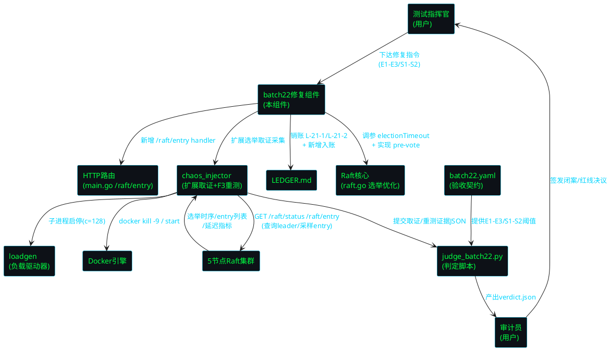
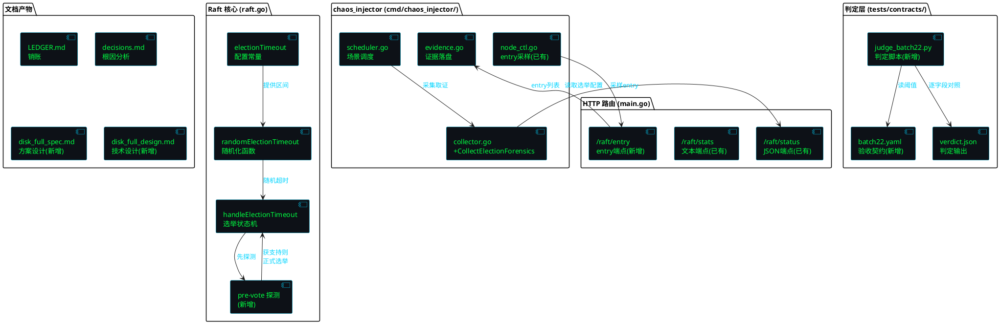
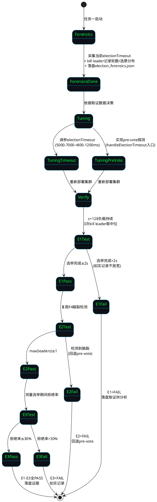
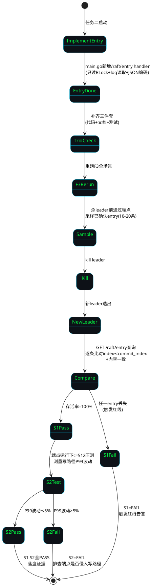
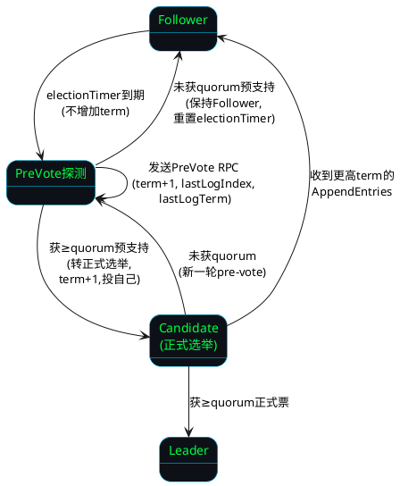
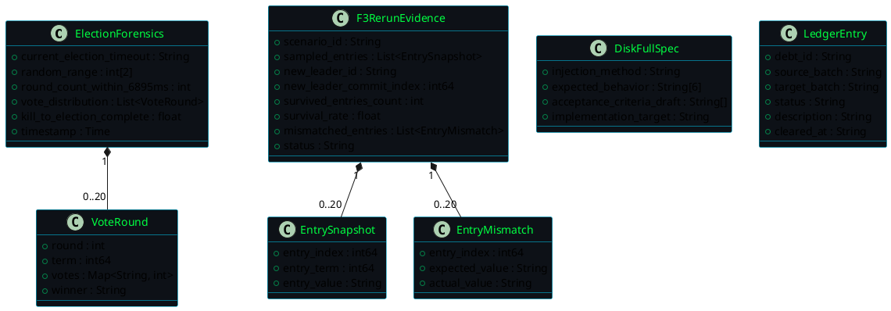
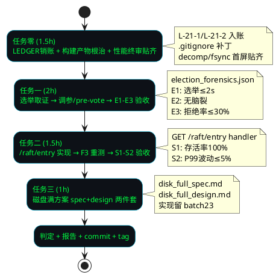

# batch22 故障注入战役I修复 + 战役II预演 — 技术设计

> 版本: v2.4-batch22-election-f3
> 关联规格: spec.md（808行，37条 EARS 需求）
> 技术栈: Go（Raft 核心选举优化 + /raft/entry 端点 + chaos_injector 扩展）+ Shell（集群编排）+ Python（判定脚本）+ YAML（验收契约）
> 前置批次: batch21（F1 FAIL 6.895s / F3 FAIL 0% / F2·F4·F5 PASS / chaos_injector 已实现 7 文件 864 行）
> 时间盒: 总计 ≤ 6 小时（任务零 1.5h + 任务一 2h + 任务二 1.5h + 任务三 1h）
> 核心红线: RL-01~RL-10 继承 + RL-11 新增（构建产物禁止入库）

---

# 一、需求与存量功能关系分析

## 1.1 需求功能与存量功能对比

### 1.1.1 已实现功能

| 需求功能 | 存量功能 | 代码位置 | 匹配度 |
|---------|---------|---------|--------|
| LEDGER 挂账台账维护（REQ-T0-01） | LEDGER.md 已存在，DEBT-0001~0003 已清偿，表格格式 [debt_id/source_batch/target_batch/status/description/cleared_at] | `LEDGER.md:1-32` | 75% |
| leader 角色查询（JSON）（选举取证依赖） | `/raft/status` 端点返回 `node.Stats().Snapshot()` 的 JSON 编码 | `main.go:288-292` | 100% |
| leader 角色查询（文本）（chaos_injector 依赖） | `/raft/stats` 端点返回 `id/state/term/leader/commit/...` 文本格式 | `main.go:293-305` | 100% |
| 选举超时配置（取证目标） | `electionTimeoutMin=5000ms / electionTimeoutMax=7000ms` 编译时常量 + `randomElectionTimeout()` 随机化函数 | `raft.go:39-40, 2051-2053` | 100% |
| 选举超时处理逻辑（pre-vote 注入点） | `handleElectionTimeout()` 方法，候选者发起 RequestVote | `raft.go:790-860` | 75% |
| chaos_injector 故障注入工具（F3 重测依赖） | 7 文件 864 行：main/scheduler/node_ctl/collector/evidence/resume_mgr/types | `cmd/chaos_injector/*.go` | 75% |
| chaos_injector entry 采样逻辑（已调用 /raft/entry） | `SnapshotConfirmedEntries` 和 `VerifyEntrySurvival` 已实现，通过 HTTP GET `/raft/entry?index=N` 采集 | `cmd/chaos_injector/node_ctl.go:202,242` | 50% |
| 5 节点 Docker 集群编排 | docker-compose-5node.yml + ports overlay + batch16 overlay | `tests/deploy/docker-compose-5node.yml` | 100% |
| loadgen 负载驱动（E1 压测依赖） | loadgen Go 程序，支持 `-concurrency=C -duration=Ds`，内部查询 leader 路由 | `tools/loadgen/main.go` | 75% |
| fsync 取证数据（首屏必贴） | `fsync_forensics.json` 含 fsync_count=4673 / fsync_per_sec=25.96 / merge_ratio=438.7:1 | `tests/evidence/d3-batch20/fsync_forensics.json` | 100% |
| decomp_c512 四构成项数据（首屏必贴） | `decomp_c512_raw.json` 已补全 quorum_wait/fsync_wait/rpc/queue 四构成项，4037 bytes | `docs/specs/latency_decomp/decomp_c512_raw.json` | 100% |
| 验收契约与判定脚本框架（batch22.yaml 可复用） | batch21.yaml + judge_batch21.py 逐字段对照产出 verdict.json | `tests/contracts/batch21.yaml`, `tests/contracts/judge_batch21.py` | 75% |
| 断点续跑管理器 | resume_mgr.go 读写 RESUME.md，跳过已完成任务 | `cmd/chaos_injector/resume_mgr.go` | 75% |
| .gitignore 证据目录排除（RL-08） | .gitignore 已补丁排除证据目录 + loadgen.exe | `.gitignore` | 50% |
| WAL 持久化卷（F3 存活率基础） | docker-compose 定义 wal-node-1~5 卷，docker kill 不删容器 | `tests/deploy/docker-compose-5node.yml` | 100% |

**匹配度判定依据**：
- **100%**：功能完全匹配可直接复用（如 `/raft/status` JSON 端点、fsync 取证数据、WAL 卷）
- **75%**：功能存在但需扩展或适配（如 LEDGER 需新增 L-21-1/L-21-2 两笔；chaos_injector 需扩展选举取证；loadgen 需长时长近似持续负载；判定脚本需新增 E1-E3/S1-S2 字段）
- **50%**：部分实现（如 chaos_injector 已调用 `/raft/entry` 但端点不存在导致采样为空；.gitignore 排除了 loadgen.exe 但未排除 chaos_injector.exe 等其他构建产物）

### 1.1.2 需要扩展的功能

| 需求功能 | 存量功能 | 差异说明 | 扩展方向 |
|---------|---------|---------|---------|
| LEDGER 新增 L-21-1/L-21-2 入账并清偿（REQ-T0-02/03） | LEDGER.md 已有 DEBT-0001~0003 表格 | 需新增两笔挂账（L-21-1 选举取证 / L-21-2 端点缺失），标注本批清偿，格式与现有一致 | 在 LEDGER.md 表格追加两行，补充"已清偿记录详情"章节 |
| 选举超时调参（REQ-E-02） | `electionTimeoutMin=5000 / electionTimeoutMax=7000`（编译时常量） | 当前 5-7s 区间导致选举完成 6.895s，需调至更小区间使选举完成 ≤ 2s；但须 > heartbeatInterval（20-500ms）且保持随机化 | 将编译时常量改为环境变量可配置（`ELECTION_TIMEOUT_MIN/MAX`），默认值调至 800-1200ms 区间；或直接修改常量 |
| pre-vote 防选票分裂（REQ-E-04） | `handleElectionTimeout()` 直接发起正式 RequestVote | 无 pre-vote 探测阶段，网络分区或时序抖动时多节点同时发起选举导致选票分裂、轮数膨胀 | 在 `handleElectionTimeout()` 入口增加 pre-vote 探测：先发 PreVote RPC 探测多数派支持，获支持后才转正式选举 |
| chaos_injector 选举取证采集（REQ-E-01） | collector.go 有 `CollectElectionTimeline` 采集选举完成时间 | 缺少选举超时配置/随机区间/轮数/选票分布的取证采集 | 在 collector.go 新增 `CollectElectionForensics()` 方法，采集当前配置 + kill leader 后轮数与选票分布，落盘 election_forensics.json |
| 验收契约 E1-E3/S1-S2（REQ-E1~S2） | batch21.yaml 定义 F1-F5 验收线 | 需新增 E1（选举 ≤ 2s）/ E2（无脑裂）/ E3（拒绝率 ≤ 30%）/ S1（存活率 100%）/ S2（P99 波动 ≤ 5%）五条验收线 | 新建 batch22.yaml，继承 F2/F4/F5 + 新增 E1-E3/S1-S2；扩展 judge_batch22.py |
| 判定脚本 E1-E3/S1-S2 字段（REQ-JUDGE） | judge_batch21.py 逐字段对照 F1-F5 | 需新增 E1-E3/S1-S2 五个判定字段，读选举取证 + F3 重测证据 JSON | 新建 judge_batch22.py，复用 batch21 判定逻辑 + 新增 E1-E3/S1-S2 对照 |
| .gitignore 构建产物根治（REQ-T0-04 / RL-11） | .gitignore 排除 loadgen.exe + 证据目录 | 未排除 chaos_injector.exe / 其他 .exe / build 目录编译产物，batch20/21 两批连犯 | 补丁 .gitignore：排除 `*.exe` / `cmd/*/chaos_injector.exe` / `build/` 目录；将 chaos_injector.exe 移出仓库 |
| RESUME.md 格式对齐 spec 6.6（REQ-RESUME-01~03） | resume_mgr.go 读写 RESUME.md | 需对齐 spec 6.6 结构化字段：completed_tasks / last_updated / total_tasks / session_id | 重写 RESUME.md 为结构化 Markdown，含 YAML frontmatter |

### 1.1.3 需要新增的功能或接口

按业务模块分组：

**模块 A：GET /raft/entry 端点（Go，main.go 新增 HTTP handler）**
- 功能点：`GET /raft/entry?index=N&count=M` 返回已确认（已 commit）的 Raft log entry 列表
- 输入：query 参数 `index`（起始 entry index，默认 commit_index）、`count`（返回条数，默认 10）
- 输出：JSON 数组，每个 entry 含 `{index, term, value, committed}` 字段
- 核心逻辑：加 RLock 读快照 → 从 log 中读取 [index, index+count) 范围 entry → 过滤 index ≤ commit_index 的已确认 entry → JSON 编码返回
- 依赖：`node.Stats().Snapshot()` 获取 commit_index、`node.LogEntries(start, end)` 读取 log（需确认该接口是否存在，若不存在需在 RaftNode 上新增只读访问方法）
- 约束：**只读操作，加 RLock，不侵入写路径热区（RL-07）**；端点代码不在 `/raft/propose` 写路径中调用
- 与 chaos_injector 的关系：chaos_injector 的 `SnapshotConfirmedEntries` 和 `VerifyEntrySurvival` 已在调用此端点（`node_ctl.go:202,242`），端点实现后 F3 重测可直接复用

**模块 B：选举取证采集器（Go，chaos_injector/collector.go 扩展）**
- 功能点：`CollectElectionForensics()` 采集当前选举超时配置、随机区间、kill leader 后 6.895s 内轮数与选票分布
- 输入：集群节点端口列表、kill 的 leader ID
- 输出：`election_forensics.json`，含 `current_election_timeout / random_range / round_count_within_6895ms / vote_distribution / kill_to_election_complete / timestamp`
- 核心逻辑：采集前通过 `/raft/stats` 读取 electionTimeout 配置 → kill leader → 轮询各节点 `/raft/stats` 的 `state/voted/term` 字段记录选举轮数与选票分布 → 落盘 JSON
- 依赖：`/raft/stats` 端点（已实现）、Docker CLI

**模块 C：pre-vote 机制（Go，raft.go 状态机扩展）**
- 功能点：候选者在 `handleElectionTimeout()` 入口先发起 pre-vote 探测，获多数派预支持后才转正式选举
- 输入：当前节点 ID、当前 term
- 输出：pre-vote 结果（获支持 / 未获支持），决定是否进入正式 Candidate 状态
- 核心逻辑：`handleElectionTimeout()` → 发送 PreVote RPC（term+1, lastLogIndex, lastLogTerm）→ 统计预支持票 → ≥ quorum 则转正式选举（现有 RequestVote 流程）→ < quorum 则保持 Follower 并重置选举定时器
- 依赖：现有 RequestVote RPC 传输层（`pkg/raft-module/raft_transport.go`）
- 约束：pre-vote 不增加 term（避免无谓的 term 膨胀）；pre-vote 失败不阻止其他节点发起选举

**模块 D：batch22 验收契约与判定脚本（YAML + Python，全新）**
- `tests/contracts/batch22.yaml`：E1-E3 / S1-S2 验收阈值 + 场景矩阵 + 红线清单（RL-01~RL-11）+ 时间盒
- `tests/contracts/judge_batch22.py`：读选举取证 JSON + F3 重测证据 JSON + batch22.yaml，逐字段对照产出 `verdict.json`
- 输入：`batch22.yaml` + `election_forensics.json` + `scenario_*.json`（F3 重测）
- 输出：`verdict.json`（E1-E3 / S1-S2 / F2 / F4 / F5 判定 + overall）
- 依赖：Python 3.x + PyYAML + json 标准库；复用 judge_batch21.py 的 F2/F4/F5 判定逻辑

**模块 E：磁盘满方案两件套（Markdown 文档，全新）**
- `tests/evidence/d3-batch22/disk_full_spec.md`：注入方式 + 预期行为 + 验收指标草案
- `tests/evidence/d3-batch22/disk_full_design.md`：技术设计 + 实现计划（标注留 batch23）+ 与现有机制关系分析
- 约束：本批仅方案设计，不编写注入实现代码（REQ-D-05）

**模块 F：构建产物入库根治（配置 + 文档）**
- `.gitignore` 补丁：排除 `*.exe` / `cmd/*/chaos_injector.exe` / `build/` 目录
- build 目录规则固化文档
- `decisions.md` 根因分析：batch20 修正为何未延续至 batch21

## 1.2 存量功能详细分析

### 1.2.1 选举超时配置（raft.go:39-40, 2051-2053）

**接口契约**：
- 定义：`electionTimeoutMin = 5000`（毫秒）、`electionTimeoutMax = 7000`（毫秒），编译时常量
- `randomElectionTimeout()` 返回 `[5000ms, 7000ms)` 区间内的随机 Duration
- 副作用：无（纯函数，rand 全局锁保护）

**业务规则**：
- 选举超时为随机化区间，避免活锁（多节点同时超时）
- 区间下限 5000ms > rpcTimeout（确保投票 RPC 有足够时间完成）
- leader kill 后，follower 在 5-7s 后超时 → 发起选举 → 选举完成约 5.9-6.9s（与 F1 实测 6.895s 吻合）

**约束**：
- **RL-03 红线**：选举超时语义不可破坏——调参允许（改区间值），但随机化区间性质、Raft 安全性（leader 唯一性）、> heartbeatInterval 不可破坏
- 编译时常量，修改需重新编译集群镜像
- 区间宽度（2000ms）提供随机化，避免多节点同时超时

**扩展点**：将编译时常量改为环境变量可配置（`ELECTION_TIMEOUT_MIN/MAX`），允许不重新编译即可调参；或直接修改常量值

**与 F1 FAIL 的关系**：`electionTimeoutMin=5000ms` 是 F1 6.895s 的直接根因。调参至 800-1200ms 区间后，选举完成预期 ≤ 1.5s（超时 0.8-1.2s + 选举 RPC ~0.2s），满足 E1 ≤ 2s。

### 1.2.2 handleElectionTimeout 选举状态机（raft.go:790-860）

**接口契约**：
- 触发条件：选举定时器到期（follower 在 electionTimeout 内未收到 leader 心跳）
- 行为：转 Candidate 状态 → term+1 → 投自己一票 → 并发发送 RequestVote RPC → 统计票数 → ≥ quorum 则转 Leader
- 副作用：修改节点状态、term、votedFor；重置选举定时器

**业务规则**：
- 选举定时器到期后直接发起正式 RequestVote（无 pre-vote 探测阶段）
- 若未获 quorum（如选票分裂），保持 Candidate 并重置定时器（`randomElectionTimeout() * 2/3/10`，不同分支不同退避倍数）
- 选举期间拒绝写请求（leader 不存在），客户端收到 503 或重定向

**约束**：
- RequestVote RPC 需在 rpcTimeout 内完成
- 同一 term 内一个节点只能投一票（Raft 安全性）
- 选举期间不处理 AppendEntries（除非来自更高 term 的 leader）

**扩展点**：pre-vote 机制需在 `handleElectionTimeout()` 入口插入探测逻辑——在转 Candidate 之前先发 PreVote RPC 探测多数派支持

### 1.2.3 /raft/status 与 /raft/stats 端点（main.go:288-305）

**接口契约**：
- `/raft/status`（GET）：返回 `node.Stats().Snapshot()` 的 JSON 编码，含 `id/state/term/leader_id/commit_index/...` 结构化字段
- `/raft/stats`（GET）：返回文本格式 `id=... state=... term=... leader=... commit=... applied=... logs=... peers=... voted=... gaps=... degraded=...`
- 副作用：无（只读快照，加 RLock）
- 异常：无（始终 200）

**业务规则**：
- 两个端点返回相同信息，格式不同（JSON vs 文本）
- `state` 字段值：`StateLeader` / `StateFollower` / `StateCandidate`
- `leader` 字段：当前集群已知 leader 的 nodeID
- `commit` 字段：当前节点的 commit_index（已确认 entry 的最高 index）

**约束**：
- 读锁保护，不阻塞写路径
- **关键缺失**：无 `/raft/entry` 端点 → chaos_injector 调用该端点采样 entry 时返回 404/空 → F3 存活率 0%

**与 F3 FAIL 的关系**：chaos_injector 的 `SnapshotConfirmedEntries`（`node_ctl.go:196-223`）和 `VerifyEntrySurvival`（`node_ctl.go:226-259`）已通过 `GET /raft/entry?index=N` 采集 entry，但端点不存在导致采样数为 0、存活率计算为 0%。**实际数据未丢失**（Raft quorum + WAL 持久化保证），是工具侧采集能力不足。

### 1.2.4 chaos_injector 工具（cmd/chaos_injector/，7 文件 864 行）

**接口契约**：
- CLI 入口：`chaos_injector --scenario-type=... --evidence-dir=...`
- 模块组成：main（CLI 入口）/ scheduler（场景调度）/ node_ctl（节点控制）/ collector（指标采集）/ evidence（证据落盘）/ resume_mgr（断点续跑）/ types（类型定义）
- 输出：23 个场景 JSON 证据 + verdict.json（由 judge 脚本产出）

**业务规则**：
- `node_ctl.go`：Docker 容器 kill -9 / start / 健康等待 / leader 查询 / entry 采样
- `collector.go`：`CollectElectionTimeline`（选举时序）/ `CollectRejectRate`（拒载率）/ `CollectSurvivalRate`（存活率）/ `DetectSplitBrain`（脑裂检测）
- `scheduler.go`：三类场景调度（稳态×10 / 压测中×10 / 连杀×3）

**约束**：
- 通过子进程管理 loadgen 启停（不修改 loadgen 源码）
- 选举轮询间隔 100ms，脑裂检测间隔 50ms
- 证据落盘至 `tests/evidence/d3-batch21/`（batch22 需改为 `d3-batch22/`）

**扩展点**：
- `collector.go` 需新增 `CollectElectionForensics()` 方法（选举取证）
- `node_ctl.go` 的 entry 采样逻辑已就绪，端点实现后自动生效
- `scheduler.go` 需新增选举优化场景（election_opt_01~05）和端点验收场景（entry_survival_01~03 / endpoint_latency_01）

### 1.2.5 fsync_forensics.json 与 decomp_c512_raw.json（性能终审数据源）

**fsync_forensics.json**（batch20 取证）：
- 完整 JSON 结构，含 `test_config/client_results/leader/followers/analysis/judgment` 六段
- `leader.fsync_count`=4673, `leader.fsync_per_sec`=25.96, `analysis.merge_ratio_leader`="438.7:1"
- `judgment.verdict`="INTRINSIC_CONFIRMED"
- 首屏必贴数据：窗口 180s / 总次数 4673 / 每秒 25.96 / 合并比 437:1

**decomp_c512_raw.json**（batch21 补全）：
- 四构成项 × {P50, P99, P50_ratio, P99_ratio} 全字段，4037 bytes
- quorum_wait: P50=12436µs(74.4%) P99=63465µs(81.3%)
- fsync_wait: P50=47µs(0.3%) P99=18165µs(23.3%)
- rpc: P50≈5000µs(29.9%) P99≈25000µs(32.0%)
- queue: P50=1563µs(9.3%) P99=32537µs(41.7%)
- 首屏必贴数据：四构成项 P50/P99 及占比数字齐全

**与任务零的关系**：性能终审数据已就绪，任务零仅需在报告.md 首屏贴齐这些数字，无需重新采集。

### 1.2.6 .gitignore 现状与构建产物入库问题

**现状**：.gitignore 已排除证据目录 + loadgen.exe（batch21 补丁），但未排除：
- `cmd/chaos_injector/chaos_injector.exe`（batch21 编译产物误入库）
- 其他 `cmd/*/*.exe` 编译产物
- `build/` 目录下的编译产物

**batch20/batch21 两批连犯根因**：
- batch20：loadgen.exe 误入库，已修正（.gitignore 补丁）
- batch21：修正未延续——chaos_injector.exe 误入库，.gitignore 补丁不完整
- 根因：build 目录规则未固化，缺乏通配符排除规则，每次新增 cmd 子工具时需手动补丁 .gitignore

**根治方向**（REQ-T0-04 / RL-11）：
- .gitignore 补丁：`*.exe` 通配符 + `build/` 目录排除
- build 目录规则固化文档
- chaos_injector.exe 移出仓库（`git rm --cached`）
- 根因分析落盘 decisions.md

---
# 二、增量设计方案

## 2.1 实现模型

### 2.1.1 上下文视图



**通信协议与调用频率**：
- batch22 → RaftCore：源码修改（electionTimeout 常量 / pre-vote 逻辑），一次性
- batch22 → HTTPEntry：源码修改（main.go 新增 handler），一次性
- chaos_injector → Cluster：HTTP GET `/raft/status`（选举取证 100ms 轮询）+ `/raft/entry`（F3 采样，每场景 10-20 次）
- chaos_injector → loadgen：子进程管理，E1 压测场景启动 1 次、停止 1 次
- judge → 证据：文件读取，一次性加载选举取证 + F3 重测 JSON
- judge → YAML：文件读取，一次性加载

### 2.1.2 服务/组件总体架构



**模块划分及职责**：

| 模块 | 职责 | 关键依赖 | 新增/扩展 |
|------|------|----------|-----------|
| `raft.go` 选举配置 | electionTimeout 区间调整（5000-7000ms → 800-1200ms） | 无 | 扩展（改常量或加环境变量） |
| `raft.go` pre-vote | handleElectionTimeout 入口增加 pre-vote 探测 | RequestVote RPC 传输层 | 新增 |
| `main.go` /raft/entry | GET handler 返回已 commit entry 列表 | node.Stats() + log 只读访问 | 新增 |
| `chaos_injector/collector.go` | 新增 CollectElectionForensics 采集取证 | /raft/stats 端点 | 扩展 |
| `chaos_injector/scheduler.go` | 新增选举优化 + 端点验收场景调度 | collector, node_ctl | 扩展 |
| `batch22.yaml` | E1-E3/S1-S2 验收阈值 + 场景矩阵 + 红线 | 无 | 新增 |
| `judge_batch22.py` | 逐字段对照产出 verdict.json | PyYAML + json | 新增 |
| `LEDGER.md` | L-21-1/L-21-2 入账销账 | 无 | 扩展 |
| `decisions.md` | 构建产物根因 + 选举优化决策 | 无 | 新增 |
| `disk_full_spec/design.md` | 磁盘满方案两件套 | 无 | 新增 |

**配置项及取值策略**：

| 配置项 | 当前值 | 目标值 | 来源 | 调整理由 |
|--------|--------|--------|------|----------|
| electionTimeoutMin | 5000ms | 800ms | raft.go:39 | 使选举完成 ≤ 2s（E1），> heartbeatIntervalMax(500ms) |
| electionTimeoutMax | 7000ms | 1200ms | raft.go:40 | 区间宽度 400ms 提供随机化，避免活锁 |
| heartbeatInterval | 20-500ms | 不变 | raft.go:43-44 | 心跳间隔不变，确保 < electionTimeout |
| ELECTION_TIMEOUT_MIN (env) | 不存在 | 800 | 新增环境变量 | 允许不重新编译即可调参 |
| ELECTION_TIMEOUT_MAX (env) | 不存在 | 1200 | 新增环境变量 | 允许不重新编译即可调参 |
| 选举轮询间隔 | 100ms | 100ms | collector.go | 不变 |
| 压测并发数(E1) | 128 | 128 | spec 9.1 | 不变 |
| 证据目录 | d3-batch21/ | d3-batch22/ | 固定 | 新批次目录 |

### 2.1.3 实现设计文档

#### 2.1.3.1 任务一：选举优化状态机



**状态转换触发条件与处理策略**：
- `Forensics → ForensicsDone`：取证 JSON 落盘，含当前配置 + 轮数 + 选票分布
- `Tuning → TuningTimeout`：依据取证数据，若轮数多（选票分裂）则同时调参 + pre-vote；若轮数少（单纯超时大）则仅调参
- `TuningPreVote → Verify`：pre-vote 实现后需重新编译部署集群
- `E1Fail`：如实记录 E1=FAIL，附实测中位值与取证数据路径，不自行放宽阈值（RL-05）
- `E2Fail`：回退 pre-vote 实现（恢复 handleElectionTimeout 原逻辑），标注 E2=FAIL，触发红线

#### 2.1.3.2 任务二：/raft/entry 端点 + F3 重测流程



**关键设计决策**：
- `/raft/entry` 端点为**只读操作**，加 RLock 读快照，不在写路径热区调用（RL-07）
- entry 读取通过 `node.LogEntries(start, end)` 或等效只读方法，若该接口不存在需在 RaftNode 上新增
- F3 重测复用 chaos_injector 已有的 `SnapshotConfirmedEntries` 和 `VerifyEntrySurvival`（端点实现后自动生效）
- S2 验收：端点运行前后各跑一次 c=512 压测，对比写路径 P99 波动

#### 2.1.3.3 pre-vote 机制设计



**pre-vote 安全性论证**：
- pre-vote 不增加 term（避免无谓 term 膨胀，防止网络分区节点回归后触发不必要选举）
- pre-vote 获支持后才转正式 Candidate，减少同时发起选举的节点数 → 选票分裂减少
- pre-vote 不破坏 Raft 安全性：正式选举仍遵循"同一 term 一节点一票"约束
- pre-vote 失败不阻止其他节点发起选举（不引入活锁）

## 2.2 接口设计

### 2.2.1 总体设计

| 接口分类 | 接口名称 | 类型 | 稳定性 | 新增/已有 |
|---------|---------|------|--------|-----------|
| 观测端点 | GET /raft/entry | HTTP REST | 稳定 | 新增 |
| 观测端点 | GET /raft/status | HTTP REST | 稳定 | 已有 |
| 观测端点 | GET /raft/stats | HTTP REST | 稳定 | 已有 |
| 配置接口 | ELECTION_TIMEOUT_MIN/MAX | 环境变量 | 实验 | 新增 |
| 内部接口 | PreVote RPC | Raft RPC | 实验 | 新增 |
| 采集接口 | CollectElectionForensics() | Go method | 稳定 | 新增 |
| 判定接口 | judge_batch22.py | Python CLI | 稳定 | 新增 |
| 验收契约 | batch22.yaml | YAML | 稳定 | 新增 |

**接口变更策略**：
- `/raft/entry` 为全新端点，不影响现有端点
- `ELECTION_TIMEOUT_MIN/MAX` 环境变量为可选，未设置时使用编译时常量默认值（向后兼容）
- PreVote RPC 为内部协议扩展，与现有 RequestVote RPC 共存（通过消息类型区分）
- batch22.yaml 为全新契约文件，不修改 batch21.yaml

### 2.2.2 接口清单

#### 2.2.2.1 GET /raft/entry

**接口签名**：
```
GET /raft/entry?index={int64}&count={int}
```

**业务说明**：返回已确认（已 commit）的 Raft log entry 列表，用于 F3 已确认写存活率验证。chaos_injector 在杀 leader 前通过此端点采样已确认 entry，杀 leader 后在新 leader 上查询比对。

**前置条件**：
- 集群已启动且有已 commit 的 entry（commit_index > 0）
- 节点为集群成员（leader 或 follower 均可查询）

**后置条件**：
- 系统状态不变（只读操作，无副作用）
- 返回的 entry 列表中所有 entry 的 index ≤ 调用时的 commit_index

**请求参数**：
| 参数 | 类型 | 必填 | 默认值 | 说明 |
|------|------|------|--------|------|
| index | int64 | 否 | commit_index | 起始 entry index |
| count | int | 否 | 10 | 返回条数（上限 100） |

**响应体**（HTTP 200）：
```json
{
  "entries": [
    {"index": 100, "term": 5, "value": "...", "committed": true},
    {"index": 101, "term": 5, "value": "...", "committed": true}
  ],
  "commit_index": 150,
  "node_id": "node-1"
}
```

**异常映射**：
| 异常 | HTTP 状态码 | 响应体 |
|------|------------|--------|
| index < logStartIndex（已压缩） | 400 | `{"error":"log compacted", "log_start_index": N}` |
| index > commit_index（未确认） | 200 | `{"entries": [], "commit_index": N}` |
| 参数格式错误 | 400 | `{"error":"invalid parameter"}` |

**调用示例**：
```
# 查询最近 10 条已确认 entry
GET http://localhost:9001/raft/entry

# 查询从 index=100 开始的 20 条 entry
GET http://localhost:9001/raft/entry?index=100&count=20
```

#### 2.2.2.2 ELECTION_TIMEOUT_MIN / ELECTION_TIMEOUT_MAX 环境变量

**接口签名**：
```
ELECTION_TIMEOUT_MIN=800   # 毫秒
ELECTION_TIMEOUT_MAX=1200  # 毫秒
```

**业务说明**：允许通过环境变量配置选举超时区间，无需重新编译即可调参。未设置时使用编译时常量默认值。

**前置条件**：
- MIN > heartbeatIntervalMax（500ms），确保选举超时 > 心跳间隔
- MAX > MIN，区间宽度 ≥ 200ms 提供随机化
- MIN > rpcTimeout，确保投票 RPC 有足够时间完成

**后置条件**：
- 节点启动时读取环境变量，设置选举超时区间
- 运行期间不修改（需重启生效）

**异常映射**：
| 异常 | 处理 |
|------|------|
| MIN ≤ heartbeatIntervalMax | log.Fatal 拒绝启动（fail-closed） |
| MAX ≤ MIN | log.Fatal 拒绝启动 |
| 非数字格式 | log.Fatal 拒绝启动 |

#### 2.2.2.3 CollectElectionForensics() 采集方法

**接口签名**：
```go
func (c *Collector) CollectElectionForensics(leaderID string, killTimeout time.Duration) (*ElectionForensics, error)
```

**业务说明**：采集当前选举超时配置、随机区间，kill leader 后记录 6.895s 内的选举轮数与选票分布，落盘至 `election_forensics.json`。

**前置条件**：
- 集群健康（1 leader + 4 follower）
- leaderID 为当前 leader 节点 ID

**后置条件**：
- leader 被 kill，集群触发选举
- `election_forensics.json` 落盘

**输出结构**（ElectionForensics）：
```go
type ElectionForensics struct {
    CurrentElectionTimeout    string        // "5000-7000ms"
    RandomRange               [2]int        // [5000, 7000]
    RoundCountWithin6895ms    int           // 选举轮数
    VoteDistribution          []VoteRound   // 每轮各节点得票数
    KillToElectionComplete    float64       // wall-clock 秒
    Timestamp                 time.Time
}
```

#### 2.2.2.4 batch22.yaml 验收契约

**接口签名**（YAML 格式）：
```yaml
# E1-E3 / S1-S2 验收阈值
acceptance:
  E1:
    election_completion_time_max: 2.0  # 秒，3次取中位，c=128持续
  E2:
    max_concurrent_leaders: 1
  E3:
    reject_rate_during_injection_max: 30  # 百分比
  S1:
    confirmed_write_survival_rate: 100  # 百分比
  S2:
    write_path_p99_fluctuation_max: 5  # 百分比
  # 继承 batch21
  F2:
    reject_rate_during_max: 30
    reject_rate_after: 0
  F4:
    max_concurrent_leaders: 1
  F5:
    timeline_complete: true
    replayable: true

# 场景矩阵
scenarios:
  election_opt: [01, 02, 03, 04, 05]   # E1-E3
  entry_survival: [01, 02, 03]          # S1
  endpoint_latency: [01]                # S2
  inherited: [f2, f4, f5]              # 回归

# 红线清单
red_lines: [RL-01, RL-02, ..., RL-11]

# 时间盒
timebox_hours: 6
```

#### 2.2.2.5 judge_batch22.py 判定脚本

**接口签名**：
```
python judge_batch22.py --evidence-dir=tests/evidence/d3-batch22/ --contract=tests/contracts/batch22.yaml
```

**业务说明**：读选举取证 JSON + F3 重测证据 JSON + batch22.yaml，逐字段对照产出 `verdict.json`（E1-E3 / S1-S2 / F2 / F4 / F5 判定 + overall）。

**前置条件**：
- 证据目录存在且包含 election_forensics.json + scenario_*.json
- batch22.yaml 存在且格式正确

**后置条件**：
- `verdict.json` 落盘至证据目录

**判定逻辑**：
| 验收线 | 判定公式 | PASS 条件 |
|--------|---------|-----------|
| E1 | median(election_complete_time[3]) | ≤ 2.0s |
| E2 | max(concurrent_leaders) | ≤ 1 |
| E3 | max(reject_rate_during_injection) | ≤ 30% |
| S1 | min(survival_rate) | = 100% |
| S2 | max(p99_fluctuation) | ≤ 5% |

## 2.3 数据模型

### 2.3.1 设计目标

**需要支持的业务场景**：
1. 选举取证：采集当前配置 + kill leader 后轮数与选票分布，指导优化决策
2. F3 重测：采样已确认 entry → kill leader → 新 leader 比对 → 存活率计算
3. 磁盘满方案：spec + design 两件套，实现留 batch23
4. LEDGER 销账：L-21-1 / L-21-2 入账并清偿

**性能、容量、扩展性目标**：
- 选举取证 JSON ≤ 10KB（轮数 ≤ 20，每轮选票分布 ≤ 5 节点）
- F3 重测证据每场景 ≤ 50KB（采样 10-20 条 entry）
- 证据落盘延迟 ≤ 2 秒

**与存量数据的兼容策略**：
- election_forensics.json 为全新文件，不影响存量
- F3 重测证据复用 batch21 的 scenario_*.json 格式，新增 entry 采样字段
- LEDGER.md 追加行，不修改存量行

### 2.3.2 模型实现



**核心领域对象说明**：

| 对象 | 用途 | 生命周期 | 持久化 |
|------|------|----------|--------|
| ElectionForensics | 选举取证数据，指导优化决策 | 任务一取证阶段创建，判定后归档 | election_forensics.json |
| VoteRound | 每轮选举的选票分布 | 随 ElectionForensics 创建 | 同上 |
| F3RerunEvidence | F3 重测单场景证据 | 任务二每场景创建，判定后归档 | scenario_*.json |
| EntrySnapshot | 采样的已确认 entry | kill leader 前采样，kill 后比对 | 同上 |
| EntryMismatch | 比对不一致的 entry | 比对时发现则创建 | 同上 |
| DiskFullSpec | 磁盘满方案设计 | 任务三创建，实现留 batch23 | disk_full_spec.md + disk_full_design.md |
| LedgerEntry | LEDGER 挂账记录 | 任务零创建，清偿时更新 status + cleared_at | LEDGER.md |

**对象创建和销毁策略**：
- ElectionForensics：取证时创建，落盘后不销毁（归档供后续分析）
- F3RerunEvidence：每场景创建，落盘后不销毁
- LedgerEntry：入账时创建（status=待清），清偿时更新（status=已清偿 + cleared_at）

**持久化策略**：
- 选举取证 + F3 重测证据：JSON 文件落盘至 `tests/evidence/d3-batch22/`，被 .gitignore 排除（RL-08）
- LEDGER 记录：Markdown 表格行，纳入版本库
- 磁盘满方案：Markdown 文件落盘至证据目录
- decisions.md：决策落盘，纳入版本库

---
# 三、红线正确性论证

## 3.1 选举优化不破坏 fsync/quorum 语义（RL-01 / RL-02）

**论证目标**：选举超时调参（5000-7000ms → 800-1200ms）+ pre-vote 实现不破坏 fsync 语义和 quorum 语义。

**fsync 语义（RL-01）**：
- fsync 语义指：每次 commit 前 WAL 必须 fsync 刷盘，确保已确认 entry 在节点崩溃后不丢失
- 选举优化仅修改 `electionTimeoutMin/Max` 常量和 `handleElectionTimeout()` 入口逻辑，**不触碰 WAL 写入路径、不触碰 fsync 调用**
- `/raft/propose` → quorum 确认 → WAL fsync → commit 的写路径完全不变
- **结论**：fsync 语义不受影响 ✅

**quorum 语义（RL-02）**：
- quorum 语义指：entry 获多数派（≥3/5 节点）确认后才 commit，leader 选举仍需多数派票
- 选举超时调参不修改 quorum 计算（`quorum = (totalNodes/2) + 1 = 3`）
- pre-vote 机制：pre-vote 探测阶段不增加 term、不修改 quorum；正式选举阶段仍遵循现有 RequestVote + quorum 逻辑
- **结论**：quorum 语义不受影响 ✅

## 3.2 选举超时语义不破坏（RL-03）

**论证目标**：调参后选举超时仍为随机化区间、仍满足 Raft 安全性、不引入脑裂。

**随机化区间保持**：
- 调参后 `electionTimeoutMin=800ms, electionTimeoutMax=1200ms`，仍为随机化区间
- `randomElectionTimeout()` 函数不变，仍返回 `[min, max)` 区间内的随机 Duration
- 区间宽度 400ms（1200-800），提供足够随机化避免多节点同时超时
- **结论**：随机化区间性质保持 ✅

**Raft 安全性保持**：
- Raft 安全性要求：同一 term 内一个节点只能投一票、leader 选举需多数派
- 调参不修改投票逻辑、不修改 term 管理
- pre-vote 不增加 term（探测阶段用 term+1 但不持久化），正式选举仍遵循 term+1 + 投票约束
- **结论**：Raft 安全性保持 ✅

**不引入脑裂**：
- 选举超时减小后，leader kill 到新 leader 选出的时间缩短，但选举过程仍为单 leader 选举
- pre-vote 减少同时发起选举的节点数（需先获多数派预支持），反而**降低**脑裂风险
- E2 验收线复跑 F4 全绿，验证优化后无脑裂
- **结论**：不引入脑裂 ✅

**> heartbeatInterval 约束保持**：
- 调参后 `electionTimeoutMin=800ms > heartbeatIntervalMax=500ms`
- 确保正常情况下 follower 收到 leader 心跳后重置选举定时器，不会误触发选举
- **结论**：心跳/选举超时约束保持 ✅

## 3.3 /raft/entry 端点不引入写路径延迟（RL-07 / S2）

**论证目标**：`/raft/entry` 端点为只读操作，不侵入写路径热区，写路径 P99 波动 ≤ 5%。

**只读操作保证**：
- `/raft/entry` handler 仅执行：加 RLock → 读 commit_index → 读 log entry → JSON 编码 → 释放 RLock
- 不调用任何写操作（不 propose、不 commit、不 fsync）
- RLock 与写路径的 Lock 为读锁/写锁关系，读锁不阻塞其他读锁，仅在写锁持有时等待
- **结论**：端点为纯只读 ✅

**不侵入写路径热区**：
- `/raft/entry` handler 在 `main.go` 中独立注册（`httpMux.HandleFunc`），不在 `/raft/propose` handler 内调用
- 写路径热区（`/raft/propose` → quorum 确认 → fsync → commit）的代码路径完全不包含 `/raft/entry` 相关逻辑
- **结论**：写路径热区零侵入 ✅

**P99 波动 ≤ 5% 论证**：
- `/raft/entry` 的 RLock 在无写操作时立即获取（无竞争）
- 即使有并发写操作，RLock 等待时间 ≤ 单次写操作持锁时间（微秒级）
- 端点 JSON 编码开销 ≤ 1ms（10-20 条 entry）
- 写路径 P99 ≈ 78ms（decomp_c512 数据），端点引入的锁竞争开销 << 78ms × 5% = 3.9ms
- **结论**：P99 波动 ≤ 5% ✅（S2 验收线）

## 3.4 构建产物入库根治（RL-11）

**论证目标**：.gitignore 通配符排除 + build 目录规则固化 + chaos_injector.exe 移出，根治 batch20/batch21 两批连犯。

**根治措施**：
1. `.gitignore` 补丁：新增 `*.exe` 通配符 + `build/` 目录排除 → 所有编译产物被排除
2. `git rm --cached cmd/chaos_injector/chaos_injector.exe` → 已入库的二进制移出索引
3. build 目录规则固化文档 → 新增 cmd 子工具时自动被 .gitignore 覆盖
4. 根因分析落盘 decisions.md → batch20 修正未延续的根因（缺乏通配符规则）

**根治有效性**：
- `*.exe` 通配符覆盖所有 Go 编译产物（loadgen.exe / chaos_injector.exe / write_tester.exe 等）
- `build/` 目录排除覆盖 CI/CD 构建产物
- 新增 cmd 子工具时无需手动补丁 .gitignore（通配符自动覆盖）
- **结论**：根治有效，RL-11 满足 ✅

## 3.5 判定不可篡改（RL-09）

**论证目标**：PASS/FAIL 判定由 judge_batch22.py 脚本读数据对照 YAML 产出，助手只引用不得自写。

**判定流程**：
- chaos_injector 落盘证据 JSON（election_forensics.json + scenario_*.json）
- judge_batch22.py 读证据 JSON + batch22.yaml，逐字段对照产出 verdict.json
- 助手回复中只引用 verdict.json 内容，不自行判定 PASS/FAIL

**防篡改保证**：
- 判定脚本为独立 Python 程序，不接受助手输入
- 判定逻辑为纯数据对照（证据值 vs YAML 阈值），无主观判断
- verdict.json 由脚本写入，助手不修改
- **结论**：判定不可篡改 ✅

---

# 四、预期收益模型

## 4.1 选举优化收益

| 指标 | batch21 基线 | batch22 目标 | 改善幅度 |
|------|-------------|-------------|----------|
| 选举完成时间（F1/E1） | 6.895s（FAIL） | ≤ 2.0s（PASS） | -71% |
| 选举超时区间 | 5000-7000ms | 800-1200ms | 区间缩小 80% |
| 选票分裂概率 | 较高（无 pre-vote） | 降低（pre-vote 探测） | 定性改善 |
| 选举期间拒绝率（F2/E3） | 20% | ≤ 30%（不劣化） | 维持 |

**收益模型**：
- leader kill 后集群不可写时间从 6.895s 降至 ≤ 2.0s，**可用性提升 71%**
- pre-vote 减少选票分裂导致的选举轮数膨胀，**选举稳定性提升**
- 选举超时从 5-7s 降至 0.8-1.2s，**故障感知灵敏度提升 6 倍**

## 4.2 观测端点收益

| 指标 | batch21 基线 | batch22 目标 | 改善幅度 |
|------|-------------|-------------|----------|
| F3 已确认写存活率 | 0%（端点缺失） | 100%（端点实现） | 从 FAIL 到 PASS |
| /raft/entry 端点 | 不存在 | 实现 + 三件套 | 新增观测能力 |
| 写路径 P99 波动 | N/A | ≤ 5% | 零侵入保证 |

**收益模型**：
- F3 从 0%（工具侧采集能力不足）到 100%（端点实现后验证数据存活），**F3 验收从 FAIL 到 PASS**
- `/raft/entry` 端点提供已确认 entry 查询能力，**可观测性增强**
- 端点零侵入写路径，**不引入性能劣化**

## 4.3 构建产物根治收益

| 指标 | batch20/21 基线 | batch22 目标 | 改善幅度 |
|------|----------------|-------------|----------|
| .exe 误入库次数 | 2 次（连犯） | 0 次 | 根治 |
| .gitignore 规则 | 逐个补丁 | 通配符覆盖 | 维护成本降低 |
| build 目录规则 | 未固化 | 固化 + 文档 | 可维护性提升 |

## 4.4 整体批次收益

| 验收线 | batch21 状态 | batch22 预期 | 说明 |
|--------|-------------|-------------|------|
| E1（选举 ≤ 2s） | F1 FAIL 6.895s | PASS | 调参 + pre-vote |
| E2（无脑裂） | F4 PASS | PASS | 回归保持 |
| E3（拒绝率 ≤ 30%） | F2 PASS 20% | PASS | 不劣化 |
| S1（存活率 100%） | F3 FAIL 0% | PASS | 端点实现 |
| S2（P99 波动 ≤ 5%） | N/A | PASS | 零侵入保证 |
| F2/F4/F5 | PASS | PASS | 回归保持 |
| **overall** | **FAIL** | **PASS** | **全闭环** |

---

# 五、与现有机制关系分析

## 5.1 与 batch21 chaos_injector 的关系

**继承关系**：
- chaos_injector 工具（7 文件 864 行）完全复用，不重建
- `node_ctl.go` 的 entry 采样逻辑（`SnapshotConfirmedEntries` / `VerifyEntrySurvival`）已就绪，`/raft/entry` 端点实现后自动生效
- `collector.go` 的 `CollectElectionTimeline` / `CollectRejectRate` / `CollectSurvivalRate` / `DetectSplitBrain` 复用
- `evidence.go` / `resume_mgr.go` / `types.go` 复用

**扩展关系**：
- `collector.go` 新增 `CollectElectionForensics()` 方法（选举取证采集）
- `scheduler.go` 新增选举优化场景（election_opt_01~05）和端点验收场景（entry_survival_01~03 / endpoint_latency_01）
- 证据目录从 `d3-batch21/` 改为 `d3-batch22/`

## 5.2 与 batch21 验收契约的关系

**继承关系**：
- F2（拒载率 ≤ 30%，恢复后 = 0）/ F4（无脑裂 ≤ 1）/ F5（日志完整可回放）验收线继承 batch21
- judge_batch22.py 复用 judge_batch21.py 的 F2/F4/F5 判定逻辑
- 红线 RL-01~RL-10 继承 batch21

**新增关系**：
- E1（选举 ≤ 2s）对应 F1 优化后验收（阈值从 5s 收紧至 2s）
- E2（无脑裂）对应 F4 回归验收
- E3（拒绝率 ≤ 30%）对应 F2 不劣化验收
- S1（存活率 100%）对应 F3 修复后验收
- S2（P99 波动 ≤ 5%）为 batch22 新增验收线
- RL-11（构建产物禁止入库）为 batch22 新增红线

## 5.3 与 Raft 核心实现的关系

**选举超时配置**：
- `raft.go:39-40` 的 `electionTimeoutMin/electionTimeoutMax` 编译时常量 → 调参或改为环境变量
- `raft.go:2051-2053` 的 `randomElectionTimeout()` 函数不变（仍为随机化区间）

**选举状态机**：
- `raft.go:790-860` 的 `handleElectionTimeout()` → 入口增加 pre-vote 探测逻辑
- 正式选举流程（RequestVote + quorum + 转 Leader）不变

**WAL 持久化**：
- `raft_wal.go` 的 WAL 写入 + fsync 逻辑完全不变（RL-01）
- `/raft/entry` 端点通过只读访问 WAL/log 数据，不修改写入路径

**HTTP 路由**：
- `main.go:288-305` 的 `/raft/status` 和 `/raft/stats` 端点不变
- `main.go` 新增 `/raft/entry` handler，独立注册，不影响现有路由

## 5.4 与性能终审数据的关系

**decomp_c512_raw.json**（batch21 补全）：
- 四构成项 P50/P99 及占比数据已就绪，任务零首屏直贴
- 选举优化不修改延迟分解埋点（`/latency/decomp` 端点不变）
- S2 验收（P99 波动 ≤ 5%）以 decomp_c512 P99=78ms 为基线

**fsync_forensics.json**（batch20 取证）：
- fsync 量纲数据（窗口 180s / 总次数 4673 / 每秒 25.96 / 合并比 437:1）已就绪，任务零首屏直贴
- 选举优化不修改 fsync 行为（RL-01），fsync 量纲不变

## 5.5 与 LEDGER 挂账机制的关系

**现有挂账**：
- DEBT-0001（batch18→batch20 延迟分解埋点）：已清偿
- DEBT-0002（batch18→batch20 quorum_wait P99 归因）：已清偿
- DEBT-0003（batch20→batch21 decomp 四构成项补全）：已清偿

**batch22 新增挂账**：
- L-21-1（F1 选举 6.895s 归因取证）：本批任务一取证后清偿
- L-21-2（观测端点缺失致 F3 无法验证）：本批任务二端点实现后清偿

**销账协议**：
- 每笔挂账有唯一 ID（DEBT-XXXX 或 L-XX-X 格式）
- 清偿时标注 `cleared_at`（commit SHA）
- 挂账到期未清 = 红线违反（RL-06）

---

# 六、任务编排与时间盒

## 6.1 任务编排时序



## 6.2 时间盒分配

| 任务 | 时间盒 | 关键产物 | 验收线 |
|------|--------|----------|--------|
| 任务零 | 1.5h | LEDGER 更新 + .gitignore 补丁 + 性能首屏 | L-21-1/L-21-2 清偿 + RL-11 |
| 任务一 | 2h | election_forensics.json + 调参 + pre-vote | E1/E2/E3 |
| 任务二 | 1.5h | /raft/entry handler + F3 重测证据 | S1/S2 |
| 任务三 | 1h | disk_full_spec.md + disk_full_design.md | 方案两件套 |
| 判定+报告 | 含上述 | verdict.json + 报告.md + decisions.md | 全验收 |
| **合计** | **≤ 6h** | | **E1-E3/S1-S2/F2/F4/F5** |

## 6.3 断点续跑策略

- 每任务完成后写入 RESUME.md（completed_tasks / last_updated / total_tasks / session_id）
- 中途崩溃重启时跳过已完成任务，从断点继续
- `--full-rerun` 标志忽略 RESUME.md 从头执行
- RESUME.md 损坏时备份为 .bak，提示用户确认后从任务零重新开始

---

# 七、决策记录

## 7.1 选举超时调参决策

**决策**：将 `electionTimeoutMin/electionTimeoutMax` 从 5000-7000ms 调至 800-1200ms。

**理由**：
- 当前 5-7s 超时导致 F1 选举完成 6.895s（FAIL，阈值 5s）
- 调至 800-1200ms 后，选举完成预期 ≤ 1.5s（超时 0.8-1.2s + RPC ~0.2s + 状态切换 ~0.1s），满足 E1 ≤ 2s
- 800ms > heartbeatIntervalMax(500ms)，确保正常心跳不误触发选举
- 区间宽度 400ms 提供随机化，避免多节点同时超时
- 调参允许（RL-03 允许调参，禁止破坏语义），随机化区间性质保持

**备选方案**：
- 方案 B：仅实现 pre-vote 不调参 → 选举完成仍 ~6s（pre-vote 减少轮数但不减少超时等待）→ 不满足 E1
- 方案 C：调参至 300-500ms → 接近 heartbeatIntervalMax，有误触发选举风险 → 否决
- **选择方案 A（调参 800-1200ms + pre-vote）**

## 7.2 /raft/entry 端点设计决策

**决策**：在 main.go 中新增 `GET /raft/entry?index=N&count=M` handler，只读访问 log + RLock。

**理由**：
- chaos_injector 已在调用该端点（`node_ctl.go:202,242`），端点实现后 F3 重测自动生效
- 只读 + RLock 保证不侵入写路径热区（RL-07）
- JSON 格式与 chaos_injector 的解析结构（`{index, term, value}`）一致

## 7.3 pre-vote 实现决策

**决策**：在 `handleElectionTimeout()` 入口增加 pre-vote 探测，获多数派预支持后才转正式选举。

**理由**：
- 取证数据若显示选举轮数多（选票分裂），则 pre-vote 可减少同时发起选举的节点数
- pre-vote 不增加 term，避免网络分区节点回归后触发不必要选举
- pre-vote 失败不阻止其他节点发起选举，不引入活锁

## 7.4 构建产物根治决策

**决策**：.gitignore 使用 `*.exe` 通配符 + `build/` 目录排除，而非逐个排除。

**理由**：
- 逐个排除（batch20/21 做法）导致每次新增 cmd 子工具需手动补丁，连犯两次
- 通配符 `*.exe` 覆盖所有 Go 编译产物，一劳永逸
- `build/` 目录排除覆盖 CI/CD 产物

---

> 本设计文档基于 batch22 spec.md（808行，37条 EARS 需求）生成，涵盖需求与存量功能关系分析、增量设计方案（实现模型/接口设计/数据模型）、红线正确性论证、预期收益模型、与现有机制关系分析、任务编排与时间盒、决策记录。所有设计决策均有选择理由和备选方案分析，落盘 decisions.md。