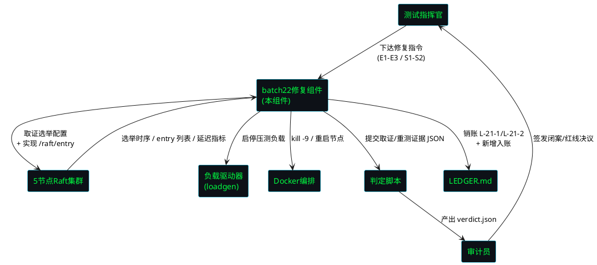
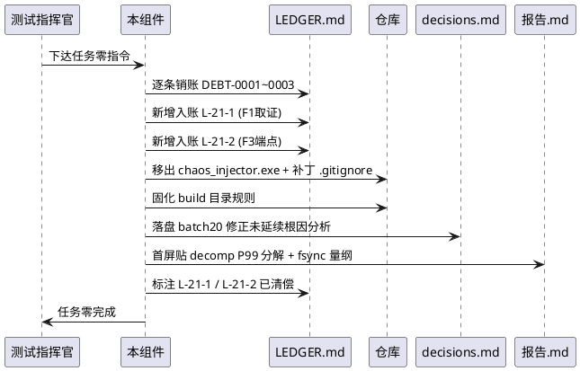
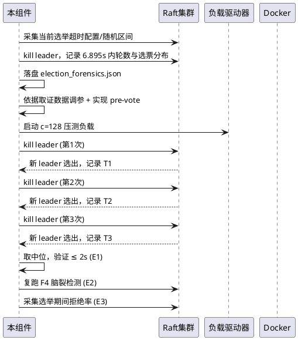
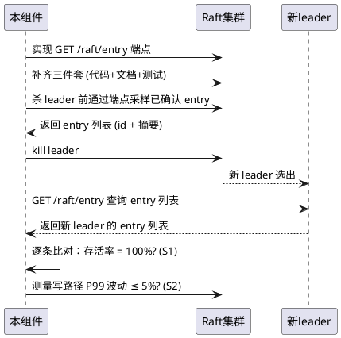
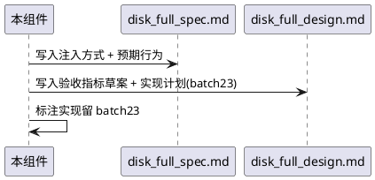
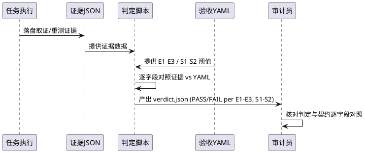

# batch22 故障注入战役I修复 + 战役II预演 — 需求规格（EARS 格式）

> 版本: v2.4-batch22-election-f3
> 来源指令: batch22 七节全闭环指令
> 前置批次: batch21（F1 FAIL 6.895s / F3 FAIL 0% / F2·F4·F5 PASS）
> 验收契约: tests/contracts/batch22.yaml
> EARS 格式: Ubiquitous / Event-driven / State-driven / Optional / Unwanted
> 时间盒: 总计 ≤ 6 小时（任务零 1.5h + 任务一 2h + 任务二 1.5h + 任务三 1h），到点停手交数据

---

## 1. 组件定位

### 1.1 核心职责

本组件负责修复 batch21 战役I 两项 FAIL（F1 选举完成时间 6.895s 超标、F3 已确认写存活率 0% 因端点缺失），完成 LEDGER 挂账逐条销账与构建产物入库根治，贴齐性能章节终审数据，并预演战役II 磁盘满故障注入方案设计。

### 1.2 核心输入

1. **batch21 判定结果**：`tests/evidence/d3-batch21/verdict.json`（F1=FAIL 6.895s / F3=FAIL 0% / overall=FAIL）
2. **batch21 报告**：`tests/evidence/d3-batch21/report.md`（F1 根因=选举超时配置 / F3 根因=/raft/entry 端点未实现）
3. **LEDGER 挂账台账**：`LEDGER.md`（DEBT-0001~0003 已清偿，本批新增 L-21-1 / L-21-2 两笔入账并清偿）
4. **性能终审数据**：`docs/specs/latency_decomp/decomp_c512_raw.json`（四构成项 P50/P99 及占比，batch21 已补全 4037 bytes）
5. **fsync 取证数据**：`tests/evidence/d3-batch20/fsync_forensics.json`（窗口 180s / fsync 总次数 4673 / 25.96 fsync/s / 合并比 437:1）
6. **验收契约 YAML**：`tests/contracts/batch22.yaml`（定义 E1-E3 / S1-S2 验收线及阈值）
7. **集群拓扑**：5 节点 Docker 集群配置（leader/follower 角色可动态识别，HTTP 9001-9005）
8. **断点续跑状态**：RESUME.md 中记录的已完成任务编号

### 1.3 核心输出

1. **选举取证 JSON**：当前选举超时配置 / 随机区间 / 6.895s 内轮数与选票分布，落盘至 `tests/evidence/d3-batch22/election_forensics.json`
2. **F3 重测证据 JSON 组**：实现 `/raft/entry` 端点后重跑 F3 全场景的存活率证据
3. **判定输出文件**：`tests/evidence/d3-batch22/verdict.json`（脚本读数据对照 YAML 产出 PASS/FAIL，助手只引用不得自写）
4. **磁盘满方案两件套**：`tests/evidence/d3-batch22/disk_full_spec.md` + `disk_full_design.md`（实现留 batch23）
5. **报告三件套**：`tests/evidence/d3-batch22/报告.md`（首屏三清单：绕行/降级/销账，必贴性能终审数据）/ `decisions.md` / `RESUME.md`
6. **LEDGER.md 更新**：L-21-1 / L-21-2 两笔入账并标注已清偿
7. **构建产物根治产物**：build 目录规则固化 + .gitignore 补丁 + chaos_injector.exe 移出 + decisions.md 根因分析
8. **commit + tag**：commit `D3-batch22-election-f3` + tag `v2.4-post-batch22` + bundle 备份

### 1.4 职责边界

- **不负责**：修改 fsync/quorum 语义（红线 RL-01/RL-02 不可破坏）
- **不负责**：自行放宽验收 YAML 阈值（改 YAML 须晨批，红线 RL-05）
- **不负责**：将可观测性代码写入写路径热区（红线 RL-07）
- **不负责**：实现磁盘满故障注入（本批仅方案设计，实现留 batch23）
- **不负责**：提交证据目录内容（证据被 .gitignore 排除，红线 RL-08）
- **不负责**：提交构建产物二进制（.exe / 编译产物禁止入库，红线 RL-11 升级项）
- **不负责**：自行延期（时间盒 ≤ 6 小时，到点停手交数据，红线 RL-10）
- **不负责**：自写 PASS/FAIL 判定（判定由脚本产出，红线 RL-09）

---

## 2. 领域术语

**选举取证（Election Forensics）**
: 对 batch21 F1 FAIL 的归因取证数据，包含当前选举超时配置、随机区间、6.895s 内的选举轮数与选票分布，用于指导选举优化决策。

**pre-vote 防选票分裂（Pre-Vote Anti-Split）**
: Raft 优化机制，候选人在发起正式选举前先进行 pre-vote 预投票探测，避免因网络分区或时序抖动导致多个节点同时发起选举造成选票分裂、选举轮数膨胀。

**选举超时随机区间（Election Timeout Random Range）**
: Raft 选举超时的随机化区间 [min, max]，用于避免活锁。当前配置导致 leader kill 后选举完成约 5.9~6.9s。

**已确认 entry 列表端点（Confirmed Entry Endpoint）**
: `GET /raft/entry` 端点，返回已获得 quorum 确认的 Raft log entry 列表（含 entry id + 内容摘要），用于 F3 已确认写存活率验证。

**观测端点三件套（Observation Endpoint Trio）**
: 观测端点的完整交付物：端点实现代码 + 端点文档 + 端点测试，三者缺一不可。

**磁盘满故障注入（Disk Full Fault Injection）**
: 战役II 预设故障场景，通过模拟磁盘空间耗尽（如填充 WAL 目录至 100%），观察 Raft 集群在磁盘满条件下的 fsync 失败、entry 拒写、降级行为与恢复能力。

**挂账销账（Ledger Settlement）**
: 对 LEDGER.md 中的待清记录逐条核对清偿条件、标注已清偿并记录 cleared_at 的过程。本批新增 L-21-1（F1 选举归因取证）和 L-21-2（观测端点缺失致 F3 无法验证）两笔入账并清偿。

**构建产物入库根治（Build Artifact Ingress Remediation）**
: 对 batch20/batch21 两批连续发生的构建产物（.exe / 二进制）误入库问题的根治措施，包括 build 目录规则固化、.gitignore 补丁、二进制移出仓库、根因分析落 decisions.md。

**性能终审数据（Performance Final Audit Data）**
: decomp_c512 P99 分解（quorum_wait / fsync_wait / RPC / 排队 各项 P50 / P99 及占比）与 fsync 量纲（压测窗口时长 + 窗口内总次数），为性能章节正式闭案提供数据闭环。

**首屏三清单（First-Screen Three Lists）**
: 报告.md 首屏必须包含的三个清单：绕行清单（已绕过的问题及原因）、降级清单（降级运行的功能及影响）、销账清单（LEDGER 挂账清偿状态）。

**断点续跑（Checkpoint Resume）**
: 任务执行中途崩溃后，依据 RESUME.md 中记录的已完成任务编号，跳过已完成任务、从断点继续执行的协议。

**三等级处置（Three-Tier Disposition）**
: 对验收结果按 PASS / PARTIAL / FAIL 三等级分类处置的协议，每等级有明确的后续动作定义。

---

## 3. 角色与边界

### 3.1 核心角色

- **测试指挥官（Test Commander）**：下达 batch22 修复指令，设定验收契约 E1-E3 / S1-S2，审核判定结果，签发闭案决议。
- **审计员（Auditor）**：核对证据完整性，验证判定与 YAML 契约逐字段对照，签发红线合规结论，审核构建产物入库根治。

### 3.2 外部系统

- **5 节点 Raft 集群**：选举优化目标 + 观测端点实现目标，提供 leader/follower 角色查询、进程管理、entry 列表查询接口。
- **负载驱动器（loadgen）**：c=128 / c=512 压测负载生成，E1 压测负载持续下选举验收 + S2 端点延迟验收的负载源。
- **Docker 集群编排**：节点容器启停、健康检查、网络隔离管理。
- **判定脚本**：读选举取证 / F3 重测证据 JSON + 验收 YAML，产出 verdict.json。

### 3.3 交互上下文

---

## 4. DFX 约束

### 4.1 性能

1. **总时间盒**：任务零 1.5h + 任务一 2h + 任务二 1.5h + 任务三 1h = 总计 ≤ 6 小时（wall-clock），到点停手交数据。
2. **选举优化验收**：杀 leader 后选举完成 ≤ 2s（3 次取中位），在压测负载持续下测量（E1）。
3. **端点延迟不劣化**：`/raft/entry` 端点自身不引入写路径延迟劣化，P99 波动 ≤ 5%（S2）。
4. **证据落盘**：单任务证据 JSON 落盘延迟 ≤ 2 秒（任务结束后）。

### 4.2 可靠性

1. **断点续跑**：任务执行中途崩溃后重启，已完成的任务不重复执行，从断点继续。
2. **证据完整性**：每个任务的 JSON 证据必须包含完整时间线，时间戳单调递增，无缺口。
3. **集群可恢复**：所有任务执行完毕后，5 节点集群恢复到健康稳态（1 leader + 4 follower）。
4. **选举优化不引入脑裂**：选举优化后复跑 F4 全绿，不引入新的脑裂风险（E2）。

### 4.3 安全性

1. **红线不可破坏**：fsync 语义、quorum 语义、选举超时语义在优化期间不可被绕过（调参允许但语义不可破坏）。
2. **证据隔离**：证据目录被 .gitignore 排除，提交时只 git add 代码文件，证据不进版本库。
3. **构建产物禁止入库**：.exe / 二进制 / 编译产物禁止入库，batch20/21 两批连犯，本批升级为红线项（RL-11）。
4. **判定不可篡改**：PASS/FAIL 判定由脚本读数据对照 YAML 产出，助手只引用判定文件，不得自写 PASS/FAIL。

### 4.4 可维护性

1. **结构化日志**：修复全过程日志为结构化格式（含时间戳、事件类型、节点 ID、角色），可回放重演。
2. **可观测性隔离**：`/raft/entry` 端点代码不进写路径热区，对正常写路径零侵入。
3. **挂账可追溯**：LEDGER.md 中每笔挂账有唯一 ID、来源批次、应清批次、状态，可审计追溯。
4. **决策落盘**：构建产物入库根因分析、选举优化决策、磁盘满方案设计决策均落盘 decisions.md。

### 4.5 兼容性

1. **验收 YAML 兼容**：batch22.yaml 格式与既有 batch21.yaml 契约格式一致，判定脚本可复用。
2. **集群配置兼容**：选举优化适配现有 5 节点 Docker 集群配置，无需修改集群拓扑。
3. **batch21 契约继承**：F2/F4/F5 验收线继承 batch21，E1-E3 对应 F1 优化后验收，S1-S2 对应 F3 修复后验收。

---

## 5. 核心能力

## 5.1 任务零：LEDGER 销账 + 构建产物根治 + 性能终审数据

### 5.1.1 业务规则

1. **LEDGER 逐条销账**（Ubiquitous）
   - 描述：系统应维护 LEDGER.md 挂账台账，对 batch21 遗留的 DEBT-0001~0003 逐条核对清偿状态，并新增两笔入账 L-21-1（F1 选举 6.895s 归因取证，本批清偿）和 L-21-2（观测端点缺失致 F3 无法验证，本批清偿），标注本批清偿。
   - EARS 类型：Ubiquitous — The [system] shall [maintain LEDGER.md with all debts audited, adding L-21-1 and L-21-2 as new entries cleared in this batch]
   - 验收条件：LEDGER.md 存在 → DEBT-0001~0003 状态确认为已清偿 → L-21-1 / L-21-2 两笔入账且状态为已清偿 → 每笔有唯一 ID 和 cleared_at。

2. **L-21-1 入账与清偿**（Event-driven）
   - 描述：当 batch21 F1 判定为 FAIL（6.895s > 5.0s）时，系统应将"F1 选举 6.895s 归因取证"作为 L-21-1 入账 LEDGER.md，并在本批完成取证后标注清偿。
   - EARS 类型：Event-driven — When [batch21 F1 is FAIL at 6.895s], the [system] shall [ledger L-21-1 for election forensics and clear it after forensics is complete in this batch]
   - 验收条件：F1 FAIL → L-21-1 入账 → 选举取证 JSON 落盘 → L-21-1 状态标注已清偿。

3. **L-21-2 入账与清偿**（Event-driven）
   - 描述：当 batch21 F3 判定为 FAIL（0%，根因=观测端点缺失）时，系统应将"观测端点缺失致 F3 无法验证"作为 L-21-2 入账 LEDGER.md，并在本批实现 `/raft/entry` 端点后标注清偿。
   - EARS 类型：Event-driven — When [batch21 F3 is FAIL due to missing /raft/entry endpoint], the [system] shall [ledger L-21-2 and clear it after the endpoint is implemented in this batch]
   - 验收条件：F3 FAIL → L-21-2 入账 → `/raft/entry` 端点实现 → L-21-2 状态标注已清偿。

4. **构建产物入库根治**（Ubiquitous）
   - 描述：系统应根治构建产物入库问题：固化 build 目录规则、补丁 .gitignore 排除所有二进制产物、将 chaos_injector.exe 移出仓库，并将 batch20 修正为何未延续的根因分析落盘 decisions.md。
   - EARS 类型：Ubiquitous — The [system] shall [remediate build artifact ingress by fixing build directory rules, patching .gitignore, removing chaos_injector.exe, and recording root-cause analysis in decisions.md]
   - 验收条件：仓库中不存在 .exe / 二进制产物 → .gitignore 包含排除规则 → build 目录规则已固化 → decisions.md 含 batch20 修正未延续根因分析 → git status 干净。

5. **性能终审数据贴齐**（Ubiquitous）
   - 描述：系统应贴齐性能章节终审数据（第三次催缴，首屏必贴），包括 decomp_c512 P99 分解（quorum_wait / fsync_wait / RPC / 排队 各项 P50 / P99 及占比）和 fsync 量纲（压测窗口时长 + 窗口内总次数）。
   - EARS 类型：Ubiquitous — The [system] shall [present performance final audit data on first screen: decomp_c512 P99 breakdown and fsync dimensional data]
   - 验收条件：报告.md 首屏 → 包含 decomp_c512 四构成项 P50/P99 及占比数字 → 包含 fsync 窗口时长 180s + 总次数 4673 → 数据可直接决定性能章节是否正式闭案。

6. **decomp_c512 P99 分解数字直贴**（Ubiquitous）
   - 描述：系统应直接贴出 decomp_c512 P99 分解数字：quorum_wait P50=12436µs(74.4%) P99=63465µs(81.3%)；fsync_wait P50=47µs(0.3%) P99=18165µs(23.3%)；RPC P50≈5000µs(29.9%) P99≈25000µs(32.0%)；queue P50=1563µs(9.3%) P99=32537µs(41.7%)。
   - EARS 类型：Ubiquitous — The [system] shall [directly present decomp_c512 P99 breakdown numbers for all four components]
   - 验收条件：报告.md 首屏 → 四构成项 × {P50, P99, P50占比, P99占比} 数字齐全且与 decomp_c512_raw.json 一致。

7. **fsync 量纲数字直贴**（Ubiquitous）
   - 描述：系统应直接贴出 fsync 量纲数字：压测窗口时长=180s，窗口内 fsync 总次数=4673，每秒 fsync=25.96，合并比=437:1。
   - EARS 类型：Ubiquitous — The [system] shall [directly present fsync dimensional numbers: window=180s, count=4673, per_sec=25.96, merge_ratio=437:1]
   - 验收条件：报告.md 首屏 → fsync 量纲数字齐全且与 fsync_forensics.json 一致。

### 5.1.2 交互流程

### 5.1.3 异常场景

1. **LEDGER 销账时发现历史记录状态不一致**
   - 触发条件：DEBT-0001~0003 中某笔状态与实际清偿情况不符
   - 系统行为：记录不一致详情，以实际证据为准修正状态，落盘 decisions.md
   - 用户感知：decisions.md 中标注状态修正记录

2. **chaos_injector.exe 被其他进程占用**
   - 触发条件：移出 chaos_injector.exe 时文件被占用无法删除
   - 系统行为：记录占用错误，先补丁 .gitignore，延迟重试移出
   - 用户感知：警告日志，.gitignore 已生效，后续手动移出

3. **decomp_c512_raw.json 数据缺失**
   - 触发条件：decomp_c512_raw.json 中某构成项缺少 P50 或 P99 字段
   - 系统行为：标记该字段为"缺失"，不阻止其余字段贴齐
   - 用户感知：报告.md 中标注缺失字段，提示性能章节暂不闭案

---

## 5.2 任务一：选举优化（治 F1，时间盒 2h）

### 5.2.1 业务规则

1. **选举取证先行**（Event-driven）
   - 描述：当启动选举优化任务时，系统应先进行取证：采集当前选举超时配置、随机区间、6.895s 内的选举轮数与选票分布，落盘至 `tests/evidence/d3-batch22/election_forensics.json`。
   - EARS 类型：Event-driven — When [election optimization task starts], the [system] shall [first collect forensics: current election timeout config, random range, round count and vote distribution within 6.895s, persisted to election_forensics.json]
   - 验收条件：任务一启动 → election_forensics.json 落盘 → 含超时配置 / 随机区间 / 轮数 / 选票分布 → 数据可指导优化决策。

2. **依据取证数据优化**（State-driven）
   - 描述：在选举取证数据已落盘的状态下，系统应依据数据优化选举：调参（超时 / 随机区间）使选举完成时间收敛至 ≤ 2s；如当前无 pre-vote 机制则实现 pre-vote 防选票分裂。
   - EARS 类型：State-driven — While [election forensics data is available], the [system] shall [optimize election based on data: tune timeout/random range and implement pre-vote if absent]
   - 验收条件：取证数据落盘 → 调参后选举完成 ≤ 2s（E1 验收）→ 如无 pre-vote 则实现 pre-vote → 选票分裂减少。

3. **调参不破坏选举超时语义**（State-driven）
   - 描述：在调参优化选举超时期间，系统应保证选举超时语义不被破坏——超时仍为随机化区间、仍满足 Raft 安全性（leader 选举唯一性）、不引入脑裂风险。
   - EARS 类型：State-driven — While [tuning election timeout], the [system] shall [preserve election timeout semantics: randomized range, Raft safety, no split-brain]
   - 验收条件：调参后 → 选举超时仍为随机区间 → Raft 安全性不破坏 → 复跑 F4 全绿（E2 验收）。

4. **pre-vote 实现**（Optional）
   - 描述：在当前集群无 pre-vote 机制的情况下，系统应实现 pre-vote：候选人在正式选举前先进行预投票探测，获得多数派预支持后才发起正式选举，防止选票分裂。
   - EARS 类型：Optional — Where [pre-vote is absent], the [system] shall [implement pre-vote: candidate probes majority support before starting formal election]
   - 验收条件：无 pre-vote → 实现 pre-vote → 选举轮数减少 → 选举完成时间收敛。

5. **压测负载持续下测量**（State-driven）
   - 描述：在压测负载（c=128）持续不断的集群状态下，系统应测量选举完成时间，3 次取中位值，验证 ≤ 2s。
   - EARS 类型：State-driven — While [c=128 load is sustained], the [system] shall [measure election completion time, median of 3 runs, verify ≤ 2s]
   - 验收条件：c=128 负载持续 → 3 次杀 leader → 取中位 → 选举完成 ≤ 2s → E1=PASS。

### 5.2.2 交互流程

### 5.2.3 异常场景

1. **调参后选举完成时间仍 > 2s**
   - 触发条件：调参 + pre-vote 后选举完成时间中位值仍超过 2s
   - 系统行为：如实记录，标注 E1=FAIL，落盘取证数据供后续分析，不自行放宽阈值
   - 用户感知：verdict.json 中 E1=FAIL，附实测中位值与取证数据路径

2. **pre-vote 引入新脑裂风险**
   - 触发条件：实现 pre-vote 后复跑 F4 检测到 > 1 个 leader
   - 系统行为：回退 pre-vote 实现，标注 E2=FAIL，记录脑裂详情，触发红线
   - 用户感知：verdict.json 中 E2=FAIL，附脑裂检测详情，pre-vote 已回退

3. **选举期间拒绝率劣化**
   - 触发条件：优化后选举期间拒绝率 > 30%（batch21 基线为 20%）
   - 系统行为：如实记录，标注 E3=FAIL，不自行放宽阈值
   - 用户感知：verdict.json 中 E3=FAIL，附实测拒绝率与基线对照

---

## 5.3 任务二：观测端点（治 F3，时间盒 1.5h）

### 5.3.1 业务规则

1. **实现 GET /raft/entry 端点**（Ubiquitous）
   - 描述：系统应实现 `GET /raft/entry` 端点，返回已确认（已 commit）的 Raft log entry 列表，每个 entry 含 entry id（index + term）和内容摘要，补齐观测端点三件套（端点代码 + 端点文档 + 端点测试）。
   - EARS 类型：Ubiquitous — The [system] shall [implement GET /raft/entry returning confirmed entry list with id and content summary, with endpoint trio: code + docs + tests]
   - 验收条件：`GET /raft/entry` 可调用 → 返回 JSON 含 entry 列表 → 每个 entry 含 index / term / 内容摘要 → 三件套齐全。

2. **端点只读不侵入写路径**（State-driven）
   - 描述：在 `/raft/entry` 端点运行期间，系统应保证端点为只读操作，不侵入写路径热区，对正常写路径零侵入。
   - EARS 类型：State-driven — While [/raft/entry is serving], the [system] shall [ensure read-only operation with zero intrusion to write path]
   - 验收条件：端点运行 → 写路径 P99 波动 ≤ 5%（S2 验收）→ 端点代码不在写路径热区。

3. **重跑 F3 全场景**（Event-driven）
   - 描述：当 `/raft/entry` 端点实现完成后，系统应重跑 F3 全场景：杀 leader 前通过端点写入并采样已确认 entry，杀 leader 后在新 leader 上查询并比对，验证 100% 存活。
   - EARS 类型：Event-driven — When [/raft/entry is implemented], the [system] shall [re-run all F3 scenarios: sample confirmed entries before kill, verify 100% survival on new leader after kill]
   - 验收条件：端点实现 → 杀 leader 前采样已确认 entry → 杀 leader → 新 leader 上查询比对 → 存活率 100% → S1=PASS。

4. **抽样比对验证**（Event-driven）
   - 描述：当杀 leader 后新 leader 选出时，系统应对杀 leader 前采样的已确认 entry 逐条比对，验证 entry index ≤ 新 leader commit_index 且内容一致。
   - EARS 类型：Event-driven — When [new leader is elected after kill], the [system] shall [compare sampled confirmed entries against new leader: index ≤ commit_index and content matches]
   - 验收条件：新 leader 选出 → 逐条比对采样 entry → 全部存活 → 存活率 = 100% → S1=PASS。

5. **端点三件套完整**（Ubiquitous）
   - 描述：系统应保证 `/raft/entry` 端点三件套完整：端点实现代码（main.go 路由 + handler）、端点文档（API 契约说明）、端点测试（单元测试 + 集成测试）。
   - EARS 类型：Ubiquitous — The [system] shall [deliver /raft/endpoint trio: implementation code + API docs + tests]
   - 验收条件：端点代码存在 → 端点文档存在 → 端点测试存在且通过 → 三件套齐全。

### 5.3.2 交互流程

### 5.3.3 异常场景

1. **端点返回 entry 列表为空**
   - 触发条件：`GET /raft/entry` 返回空列表（集群无已确认 entry 或端点实现有误）
   - 系统行为：记录空列表情况，检查集群 commit_index > 0，若端点实现有误则修复
   - 用户感知：警告日志，附集群 commit_index 和端点响应

2. **抽样比对发现 entry 丢失**
   - 触发条件：新 leader 上某已确认 entry 不存在或内容不一致
   - 系统行为：记录丢失 entry 详情（index / term / 预期值 / 实际值），判定 S1=FAIL，触发红线（数据丢失）
   - 用户感知：verdict.json 中 S1=FAIL，附丢失 entry 详情，触发红线告警

3. **端点引入写路径延迟劣化**
   - 触发条件：`/raft/entry` 端点运行后写路径 P99 波动 > 5%
   - 系统行为：排查端点实现是否侵入写路径热区，修复后重测，若无法修复则标注 S2=FAIL
   - 用户感知：verdict.json 中 S2=FAIL，附 P99 波动数据

---

## 5.4 任务三：战役II预演（磁盘满方案设计，时间盒 1h）

### 5.4.1 业务规则

1. **磁盘满故障注入方案设计**（Ubiquitous）
   - 描述：系统应设计磁盘满故障注入方案，产出 spec + design 两件套落盘至 `tests/evidence/d3-batch22/disk_full_spec.md` 和 `disk_full_design.md`，实现留 batch23。
   - EARS 类型：Ubiquitous — The [system] shall [design disk-full fault injection plan with spec+design duo, implementation deferred to batch23]
   - 验收条件：disk_full_spec.md 存在 → disk_full_design.md 存在 → 两件套含注入方式 / 预期行为 / 验收指标草案 → 实现标注留 batch23。

2. **注入方式设计**（Ubiquitous）
   - 描述：系统应在方案中明确磁盘满故障的注入方式：如填充 WAL 目录至 100%、使用 Docker 卷大小限制模拟磁盘满、或使用 fallocate/dd 快速占用空间。
   - EARS 类型：Ubiquitous — The [system] shall [specify injection method: fill WAL directory to 100% / Docker volume size limit / fallocate/dd]
   - 验收条件：disk_full_spec.md → 注入方式章节 → 含至少一种具体可执行的注入方法 → 附操作命令草案。

3. **预期行为设计**（Ubiquitous）
   - 描述：系统应在方案中明确磁盘满故障的预期行为：fsync 失败、entry 拒写、leader 降级或步进、follower 同步停滞、客户端错误码、集群可用性影响。
   - EARS 类型：Ubiquitous — The [system] shall [specify expected behavior: fsync failure, entry rejection, leader degradation, follower sync stall, client error codes, availability impact]
   - 验收条件：disk_full_spec.md → 预期行为章节 → 含 fsync / entry / leader / follower / client / 可用性 六维预期。

4. **验收指标草案**（Ubiquitous）
   - 描述：系统应在方案中定义磁盘满故障注入的验收指标草案：如 fsync 失败后集群不脑裂、已确认 entry 不丢失、磁盘恢复后集群自愈、降级期间拒绝率可控。
   - EARS 类型：Ubiquitous — The [system] shall [define acceptance criteria draft: no split-brain after fsync failure, confirmed entries preserved, self-healing after disk recovery, controlled reject rate during degradation]
   - 验收条件：disk_full_design.md → 验收指标草案章节 → 含 ≥ 4 条可量化验收指标 → 标注为草案待 batch23 细化。

5. **实现留 batch23**（Optional）
   - 描述：在方案设计完成的情况下，系统应明确标注磁盘满故障注入的实现留至 batch23，本批仅产出方案两件套。
   - EARS 类型：Optional — Where [design is complete], the [system] shall [explicitly defer implementation to batch23]
   - 验收条件：方案两件套完成 → 明确标注"实现留 batch23" → 本批不编写注入实现代码。

### 5.4.2 交互流程

### 5.4.3 异常场景

1. **方案设计时间盒不足**
   - 触发条件：任务三 1h 时间盒到期但方案两件套未完成
   - 系统行为：停手交已完成部分，标注未完成章节，挂账至 batch23
   - 用户感知：RESUME.md 中标注任务三未完成部分，挂账记录

---

## 5.5 验收契约 E1-E3 / S1-S2

### 5.5.1 业务规则

1. **E1: 选举完成时间 ≤ 2s**（Event-driven）
   - 描述：当 leader 被 kill 后，系统应在 2 秒内完成选举（新 leader 选出并对外可服务），以 3 次测量取中位值为准，在压测负载（c=128）持续下测量。
   - EARS 类型：Event-driven — When [leader is killed under c=128 load], the [system] shall [complete election within 2s (median of 3 runs)]
   - 验收条件：c=128 负载持续 → kill leader → 选举完成时间中位 ≤ 2s → 判定 E1=PASS
   - 反条件：选举完成时间中位 > 2s → 判定 E1=FAIL
   - 与 batch21 追溯：E1 对应 F1 优化后验收（F1 阈值 5s → E1 阈值 2s，优化目标）

2. **E2: 优化不引入脑裂风险**（State-driven）
   - 描述：在选举优化（调参 + pre-vote）实施后，系统应保证复跑 F4 全绿——任一时刻 leader 至多 1 个，5 节点集群无脑裂。
   - EARS 类型：State-driven — While [election optimization is applied], the [system] shall [have no new split-brain risk: re-run F4 all green, at most 1 leader at any instant]
   - 验收条件：优化实施后 → 复跑 F4 → max(concurrent_leaders) ≤ 1 → 判定 E2=PASS
   - 反条件：复跑 F4 检测到 > 1 个 leader → 判定 E2=FAIL
   - 与 batch21 追溯：E2 对应 F4 回归验收（优化不得破坏 F4 已 PASS 状态）

3. **E3: 选举期间拒绝率不劣化**（State-driven）
   - 描述：在选举优化后故障注入期间，系统应将客户端拒绝率维持在 ≤ 30%（batch21 基线为 20%，优化后不劣化）。
   - EARS 类型：State-driven — While [fault injection is active after optimization], the [system] shall [maintain reject rate ≤ 30% (no degradation from batch21 baseline 20%)]
   - 验收条件：优化后注入期间 → 拒绝率 ≤ 30% → 判定 E3=PASS
   - 反条件：拒绝率 > 30% → 判定 E3=FAIL
   - 与 batch21 追溯：E3 对应 F2 优化后不劣化验收（F2 基线 20% → E3 维持 ≤ 30%）

4. **S1: 已确认写入存活率 = 100%**（Event-driven）
   - 描述：当 leader 被 kill 时，系统应保证所有已获得 quorum 确认的 entry 100% 存活，通过 `/raft/entry` 端点抽样比对验证。
   - EARS 类型：Event-driven — When [leader is killed], the [system] shall [preserve 100% of quorum-confirmed entries (verified via /raft/entry sampling)]
   - 验收条件：kill leader → 通过 `/raft/entry` 采样比对 → 存活率 100% → 判定 S1=PASS
   - 反条件：任一已确认 entry 丢失 → 判定 S1=FAIL
   - 与 batch21 追溯：S1 对应 F3 修复后验收（F3 因端点缺失 0% → S1 端点实现后 100%）

5. **S2: 端点不引入写路径延迟劣化**（State-driven）
   - 描述：在 `/raft/entry` 端点运行期间，系统应保证写路径 P99 波动 ≤ 5%，端点自身不引入延迟劣化。
   - EARS 类型：State-driven — While [/raft/entry is serving], the [system] shall [keep write path P99 fluctuation ≤ 5%]
   - 验收条件：端点运行 → 写路径 P99 波动 ≤ 5% → 判定 S2=PASS
   - 反条件：P99 波动 > 5% → 判定 S2=FAIL
   - 与 batch21 追溯：S2 为 batch22 新增验收线（端点引入的延迟约束，batch21 无对应）

6. **判定来源约束**（Ubiquitous）
   - 描述：系统应确保 PASS/FAIL 判定由脚本读数据对照 YAML 产出，助手只引用判定文件，不得自写 PASS/FAIL。
   - EARS 类型：Ubiquitous — The [system] shall [ensure PASS/FAIL verdicts are produced by script reading data vs YAML, assistant only references]
   - 验收条件：判定文件存在 → 判定由脚本产出 → 助手回复中只引用判定文件内容 → 无助手自写判定。

7. **验收 YAML 变更约束**（Unwanted）
   - 描述：如果需要修改验收 YAML 阈值，则系统应要求晨批审批，禁止自行修改。
   - EARS 类型：Unwanted — If [YAML threshold modification is needed], then the [system] shall [require morning batch approval]
   - 验收条件：YAML 阈值变更请求 → 必须经晨批审批 → 未经审批的变更 → 红线违反。

### 5.5.2 交互流程

### 5.5.3 异常场景

1. **判定脚本执行失败**
   - 触发条件：判定脚本读取证据 JSON 或 YAML 时格式错误
   - 系统行为：记录错误日志，标记对应验收项为 ERROR，不阻止其余项判定
   - 用户感知：verdict.json 中对应项 status=ERROR，附错误详情

2. **证据数据不完整**
   - 触发条件：证据 JSON 缺少判定所需字段
   - 系统行为：标记缺失字段为 MISSING，对应项判定为 INSUFFICIENT_EVIDENCE
   - 用户感知：verdict.json 中标注缺失字段，提示需补采

3. **S1 抽样比对发现 entry 丢失**
   - 触发条件：`/raft/entry` 端点比对发现已确认 entry 丢失
   - 系统行为：记录丢失 entry 详情，判定 S1=FAIL，触发红线（数据丢失）
   - 用户感知：verdict.json 中 S1=FAIL，附丢失 entry 详情，触发红线告警

---

## 5.6 断点续跑协议

### 5.6.1 业务规则

1. **断点记录**（Event-driven）
   - 描述：当每个任务执行完成并落盘证据后，系统应将该任务编号写入 RESUME.md。
   - EARS 类型：Event-driven — When [a task completes and evidence is persisted], the [system] shall [write the task ID to RESUME.md]
   - 验收条件：任务 N 完成 → RESUME.md 包含任务 N 编号 → 任务 N 证据已落盘。

2. **断点恢复**（Event-driven）
   - 描述：当 batch22 组件启动时检测到 RESUME.md 存在，系统应跳过已记录的任务，从断点继续执行。
   - EARS 类型：Event-driven — When [component starts and RESUME.md exists], the [system] shall [skip recorded tasks and resume from checkpoint]
   - 验收条件：组件启动 + RESUME.md 存在 → 跳过已记录任务 → 从下一未完成任务继续。

3. **全量重跑开关**（Optional）
   - 描述：在显式指定全量重跑标志的情况下，系统应忽略 RESUME.md，从头执行全部任务。
   - EARS 类型：Optional — Where [full-rerun flag is specified], the [system] shall [ignore RESUME.md and execute all tasks from scratch]
   - 验收条件：启动时带 --full-rerun → 忽略 RESUME.md → 执行全部任务。

### 5.6.2 异常场景

1. **RESUME.md 损坏**
   - 触发条件：RESUME.md 格式损坏，无法解析已完成任务编号
   - 系统行为：备份损坏文件为 RESUME.md.bak，提示用户确认后从任务零重新开始
   - 用户感知：警告日志，要求确认全量重跑

---

## 5.7 三等级处置协议

### 5.7.1 业务规则

1. **PASS 等级处置**（Event-driven）
   - 描述：当验收契约 E1-E3 / S1-S2 全部判定为 PASS 时，系统应执行闭案处置：签发闭案决议、打 tag v2.4-post-batch22、commit D3-batch22-election-f3、bundle 备份。
   - EARS 类型：Event-driven — When [all E1-E3 and S1-S2 verdicts are PASS], the [system] shall [close the case, tag v2.4-post-batch22, commit D3-batch22-election-f3, and bundle backup]
   - 验收条件：E1-E3 / S1-S2 全 PASS → 签发闭案决议 → 打 tag → commit → bundle 备份。

2. **PARTIAL 等级处置**（Event-driven）
   - 描述：当 E1-E3 / S1-S2 中部分（非全部）判定为 PASS，且无 FAIL 时，系统应执行挂账处置：将未通过项挂账至 batch23，记录根因初判，不闭案。
   - EARS 类型：Event-driven — When [some but not all verdicts are PASS and none are FAIL], the [system] shall [ledger failing items to batch23, record initial root-cause, and not close the case]
   - 验收条件：部分 PASS + 无 FAIL → 未通过项挂账至 batch23 → 记录根因初判 → 不闭案。

3. **FAIL 等级处置**（Event-driven）
   - 描述：当 E1-E3 / S1-S2 中任一判定为 FAIL 时，系统应执行红线处置：触发红线告警，记录失败详情，不得自行修复后重判，须晨批审议。
   - EARS 类型：Event-driven — When [any verdict is FAIL], the [system] shall [trigger red-line alert, record failure details, prohibit self-repair-and-rejudge, and require morning batch review]
   - 验收条件：任一项 FAIL → 红线告警 → 记录失败详情 → 须晨批审议。

4. **挂账到期红线**（Unwanted）
   - 描述：如果挂账到期未清，则系统应自动判定为红线违反。
   - EARS 类型：Unwanted — If [a ledger debt expires without clearance], then the [system] shall [automatically flag a red-line violation]
   - 验收条件：挂账到期 + 未清 → 自动红线违反。

5. **时间盒到期处置**（Event-driven）
   - 描述：当时间盒（6 小时）到期时，系统应停手交数据，不得自行延期，将已完成任务的判定结果和未完成任务清单一并上报。
   - EARS 类型：Event-driven — When [the 6-hour timebox expires], the [system] shall [stop and hand over data, prohibit self-extension, and report completed verdicts plus pending task list]
   - 验收条件：时间盒到期 → 停手 → 交数据 → 上报已完成判定 + 未完成清单 → 不自行延期。

### 5.7.2 异常场景

1. **闭案后发现问题**
   - 触发条件：闭案决议签发后，审计复核发现某验收项实际未通过
   - 系统行为：撤销闭案决议，回退 tag，重新挂账，触发红线告警
   - 用户感知：闭案撤销公告，红线告警，须晨批审议

---

## 6. 数据约束

### 6.1 验收契约 YAML（batch22.yaml）

1. **契约文件路径**：tests/contracts/batch22.yaml
2. **E1 阈值**：election_completion_time_max = 2.0s（单位：秒，3 次取中位，压测 c=128 持续下测量）
3. **E2 要求**：max_concurrent_leaders ≤ 1（复跑 F4 全绿，任一时刻）
4. **E3 阈值**：reject_rate_during_injection_max = 30（单位：百分比，不劣化 batch21 基线 20%）
5. **S1 阈值**：confirmed_write_survival_rate = 100（单位：百分比，通过 `/raft/entry` 端点抽样比对）
6. **S2 阈值**：write_path_p99_fluctuation_max = 5（单位：百分比，端点运行期间写路径 P99 波动）
7. **继承验收线**：F2（拒载率 ≤ 30%，恢复后 = 0）/ F4（无脑裂 ≤ 1）/ F5（日志完整可回放）继承 batch21

### 6.2 选举取证 JSON（election_forensics.json）

1. **current_election_timeout**：当前选举超时配置值
2. **random_range**：选举超时随机化区间 [min, max]
3. **round_count_within_6895ms**：6.895s 内的选举轮数
4. **vote_distribution**：选票分布（每轮各节点得票数）
5. **kill_to_election_complete**：kill 到选举完成的 wall-clock 时长
6. **timestamp**：取证时间戳

### 6.3 F3 重测证据 JSON

1. **scenario_id**：场景唯一标识
2. **sampled_entries**：杀 leader 前采样的已确认 entry 列表（index / term / 内容摘要）
3. **new_leader_id**：新 leader 节点 ID
4. **new_leader_commit_index**：新 leader 的 commit_index
5. **survived_entries_count**：存活 entry 数
6. **survival_rate**：存活率（百分比）
7. **mismatched_entries**：不一致 entry 详情列表
8. **status**：场景状态（PASS / FAIL）

### 6.4 磁盘满方案两件套

1. **disk_full_spec.md**：注入方式 + 预期行为 + 验收指标草案
2. **disk_full_design.md**：技术设计 + 实现计划（标注留 batch23）+ 与现有机制关系分析
3. **注入方式**：至少一种具体可执行方法（填充 WAL 目录 / Docker 卷限制 / fallocate）
4. **预期行为**：fsync 失败 / entry 拒写 / leader 降级 / follower 停滞 / client 错误码 / 可用性影响 六维
5. **验收指标草案**：≥ 4 条可量化指标，标注为草案待 batch23 细化

### 6.5 LEDGER.md 挂账记录

1. **debt_id**：欠账唯一 ID（格式：DEBT-XXXX 或 L-XX-X）
2. **source_batch**：来源批次
3. **target_batch**：应清批次
4. **status**：状态（待清 / 已清偿 / 到期未清）
5. **description**：欠账描述
6. **cleared_at**：清偿时间戳（已清偿时填写）

### 6.6 RESUME.md

1. **completed_tasks**：已完成任务编号列表
2. **last_updated**：最后更新时间戳
3. **total_tasks**：总任务数
4. **session_id**：当前执行会话 ID

### 6.7 decomp_c512_raw.json（终审数据，首屏必贴）

1. **quorum_wait**：{p50=12436µs, p99=63465µs, p50_ratio=74.4%, p99_ratio=81.3%}
2. **fsync_wait**：{p50=47µs, p99=18165µs, p50_ratio=0.3%, p99_ratio=23.3%}
3. **rpc**：{p50≈5000µs, p99≈25000µs, p50_ratio≈29.9%, p99_ratio≈32.0%}（估算值，未独立埋点）
4. **queue**：{p50=1563µs, p99=32537µs, p50_ratio=9.3%, p99_ratio=41.7%}
5. **server_total**：{p50=16723µs, p99=78095µs}
6. **metadata**：{source=batch18埋点实测, sample_count=69982, concurrency=512}

### 6.8 fsync 量纲数据（首屏必贴）

1. **压测窗口时长**：180s（来源：fsync_forensics.json test_config.duration）
2. **窗口内 fsync 总次数**：4673（来源：fsync_forensics.json leader.fsync_count）
3. **每秒 fsync**：25.96（来源：fsync_forensics.json leader.fsync_per_sec）
4. **合并比**：437:1（来源：fsync_forensics.json analysis.merge_ratio_leader）
5. **判定**：INTRINSIC_CONFIRMED（26 fsync/s 属"几十次/秒"范畴，符合预设标准）

---

## 7. 需求追溯矩阵

### 7.1 batch22 内部需求追溯

| 需求 ID | EARS 类型 | 描述 | 对应验收 |
|---------|-----------|------|----------|
| REQ-T0-01 | Ubiquitous | LEDGER 逐条销账 | 任务零 |
| REQ-T0-02 | Event-driven | L-21-1 入账与清偿（F1 取证） | 任务零 |
| REQ-T0-03 | Event-driven | L-21-2 入账与清偿（F3 端点） | 任务零 |
| REQ-T0-04 | Ubiquitous | 构建产物入库根治 | 任务零 |
| REQ-T0-05 | Ubiquitous | 性能终审数据贴齐 | 任务零 |
| REQ-T0-06 | Ubiquitous | decomp_c512 P99 分解数字直贴 | 任务零 |
| REQ-T0-07 | Ubiquitous | fsync 量纲数字直贴 | 任务零 |
| REQ-E-01 | Event-driven | 选举取证先行 | 任务一 |
| REQ-E-02 | State-driven | 依据取证数据优化 | 任务一 |
| REQ-E-03 | State-driven | 调参不破坏选举超时语义 | 任务一 |
| REQ-E-04 | Optional | pre-vote 实现 | 任务一 |
| REQ-E-05 | State-driven | 压测负载持续下测量 | 任务一 |
| REQ-S-01 | Ubiquitous | 实现 GET /raft/entry 端点 | 任务二 |
| REQ-S-02 | State-driven | 端点只读不侵入写路径 | 任务二 |
| REQ-S-03 | Event-driven | 重跑 F3 全场景 | 任务二 |
| REQ-S-04 | Event-driven | 抽样比对验证 | 任务二 |
| REQ-S-05 | Ubiquitous | 端点三件套完整 | 任务二 |
| REQ-D-01 | Ubiquitous | 磁盘满方案设计 | 任务三 |
| REQ-D-02 | Ubiquitous | 注入方式设计 | 任务三 |
| REQ-D-03 | Ubiquitous | 预期行为设计 | 任务三 |
| REQ-D-04 | Ubiquitous | 验收指标草案 | 任务三 |
| REQ-D-05 | Optional | 实现留 batch23 | 任务三 |
| REQ-E1 | Event-driven | 选举完成时间 ≤ 2s | E1 |
| REQ-E2 | State-driven | 优化不引入脑裂风险 | E2 |
| REQ-E3 | State-driven | 选举期间拒绝率不劣化 | E3 |
| REQ-S1 | Event-driven | 已确认写入存活率 = 100% | S1 |
| REQ-S2 | State-driven | 端点不引入写路径延迟劣化 | S2 |
| REQ-JUDGE | Ubiquitous | 判定由脚本产出 | 判定约束 |
| REQ-YAML | Unwanted | YAML 变更须晨批 | 红线 |
| REQ-RESUME-01 | Event-driven | 断点记录 | 断点续跑 |
| REQ-RESUME-02 | Event-driven | 断点恢复 | 断点续跑 |
| REQ-RESUME-03 | Optional | 全量重跑开关 | 断点续跑 |
| REQ-DISP-PASS | Event-driven | PASS 等级处置 | 三等级处置 |
| REQ-DISP-PARTIAL | Event-driven | PARTIAL 等级处置 | 三等级处置 |
| REQ-DISP-FAIL | Event-driven | FAIL 等级处置 | 三等级处置 |
| REQ-DISP-EXPIRE | Unwanted | 挂账到期红线 | 三等级处置 |
| REQ-DISP-TIMEBOX | Event-driven | 时间盒到期处置 | 三等级处置 |

### 7.2 与 batch21 需求追溯关系

| batch22 需求 | batch21 需求 | 追溯关系 | 说明 |
|-------------|-------------|---------|------|
| REQ-E1 (E1: 选举 ≤ 2s) | REQ-F1 (F1: 选举 ≤ 5s) | 优化后验收 | F1 阈值 5s → E1 阈值 2s，batch21 FAIL 6.895s → batch22 优化目标 ≤ 2s |
| REQ-E2 (E2: 不引入脑裂) | REQ-F4 (F4: 无脑裂 ≤ 1) | 回归验收 | 优化不得破坏 F4 已 PASS 状态，复跑 F4 全绿 |
| REQ-E3 (E3: 拒绝率不劣化) | REQ-F2 (F2: 拒载率 ≤ 30%) | 不劣化验收 | F2 基线 20% → E3 维持 ≤ 30%，优化后不劣化 |
| REQ-S1 (S1: 存活率 100%) | REQ-F3 (F3: 存活率 100%) | 修复后验收 | F3 因 /raft/entry 端点缺失 0% → S1 端点实现后 100% |
| REQ-S2 (S2: P99 波动 ≤ 5%) | （无对应） | 新增验收 | batch22 新增：端点引入的写路径延迟约束 |
| REQ-T0-01 (LEDGER 销账) | REQ-T0-01 (LEDGER 建账) | 延续+扩展 | batch21 建账 → batch22 销账 + 新增 L-21-1/L-21-2 |
| REQ-T0-04 (构建产物根治) | REQ-T0-05 (loadgen.exe 移出) | 升级根治 | batch21 移出 loadgen.exe → batch22 根治所有构建产物 + 红线升级 |
| REQ-T0-05 (性能终审贴齐) | REQ-T0-03 (decomp 补全) | 延续+终审 | batch21 补全 decomp → batch22 首屏贴齐终审数字 |
| REQ-T0-07 (fsync 量纲直贴) | REQ-T0-02 (fsync 量纲澄清) | 延续+终审 | batch21 量纲澄清 → batch22 首屏贴齐量纲数字 |
| REQ-JUDGE | REQ-JUDGE | 完全继承 | 判定由脚本产出，红线 RL-09 继承 |
| REQ-YAML | REQ-YAML | 完全继承 | YAML 变更须晨批，红线 RL-05 继承 |
| REQ-RESUME-01~03 | REQ-RESUME-01~04 | 完全继承 | 断点续跑协议继承 |
| REQ-DISP-* | REQ-DISP-* | 完全继承 | 三等级处置协议继承，tag 升级为 v2.4-post-batch22 |

---

## 8. 红线清单

### 8.1 继承红线（batch21 RL-01 ~ RL-10）

1. **RL-01**：fsync 语义不可破坏 — 优化期间 fsync 行为与正常一致
2. **RL-02**：quorum 语义不可破坏 — 优化期间 quorum 确认逻辑与正常一致
3. **RL-03**：选举超时语义不可破坏 — 调参允许但语义不可破坏（随机化区间、Raft 安全性）
4. **RL-04**：PASS 判定逐字段对照验收 YAML — 判定脚本须逐字段比对
5. **RL-05**：改 YAML 须晨批 — 验收阈值变更须晨批审批
6. **RL-06**：挂账到期未清 = 自动红线违反
7. **RL-07**：可观测性代码不进写路径热区 — `/raft/entry` 端点零侵入写路径
8. **RL-08**：证据目录被 .gitignore 排除 — 提交时只 git add 代码文件
9. **RL-09**：助手不得自写 PASS/FAIL — 判定只引用脚本产出
10. **RL-10**：时间盒 ≤ 6 小时 — 到点停手交数据，不得自行延期

### 8.2 新增红线（batch22 升级）

11. **RL-11**：构建产物（.exe / 二进制 / 编译产物）禁止入库 — batch20/batch21 两批连犯，本批升级为红线项。build 目录规则固化 + .gitignore 补丁 + 二进制移出仓库 + 根因分析落 decisions.md。

---

## 9. 场景矩阵定义

### 9.1 选举优化验收场景（E1-E3）

| 场景 ID | 类型 | 描述 | 验收线 | 测量条件 |
|---------|------|------|--------|----------|
| election_opt_01 | 压测下杀 leader | c=128 负载持续，kill leader，测量选举完成时间 | E1 | 3 次取中位 ≤ 2s |
| election_opt_02 | 压测下杀 leader | c=128 负载持续，kill leader，复跑脑裂检测 | E2 | max(leaders) ≤ 1 |
| election_opt_03 | 压测下杀 leader | c=128 负载持续，kill leader，测量拒绝率 | E3 | 拒绝率 ≤ 30% |
| election_opt_04 | 稳态杀 leader | 无负载，kill leader，测量选举完成时间 | E1 | 3 次取中位 ≤ 2s |
| election_opt_05 | 稳态杀 leader | 无负载，kill leader，复跑脑裂检测 | E2 | max(leaders) ≤ 1 |

### 9.2 观测端点验收场景（S1-S2）

| 场景 ID | 类型 | 描述 | 验收线 | 测量条件 |
|---------|------|------|--------|----------|
| entry_survival_01 | 杀 leader 后比对 | 采样已确认 entry，kill leader，新 leader 比对存活率 | S1 | 存活率 = 100% |
| entry_survival_02 | 杀 leader 后比对 | 重复场景 01，不同 entry 采样 | S1 | 存活率 = 100% |
| entry_survival_03 | 杀 leader 后比对 | 连杀场景，采样比对存活率 | S1 | 存活率 = 100% |
| endpoint_latency_01 | 端点运行下压测 | `/raft/entry` 运行，c=512 压测，测量写路径 P99 波动 | S2 | P99 波动 ≤ 5% |

### 9.3 继承验收场景（F2 / F4 / F5）

| 场景 ID | 类型 | 描述 | 验收线 | 测量条件 |
|---------|------|------|--------|----------|
| inherited_f2 | 拒载率回归 | 优化后注入期间拒绝率 + 恢复后拒绝率 | F2 | 期间 ≤ 30%，恢复后 = 0 |
| inherited_f4 | 脑裂回归 | 优化后全场景脑裂检测 | F4 | max(leaders) ≤ 1 |
| inherited_f5 | 日志回归 | 优化后全场景日志完整性 | F5 | 完整 + 可回放 |

### 9.4 场景矩阵汇总

| 任务 | 场景数 | 验收线 | 时间盒 |
|------|--------|--------|--------|
| 任务零 | —（非场景化） | LEDGER 销账 + 构建根治 + 性能终审 | 1.5h |
| 任务一（选举优化） | 5 场景 | E1 / E2 / E3 | 2h |
| 任务二（观测端点） | 4 场景 | S1 / S2 | 1.5h |
| 任务三（战役II预演） | —（方案设计） | 磁盘满方案两件套 | 1h |
| 继承回归 | 3 场景 | F2 / F4 / F5 | 含在上述时间盒内 |
| **合计** | **12 场景 + 方案设计** | **E1-E3 / S1-S2 / F2 / F4 / F5** | **≤ 6h** |