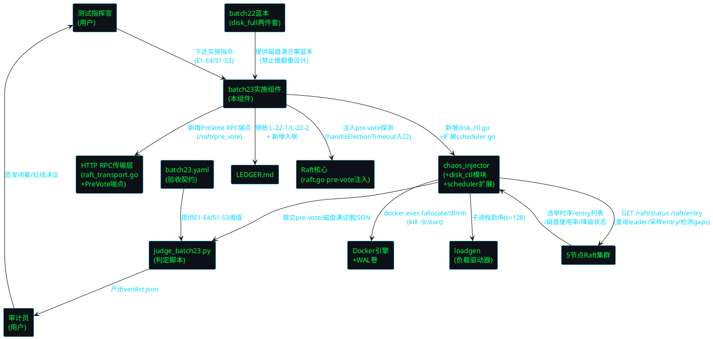
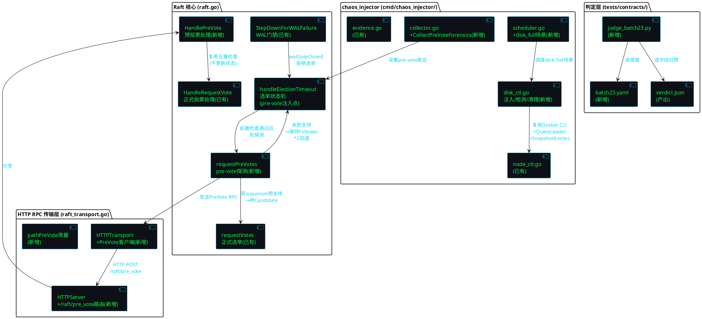
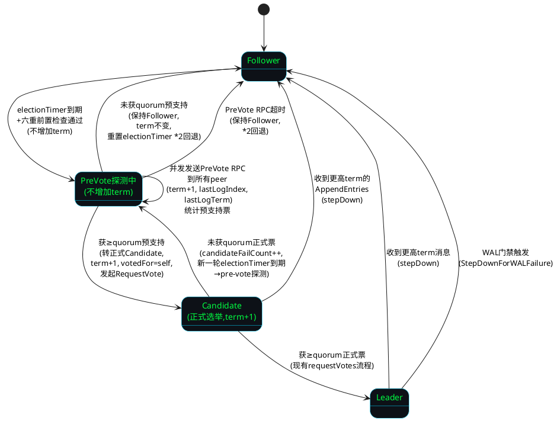
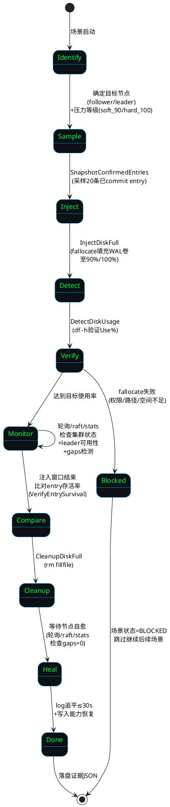
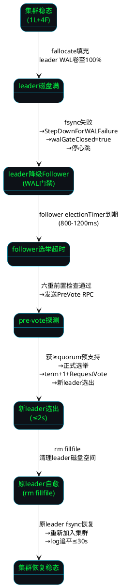
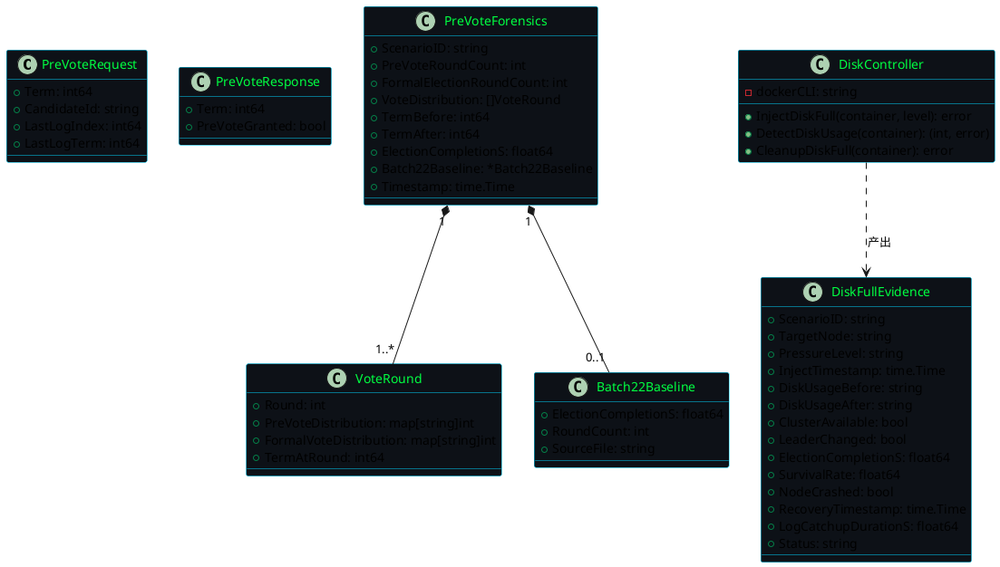

# batch23 pre-vote 防选票分裂 + 磁盘满故障注入实施 — 技术设计

> 版本: v2.4-batch23-prevote-diskfull
> 关联规格: spec.md（696行，28条 EARS 需求，pre-vote + 磁盘满两项任务）
> 技术栈: Go（Raft 状态机 pre-vote 注入 + HTTP RPC 端点扩展 + chaos_injector disk_ctl 模块）+ Shell（集群编排）+ Python（判定脚本）+ YAML（验收契约）
> 前置批次: batch22（verdict PASS, commit 29139aa, tag v2.4-post-batch22, E1=1.6003s / E2=1 / E3=20% / S1=100% / S2=20 / F1-F5 全 PASS）
> 蓝本依据: docs/specs/batch22/disk_full_spec.md + disk_full_design.md（磁盘满方案两件套，禁止推翻重设计）
> 时间盒: 总计 ≤ 6 小时（任务一 pre-vote 3h + 任务二磁盘满 3h），到点停手交数据
> 核心红线: RL-01~RL-11 继承（fsync/quorum/选举超时/proto/证据隔离/判定脚本/构建产物等不可破坏）

---

# 一、需求与存量功能关系分析

## 1.1 需求功能与存量功能对比

### 1.1.1 已实现功能

| 需求功能 | 存量功能 | 代码位置 | 匹配度 |
|---------|---------|---------|--------|
| HTTP RPC 传输层（PreVote RPC 载体） | 纯标准库 HTTP RPC 已实现 RequestVote/AppendEntries 两个端点，零外部依赖，JSON 编解码 | `pkg/raft-module/raft_transport.go:1-256` | 100% |
| 选举超时处理入口（pre-vote 注入点） | `handleElectionTimeout()` 方法，含 Leader/WAL重放/WAL门禁/无peer/日志追上/选举风暴自愈六重前置检查 | `raft.go:791-862` | 100% |
| 正式选举流程（pre-vote 获支持后复用） | `requestVotes()` 并发发送 RequestVote RPC，统计票数，≥quorum 转 Leader | `raft.go:868-991` | 100% |
| 投票处理逻辑（PreVote 处理可复用） | `HandleRequestVote()` 含 term 检查/WAL门禁/logCaughtUp/空日志拦截/日志新旧比对五重规则 | `raft.go:1719-1815+` | 75% |
| WAL 门禁机制（磁盘满 leader 降级依赖） | `StepDownForWALFailure()` 强制降级 Follower + walGateClosed=true + 停心跳 + 停攒批 | `raft.go:388-413` | 100% |
| walGateClosed 标志（磁盘满检测依赖） | bool 字段，handleElectionTimeout/HandleRequestVote/propose 路径均检查此标志 | `raft.go:137, 805, 1768, 1453, 1479, 1624, 1842` | 100% |
| HTTP RPC 服务端路由（PreVote 端点注册点） | `HTTPServer` 用 `http.ServeMux` 注册 pathRequestVote/pathAppendEntries，新增路径仅需 mux.HandleFunc | `pkg/raft-module/raft_transport.go:145-179` | 100% |
| /raft/entry 端点（磁盘满 entry 存活率验证依赖） | batch22 已实现 GET handler 返回已 commit entry 列表，只读 RLock | `main.go`（batch22 新增） | 100% |
| /raft/status + /raft/stats 端点（磁盘满集群状态检测依赖） | JSON + 文本双格式端点，返回 id/state/term/leader/commit/voted/gaps/degraded | `main.go:288-305` | 100% |
| chaos_injector 框架（disk_ctl 模块宿主） | 7 文件 864 行：main/scheduler/node_ctl/collector/evidence/resume_mgr/types | `cmd/chaos_injector/*.go` | 100% |
| scheduler 场景调度（disk_full 场景扩展点） | `BuildScenarioMatrix` + `ExecuteScenario` switch 分发，新增场景类型仅需加 case | `cmd/chaos_injector/scheduler.go:21-61` | 100% |
| node_ctl 节点控制（磁盘满 Docker 操作依赖） | KillNode/StartNode/QueryLeader/SnapshotConfirmedEntries/VerifyEntrySurvival 已实现 | `cmd/chaos_injector/node_ctl.go` | 100% |
| 选举取证采集器（pre-vote 取证扩展基础） | `CollectElectionTimeline` 已实现，batch22 已扩展 `CollectElectionForensics` | `cmd/chaos_injector/collector.go` | 100% |
| 5 节点 Docker 集群 + WAL 卷（磁盘满注入目标） | docker-compose-5node.yml + wal-node-1~5 持久化卷 | `tests/deploy/docker-compose-5node.yml` | 100% |
| batch22 验收契约 + 判定脚本（batch23 扩展基础） | batch22.yaml 定义 F1-F5+E1-E3+S1-S2，judge_batch22.py 逐字段对照产出 verdict.json | `tests/contracts/batch22.yaml`, `tests/contracts/judge_batch22.py` | 75% |
| batch22 选举取证数据（pre-vote 基线对照） | election_forensics.json 含 after_optimization 800-1200ms + pre_vote.status=not_implemented | `tests/evidence/d3-batch22/election_forensics.json` | 100% |
| batch22 判定结果（E1-E3/S1-S2 基线） | verdict.json overall=PASS, E1=1.6003s, E2=1, E3=20%, S1=100%, S2=20 | `tests/evidence/d3-batch22/verdict.json` | 100% |
| batch22 磁盘满方案蓝本（实施依据） | disk_full_spec.md + disk_full_design.md 两件套，含注入方式/预期行为/DF-1~DF-4/数据模型/实现计划 | `docs/specs/batch22/disk_full_*.md` | 100% |
| LEDGER 挂账台账（L-22-1/L-22-2 销账依赖） | LEDGER.md 已存在，表格格式 [debt_id/source_batch/target_batch/status/description/cleared_at] | `LEDGER.md` | 100% |
| .gitignore 证据目录 + 构建产物排除（RL-08/RL-11） | batch22 已根治：排除证据目录 + *.exe + build/ 目录 | `.gitignore` | 100% |

**匹配度判定依据**：
- **100%**：功能完全匹配可直接复用（如 HTTP RPC 传输层、handleElectionTimeout 入口、StepDownForWALFailure、chaos_injector 框架、磁盘满蓝本两件套）
- **75%**：功能存在但需扩展或适配（如 HandleRequestVote 的投票逻辑可被 HandlePreVote 复用 75%，但 pre-vote 不更新 votedFor/term；batch22.yaml 需新增 E4/S3 两条验收线；judge_batch22.py 需扩展为 judge_batch23.py 新增 E4/S3/DF-1~DF-4 判定字段）

### 1.1.2 需要扩展的功能

| 需求功能 | 存量功能 | 差异说明 | 扩展方向 |
|---------|---------|---------|---------|
| pre-vote 探测逻辑注入 handleElectionTimeout | `handleElectionTimeout()` 第 838 行直接转 Candidate（term+1） | 无 pre-vote 探测阶段，选举定时器到期后直接发起正式选举，cascading 场景多节点同时选举导致选票分裂（batch22 cascading max=3.44s） | 在第 836 行（选举风暴自愈）之后、第 838 行（转 Candidate）之前注入 pre-vote 探测：先发 PreVote RPC 探测多数派预支持，获支持才转 Candidate |
| PreVote RPC 端点注册 | `HTTPServer` 仅注册 pathRequestVote/pathAppendEntries 两个路径 | 缺少 PreVote RPC 端点，pre-vote 探测无传输通道 | 在 `NewHTTPServer` 中新增 `mux.HandleFunc(pathPreVote, srv.handlePreVote)`，路径常量 `pathPreVote = "/raft/pre_vote"` |
| PreVote RPC 客户端方法 | `HTTPTransport` 仅实现 RequestVote/AppendEntries 两个客户端方法 | 缺少 PreVote 客户端方法，候选者无法发送 PreVote RPC | 在 `HTTPTransport` 新增 `PreVote(req *PreVoteRequest) (*PreVoteResponse, error)` 方法，复用 `doRPC` 底层 |
| HandlePreVote 服务端处理 | `HandleRequestVote` 更新 votedFor/term 并真正投票 | pre-vote 不更新 votedFor/term，仅返回"如果正式选举我会投你吗"的预支持判断 | 新增 `HandlePreVote` 方法，复用 HandleRequestVote 的五重检查逻辑（term/WAL门禁/logCaughtUp/空日志/日志新旧），但不写入 votedFor/term |
| scheduler disk_full 场景调度 | `BuildScenarioMatrix` 仅支持 steady/under_load/cascading 三类场景 | 缺少 disk_full 场景类型，无法调度磁盘满注入 | 在 `BuildScenarioMatrix` 新增 `case "disk_full"` 分支生成 6 场景 ID；在 `ExecuteScenario` 新增 `case contains(scenarioID, "disk_full")` 分发到 `executeDiskFull` |
| batch22.yaml → batch23.yaml 验收契约扩展 | batch22.yaml 定义 F1-F5+E1-E3+S1-S2 共 10 条验收线 | 缺少 E4（cascading 选举 ≤2s）和 S3（磁盘满自愈 ≤30s）两条 batch23 新增验收线 | 新建 batch23.yaml，继承 batch22 全部验收线 + 新增 E4/S3 + 新增 DF-1~DF-4 磁盘满专项指标 + 场景矩阵扩展至 20 场景 |
| judge_batch22.py → judge_batch23.py 判定脚本扩展 | judge_batch22.py 逐字段对照 F1-F5+E1-E3+S1-S2 | 缺少 E4/S3/DF-1~DF-4 判定字段，无法判定 cascading 收敛和磁盘满自愈 | 新建 judge_batch23.py，复用 batch22 判定逻辑 + 新增 E4（读 prevote_forensics.json cascading 选举时间）+ S3（读 disk_full_*.json log_catchup_duration）+ DF-1~DF-4 判定 |
| LEDGER L-22-1/L-22-2 入账销账 | LEDGER.md 当前全部已清偿，无待清记录 | 需新增两笔挂账（L-22-1 pre-vote / L-22-2 磁盘满实施），本批清偿 | 在 LEDGER.md 表格追加 L-22-1/L-22-2 两行，补充"已清偿记录详情"章节，标注 cleared_at=batch23 |
| election_forensics.json → prevote_forensics.json 取证扩展 | election_forensics.json 含 before/after_optimization + pre_vote.status=not_implemented | 需新增 pre-vote 实现后的取证数据（轮数/选票分布/term 膨胀对照），落盘至新文件 | 新增 `CollectPreVoteForensics` 采集方法，落盘 prevote_forensics.json，含 prevote_round_count/formal_election_round_count/vote_distribution/term_before/term_after/batch22_baseline |

### 1.1.3 需要新增的功能或接口

按业务模块分组：

**模块 A：pre-vote 状态机扩展（Go，raft.go）**
- 功能点 A1：`handleElectionTimeout()` 入口注入 pre-vote 探测逻辑
  - 输入：当前节点 ID、当前 term、lastLogIndex、lastLogTerm
  - 输出：pre-vote 探测结果（获多数派预支持 / 未获支持），决定是否进入正式 Candidate
  - 核心逻辑：所有前置检查通过后（第 836 行后）→ 发送 PreVote RPC（term+1, lastLogIndex, lastLogTerm）到所有 peer → 统计预支持票 → ≥ quorum 则执行第 838 行 Candidate 转换 → < quorum 则保持 Follower 并重置选举定时器（randomElectionTimeout() * 2 回退）
  - 依赖：PreVote RPC 客户端方法（模块 B）、现有 requestVotes 流程
  - 约束：pre-vote 不增加 term（避免 term 膨胀）；pre-vote 失败不阻止其他节点发起选举

- 功能点 A2：`requestPreVotes()` 并发预投票请求方法
  - 输入：预探测 term（currentTerm+1）、peers 列表
  - 输出：预支持票数
  - 核心逻辑：并发发送 PreVote RPC 到所有 peer，统计 PreVoteGranted=true 的票数，自己预投自己一票，rpcTimeout 内未响应计为不支持
  - 依赖：HTTPTransport.PreVote 客户端方法
  - 约束：每个 peer 请求独立 goroutine + recover panic；rpcTimeout=500ms 超时

**模块 B：PreVote RPC 传输层扩展（Go，raft_transport.go）**
- 功能点 B1：`PreVoteRequest` / `PreVoteResponse` 数据结构
  - PreVoteRequest: {Term int64, CandidateId string, LastLogIndex int64, LastLogTerm int64}
  - PreVoteResponse: {Term int64, PreVoteGranted bool}
  - 与现有 RequestVoteRequest/Response 字段一致，但语义不同（预支持而非正式投票）

- 功能点 B2：`HTTPTransport.PreVote()` 客户端方法
  - 输入：PreVoteRequest
  - 输出：PreVoteResponse, error
  - 核心逻辑：复用 `doRPC(pathPreVote, req)`，JSON 编解码

- 功能点 B3：`HTTPServer` 新增 `pathPreVote = "/raft/pre_vote"` 路由
  - 在 `NewHTTPServer` 中 `mux.HandleFunc(pathPreVote, srv.handlePreVote)`
  - `handlePreVote` HTTP handler：解析 JSON → 调用 `node.HandlePreVote` → 编码响应

- 功能点 C：`HandlePreVote` 服务端处理方法（Go，raft.go）
  - 输入：PreVoteRequest
  - 输出：PreVoteResponse, error
  - 核心逻辑：复用 HandleRequestVote 的五重检查（term/WAL门禁/logCaughtUp/空日志/日志新旧），但**不更新 votedFor、不更新 term、不重置选举定时器**——仅返回"如果正式选举我会投你吗"的预支持判断
  - 关键差异：pre-vote 的 term 检查为"如果候选者 term+1 ≥ 我的 term 且日志至少和我一样新，则预支持"
  - 约束：pre-vote 不修改任何持久化状态（votedFor/term/walGateClosed 均不变）

**模块 D：磁盘满注入工具（Go，cmd/chaos_injector/disk_ctl.go，全新）**
- 功能点 D1：`InjectDiskFull(container string, pressureLevel string) error`
  - 输入：容器名、压力等级（"soft_90" 或 "hard_100"）
  - 输出：error
  - 核心逻辑：`docker exec <container> df -h /data/wal` 获取当前使用率 → 计算需填充大小 → `docker exec <container> fallocate -l <size> /data/wal/fillfile` → 验证 Use% 达到目标
  - 依赖：Docker CLI（os/exec）
  - 约束：WAL 卷大小需预先确认（disk_full_design.md §3 风险约束）

- 功能点 D2：`DetectDiskUsage(container string) (int, error)`
  - 输入：容器名
  - 输出：磁盘使用率（int, 百分比），error
  - 核心逻辑：`docker exec <container> df -h /data/wal` → 解析 Use% 列

- 功能点 D3：`CleanupDiskFull(container string) error`
  - 输入：容器名
  - 输出：error
  - 核心逻辑：`docker exec <container> rm /data/wal/fillfile` → 验证 Use% 回落

**模块 E：磁盘满场景调度扩展（Go，cmd/chaos_injector/scheduler.go）**
- 功能点 E1：`executeDiskFull(scenarioID string) (*ScenarioResult, error)`
  - 输入：场景 ID（disk_full_{soft|hard}_{follower|leader|recovery}_01）
  - 输出：ScenarioResult
  - 核心逻辑：解析场景 ID → 确定目标节点 + 压力等级 → 启动负载 → 采样已 commit entry → InjectDiskFull → 轮询集群状态 → 比对存活率 → CleanupDiskFull → 验证自愈 → 落盘证据 JSON
  - 依赖：disk_ctl（模块 D）、node_ctl、collector、evidence

**模块 F：pre-vote 取证采集（Go，cmd/chaos_injector/collector.go 扩展）**
- 功能点 F1：`CollectPreVoteForensics(scenarioID string) (*PreVoteForensics, error)`
  - 输入：场景 ID（cascading_kill_0N）
  - 输出：PreVoteForensics 结构（prevote_round_count/formal_election_round_count/vote_distribution/term_before/term_after/election_completion_s/batch22_baseline）
  - 核心逻辑：场景运行前采集 term_before → 运行 cascading 场景 → 采集 term_after + 选举轮数 + 选票分布 → 与 batch22 基线对照 → 落盘 prevote_forensics.json

**模块 G：batch23 验收契约与判定脚本（YAML + Python，全新）**
- `tests/contracts/batch23.yaml`：继承 batch22 全部验收线 + 新增 E4/S3 + DF-1~DF-4 + 场景矩阵扩展至 20 场景 + 红线 RL-01~RL-11
- `tests/contracts/judge_batch23.py`：复用 batch22 判定逻辑 + 新增 E4/S3/DF-1~DF-4 判定字段，读 prevote_forensics.json + disk_full_*.json + batch23.yaml 逐字段对照产出 verdict.json

## 1.2 存量功能详细分析

### 1.2.1 handleElectionTimeout 选举状态机（raft.go:791-862）— pre-vote 注入点

**接口契约**：
- 触发条件：选举定时器到期（follower 在 electionTimeout 内未收到 leader 心跳）
- 行为：六重前置检查通过后 → 转 Candidate → term+1 → 投自己 → 并发 RequestVote → ≥quorum 转 Leader
- 副作用：修改节点状态/term/votedFor/leaderID；重置选举定时器

**六重前置检查（pre-vote 注入点在第 836 行之后）**：
1. 第 793-796 行：state == StateLeader → return（Leader 不选举）
2. 第 798-803 行：!walReplayCompleted → return（WAL 重放未完成拒绝选举，*2 回退）
3. 第 805-810 行：walGateClosed → return（WAL 门禁关闭拒绝选举，*2 回退）
4. 第 813-817 行：len(peers) == 0 → return（无 peer 不选举，*10 回退）
5. 第 819-830 行：!logCaughtUp && lastHeartbeat 未过期 && candidateFailCount < 3 → return（日志未追上 Leader 跳过选举，*2 回退）
6. 第 832-836 行：选举风暴自愈（连续 3 次失败强制突破 logCaughtUp）

**pre-vote 注入位置**：第 836 行之后、第 838 行（`rn.state = StateCandidate`）之前。所有前置检查通过后，先发起 pre-vote 探测，获多数派预支持才执行第 838-844 行的 Candidate 转换。

**业务规则**：
- 选举定时器到期后直接发起正式 RequestVote（无 pre-vote 探测阶段）——这是 batch22 cascading_kill_02 选举 3.44s 的根因
- 若未获 quorum（选票分裂），保持 Candidate 并重置定时器（randomElectionTimeout() * 2/3/10 不同分支退避）
- 选举期间拒绝写请求（leader 不存在），客户端收到 503

**约束**：
- RequestVote RPC 需在 rpcTimeout(500ms) 内完成
- 同一 term 内一个节点只能投一票（Raft 安全性）
- 选举超时 800-1200ms > rpcTimeout 500ms（RL-03 约束维持）

**扩展点**：pre-vote 机制在此方法入口插入探测逻辑——在转 Candidate 之前先发 PreVote RPC 探测多数派支持。pre-vote 不改 electionTimeout（RL-03 不违反）。

### 1.2.2 requestVotes 正式选举流程（raft.go:868-991）— pre-vote 获支持后复用

**接口契约**：
- 输入：term（已 +1）、peers 列表
- 行为：并发发送 RequestVote RPC → 统计票数 → ≥quorum 且 state==Candidate 且 term 不变 → 转 Leader
- 副作用：修改 state/leaderID/nextIdx/matchIdx；启动心跳循环 + group commit + batchSyncMgr

**业务规则**：
- votesGranted 初始为 1（自己投自己一票）
- 每个 peer 请求独立 goroutine，recover panic 防止连接断开导致崩溃
- 收到更高 term 响应 → stepDown 降级
- 赢得选举后追加 no-op 条目（F4b 安全提交前 term 条目）
- 选举失败 → candidateFailCount++ → 连续 3 次且 60s 窗口内强制突破 logCaughtUp 死锁

**与 pre-vote 的关系**：pre-vote 获多数派预支持后，调用此方法发起正式选举。pre-vote 不修改此方法任何逻辑，仅在调用前增加一道探测门槛。

### 1.2.3 HandleRequestVote 投票处理（raft.go:1719-1815+）— HandlePreVote 复用基础

**接口契约**：
- 输入：RequestVoteRequest（Term/CandidateId/LastLogIndex/LastLogTerm）
- 输出：RequestVoteResponse（Term/VoteGranted）
- 副作用：可能更新 term/votedFor/state/leaderID/electionTimer

**五重投票检查逻辑**：
1. 第 1726-1730 行：req.Term < rn.term → 拒绝（候选者 term 过期）
2. 第 1733-1739 行：候选者不在当前配置中 → 拒绝（防止被移除节点扰乱）
3. 第 1741-1760 行：req.Term > rn.term → 更新 term + 降 Follower + 清 votedFor（异常高 term 飙升拦截：差额 > 10000 仅更新 term 不投票）
4. 第 1762-1772 行：WAL 重放未完成 / WAL 门禁关闭 → 拒绝
5. 第 1774-1807 行：votedFor 已投他人 / 自身日志未追上 Leader / 候选者日志为空但集群已提交 / 候选者日志不如自己新 → 拒绝

**HandlePreVote 复用策略**：复用第 1-5 重检查的**判断条件**，但**不执行状态变更**：
- 不更新 term（pre-vote 不增加 term）
- 不更新 votedFor（pre-vote 不真正投票，不阻止后续正式选举投票）
- 不降级 state（pre-vote 不改变节点角色）
- 不重置 electionTimer（pre-vote 不干扰选举定时器）
- 仅返回 PreVoteGranted = (五重检查全通过)

**关键差异**：pre-vote 的 term 检查为"候选者 term+1 ≥ 我的 term"（预探测下一轮选举的胜算），而非"候选者 term > 我的 term"（正式投票的 term 更新）。

### 1.2.4 StepDownForWALFailure WAL 门禁机制（raft.go:388-413）— 磁盘满 leader 降级依赖

**接口契约**：
- 输入：reason string（降级原因）
- 行为：state → StateFollower + votedFor="" + leaderID="" + walGateClosed=true + 停心跳 + 停攒批 + 重置选举定时器
- 副作用：修改 state/votedFor/leaderID/walGateClosed；关闭 heartbeatStop channel

**业务规则**：
- WAL 故障（fsync 失败）触发此方法 → 节点强制降级 Follower
- walGateClosed=true 后：handleElectionTimeout 拒绝选举（第 805 行）、HandleRequestVote 拒绝投票（第 1768 行）、propose 拒绝写入（第 1453/1479 行）、AppendEntries 拒绝处理（第 1624/1842 行）
- 若原状态为 Leader：停心跳 + 停攒批 → 触发 follower 选举定时器到期 → 选举新 leader

**与磁盘满的关系**：磁盘满 100% → fsync 失败 → StepDownForWALFailure → walGateClosed=true。这是磁盘满 leader 场景"优雅降级 + 触发选举"的已有机制，batch23 磁盘满注入**依赖此机制自然生效**，无需新增降级逻辑。

**约束**：StepDownForWALFailure 为公开方法（大写开头），可被外部 fsync 错误处理路径调用。batch23 磁盘满注入不修改此方法，仅通过 fallocate 触发 fsync 失败间接激活。

### 1.2.5 HTTP RPC 传输层（pkg/raft-module/raft_transport.go:1-256）— PreVote RPC 载体

**接口契约**：
- `HTTPTransport`（客户端）：`RequestVote(req)` / `AppendEntries(req)` / `doRPC(path, req)` / `Close()`
- `HTTPServer`（服务端）：`NewHTTPServer(addr, node)` / `Start()` / `Stop()` / `handleRequestVote` / `handleAppendEntries`
- RPC 路径常量：`pathRequestVote = "/raft/request_vote"` / `pathAppendEntries = "/raft/append_entries"`
- 超时：客户端 600ms / 服务端读写各 1s

**业务规则**：
- 纯标准库 net/http + encoding/json，零外部依赖（替代 gRPC）
- doRPC 底层方法：JSON 编码 → POST 请求 → 读响应 → JSON 解码
- 服务端用 http.ServeMux 路由，每个 RPC 类型一个 HandleFunc

**与 PreVote RPC 的关系**：PreVote RPC 可直接在此框架内新增端点，**无需修改 proto 定义**（RL-07 不违反）：
- 新增路径常量 `pathPreVote = "/raft/pre_vote"`
- 新增客户端方法 `HTTPTransport.PreVote(req)`
- 新增服务端路由 `mux.HandleFunc(pathPreVote, srv.handlePreVote)`
- 新增 HTTP handler `handlePreVote`

**约束**：HTTPTransport 和 HTTPServer 的扩展为纯增量，不影响现有 RequestVote/AppendEntries 端点。protoc 不可用约束自然满足（本项目已不使用 proto）。

### 1.2.6 chaos_injector 框架（cmd/chaos_injector/，7 文件 864 行）— disk_ctl 模块宿主

**接口契约**：
- CLI 入口：`chaos_injector --scenario-type=... --evidence-dir=...`
- 模块组成：main（CLI 入口）/ scheduler（场景调度）/ node_ctl（节点控制）/ collector（指标采集）/ evidence（证据落盘）/ resume_mgr（断点续跑）/ types（类型定义）
- 输出：场景 JSON 证据 + verdict.json（由 judge 脚本产出）

**scheduler.go 场景调度结构**：
- `BuildScenarioMatrix(scenarioType)` switch 分发：steady(10) / under_load(10) / cascading(3) / default(23 全量)
- `ExecuteScenario(scenarioID)` switch 分发：contains 匹配场景类型 → 调用对应 execute 方法
- 扩展点：新增 `case "disk_full"` 分支生成 6 场景 ID；新增 `case contains(scenarioID, "disk_full")` 分发到 `executeDiskFull`

**node_ctl.go 节点控制**：
- KillNode/StartNode/QueryLeader/SnapshotConfirmedEntries/VerifyEntrySurvival 已实现
- 通过 Docker CLI + HTTP GET /raft/status + /raft/entry 操作节点
- 磁盘满注入复用此模块的 Docker CLI 能力 + QueryLeader + SnapshotConfirmedEntries

**约束**：
- 通过子进程管理 loadgen 启停（不修改 loadgen 源码）
- 选举轮询间隔 100ms，脑裂检测间隔 50ms
- 证据落盘至 `tests/evidence/d3-batch23/`（新批次目录）

### 1.2.7 batch22 磁盘满方案蓝本（disk_full_spec.md + disk_full_design.md）— 实施依据

**蓝本核心内容**：
- 注入方式：`docker exec <container> fallocate -l <size> /data/wal/fillfile`
- 检测方法：`docker exec <container> df -h /data/wal` → 解析 Use%
- 清理方法：`docker exec <container> rm /data/wal/fillfile`
- 数据模型：scenario_id/target_node/inject_timestamp/disk_usage_before/after/cluster_available/leader_changed/recovery_timestamp/log_catchup_duration_s/node_crashed/status
- 验收指标：DF-1（集群可用性）/ DF-2（数据无损）/ DF-3（恢复追平 ≤30s）/ DF-4（无 panic/crash）
- 场景矩阵：3 场景（follower/leader/recovery）× 2 压力等级（软满 90%/硬满 100%）= 6 场景
- 实现计划：disk_ctl.go + scheduler.go 扩展 + batch23.yaml + judge_batch23.py

**风险约束**（蓝本 §3）：
- Docker volume 大小需预先确认（默认无限制，需限制容器内 /data/wal 分区大小）
- 磁盘满可能影响 Docker 引擎本身，需在独立 volume 上注入
- 恢复清理需确保 WAL 文件完整性（不可误删 WAL 日志文件，仅删 fillfile）

**fidelity 约束**：batch23 实施须以蓝本为依据，不得推翻重设计（除非实现中发现设计缺陷，走等级二降级申报）。本 design.md 的磁盘满方案**完全继承蓝本**，仅在蓝本框架内补充实现细节。

### 1.2.8 batch22 判定结果与选举取证基线（verdict.json + election_forensics.json）

**verdict.json 关键基线**：
- overall=PASS, F1-F5 全 PASS
- E1=1.6003s（threshold 2.0s）— 选举完成中位值
- E1 all_steady: [1.4807, 1.4885, 1.5492, 1.5554, 1.5868, 1.6003, 1.6313, 1.6691, **2.7811**, **3.1928**] — 后两个离群值为 cascading 场景选票分裂证据
- E2=1（max_concurrent_leaders）, E3=20%（reject_rate）, S1=100%（survival_rate）, S2=20（sampled）

**election_forensics.json 关键基线**：
- after_optimization: electionTimeoutMin=800ms, electionTimeoutMax=1200ms, rpcTimeout=500ms
- constraint_check: "800ms > rpcTimeout(500ms) ✓ Fix#7 约束维持"
- pre_vote.status = "not_implemented" — batch23 待实现
- pre_vote.reason = "当前 Raft 状态机已有选举超时随机化（800-1200ms 区间），5 节点同时超时概率极低"
- pre_vote.future = "如调参后仍不达标，再实现 pre-vote 防选票分裂"

**与 batch23 的关系**：
- E1 all_steady 中 2.7811s 和 3.1928s 两个离群值证明：即使选举超时已调至 800-1200ms，cascading 场景仍存在选票分裂导致多轮选举（>2s），需 pre-vote 消除
- pre_vote.status=not_implemented 是 batch23 任务一的直接来源
- E1=1.6003s 是 batch23 E1 验收的基线（不得退化）
- cascading max=3.1928s 是 batch23 E4 验收的对照（需降至 ≤2s）

---
# 二、增量设计方案

## 2.1 实现模型

### 2.1.1 上下文视图



**通信协议与调用频率**：
- batch23 → RaftCore：源码修改（handleElectionTimeout 注入 pre-vote 探测 + HandlePreVote 方法），一次性
- batch23 → RPC：源码修改（raft_transport.go 新增 PreVote 端点 + 客户端方法），一次性
- batch23 → FI_Tool：源码修改（新增 disk_ctl.go + 扩展 scheduler.go），一次性
- PreVote RPC：HTTP POST `/raft/pre_vote`，JSON 编解码，客户端超时 600ms，选举触发时每 peer 一次
- chaos_injector → Docker：`docker exec fallocate/df/rm`，每场景注入 1 次 + 检测多次 + 清理 1 次
- chaos_injector → Cluster：HTTP GET `/raft/status`（100ms 轮询）+ `/raft/entry`（每场景采样 20 条）
- judge → 证据：文件读取，一次性加载 prevote_forensics.json + disk_full_*.json
- judge → YAML：文件读取，一次性加载 batch23.yaml

### 2.1.2 服务/组件总体架构



**模块划分及职责**：

| 模块 | 职责 | 关键依赖 | 新增/扩展 |
|------|------|----------|-----------|
| `raft.go` pre-vote 探测 | handleElectionTimeout 入口注入 pre-vote 探测 + requestPreVotes 并发预投票 | HTTPTransport.PreVote | 新增 |
| `raft.go` HandlePreVote | 预投票服务端处理，复用五重检查但不更新状态 | 无 | 新增 |
| `raft_transport.go` PreVote RPC | PreVote 客户端方法 + 服务端路由 + HTTP handler | net/http + encoding/json | 新增 |
| `disk_ctl.go` 磁盘满注入 | fallocate 注入 + df 检测 + rm 清理 | Docker CLI (os/exec) | 新增 |
| `scheduler.go` disk_full 场景 | 6 场景调度 + executeDiskFull 执行 | disk_ctl, node_ctl, collector | 扩展 |
| `collector.go` pre-vote 取证 | CollectPreVoteForensics 采集轮数/选票分布/term 膨胀 | /raft/stats 端点 | 扩展 |
| `batch23.yaml` 验收契约 | E1-E4/S1-S3 + DF-1~DF-4 + 场景矩阵 + 红线 | 无 | 新增 |
| `judge_batch23.py` 判定脚本 | 逐字段对照产出 verdict.json | PyYAML + json | 新增 |
| `LEDGER.md` 销账 | L-22-1/L-22-2 入账销账 | 无 | 扩展 |

**配置项及取值策略**：

| 配置项 | 当前值 | 目标值 | 来源 | 调整理由 |
|--------|--------|--------|------|----------|
| electionTimeoutMin | 800ms | 800ms（不变） | raft.go:39 | pre-vote 不改选举超时（RL-03） |
| electionTimeoutMax | 1200ms | 1200ms（不变） | raft.go:40 | pre-vote 不改选举超时（RL-03） |
| rpcTimeout | 500ms | 500ms（不变） | raft.go:52 | PreVote RPC 复用 rpcTimeout |
| 心跳阈值 | 2s | 2s（不变） | raft.go:824 | pre-vote 不改心跳 |
| pre-vote 回退因子 | 不适用 | *2 | 新增 | pre-vote 未获支持时 randomElectionTimeout() * 2 回退 |
| 磁盘满软满阈值 | 不适用 | 90% | disk_full_spec.md | 软满压力等级 |
| 磁盘满硬满阈值 | 不适用 | 100% | disk_full_spec.md | 硬满压力等级 |
| log 追平阈值 | 不适用 | 30s | disk_full_spec.md DF-3 | 自愈验收线 |
| 证据目录 | d3-batch22/ | d3-batch23/ | 固定 | 新批次目录 |

### 2.1.3 实现设计文档

#### 2.1.3.1 任务一：pre-vote 状态机设计



**状态转换触发条件与处理策略**：

| 转换 | 触发条件 | 处理策略 | term 变化 |
|------|---------|---------|----------|
| Follower → PreVote | electionTimer 到期 + 六重前置检查通过 | 发送 PreVote RPC 到所有 peer，统计预支持票 | 不变 |
| PreVote → Candidate | 预支持票 ≥ quorum | term+1, votedFor=self, 发起 RequestVote（现有 requestVotes 流程） | +1 |
| PreVote → Follower | 预支持票 < quorum 或 RPC 超时 | 保持 Follower，重置 electionTimer（randomElectionTimeout() * 2 回退） | 不变 |
| Candidate → Leader | 正式票 ≥ quorum | 现有 requestVotes 流程，追加 no-op + 启动心跳 | 不变 |
| Candidate → Follower | 收到更高 term AppendEntries | stepDown | 更新为更高 term |
| Candidate → PreVote | 未获 quorum 正式票 + 新一轮 electionTimer 到期 | candidateFailCount++，重新 pre-vote 探测 | 不变 |
| Leader → Follower | 收到更高 term 或 WAL 门禁触发 | stepDown / StepDownForWALFailure | 更新或不变 |

**pre-vote 安全性论证**：
1. **不增加 term**：pre-vote 探测阶段 term 不变，仅正式 Candidate 转换时 term+1。抑制 term 膨胀，防止网络分区节点回归后触发不必要的高 term 选举。
2. **选票分裂减少**：pre-vote 获支持后才转正式 Candidate，减少同时发起正式选举的节点数。多个节点同时 electionTimer 到期时，仅获多数派预支持的节点进入正式选举，其他保持 Follower。
3. **不破坏 Raft 安全性**：正式选举仍遵循"同一 term 一节点一票"约束（votedFor 在正式 Candidate 转换时才设置）。pre-vote 不更新 votedFor，不阻止后续正式选举投票。
4. **不引入活锁**：pre-vote 失败的节点 *2 回退选举定时器，其他节点仍可发起 pre-vote 和正式选举。pre-vote 失败仅影响本节点，不阻止其他节点。
5. **cascading 收敛机制**：cascading 连杀场景中，kill L1 后多个 follower 同时 electionTimer 到期 → pre-vote 探测 → 仅日志最新的节点获多数派预支持 → 转正式选举 → 1 轮选举成功（而非多轮选票分裂）。batch22 cascading max=3.44s → batch23 ≤2s。

#### 2.1.3.2 任务二：磁盘满注入执行流程



**关键设计决策**：
- **磁盘满注入依赖已有 WAL 门禁机制**：硬满 100% → fsync 失败 → StepDownForWALFailure → walGateClosed=true。这是已有机制（raft.go:388-413），batch23 不新增降级逻辑，仅通过 fallocate 触发 fsync 失败间接激活。
- **follower 磁盘满**：follower walGateClosed=true → 拒绝投票/拒绝 AppendEntries → leader 继续服务（quorum 仍满足：5 节点 - 1 磁盘满 follower = 4 ≥ 3 quorum）
- **leader 磁盘满**：leader StepDownForWALFailure → 降级 Follower + 停心跳 → follower electionTimer 到期 → pre-vote 探测 → 选举新 leader ≤2s
- **自愈机制**：rm fillfile → 磁盘空间恢复 → fsync 恢复成功 → walGateClosed 复位（需确认复位条件）→ 节点重新加入集群 → AppendEntries 追平日志 → gaps=0
- **蓝本 fidelity**：注入/检测/清理三方法完全继承 disk_full_design.md §1.1，数据模型完全继承 §1.3，不推翻重设计

#### 2.1.3.3 pre-vote 与磁盘满的协同设计



**协同设计要点**：
- 磁盘满 leader 降级后，剩余 4 节点中选举新 leader。pre-vote 机制确保 4 节点同时 electionTimer 到期时不会选票分裂，1 轮选举成功 ≤2s。
- 若磁盘满发生在 pre-vote 实现之前，4 节点可能同时发起正式选举导致选票分裂，选举时间 >2s。pre-vote 实现后此场景收敛。
- pre-vote 和磁盘满两项任务协同提升 cascading + 磁盘满场景的选举收敛能力。
## 2.2 接口设计

### 2.2.1 总体设计

| 接口分类 | 接口名称 | 类型 | 稳定性 | 新增/已有 |
|---------|---------|------|--------|-----------|
| Raft RPC | POST /raft/pre_vote | HTTP RPC | 实验 | 新增 |
| Raft RPC | POST /raft/request_vote | HTTP RPC | 稳定 | 已有 |
| Raft RPC | POST /raft/append_entries | HTTP RPC | 稳定 | 已有 |
| 观测端点 | GET /raft/entry | HTTP REST | 稳定 | 已有（batch22） |
| 观测端点 | GET /raft/status | HTTP REST | 稳定 | 已有 |
| 观测端点 | GET /raft/stats | HTTP REST | 稳定 | 已有 |
| 内部方法 | requestPreVotes() | Go method | 实验 | 新增 |
| 内部方法 | HandlePreVote() | Go method | 实验 | 新增 |
| 内部方法 | InjectDiskFull() | Go method | 稳定 | 新增 |
| 内部方法 | DetectDiskUsage() | Go method | 稳定 | 新增 |
| 内部方法 | CleanupDiskFull() | Go method | 稳定 | 新增 |
| 内部方法 | executeDiskFull() | Go method | 稳定 | 新增 |
| 采集方法 | CollectPreVoteForensics() | Go method | 稳定 | 新增 |
| 判定接口 | judge_batch23.py | Python CLI | 稳定 | 新增 |
| 验收契约 | batch23.yaml | YAML | 稳定 | 新增 |

**接口变更策略**：
- `POST /raft/pre_vote` 为全新 HTTP RPC 端点，不影响现有 RequestVote/AppendEntries 端点
- PreVote RPC 与 RequestVote RPC 共存，通过路径区分（`/raft/pre_vote` vs `/raft/request_vote`），不修改 proto 定义（RL-07 不违反）
- HandlePreVote 复用 HandleRequestVote 的五重检查逻辑，但不更新 votedFor/term/state
- disk_ctl.go 为全新模块，不修改现有 chaos_injector 文件（仅扩展 scheduler.go 的 switch 分支）
- batch23.yaml 为全新契约文件，不修改 batch22.yaml
- judge_batch23.py 为全新判定脚本，复用 judge_batch22.py 的 F1-F5+E1-E3+S1-S2 判定逻辑

### 2.2.2 接口清单

#### 2.2.2.1 POST /raft/pre_vote — PreVote RPC 端点

**接口签名**：
```
POST /raft/pre_vote
Content-Type: application/json
Body: PreVoteRequest
Response: PreVoteResponse (200 OK)
```

**业务说明**：pre-vote 预投票探测 RPC。候选者在发起正式选举前向所有 peer 发送此 RPC，探测"如果正式选举我会投你吗"的预支持，不增加 term、不更新 votedFor。获多数派预支持后才转正式 Candidate 发起 RequestVote。

**前置条件**：
- 节点为集群成员（leader 或 follower 均可响应）
- 候选者已完成六重前置检查（Leader/WAL重放/WAL门禁/无peer/日志追上/选举风暴自愈）

**后置条件**：
- **系统状态不变**（pre-vote 不更新 votedFor/term/state/electionTimer）
- 返回 PreVoteGranted=true 表示"如果候选者发起正式选举，我会投你"
- 返回 PreVoteGranted=false 表示"不会投你"（term 过期/WAL门禁/日志落后等）

**请求体**（PreVoteRequest）：
```json
{
  "Term": 6,
  "CandidateId": "node-3",
  "LastLogIndex": 150,
  "LastLogTerm": 5
}
```

| 字段 | 类型 | 必填 | 说明 |
|------|------|------|------|
| Term | int64 | 是 | 候选者预探测的 term（currentTerm+1，尚未递增） |
| CandidateId | string | 是 | 候选者节点 ID |
| LastLogIndex | int64 | 是 | 候选者最后 log entry 的 index |
| LastLogTerm | int64 | 是 | 候选者最后 log entry 的 term |

**响应体**（PreVoteResponse）：
```json
{
  "Term": 5,
  "PreVoteGranted": true
}
```

| 字段 | 类型 | 说明 |
|------|------|------|
| Term | int64 | 响应节点的当前 term |
| PreVoteGranted | bool | 是否预支持候选者 |

**异常映射**：
| 异常 | HTTP 状态码 | 响应体 |
|------|------------|--------|
| 非 POST 方法 | 405 | `method not allowed` |
| JSON 解码失败 | 400 | 错误信息 |
| 内部处理错误 | 500 | 错误信息 |

**调用示例**：
```
# 候选者 node-3 预探测 term=6 的选举胜算
curl -X POST http://node-1:9001/raft/pre_vote \
  -H "Content-Type: application/json" \
  -d '{"Term":6,"CandidateId":"node-3","LastLogIndex":150,"LastLogTerm":5}'
```

#### 2.2.2.2 requestPreVotes() — 并发预投票请求

**接口签名**：
```go
func (rn *RaftNode) requestPreVotes(preVoteTerm int64, peers []PeerInfo) int32
```

**业务说明**：并发发送 PreVote RPC 到所有 peer，统计预支持票数。自己预投自己一票（不更新 votedFor，仅计数）。rpcTimeout 内未响应的 peer 计为不支持。

**前置条件**：
- 节点非 Leader（已通过六重前置检查）
- preVoteTerm = currentTerm + 1（预探测下一轮选举）
- peers 列表非空

**后置条件**：
- **不修改任何持久化状态**（votedFor/term/state 不变）
- 返回预支持票数（int32，含自己一票）

**参数**：
| 参数 | 类型 | 说明 |
|------|------|------|
| preVoteTerm | int64 | 预探测 term（currentTerm+1） |
| peers | []PeerInfo | peer 列表 |

**返回值**：
| 值 | 说明 |
|------|------|
| int32 | 预支持票数（≥ quorum 则转正式选举） |

**异常处理**：
- 每个 peer 请求独立 goroutine + recover panic（连接断开不计入票数）
- PreVote RPC 超时（rpcTimeout 500ms）计为不支持
- 收到更高 term 响应 → stepDown 降级（与 requestVotes 一致）

#### 2.2.2.3 HandlePreVote() — 预投票服务端处理

**接口签名**：
```go
func (rn *RaftNode) HandlePreVote(req *PreVoteRequest) (*PreVoteResponse, error)
```

**业务说明**：处理 PreVote RPC 请求，复用 HandleRequestVote 的五重检查逻辑，但**不更新 votedFor/term/state/electionTimer**。仅返回"如果候选者发起正式选举，我会投你吗"的预支持判断。

**前置条件**：
- 节点已启动且加入集群

**后置条件**：
- **系统状态完全不变**（纯只读判断，无副作用）
- 返回 PreVoteGranted=true 表示五重检查全通过

**五重检查逻辑**（复用 HandleRequestVote 但不执行状态变更）：
1. req.Term < rn.term → PreVoteGranted=false（候选者 term 过期）
2. 候选者不在当前配置中 → false
3. WAL 重放未完成 / WAL 门禁关闭 → false
4. votedFor 已投他人 → false（注意：pre-vote 检查 votedFor 但不更新）
5. 自身日志未追上 / 候选者日志为空但集群已提交 / 候选者日志不如自己新 → false

**关键差异**（与 HandleRequestVote 对比）：
| 维度 | HandleRequestVote | HandlePreVote |
|------|-------------------|---------------|
| term 更新 | req.Term > rn.term 时更新 | 不更新 |
| votedFor | 投票时设置 votedFor=CandidateId | 不设置 |
| state 降级 | req.Term > rn.term 时降 Follower | 不降级 |
| electionTimer | 重置 | 不重置 |
| 返回字段 | VoteGranted | PreVoteGranted |

#### 2.2.2.4 InjectDiskFull() — 磁盘满注入

**接口签名**：
```go
func (dc *DiskController) InjectDiskFull(container string, pressureLevel string) error
```

**业务说明**：向指定容器的 WAL 卷填充大文件至目标使用率（软满 90% / 硬满 100%）。继承 disk_full_design.md §1.1 注入方式。

**前置条件**：
- 容器存在且运行中
- WAL 卷路径 `/data/wal` 存在且可写
- WAL 卷大小已预先确认（disk_full_design.md §3 风险约束）

**后置条件**：
- 容器内 `/data/wal/fillfile` 存在，大小使 Use% 达到目标
- 硬满 100% 后该节点 fsync 将失败 → StepDownForWALFailure 触发

**参数**：
| 参数 | 类型 | 说明 |
|------|------|------|
| container | string | Docker 容器名（如 node-3） |
| pressureLevel | string | 压力等级："soft_90" 或 "hard_100" |

**异常映射**：
| 异常 | 处理 |
|------|------|
| fallocate 失败（权限/路径/空间不足） | 返回 error，场景标记 BLOCKED |
| df 解析失败 | 返回 error |
| Use% 未达到目标 | 返回 error（注入不完整） |

#### 2.2.2.5 DetectDiskUsage() — 磁盘使用率检测

**接口签名**：
```go
func (dc *DiskController) DetectDiskUsage(container string) (int, error)
```

**业务说明**：检测指定容器 WAL 卷的磁盘使用率。继承 disk_full_design.md §1.1 检测方法。

**前置条件**：
- 容器存在

**后置条件**：
- 系统状态不变（只读检测）

**返回值**：
| 值 | 说明 |
|------|------|
| int | 磁盘使用率（0-100，百分比） |
| error | df 命令失败或解析失败 |

#### 2.2.2.6 CleanupDiskFull() — 磁盘满清理

**接口签名**：
```go
func (dc *DiskController) CleanupDiskFull(container string) error
```

**业务说明**：清理指定容器的磁盘满填充文件，恢复磁盘空间。继承 disk_full_design.md §1.1 清理方法。

**前置条件**：
- 容器存在
- `/data/wal/fillfile` 存在（由 InjectDiskFull 创建）

**后置条件**：
- `/data/wal/fillfile` 已删除
- 磁盘使用率回落
- 节点 fsync 恢复成功 → walGateClosed 复位 → 重新加入集群

**约束**：仅删除 fillfile，不误删 WAL 日志文件（disk_full_design.md §3 风险约束）。

#### 2.2.2.7 executeDiskFull() — 磁盘满场景执行

**接口签名**：
```go
func (s *Scheduler) executeDiskFull(scenarioID string) (*ScenarioResult, error)
```

**业务说明**：执行磁盘满注入场景，包含注入前采样 → 注入 → 监控 → 比对 → 清理 → 自愈验证全流程。

**前置条件**：
- 集群健康（1 leader + 4 follower）
- scenarioID 格式为 `disk_full_{soft|hard}_{follower|leader|recovery}_01`

**后置条件**：
- 场景证据 JSON 落盘至 `tests/evidence/d3-batch23/disk_full_*.json`
- 集群恢复到健康稳态（清理完成 + 节点自愈）

**执行流程**：
1. 解析 scenarioID → 确定目标节点 + 压力等级
2. 启动 c=128 负载（recovery 场景无负载）
3. SnapshotConfirmedEntries（采样 20 条已 commit entry）
4. InjectDiskFull（fallocate 填充 WAL 卷）
5. 轮询 /raft/stats 检查集群状态 + leader 可用性 + gaps
6. VerifyEntrySurvival（比对 entry 存活率）
7. CleanupDiskFull（rm fillfile）
8. 轮询 /raft/stats 检查 gaps=0（log 追平）
9. 落盘证据 JSON

#### 2.2.2.8 CollectPreVoteForensics() — pre-vote 取证采集

**接口签名**：
```go
func (c *Collector) CollectPreVoteForensics(scenarioID string) (*PreVoteForensics, error)
```

**业务说明**：采集 pre-vote 实现后的 cascading 场景取证数据（轮数/选票分布/term 膨胀），与 batch22 基线对照，落盘至 prevote_forensics.json。

**前置条件**：
- pre-vote 已实现并部署
- scenarioID 为 cascading 场景

**后置条件**：
- `tests/evidence/d3-batch23/prevote_forensics.json` 落盘

**输出结构**（PreVoteForensics）：
```go
type PreVoteForensics struct {
    ScenarioID                string        // "cascading_kill_01"
    PreVoteRoundCount         int           // pre-vote 探测轮数
    FormalElectionRoundCount  int           // 正式选举轮数（应 ≤ PreVoteRoundCount）
    VoteDistribution          []VoteRound   // 每轮各节点得票数
    TermBefore                int64         // 场景前最大 term
    TermAfter                 int64         // 场景后最大 term
    ElectionCompletionS       float64       // 选举完成时间（秒）
    Batch22Baseline           *Batch22Baseline // batch22 同场景基线
    Timestamp                 time.Time
}
```

#### 2.2.2.9 batch23.yaml 验收契约

**接口签名**：
```yaml
contract:
  name: batch23-prevote-diskfull
  version: "1.0"
acceptance_criteria:
  # 继承 batch22 F1-F5 + E1-E3 + S1-S2
  # 新增：
  E4:
    name: cascading_election_convergence
    description: "cascading 场景选举完成 ≤ 2.0s"
    metric: max_cascading_election_time
    threshold: 2.0
    unit: seconds
    operator: "<="
    scope: cascading_scenarios
    judgment: "max(cascading_election_completion) ≤ 2s"
    improvement: "batch22 cascading max=3.44s → batch23 ≤ 2.0s"
  S3:
    name: disk_full_self_healing
    description: "磁盘满恢复后 log 追平 ≤ 30s"
    metric: max_log_catchup_duration
    threshold: 30
    unit: seconds
    operator: "<="
    scope: disk_full_scenarios
    judgment: "max(log_catchup_duration) ≤ 30s"
  # DF-1~DF-4 磁盘满专项指标
  DF-1:
    name: disk_full_cluster_available
    description: "磁盘满后集群可用性"
    judgment: "follower满→集群继续; leader满→选举≤2s"
  DF-2:
    name: disk_full_data_preserved
    description: "磁盘满期间数据无损"
    threshold: 100.0
    unit: percent
    operator: "=="
  DF-3:
    name: disk_full_recovery_catchup
    description: "恢复后 log 追平 ≤ 30s"
    threshold: 30
    unit: seconds
    operator: "<="
  DF-4:
    name: disk_full_no_crash
    description: "磁盘满无 panic/crash"
    judgment: "all(node_crashed == false)"
```

**业务说明**：batch23 验收契约，继承 batch22 全部验收线（F1-F5+E1-E3+S1-S2），新增 E4（cascading 选举收敛）和 S3（磁盘满自愈）两条 batch23 专项验收线，以及 DF-1~DF-4 磁盘满专项指标。场景矩阵扩展至 20 场景（pre-vote 14 + 磁盘满 6）。

## 2.3 数据模型

### 2.3.1 设计目标

**需要支持的业务场景**：
1. pre-vote 探测：候选者发起预投票 → 获/未获多数派预支持 → 转 Candidate/保持 Follower
2. cascading 收敛：连杀 leader 场景选举轮数/选票分布/term 膨胀取证
3. 磁盘满注入：软满/硬满两档 × follower/leader/recovery 三场景
4. 磁盘满自愈：清理后节点重新加入 + log 追平

**性能、容量、扩展性目标**：
- pre-vote 探测延迟 ≤ rpcTimeout(500ms)，不劣化选举完成时间
- 磁盘满注入证据 JSON 单文件 < 10KB
- prevote_forensics.json 含完整轮数/选票分布时间线

**与存量数据的兼容策略**：
- PreVoteRequest/Response 字段与 RequestVoteRequest/Response 一致，仅语义不同
- 磁盘满证据 JSON 数据模型完全继承 disk_full_design.md §1.3
- prevote_forensics.json 扩展 election_forensics.json 结构，新增 pre-vote 专项字段

### 2.3.2 模型实现



**核心领域对象**：

| 对象 | 职责 | 生命周期 | 持久化策略 |
|------|------|----------|-----------|
| PreVoteRequest | pre-vote RPC 请求载体 | 单次 RPC 调用 | 不持久化（瞬态） |
| PreVoteResponse | pre-vote RPC 响应载体 | 单次 RPC 调用 | 不持久化（瞬态） |
| PreVoteForensics | pre-vote 取证数据 | 单场景采集 | JSON 落盘 prevote_forensics.json |
| VoteRound | 单轮选举投票分布 | 取证采集时创建 | 随 PreVoteForensics 落盘 |
| Batch22Baseline | batch22 基线对照数据 | 取证采集时从 verdict.json 加载 | 随 PreVoteForensics 落盘 |
| DiskFullEvidence | 磁盘满场景证据 | 单场景采集 | JSON 落盘 disk_full_*.json |
| DiskController | 磁盘满注入控制器 | chaos_injector 运行期间 | 不持久化（瞬态） |

**对象关系**：
- PreVoteForensics 聚合 1..* VoteRound（每轮选举一个投票分布记录）
- PreVoteForensics 聚合 0..1 Batch22Baseline（与 batch22 基线对照，可为空）
- DiskController 产出 DiskFullEvidence（每场景一个证据对象）

**对象创建和销毁策略**：
- PreVoteRequest/Response：RPC 调用时创建，调用结束即销毁（GC 回收）
- PreVoteForensics：场景采集时创建，JSON 落盘后销毁
- DiskFullEvidence：场景执行时创建，JSON 落盘后销毁
- DiskController：chaos_injector 启动时创建，退出时销毁

**持久化策略**：
- PreVoteForensics → `tests/evidence/d3-batch23/prevote_forensics.json`（JSON 编码）
- DiskFullEvidence → `tests/evidence/d3-batch23/disk_full_{soft|hard}_{follower|leader|recovery}_01.json`（JSON 编码）
- 证据目录被 .gitignore 排除（RL-08）
---

## 2.4 场景执行设计

### 2.4.1 pre-vote 验证场景（14 场景）

#### 2.4.1.1 稳态选举不劣化场景（steady_prevote_01~10）

**执行步骤**：
1. 查询当前 leader（QueryLeader）
2. kill leader（KillNode, docker kill --signal=9）
3. 等待选举完成（轮询 /raft/stats，state=Leader 出现）
4. 验证选举完成时间 ≤ 2s（E1）
5. 验证 max_concurrent_leaders ≤ 1（E2）
6. 验证拒绝率 ≤ 30%（E3）
7. 重启被 kill 节点（StartNode, docker start）
8. 等待节点健康

**验收项**：E1, E2, E3
**基线对照**：batch22 E1=1.6003s，pre-vote 后不劣化

#### 2.4.1.2 cascading 选举收敛场景（cascading_prevote_01~03）

**执行步骤**：
1. 查询当前 leader L1
2. SnapshotConfirmedEntries(L1, 20)
3. kill L1 → 等待 L2 选举（轮询 /raft/stats）
4. 验证 L2 选举完成 ≤ 2s（E4）
5. kill L2 → 等待 L3 选举
6. 验证 L3 选举完成 ≤ 2s（E4）
7. 验证 max_concurrent_leaders ≤ 1（E2）
8. 重启 L1 和 L2
9. 等待节点健康

**验收项**：E4, E2
**基线对照**：batch22 cascading_kill_02 选举 3.44s（选票分裂多轮）→ batch23 ≤ 2s

#### 2.4.1.3 pre-vote 取证对照场景（prevote_forensics）

**执行步骤**：
1. 采集 term_before（各节点 /raft/stats 的 term 最大值）
2. 运行 cascading 场景（cascading_prevote_01）
3. 采集 term_after + 选举轮数 + 选票分布
4. 加载 batch22 基线（verdict.json E1 all_steady + election_forensics.json）
5. 对照 term 膨胀量（term_after - term_before）
6. 落盘 prevote_forensics.json

**验收项**：E4
**输出**：`tests/evidence/d3-batch23/prevote_forensics.json`

### 2.4.2 磁盘满注入场景（6 场景）

#### 2.4.2.1 软满 follower 场景（disk_full_soft_follower_01）

**执行步骤**：
1. 查询当前 leader，随机选择一个 follower 作为目标节点
2. 启动 c=128 压测负载
3. SnapshotConfirmedEntries(leaderID, 20)
4. InjectDiskFull(follower, "soft_90")（fallocate 填充至 90%）
5. DetectDiskUsage(follower) 验证 Use%=90%
6. 轮询 /raft/stats 验证集群继续服务（leader 不变，读请求正常）
7. VerifyEntrySurvival 比对存活率
8. CleanupDiskFull(follower)（rm fillfile）
9. 轮询 /raft/stats 验证 gaps=0（log 追平 ≤30s）
10. 落盘证据 JSON

**验收项**：S1, S3, DF-1
**预期**：集群继续服务，leader 不变，无 panic/crash

#### 2.4.2.2 软满 leader 场景（disk_full_soft_leader_01）

**执行步骤**：
1. 查询当前 leader 作为目标节点
2. 启动 c=128 压测负载
3. SnapshotConfirmedEntries(leaderID, 20)
4. InjectDiskFull(leader, "soft_90")
5. 轮询 /raft/stats 验证集群继续服务（leader 可能变或不变，90% 软满未必触发 fsync 失败）
6. VerifyEntrySurvival 比对存活率
7. CleanupDiskFull(leader)
8. 轮询 /raft/stats 验证集群稳态
9. 落盘证据 JSON

**验收项**：S1, S3, DF-1
**预期**：90% 软满集群继续服务，可能降级告警但无 panic

#### 2.4.2.3 软满恢复场景（disk_full_soft_recovery_01）

**执行步骤**：
1. 随机选择目标节点
2. InjectDiskFull(node, "soft_90")
3. CleanupDiskFull(node)
4. 轮询 /raft/stats 验证 gaps=0（log 追平 ≤30s）
5. 落盘证据 JSON

**验收项**：S3, DF-3
**预期**：清理后节点自愈，log 追平 ≤30s

#### 2.4.2.4 硬满 follower 场景（disk_full_hard_follower_01）

**执行步骤**：
1. 查询当前 leader，随机选择一个 follower
2. 启动 c=128 压测负载
3. SnapshotConfirmedEntries(leaderID, 20)
4. InjectDiskFull(follower, "hard_100")
5. 轮询 /raft/stats 验证 follower 降级（walGateClosed=true）+ leader 继续服务
6. 验证集群 quorum 存活（4 节点 ≥ 3 quorum）
7. VerifyEntrySurvival 比对存活率（S1=100%）
8. 验证 follower 进程不 crash（DF-4）
9. CleanupDiskFull(follower)
10. 轮询 /raft/stats 验证 follower 自愈 + gaps=0（log 追平 ≤30s）
11. 落盘证据 JSON

**验收项**：S1, S3, DF-1, DF-2, DF-4
**预期**：follower 降级，leader 继续服务，quorum 存活，无 panic/crash，自愈 ≤30s

#### 2.4.2.5 硬满 leader 场景（disk_full_hard_leader_01）

**执行步骤**：
1. 查询当前 leader 作为目标节点
2. 启动 c=128 压测负载
3. SnapshotConfirmedEntries(leaderID, 20)
4. InjectDiskFull(leader, "hard_100")
5. 验证 leader 降级（StepDownForWALFailure → walGateClosed=true → 停心跳）
6. 轮询 /raft/stats 验证触发选举 + 新 leader 选出 ≤2s
7. VerifyEntrySurvival 比对存活率（S1=100%）
8. 验证原 leader 进程不 crash（DF-4）
9. CleanupDiskFull(原 leader)
10. 轮询 /raft/stats 验证原 leader 自愈 + gaps=0（log 追平 ≤30s）
11. 落盘证据 JSON

**验收项**：S1, S3, DF-1, DF-2, DF-4
**预期**：leader 降级触发选举 ≤2s，新 leader 选出，quorum 存活，无 panic/crash，原 leader 自愈 ≤30s

#### 2.4.2.6 硬满恢复场景（disk_full_hard_recovery_01）

**执行步骤**：
1. 随机选择目标节点
2. InjectDiskFull(node, "hard_100")
3. 验证节点降级（walGateClosed=true）
4. CleanupDiskFull(node)
5. 轮询 /raft/stats 验证节点自愈 + gaps=0（log 追平 ≤30s）
6. 验证写入能力恢复
7. 落盘证据 JSON

**验收项**：S3, DF-3
**预期**：硬满后清理，节点自愈，log 追平 ≤30s，写入能力恢复

### 2.4.3 场景总数

| 场景类别 | 场景数 | 验收项 |
|---------|--------|--------|
| 稳态选举不劣化（steady_prevote_01~10） | 10 | E1, E2, E3 |
| cascading 选举收敛（cascading_prevote_01~03） | 3 | E4, E2 |
| pre-vote 取证对照（prevote_forensics） | 1 | E4 |
| 软满 follower/leader/recovery | 3 | S1, S3, DF-1 |
| 硬满 follower/leader/recovery | 3 | S1, S3, DF-1~DF-4 |
| **总计** | **20** | E1-E4, S1-S3, DF-1~DF-4 |

---

## 2.5 验收方案

### 2.5.1 验收项判定逻辑

| 验收项 | 判定逻辑 | 数据来源 | 阈值 | 运算符 |
|--------|---------|---------|------|--------|
| E1 | 3 次稳态 kill leader 取中位 ≤ 2s，不劣化 batch22 E1=1.6003s | scenario_*.json election_completion_duration | 2.0s | <= |
| E2 | 复跑 F4 全场景 max(concurrent_leaders) ≤ 1 | scenario_*.json split_brain_metrics | 1 | <= |
| E3 | 注入期间 max(reject_rate) ≤ 30% | scenario_*.json reject_metrics | 30.0% | <= |
| E4 | cascading 每次选举完成 ≤ 2s | prevote_forensics.json election_completion_s | 2.0s | <= |
| S1 | 所有场景 min(survival_rate) == 100% | scenario_*.json survival_metrics + disk_full_*.json survival_rate | 100.0% | == |
| S2 | 所有场景 min(sampled_entries_count) ≥ 1 | scenario_*.json survival_metrics | 1 | >= |
| S3 | 磁盘满场景 max(log_catchup_duration) ≤ 30s | disk_full_*.json log_catchup_duration_s | 30s | <= |
| DF-1 | follower 满集群继续 + leader 满选举 ≤2s | disk_full_*.json cluster_available + election_completion_s | 联合判定 | — |
| DF-2 | 磁盘满期间 min(survival_rate) == 100% | disk_full_*.json survival_rate | 100.0% | == |
| DF-3 | 恢复后 max(log_catchup_duration) ≤ 30s | disk_full_*.json log_catchup_duration_s | 30s | <= |
| DF-4 | all(node_crashed == false) | disk_full_*.json node_crashed | false | == |

### 2.5.2 判定脚本执行流程

**judge_batch23.py 执行流程**：
1. 加载 batch23.yaml 验收契约
2. 加载 prevote_forensics.json（pre-vote 取证）
3. 加载 disk_full_*.json（6 个磁盘满场景证据）
4. 加载 scenario_*.json（14 个 pre-vote 场景证据）
5. 逐字段对照 E1-E4 / S1-S3 / DF-1~DF-4 阈值
6. 继承 batch22 F1-F5 判定（回归基线）
7. 产出 verdict.json（overall = all PASS）

**判定约束**：
- PASS/FAIL 判定由脚本产出，助手只引用 verdict.json（RL-09）
- 逐字段对照 YAML 阈值，不跳过任一字段（RL-04）
- 数字如实记录，不调参刷数（RL-05）

### 2.5.3 验收项与蓝本 DF 指标映射

| batch23 验收项 | 蓝本 DF 指标 | 映射关系 |
|---------------|-------------|---------|
| E1 | — | 继承 batch22，pre-vote 不劣化 |
| E2 | — | 继承 batch22，pre-vote 不引入脑裂 |
| E3 | — | 继承 batch22，pre-vote 拒绝率不劣化 |
| E4 | — | batch23 新增，pre-vote cascading 收敛 |
| S1 | DF-2 | 已确认 entry 100% 存活（含磁盘满场景） |
| S2 | — | 继承 batch22，端点可用 |
| S3 | DF-3 | 磁盘满自愈 log 追平 ≤30s |
| — | DF-1 | 由 E1 + E2 + S1 联合覆盖（集群可用性） |
| — | DF-4 | 由证据 JSON node_crashed=false 验证（无 panic/crash） |

---

## 2.6 风险与缓解

| 风险 | 等级 | 触发条件 | 缓解措施 | 追溯 |
|------|------|---------|---------|------|
| pre-vote 引入新脑裂风险 | 高 | pre-vote 实现后复跑 F4 检测到 >1 个 leader | 回退 pre-vote 实现（恢复 handleElectionTimeout 原逻辑），标注 E2=FAIL，触发红线 | spec §5.1.3 异常 1 |
| pre-vote 后选举完成时间劣化 | 中 | pre-vote 实现后 E1 中位 >2s | 如实记录 E1=FAIL，落盘取证供分析，不放宽阈值（RL-05） | spec §5.1.3 异常 2 |
| cascading 场景选举时间仍 >2s | 中 | pre-vote 后 E4 仍 >2s（选票分裂未消除） | 如实记录 E4=FAIL，分析 pre-vote 探测命中率与残余原因 | spec §5.1.3 异常 3 |
| PreVote RPC 传输层 panic | 低 | PreVote RPC 发送/接收 panic | recover 捕获 panic，该 peer 票不计入，继续统计其他 peer | spec §5.1.3 异常 5 |
| 磁盘满注入后集群脑裂 | 高 | 磁盘满后检测到 >1 个 leader | 记录脑裂详情，标注 DF-1=FAIL，立即清理磁盘空间恢复集群 | spec §5.2.3 异常 1 |
| 磁盘满期间 entry 丢失 | 高 | 磁盘满后比对发现已 commit entry 丢失 | 记录丢失 entry 详情，标注 DF-2=FAIL / S1=FAIL，触发红线 | spec §5.2.3 异常 2 |
| 磁盘空间恢复后节点不自愈 | 中 | 清理后节点未重新加入或 log 追平 >30s | 记录自愈失败，标注 DF-3=FAIL / S3=FAIL，分析 WAL 门禁恢复条件，尝试手动重启 | spec §5.2.3 异常 3 |
| 磁盘满导致节点 panic/crash | 高 | 磁盘满后节点进程 Exit | 记录 crash 详情，标注 DF-4=FAIL，分析 fsync 错误处理路径 | spec §5.2.3 异常 4 |
| fallocate 填充失败 | 低 | WAL 卷权限不足/路径不存在/空间不足 | 记录错误，场景标记 BLOCKED，跳过继续后续场景 | spec §5.2.3 异常 5 |
| Docker volume 无限制无法填满 | 低 | Docker volume 默认无限制，fallocate 无法使 Use% 达 90%/100% | 预先确认 WAL 卷大小或限制容器内 /data/wal 分区大小（disk_full_design.md §3） | spec §5.2.3 异常 6 |
| 磁盘满蓝本与实现不符 | 中 | 实施中发现 disk_full_spec/design.md 设计缺陷 | 走等级二降级申报，记录缺陷详情与修正方案，落盘 decisions.md | spec §5.2.3 异常 7 |
| walGateClosed 未复位导致自愈失败 | 中 | rm fillfile 后 walGateClosed 仍为 true | 分析 StepDownForWALFailure 的复位条件，确认 fsync 恢复后 walGateClosed 是否自动复位；若不复位需新增复位逻辑 | disk_full_design.md §3 |
| 时间盒超限 | 中 | 实施超过 6 小时 | 到点停手交数据（RL-10），已完成场景证据保留，未完成场景标注 BLOCKED | spec §4.1 |

---

## 2.7 实现优先级与时间盒分配

| 任务 | 子任务 | 时间盒 | 优先级 | 依赖 |
|------|--------|--------|--------|------|
| 任务一：pre-vote | PreVote RPC 传输层（raft_transport.go） | 0.5h | P0 | 无 |
| | HandlePreVote 服务端处理（raft.go） | 0.5h | P0 | PreVote RPC |
| | requestPreVotes + handleElectionTimeout 注入（raft.go） | 1.0h | P0 | HandlePreVote |
| | pre-vote 取证采集 + 14 场景执行 | 1.0h | P1 | requestPreVotes |
| 任务二：磁盘满 | disk_ctl.go 注入/检测/清理 | 1.0h | P0 | 无（可与任务一并行） |
| | scheduler.go disk_full 场景扩展 | 0.5h | P0 | disk_ctl.go |
| | 6 场景执行 + 证据落盘 | 1.0h | P1 | scheduler 扩展 |
| 收尾 | batch23.yaml + judge_batch23.py | 0.5h | P0 | 任务一+二证据 |
| | LEDGER 销账 + decisions.md + 报告.md | 0.5h | P1 | verdict.json |
| **总计** | | **≤6h** | | |

**关键路径**：PreVote RPC → HandlePreVote → requestPreVotes → handleElectionTimeout 注入 → 14 场景 → batch23.yaml + judge_batch23.py → verdict.json

**并行机会**：任务一（pre-vote）和任务二（disk_ctl.go）无依赖，可并行开发。磁盘满蓝本已就绪，disk_ctl.go 可立即开始。

---

## 2.8 与现有机制的关系分析

### 2.8.1 pre-vote 与现有选举状态机的关系

| 现有机制 | pre-vote 关系 | 影响 |
|---------|-------------|------|
| handleElectionTimeout 六重前置检查 | pre-vote 在六重检查通过后注入 | 不修改六重检查逻辑，仅在其后增加探测门槛 |
| requestVotes 正式选举流程 | pre-vote 获支持后调用 | 不修改 requestVotes，仅增加调用前置条件 |
| HandleRequestVote 投票处理 | HandlePreVote 复用五重检查 | 不修改 HandleRequestVote，新增 HandlePreVote 并行存在 |
| electionTimeout 800-1200ms | pre-vote 不改选举超时 | RL-03 不违反 |
| 选举风暴自愈（candidateFailCount） | pre-vote 失败也计入 candidateFailCount | 复用自愈机制，连续 3 次失败强制突破 |
| stepDown 降级 | pre-vote 收到更高 term 响应时 stepDown | 与 requestVotes 一致 |
| WAL 门禁（walGateClosed） | pre-vote 检查 walGateClosed | 六重前置检查第 3 重，WAL 门禁关闭时不发起 pre-vote |

### 2.8.2 磁盘满注入与现有机制的关系

| 现有机制 | 磁盘满关系 | 影响 |
|---------|-----------|------|
| StepDownForWALFailure | 硬满 100% → fsync 失败 → 间接激活 | 不修改此方法，依赖其自然生效 |
| walGateClosed 标志 | 硬满后 walGateClosed=true | 不修改此标志，依赖 fsync 错误处理路径设置 |
| /raft/entry 端点 | 磁盘满 entry 存活率验证依赖 | 不修改端点，复用 SnapshotConfirmedEntries/VerifyEntrySurvival |
| /raft/stats 端点 | 磁盘满集群状态检测依赖 | 不修改端点，复用 gaps/leader/state 字段查询 |
| chaos_injector 框架 | disk_ctl.go 新增模块 + scheduler 扩展 | 不修改现有 7 文件逻辑，仅扩展 scheduler switch |
| Docker WAL 卷 | fallocate 填充目标 | 不修改 docker-compose，仅通过 docker exec 操作 |
| quorum 语义 | 磁盘满 follower 后 4 节点 ≥ 3 quorum | 不修改 quorum，依赖 5 节点拓扑自然满足 |
| fsync 语义 | 硬满 fsync 失败正确处理（WAL 门禁触发） | RL-01 不违反，fsync 错误不忽略 |

### 2.8.3 pre-vote 与磁盘满的协同关系

- **磁盘满 leader 降级 + pre-vote 选举收敛**：leader 磁盘满 → StepDownForWALFailure → 4 节点选举 → pre-vote 确保 4 节点同时 electionTimer 到期时 1 轮选举成功 ≤2s
- **无 pre-vote 时磁盘满 leader 场景**：4 节点可能同时发起正式选举 → 选票分裂 → 选举 >2s → DF-1 FAIL
- **协同收益**：pre-vote 使磁盘满 leader 场景的选举收敛能力提升，两项任务联合满足 DF-1（leader 满选举 ≤2s）

---

## 2.9 正确性论证

### 2.9.1 pre-vote 安全性论证

**定理**：pre-vote 机制不破坏 Raft 安全性（leader 唯一性 + 已 commit entry 不丢失）。

**论证**：
1. **pre-vote 不增加 term**：pre-vote 探测阶段 term 不变（PreVoteRequest.Term = currentTerm+1 但不写入节点 term）。仅正式 Candidate 转换时 term+1（现有 requestVotes 流程）。→ term 膨胀抑制。
2. **pre-vote 不更新 votedFor**：HandlePreVote 不设置 votedFor（与 HandleRequestVote 的关键差异）。→ 正式选举时 votedFor 仍为空，可投票给候选者。
3. **pre-vote 不改变 state**：HandlePreVote 不降级 state、不重置 electionTimer。→ 节点状态不受 pre-vote 影响。
4. **正式选举仍遵循 Raft 约束**：pre-vote 获支持后转 Candidate → term+1 → votedFor=self → RequestVote → HandleRequestVote（现有逻辑）→ "同一 term 一节点一票"约束保持。→ leader 唯一性保证。
5. **pre-vote 失败不阻止其他节点**：pre-vote 失败仅本节点保持 Follower + *2 回退，其他节点 electionTimer 独立到期 → 仍可发起 pre-vote 和正式选举。→ 无活锁。

**推论**：pre-vote 实现后复跑 F4 全绿（max_concurrent_leaders ≤ 1），E2=PASS。

### 2.9.2 磁盘满数据完整性论证

**定理**：磁盘满注入全程已 commit entry 100% 存活（survival_rate=100%）。

**论证**：
1. **已 commit entry 已持久化在 quorum 节点**：Raft quorum 语义保证已 commit entry 至少存在于 ≥3 节点（5 节点 quorum=3）。
2. **磁盘满仅影响单节点**：注入目标为单节点 WAL 卷，其他 4 节点 WAL 不受影响。
3. **quorum 存活**：5 节点 - 1 磁盘满 = 4 ≥ 3 quorum。已 commit entry 在剩余 4 节点中至少存在于 ≥3 节点（原 quorum - 最多 1 磁盘满节点）。
4. **新 leader 有完整日志**：选举时 HandleRequestVote 检查候选者日志新旧（第 1815 行），日志落后的候选者无法获选票。→ 新 leader 日志至少和已 commit entry 一样新。
5. **清理后 log 追平**：rm fillfile → fsync 恢复 → 节点重新加入 → AppendEntries 从新 leader 同步日志 → gaps=0。

**推论**：磁盘满注入全程 survival_rate=100%，S1=PASS，DF-2=PASS。

### 2.9.3 预期收益模型

| 指标 | batch22 基线 | batch23 预期 | 收益 |
|------|-------------|-------------|------|
| E1 选举完成中位 | 1.6003s | ≤2s（不劣化） | 维持 |
| E4 cascading 选举 max | 3.44s（离群值 2.78/3.19s） | ≤2s | -42%（3.44→2.0） |
| 选票分裂轮数 | 多轮（cascading_kill_02） | 1 轮（pre-vote 收敛） | 选票分裂消除 |
| term 膨胀 | cascading 场景 term+多 | cascading 场景 term+1~2 | term 膨胀抑制 |
| DF-1 集群可用性 | 未测试 | follower 满集群继续 + leader 满选举 ≤2s | 新增能力 |
| S3 磁盘满自愈 | 未测试 | log 追平 ≤30s | 新增能力 |
| L-22-1/L-22-2 挂账 | 待清 | 已清偿 | 挂账清零 |

---

> 本 design.md 生成完毕。文件路径：`docs/specs/batch23/design.md`。基于 batch22 磁盘满蓝本（disk_full_spec.md + disk_full_design.md）和现有 Raft 状态机（raft.go handleElectionTimeout + HTTP RPC 传输层）设计，不推翻蓝本重设计，不修改 proto 定义（RL-07），不修改 fsync/quorum 语义（RL-01/RL-02），不缩选举超时（RL-03）。