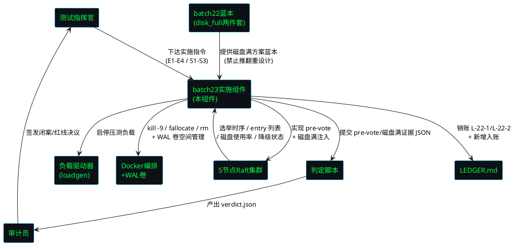
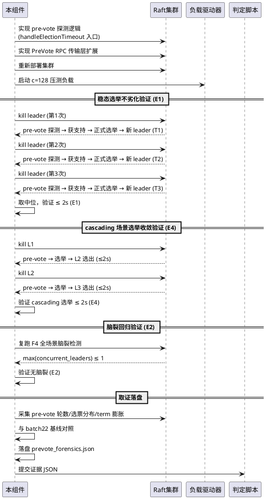
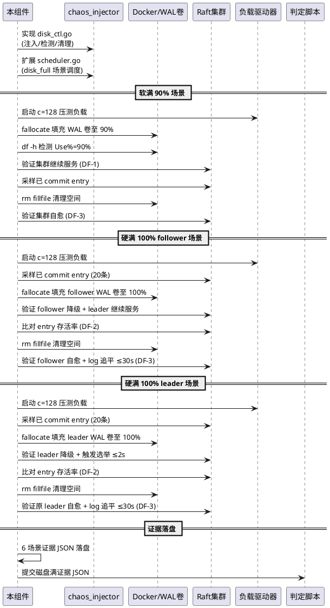

# batch23 pre-vote 防选票分裂 + 磁盘满故障注入实施 — 需求规格（EARS 格式）

> 版本: v2.4-batch23-prevote-diskfull
> 来源指令: batch23 七节全闭环指令
> 前置批次: batch22（verdict PASS, commit 29139aa, tag v2.4-post-batch22, E1=1.60s / S1=100% / F4=1）
> 验收契约: tests/contracts/batch23.yaml（草案，本 spec §7 定义）
> EARS 格式: Ubiquitous / Event-driven / State-driven / Optional / Unwanted
> 时间盒: 总计 ≤ 6 小时（任务一 pre-vote 3h + 任务二磁盘满 3h），到点停手交数据
> 范围锚定: 仅覆盖 W-1 pre-vote 实现 + 磁盘满故障注入实施两项任务，不得扩项

---

## 1. 组件定位

### 1.1 核心职责

本组件负责实现 batch22 挂账绕行项 W-1（pre-vote 防选票分裂机制）以消除 cascading 场景选票分裂导致的选举时间膨胀（3.44s → ≤2s），并实施 batch22 任务三预演的磁盘满故障注入方案（disk_full_spec.md + disk_full_design.md 两件套为蓝本），使集群在磁盘满条件下优雅降级、恢复后自愈、全程无数据损坏。

### 1.2 核心输入

1. **batch22 判定结果**：`tests/evidence/d3-batch22/verdict.json`（overall=PASS, E1=1.6003s, E2=1, E3=20%, S1=100%, S2=20, F1-F5 全 PASS）
2. **batch22 选举取证数据**：`tests/evidence/d3-batch22/election_forensics.json`（after_optimization: 800-1200ms, pre_vote.status=not_implemented, 残余脑裂风险标注）
3. **batch22 验收契约**：`tests/contracts/batch22.yaml`（E1-E3 / S1-S2 阈值 + 场景矩阵 + 红线 RL-01~RL-11）
4. **batch22 磁盘满方案蓝本**：`docs/specs/batch22/disk_full_spec.md`（注入方式 + 预期行为 + DF-1~DF-4 验收指标草案 + 3 场景矩阵）+ `docs/specs/batch22/disk_full_design.md`（disk_ctl.go 架构 + 实现计划标注 batch23）
5. **batch22 报告绕行清单 W-1**：pre-vote 未实现，挂账 batch23（cascading_kill_02 选举 3.44s 为选票分裂导致多轮选举）
6. **batch22 decisions.md D-8**：磁盘满方案仅设计不实施，挂账 batch23
7. **当前 Raft 实现**：`raft.go`（electionTimeoutMin=800ms / electionTimeoutMax=1200ms / rpcTimeout=500ms / 心跳阈值 2s / 回退因子 *2 / handleElectionTimeout 第 791-862 行 / term+1 第 841 行）
8. **LEDGER 挂账台账**：`LEDGER.md`（当前全部已清偿，W-1 pre-vote 和磁盘满实施为本次需求来源，本批新增 L-22-1 / L-22-2 两笔入账并清偿）
9. **集群拓扑**：5 节点 Docker 集群配置（leader/follower 角色可动态识别，HTTP 9001-9005，WAL 卷 wal-node-1~5）
10. **断点续跑状态**：RESUME.md 中记录的已完成任务编号

### 1.3 核心输出

1. **pre-vote 实现代码**：`raft.go` handleElectionTimeout 入口增加 pre-vote 探测逻辑 + PreVote RPC 传输层扩展，非 Leader 节点正式选举前先预投票探测多数派支持
2. **磁盘满注入实现代码**：`cmd/chaos_injector/disk_ctl.go`（磁盘满注入/清理/检测）+ `cmd/chaos_injector/scheduler.go` 扩展（新增 disk_full 场景调度）
3. **pre-vote 取证证据 JSON**：pre-vote 实现后 cascading 场景选举轮数/选票分布/term 膨胀对比数据，落盘至 `tests/evidence/d3-batch23/prevote_forensics.json`
4. **磁盘满注入证据 JSON 组**：软满（90%）/硬满（100%）两档 × 3 场景（follower/leader/recovery）= 6 场景证据 JSON，落盘至 `tests/evidence/d3-batch23/disk_full_*.json`
5. **判定输出文件**：`tests/evidence/d3-batch23/verdict.json`（脚本读数据对照 YAML 产出 PASS/FAIL，助手只引用不得自写）
6. **验收契约 YAML**：`tests/contracts/batch23.yaml`（E1-E4 / S1-S3 验收线及阈值 + 场景矩阵 + 红线清单）
7. **判定脚本**：`tests/contracts/judge_batch23.py`（读 pre-vote 取证 + 磁盘满证据 JSON + batch23.yaml，逐字段对照产出 verdict.json）
8. **报告三件套**：`tests/evidence/d3-batch23/报告.md`（首屏三清单：绕行/降级/销账，必贴 batch22→batch23 对照数据）/ `decisions.md` / `RESUME.md`
9. **LEDGER.md 更新**：L-22-1（W-1 pre-vote 实现）+ L-22-2（磁盘满故障注入实施）两笔入账并标注已清偿
10. **commit + tag**：commit `D3-batch23-prevote-diskfull` + tag `v2.4-post-batch23` + bundle 备份

### 1.4 职责边界

- **不负责**：修改 fsync/quorum 语义（红线 RL-01/RL-02 不可破坏）
- **不负责**：自行放宽验收 YAML 阈值（改 YAML 须晨批，红线 RL-05）
- **不负责**：修改 proto 定义（protoc 不可用，红线 RL-07）
- **不负责**：缩选举超时至 rpcTimeout 以下（electionTimeout 800ms > rpcTimeout 500ms，红线 RL-03）
- **不负责**：推翻 batch22 磁盘满方案蓝本重设计（以 disk_full_spec.md + disk_full_design.md 为蓝本，除非实现中发现设计缺陷，走等级二降级申报）
- **不负责**：提交证据目录内容（证据被 .gitignore 排除，红线 RL-08）
- **不负责**：提交构建产物二进制（.exe / 编译产物禁止入库，红线 RL-11）
- **不负责**：自行延期（时间盒 ≤ 6 小时，到点停手交数据，红线 RL-10）
- **不负责**：自写 PASS/FAIL 判定（判定由脚本产出，红线 RL-09）
- **不负责**：调参刷数（数字是什么就报什么，红线 RL-05）
- **不负责**：违反 pipeline 正确性三原则（红线 RL-06）

---

## 2. 领域术语

**pre-vote 预投票探测（Pre-Vote Probe）**
: Raft 优化机制，候选人在发起正式选举（term+1 + RequestVote）前先进行 pre-vote 预投票探测（不增加 term），获得多数派预支持后才转正式 Candidate 状态发起正式选举，避免因网络分区或时序抖动导致多个节点同时发起选举造成选票分裂、选举轮数膨胀、term 膨胀。

**选票分裂（Vote Split）**
: Raft 选举异常场景，多个节点在同一 term 或相邻 term 同时发起选举，每个候选人先投自己一票后剩余票数不足以形成 quorum，导致选举失败需重新发起，选举轮数膨胀、选举完成时间劣化。batch22 cascading_kill_02 场景选举 3.44s 即为选票分裂导致多轮选举的残余风险。

**term 膨胀（Term Inflation）**
: Raft 节点反复发起正式选举导致 term 单调递增但未选出 leader 的现象。pre-vote 机制通过在正式选举前不增加 term 来抑制 term 膨胀，防止网络分区节点回归后触发不必要的高 term 选举。

**cascading 连杀（Cascading Kill）**
: 故障注入场景，连续 kill 当前 leader 和新选出的 leader，模拟连续故障。batch22 cascading_kill_02 选举 3.44s 为选票分裂导致多轮选举，是 batch23 pre-vote 的主要验收场景。

**磁盘满故障注入（Disk Full Fault Injection）**
: 战役II 故障场景，通过模拟磁盘空间耗尽（填充 WAL 目录至 90% 软满或 100% 硬满），观察 Raft 集群在磁盘满条件下的 fsync 失败、entry 拒写、降级行为与恢复能力。batch22 已完成方案设计（disk_full_spec.md + disk_full_design.md），batch23 实施落地。

**软满（Soft Full, 90%）**
: 磁盘空间使用率达到 90% 的压力等级，集群应在此条件下继续服务但可能触发降级告警，用于验证集群接近磁盘满时的预警行为。

**硬满（Hard Full, 100%）**
: 磁盘空间使用率达到 100% 的压力等级，WAL fsync 应失败，节点应优雅降级（标记自身不可用、停止接受新写入），集群应维持 quorum 可用。

**quorum 存活（Quorum Survival）**
: 磁盘满注入后集群可用性维持状态。如填满的是 follower，leader 继续服务；如填满的是 leader，触发选举且选举完成 ≤2s。已 commit 的 entry 不丢失（survival_rate=100%）。

**磁盘满自愈（Disk Full Self-Healing）**
: 磁盘空间恢复后（清理 WAL 卷空间），节点自动重新加入集群并追平日志（log catchup ≤30s），无需手动重启，自动恢复写入能力。

**WAL 门禁（WAL Gate）**
: Raft 节点在 WAL fsync 失败时的降级机制，标记 walGateClosed=true，强制降级为 Follower，停止接受新写入。batch23 磁盘满注入依赖此已有机制（raft.go StepDownForWALFailure）。

**挂账销账（Ledger Settlement）**
: 对 LEDGER.md 中的待清记录逐条核对清偿条件、标注已清偿并记录 cleared_at 的过程。本批新增 L-22-1（W-1 pre-vote 实现）和 L-22-2（磁盘满故障注入实施）两笔入账并清偿。

**首屏三清单（First-Screen Three Lists）**
: 报告.md 首屏必须包含的三个清单：绕行清单（已绕过的问题及原因）、降级清单（降级运行的功能及影响）、销账清单（LEDGER 挂账清偿状态）。

**断点续跑（Checkpoint Resume）**
: 任务执行中途崩溃后，依据 RESUME.md 中记录的已完成任务编号，跳过已完成任务、从断点继续执行的协议。

---

## 3. 角色与边界

### 3.1 核心角色

- **测试指挥官（Test Commander）**：下达 batch23 实施指令，设定验收契约 E1-E4 / S1-S3，审核判定结果，签发闭案决议。
- **审计员（Auditor）**：核对证据完整性，验证判定与 YAML 契约逐字段对照，签发红线合规结论，审核 pre-vote 安全性论证与磁盘满蓝本 fidelity。

### 3.2 外部系统

- **5 节点 Raft 集群**：pre-vote 实现目标 + 磁盘满注入目标，提供 leader/follower 角色查询、进程管理、entry 列表查询、WAL 卷访问接口。
- **负载驱动器（loadgen）**：c=128 / c=512 压测负载生成，E1/E4 选举验收 + 磁盘满注入期间持续负载的负载源。
- **Docker 集群编排**：节点容器启停、健康检查、网络隔离管理、WAL 卷（wal-node-1~5）空间管理。
- **判定脚本**：读 pre-vote 取证 + 磁盘满证据 JSON + 验收 YAML，产出 verdict.json。

### 3.3 交互上下文

---

## 4. DFX 约束

### 4.1 性能

1. **总时间盒**：任务一 pre-vote 3h + 任务二磁盘满 3h = 总计 ≤ 6 小时（wall-clock），到点停手交数据。
2. **选举完成不劣化**：pre-vote 实现后选举完成时间 ≤ 2s（3 次取中位），以 batch22 E1=1.6003s 为基线，不得退化（E1 验收）。
3. **cascading 场景选举收敛**：pre-vote 实现后 cascading 连杀场景选举完成时间 ≤ 2s，batch22 cascading max=3.44s 需降至 ≤ 2s（E4 验收）。
4. **磁盘满注入期间集群可用**：follower 磁盘满 → 集群继续服务；leader 磁盘满 → 选举完成 ≤ 2s（DF-1 验收）。
5. **磁盘满恢复后自愈**：清理空间后节点重新加入，log 追平 ≤ 30s（DF-3 验收）。
6. **证据落盘**：单任务证据 JSON 落盘延迟 ≤ 2 秒（任务结束后）。

### 4.2 可靠性

1. **断点续跑**：任务执行中途崩溃后重启，已完成的任务不重复执行，从断点继续。
2. **证据完整性**：每个任务的 JSON 证据必须包含完整时间线，时间戳单调递增，无缺口。
3. **集群可恢复**：所有任务执行完毕后，5 节点集群恢复到健康稳态（1 leader + 4 follower），WAL 卷空间清理干净。
4. **pre-vote 不引入脑裂**：pre-vote 实现后复跑 F4 全绿，不引入新的脑裂风险（E2 验收）。
5. **磁盘满无数据损坏**：磁盘满注入全程已 commit 的 entry 不丢失，survival_rate=100%（S1 验收）。
6. **磁盘满无 panic/crash**：节点进程不 crash，优雅处理磁盘满错误（DF-4 验收）。

### 4.3 安全性

1. **红线不可破坏**：fsync 语义、quorum 语义、选举超时语义、proto 定义在实施期间不可被绕过（RL-01/RL-02/RL-03/RL-07）。
2. **证据隔离**：证据目录被 .gitignore 排除，提交时只 git add 代码文件，证据不进版本库（RL-08）。
3. **构建产物禁止入库**：.exe / 二进制 / 编译产物禁止入库（RL-11）。
4. **判定不可篡改**：PASS/FAIL 判定由脚本读数据对照 YAML 产出，助手只引用判定文件，不得自写 PASS/FAIL（RL-09）。
5. **pre-vote 安全性**：pre-vote 不增加 term（避免 term 膨胀）；pre-vote 失败不阻止其他节点发起选举（不引入活锁）；正式选举仍遵循"同一 term 一节点一票"约束（Raft 安全性不破坏）。

### 4.4 可维护性

1. **结构化日志**：实施全过程日志为结构化格式（含时间戳、事件类型、节点 ID、角色），可回放重演。
2. **pre-vote 可观测**：pre-vote 探测/成功/失败事件有结构化日志，可统计 pre-vote 命中率与选票分裂减少率。
3. **磁盘满可观测**：磁盘满注入/降级/恢复事件有结构化日志，磁盘使用率变化可追溯。
4. **挂账可追溯**：LEDGER.md 中每笔挂账有唯一 ID、来源批次、应清批次、状态，可审计追溯。
5. **决策落盘**：pre-vote 实现决策、磁盘满蓝本 fidelity 审查决策、降级申报（如有）均落盘 decisions.md。

### 4.5 兼容性

1. **验收 YAML 兼容**：batch23.yaml 格式与既有 batch22.yaml 契约格式一致，判定脚本可复用扩展。
2. **集群配置兼容**：pre-vote 适配现有 5 节点 Docker 集群配置，无需修改集群拓扑。
3. **batch22 契约继承**：E1-E3 / S1-S2 验收线继承 batch22，E4（cascading 选举 ≤2s）和 S3（磁盘满自愈）为 batch23 新增。
4. **磁盘满蓝本 fidelity**：实施须以 batch22 disk_full_spec.md + disk_full_design.md 为蓝本，不得推翻重设计（除非实现中发现设计缺陷，走等级二降级申报）。
5. **PreVote RPC 协议兼容**：PreVote RPC 为内部协议扩展，与现有 RequestVote RPC 共存（通过消息类型区分），不修改 proto 定义（RL-07）。

---

## 5. 核心能力

## 5.1 任务一：W-1 pre-vote 防选票分裂实现（时间盒 3h）

### 5.1.1 业务规则

1. **pre-vote 探测先行**（Event-driven）
   - 描述：当节点的选举定时器到期且节点非 Leader 时，系统应先发起 pre-vote 预投票探测（不增加 term），向所有 peer 发送 PreVote RPC（携带 term+1, lastLogIndex, lastLogTerm），统计预支持票数。
   - EARS 类型：Event-driven — When [election timer expires and node is not Leader], the [system] shall [first initiate pre-vote probe without incrementing term, sending PreVote RPC to all peers with term+1/lastLogIndex/lastLogTerm]
   - 验收条件：选举定时器到期 → 节点非 Leader → 发送 PreVote RPC（term 不增加）→ 统计预支持票数 → 决定是否转正式选举。

2. **pre-vote 获多数派预支持转正式选举**（State-driven）
   - 描述：在 pre-vote 探测获得 ≥ quorum 预支持票的状态下，系统应转正式 Candidate 状态（term+1, 投自己一票），并发起正式 RequestVote RPC（现有选举流程）。
   - EARS 类型：State-driven — While [pre-vote has received ≥ quorum pre-support votes], the [system] shall [transition to formal Candidate state with term+1 and self-vote, then initiate formal RequestVote RPC]
   - 验收条件：pre-vote 预支持 ≥ quorum → 转 Candidate → term+1 → 投自己 → 发送 RequestVote → 现有选举流程继续。

3. **pre-vote 未获多数派预支持保持 Follower**（State-driven）
   - 描述：在 pre-vote 探测未获得 ≥ quorum 预支持票的状态下，系统应保持 Follower 状态（不增加 term），重置选举定时器（randomElectionTimeout() * 2 回退），等待下一轮超时。
   - EARS 类型：State-driven — While [pre-vote has received < quorum pre-support votes], the [system] shall [remain Follower without incrementing term, reset election timer with randomElectionTimeout() * 2 backoff]
   - 验收条件：pre-vote 预支持 < quorum → 保持 Follower → term 不变 → 重置选举定时器 → 等待下一轮超时。

4. **pre-vote 不增加 term**（Ubiquitous）
   - 描述：系统应保证 pre-vote 探测阶段不增加节点 term，term 递增仅发生在正式 Candidate 转换时（pre-vote 获多数派支持后），防止 term 膨胀。
   - EARS 类型：Ubiquitous — The [system] shall [ensure pre-vote probe phase does not increment term; term increment only occurs on formal Candidate transition after pre-vote majority support]
   - 验收条件：pre-vote 探测阶段 → term 不变 → 仅正式 Candidate 转换时 term+1 → term 膨胀抑制。

5. **pre-vote 失败不阻止其他节点选举**（Ubiquitous）
   - 描述：系统应保证 pre-vote 失败的节点不阻止其他节点发起选举（不引入活锁），pre-vote 失败仅影响本节点是否进入正式 Candidate。
   - EARS 类型：Ubiquitous — The [system] shall [ensure pre-vote failure on one node does not prevent other nodes from initiating elections, no livelock introduction]
   - 验收条件：节点 A pre-vote 失败 → 节点 B 仍可发起 pre-vote → 节点 B 仍可转正式选举 → 无活锁。

6. **pre-vote 不破坏 Raft 安全性**（Ubiquitous）
   - 描述：系统应保证 pre-vote 机制不破坏 Raft 安全性——正式选举仍遵循"同一 term 一节点一票"约束，leader 唯一性保证不破坏，不引入脑裂风险。
   - EARS 类型：Ubiquitous — The [system] shall [ensure pre-vote does not break Raft safety: formal election still follows one-node-one-vote-per-term, leader uniqueness preserved, no split-brain]
   - 验收条件：pre-vote 实现后 → 复跑 F4 全绿 → max(concurrent_leaders) ≤ 1 → E2=PASS。

7. **cascading 场景选举时间收敛**（Event-driven）
   - 描述：当 cascading 连杀场景（kill leader L1 → 等待 L2 选举 → kill L2 → 等待 L3 选举）执行时，系统应保证每次选举完成时间 ≤ 2s，pre-vote 机制使选票分裂减少、选举轮数收敛。
   - EARS 类型：Event-driven — When [cascading kill scenario executes (kill L1 → L2 elected → kill L2 → L3 elected)], the [system] shall [complete each election within 2s, pre-vote reduces vote split and converges election rounds]
   - 验收条件：cascading 连杀 → 每次选举完成 ≤ 2s → 选票分裂减少 → 选举轮数收敛 → E4=PASS。
   - 与 batch22 追溯：batch22 cascading_kill_02 选举 3.44s（选票分裂多轮）→ batch23 pre-vote 后 ≤ 2s。

8. **选举完成不劣化**（State-driven）
   - 描述：在 pre-vote 实现后的稳态场景下，系统应保证选举完成时间 ≤ 2s（3 次取中位），以 batch22 E1=1.6003s 为基线不得退化。
   - EARS 类型：State-driven — While [pre-vote is implemented and steady-state scenarios run], the [system] shall [maintain election completion ≤ 2s (median of 3), no degradation from batch22 E1=1.6003s baseline]
   - 验收条件：pre-vote 实现后 → 稳态 3 次杀 leader 取中位 → 选举完成 ≤ 2s → E1=PASS → 不劣化。

9. **pre-vote 取证数据落盘**（Event-driven）
   - 描述：当 pre-vote 实现完成并复跑 cascading 场景后，系统应采集 pre-vote 取证数据（cascading 场景选举轮数/选票分布/term 膨胀对比 batch22 基线），落盘至 `tests/evidence/d3-batch23/prevote_forensics.json`。
   - EARS 类型：Event-driven — When [pre-vote is implemented and cascading scenarios re-run], the [system] shall [collect pre-vote forensics: round count, vote distribution, term inflation comparison vs batch22 baseline, persisted to prevote_forensics.json]
   - 验收条件：pre-vote 实现 → 复跑 cascading → 采集轮数/选票分布/term 膨胀 → 与 batch22 基线对照 → 落盘 prevote_forensics.json。

### 5.1.2 交互流程

### 5.1.3 异常场景

1. **pre-vote 引入新脑裂风险**
   - 触发条件：实现 pre-vote 后复跑 F4 检测到 > 1 个 leader
   - 系统行为：回退 pre-vote 实现（恢复 handleElectionTimeout 原逻辑），标注 E2=FAIL，记录脑裂详情，触发红线
   - 用户感知：verdict.json 中 E2=FAIL，附脑裂检测详情，pre-vote 已回退

2. **pre-vote 后选举完成时间劣化**
   - 触发条件：pre-vote 实现后选举完成时间中位值 > 2s（batch22 基线 1.60s）
   - 系统行为：如实记录，标注 E1=FAIL，落盘取证数据供后续分析，不自行放宽阈值（RL-05）
   - 用户感知：verdict.json 中 E1=FAIL，附实测中位值与 batch22 基线对照

3. **cascading 场景选举时间仍 > 2s**
   - 触发条件：pre-vote 实现后 cascading 场景选举完成时间仍 > 2s（选票分裂未消除）
   - 系统行为：如实记录，标注 E4=FAIL，分析 pre-vote 探测命中率与选票分裂残余原因，落盘取证数据
   - 用户感知：verdict.json 中 E4=FAIL，附 cascading 选举时序与 pre-vote 探测详情

4. **pre-vote 探测超时**
   - 触发条件：PreVote RPC 探测在 rpcTimeout(500ms) 内未收到多数派响应
   - 系统行为：保持 Follower，重置选举定时器（randomElectionTimeout() * 2 回退），等待下一轮超时
   - 用户感知：结构化日志记录 pre-vote 探测超时，节点保持 Follower

5. **PreVote RPC 传输层 panic**
   - 触发条件：PreVote RPC 发送/接收过程中 panic（如 peer 连接断开）
   - 系统行为：recover 捕获 panic，记录错误日志，该 peer 的 pre-vote 票不计入，继续统计其他 peer 响应
   - 用户感知：结构化日志记录 panic 恢复，pre-vote 继续统计

---

## 5.2 任务二：磁盘满故障注入实施（时间盒 3h）

### 5.2.1 业务规则

1. **以 batch22 蓝本为实施依据**（Ubiquitous）
   - 描述：系统应以 batch22 已设计的 disk_full_spec.md + disk_full_design.md 两件套为蓝本实施磁盘满故障注入，不得推翻重设计，除非实现中发现设计缺陷走等级二降级申报。
   - EARS 类型：Ubiquitous — The [system] shall [implement disk-full fault injection based on batch22 disk_full_spec.md + disk_full_design.md blueprint, no redesign unless design defect found with level-2 downgrade report]
   - 验收条件：实施代码与蓝本一致 → 注入方式（fallocate 填充 WAL 卷）→ 检测方法（df -h 解析 Use%）→ 清理方法（rm fillfile）→ 数据模型与蓝本一致。

2. **磁盘满注入工具实现**（Ubiquitous）
   - 描述：系统应实现磁盘满注入工具模块 `cmd/chaos_injector/disk_ctl.go`，提供注入（fallocate -l <size> /data/wal/fillfile）、检测（df -h /data/wal 解析 Use%）、清理（rm /data/wal/fillfile）三个方法，复用 chaos_injector 框架。
   - EARS 类型：Ubiquitous — The [system] shall [implement disk_ctl.go with inject (fallocate), detect (df -h), cleanup (rm) methods, reusing chaos_injector framework]
   - 验收条件：disk_ctl.go 存在 → 注入/检测/清理三方法可用 → 复用 chaos_injector 框架 → 与 disk_full_design.md 架构一致。

3. **软满（90%）压力等级**（Event-driven）
   - 描述：当磁盘使用率达到 90% 软满压力等级时，系统应在此条件下运行集群，验证集群继续服务但可能触发降级告警，leader 继续接受写入，follower 继续同步。
   - EARS 类型：Event-driven — When [disk usage reaches 90% soft-full level], the [system] shall [run cluster under this condition, verify cluster continues serving with possible degradation alerts, leader continues accepting writes, followers continue syncing]
   - 验收条件：磁盘填充至 90% → 集群继续服务 → leader 接受写入 → follower 同步 → 可能降级告警 → 无 panic/crash。

4. **硬满（100%）压力等级**（Event-driven）
   - 描述：当磁盘使用率达到 100% 硬满压力等级时，系统应在此条件下运行集群，验证 WAL fsync 失败、节点优雅降级（标记 walGateClosed=true、停止接受新写入）、集群维持 quorum 可用。
   - EARS 类型：Event-driven — When [disk usage reaches 100% hard-full level], the [system] shall [run cluster under this condition, verify WAL fsync failure, node graceful degradation (walGateClosed=true, stop accepting writes), cluster maintains quorum availability]
   - 验收条件：磁盘填充至 100% → WAL fsync 失败 → 节点优雅降级 → walGateClosed=true → 停止接受新写入 → 集群维持 quorum → 读请求正常。

5. **follower 磁盘满集群继续服务**（State-driven）
   - 描述：在 follower 节点磁盘满的状态下，系统应保证 leader 继续服务，集群可用性不破坏，读请求正常，已 commit 的 entry 不丢失。
   - EARS 类型：State-driven — While [follower node disk is full], the [system] shall [ensure leader continues serving, cluster availability preserved, read requests normal, committed entries preserved]
   - 验收条件：follower 磁盘满 → leader 继续服务 → 集群可用 → 读请求正常 → 已 commit entry 不丢失 → DF-1=PASS。

6. **leader 磁盘满触发选举**（State-driven）
   - 描述：在 leader 节点磁盘满的状态下，系统应保证 leader 优雅降级（StepDownForWALFailure），触发选举且选举完成 ≤ 2s，新 leader 在剩余可用节点中选出。
   - EARS 类型：State-driven — While [leader node disk is full], the [system] shall [ensure leader graceful degradation (StepDownForWALFailure), trigger election with completion ≤ 2s, new leader elected from remaining available nodes]
   - 验收条件：leader 磁盘满 → leader 降级 → 触发选举 → 选举完成 ≤ 2s → 新 leader 选出 → DF-1=PASS。

7. **磁盘满期间数据无损**（Ubiquitous）
   - 描述：系统应保证磁盘满注入全程已 commit 的 entry 不丢失，通过 `/raft/entry` 端点抽样比对验证，survival_rate=100%。
   - EARS 类型：Ubiquitous — The [system] shall [preserve all committed entries during disk-full injection, verified via /raft/entry sampling, survival_rate=100%]
   - 验收条件：磁盘满注入前采样已 commit entry → 注入 → 注入后比对 → 存活率 100% → S1=PASS → DF-2=PASS。

8. **磁盘满无 panic/crash**（Ubiquitous）
   - 描述：系统应保证磁盘满注入期间节点进程不 crash，优雅处理磁盘满错误（fsync 失败正确处理，不可忽略），WAL 门禁正确触发。
   - EARS 类型：Ubiquitous — The [system] shall [ensure no node panic/crash during disk-full injection, graceful error handling, WAL gate correctly triggered]
   - 验收条件：磁盘满注入 → 节点进程不 Exit → fsync 失败正确处理 → WAL 门禁触发 → DF-4=PASS。

9. **磁盘空间恢复后自动自愈**（Event-driven）
   - 描述：当磁盘满节点的空间被清理（rm fillfile）后，系统应自动恢复——节点重新加入集群并追平日志（log catchup ≤ 30s），无需手动重启，自动恢复写入能力。
   - EARS 类型：Event-driven — When [disk space is recovered (rm fillfile)], the [system] shall [auto-recover: node rejoins cluster, log catches up ≤ 30s, no manual restart, write capability restored]
   - 验收条件：磁盘空间清理 → 节点自动重新加入 → log 追平 ≤ 30s → 无需手动重启 → 写入能力恢复 → S3=PASS → DF-3=PASS。

10. **磁盘满场景调度扩展**（Ubiquitous）
    - 描述：系统应在 chaos_injector scheduler.go 中新增 disk_full 场景调度，包括软满（90%）/硬满（100%）两档 × 3 场景（disk_full_follower / disk_full_leader / disk_full_recovery）= 6 场景。
    - EARS 类型：Ubiquitous — The [system] shall [extend scheduler.go with disk_full scenario scheduling: soft-full(90%)/hard-full(100%) × 3 scenarios (follower/leader/recovery) = 6 scenarios]
    - 验收条件：scheduler.go 扩展 → 6 场景调度可用 → 每场景证据 JSON 落盘 → 场景矩阵与 spec §9 一致。

11. **磁盘满注入不破坏 fsync 语义**（Unwanted）
    - 描述：系统应避免磁盘满注入导致 fsync 语义被破坏——fsync 失败应正确处理（WAL 门禁触发、节点降级），不可忽略 fsync 错误或跳过 fsync 调用。
    - EARS 类型：Unwanted — The [system] shall not [break fsync semantics during disk-full injection: fsync failure must be correctly handled (WAL gate triggered, node degraded), never ignored or skipped]
    - 验收条件：磁盘满 → fsync 失败 → WAL 门禁触发 → 节点降级 → fsync 错误不忽略 → fsync 调用不跳过 → RL-01 不违反。

12. **磁盘满注入不修改 Raft 协议语义**（Unwanted）
    - 描述：系统应避免磁盘满注入工具修改 Raft 协议语义——注入工具仅操作磁盘空间，不修改选举/投票/日志复制/提交规则。
    - EARS 类型：Unwanted — The [system] shall not [modify Raft protocol semantics during disk-full injection: tool only operates disk space, not election/vote/replication/commit rules]
    - 验收条件：注入工具仅 fallocate/rm/df → 不修改 Raft 协议 → 选举/投票/复制/提交规则不变。

### 5.2.2 交互流程

### 5.2.3 异常场景

1. **磁盘满注入后集群脑裂**
   - 触发条件：磁盘满注入后检测到 > 1 个 leader
   - 系统行为：记录脑裂详情，标注 DF-1=FAIL，触发红线，立即清理磁盘空间恢复集群
   - 用户感知：verdict.json 中 DF-1=FAIL，附脑裂检测详情，磁盘空间已清理

2. **磁盘满期间 entry 丢失**
   - 触发条件：磁盘满注入后比对发现已 commit entry 丢失或内容不一致
   - 系统行为：记录丢失 entry 详情（index / term / 预期值 / 实际值），标注 DF-2=FAIL / S1=FAIL，触发红线（数据丢失）
   - 用户感知：verdict.json 中 DF-2=FAIL / S1=FAIL，附丢失 entry 详情，触发红线告警

3. **磁盘空间恢复后节点不自愈**
   - 触发条件：清理磁盘空间后节点未自动重新加入集群或 log 追平 > 30s
   - 系统行为：记录自愈失败详情，标注 DF-3=FAIL / S3=FAIL，分析 WAL 门禁恢复条件，尝试手动重启节点
   - 用户感知：verdict.json 中 DF-3=FAIL / S3=FAIL，附自愈失败详情与 log 追平时序

4. **磁盘满导致节点 panic/crash**
   - 触发条件：磁盘满注入后节点进程 Exit（docker inspect 显示 Exited）
   - 系统行为：记录 crash 详情，标注 DF-4=FAIL，分析 fsync 错误处理路径是否遗漏 recover，触发红线
   - 用户感知：verdict.json 中 DF-4=FAIL，附 crash 详情与节点状态

5. **fallocate 填充失败**
   - 触发条件：fallocate 命令执行失败（WAL 卷权限不足 / 路径不存在 / 空间不足）
   - 系统行为：记录 fallocate 错误，标注场景为 BLOCKED，跳过该场景继续后续场景
   - 用户感知：证据 JSON 中场景状态为 BLOCKED，附 fallocate 错误详情

6. **Docker volume 无限制导致无法填满**
   - 触发条件：Docker volume 默认无限制，fallocate 无法使 Use% 达到 90%/100%
   - 系统行为：按 disk_full_design.md §3 风险约束，预先确认 WAL 卷大小或限制容器内 /data/wal 分区大小，标注为环境前置条件
   - 用户感知：decisions.md 中记录 Docker volume 大小确认措施

7. **磁盘满蓝本与实现不符（设计缺陷）**
   - 触发条件：实施过程中发现 disk_full_spec.md 或 disk_full_design.md 存在设计缺陷（如注入方式不可行、预期行为与实际不符）
   - 系统行为：走等级二降级申报，记录设计缺陷详情与修正方案，落盘 decisions.md，更新蓝本文档
   - 用户感知：decisions.md 中标注等级二降级申报，附设计缺陷详情与修正方案

---

## 5.3 验收契约 E1-E4 / S1-S3

### 5.3.1 业务规则

1. **E1: 选举完成时间 ≤ 2s（不劣化）**（Event-driven）
   - 描述：当 leader 被 kill 后，系统应在 2 秒内完成选举（新 leader 选出并对外可服务），以 3 次测量取中位值为准，在压测负载（c=128）持续下测量，以 batch22 E1=1.6003s 为基线不得退化。
   - EARS 类型：Event-driven — When [leader is killed under c=128 load], the [system] shall [complete election within 2s (median of 3 runs), no degradation from batch22 E1=1.6003s baseline]
   - 验收条件：c=128 负载持续 → kill leader → 选举完成时间中位 ≤ 2s → 判定 E1=PASS
   - 反条件：选举完成时间中位 > 2s → 判定 E1=FAIL
   - 与 batch22 追溯：继承 batch22 E1，基线 1.6003s，pre-vote 实现后不劣化

2. **E2: pre-vote 不引入脑裂风险**（State-driven）
   - 描述：在 pre-vote 实施后，系统应保证复跑 F4 全绿——任一时刻 leader 至多 1 个，5 节点集群无脑裂。
   - EARS 类型：State-driven — While [pre-vote is applied], the [system] shall [have no split-brain risk: re-run F4 all green, at most 1 leader at any instant]
   - 验收条件：pre-vote 实施后 → 复跑 F4 → max(concurrent_leaders) ≤ 1 → 判定 E2=PASS
   - 反条件：复跑 F4 检测到 > 1 个 leader → 判定 E2=FAIL
   - 与 batch22 追溯：继承 batch22 E2，pre-vote 不得破坏

3. **E3: 选举期间拒绝率不劣化**（State-driven）
   - 描述：在 pre-vote 实施后故障注入期间，系统应将客户端拒绝率维持在 ≤ 30%（batch22 基线为 20%，pre-vote 后不劣化）。
   - EARS 类型：State-driven — While [fault injection is active after pre-vote], the [system] shall [maintain reject rate ≤ 30% (no degradation from batch22 baseline 20%)]
   - 验收条件：pre-vote 后注入期间 → 拒绝率 ≤ 30% → 判定 E3=PASS
   - 反条件：拒绝率 > 30% → 判定 E3=FAIL
   - 与 batch22 追溯：继承 batch22 E3，基线 20%

4. **E4: cascading 场景选举时间 ≤ 2s（新增）**（Event-driven）
   - 描述：当 cascading 连杀场景（kill L1 → L2 选举 → kill L2 → L3 选举）执行时，系统应保证每次选举完成时间 ≤ 2s，pre-vote 机制使选票分裂减少、选举轮数收敛。
   - EARS 类型：Event-driven — When [cascading kill scenario executes], the [system] shall [complete each election within 2s, pre-vote reduces vote split and converges rounds]
   - 验收条件：cascading 连杀 → 每次选举完成 ≤ 2s → 判定 E4=PASS
   - 反条件：任一次选举完成 > 2s → 判定 E4=FAIL
   - 与 batch22 追溯：batch22 cascading_kill_02 选举 3.44s（选票分裂多轮）→ batch23 pre-vote 后 ≤ 2s

5. **S1: 已确认写入存活率 = 100%（继承）**（Event-driven）
   - 描述：当 leader 被 kill 或磁盘满注入时，系统应保证所有已获得 quorum 确认的 entry 100% 存活，通过 `/raft/entry` 端点抽样比对验证。
   - EARS 类型：Event-driven — When [leader is killed or disk-full is injected], the [system] shall [preserve 100% of quorum-confirmed entries (verified via /raft/entry sampling)]
   - 验收条件：kill leader 或磁盘满 → 通过 `/raft/entry` 采样比对 → 存活率 100% → 判定 S1=PASS
   - 反条件：任一已确认 entry 丢失 → 判定 S1=FAIL
   - 与 batch22 追溯：继承 batch22 S1，基线 100%

6. **S2: 端点可用（继承）**（State-driven）
   - 描述：在 `/raft/entry` 端点运行期间，系统应保证端点可用，所有场景 sampled_entries_count ≥ 1。
   - EARS 类型：State-driven — While [/raft/entry is serving], the [system] shall [ensure endpoint available, all scenarios sampled_entries_count ≥ 1]
   - 验收条件：端点运行 → 所有场景 sampled_entries_count ≥ 1 → 判定 S2=PASS
   - 反条件：任一场景 sampled_entries_count = 0 → 判定 S2=FAIL
   - 与 batch22 追溯：继承 batch22 S2，基线 sampled=20

7. **S3: 磁盘满恢复后集群自愈（新增）**（Event-driven）
   - 描述：当磁盘满节点的空间被清理后，系统应自动恢复——节点重新加入集群并追平日志（log catchup ≤ 30s），无需手动重启，自动恢复写入能力。
   - EARS 类型：Event-driven — When [disk space is recovered], the [system] shall [auto-recover: node rejoins cluster, log catches up ≤ 30s, no manual restart, write capability restored]
   - 验收条件：磁盘空间清理 → 节点自动重新加入 → log 追平 ≤ 30s → 写入能力恢复 → 判定 S3=PASS
   - 反条件：节点未自动重新加入 或 log 追平 > 30s 或需手动重启 → 判定 S3=FAIL
   - 与 batch22 追溯：batch23 新增，对应 disk_full_design.md DF-3

8. **判定来源约束**（Ubiquitous）
   - 描述：系统应保证 PASS/FAIL 判定由脚本读证据 JSON 对照 YAML 阈值逐字段产出，助手只引用判定文件，不得自写 PASS/FAIL（RL-09）。
   - EARS 类型：Ubiquitous — The [system] shall [ensure PASS/FAIL judgment is produced by script reading evidence JSON vs YAML thresholds per-field, assistant only references verdict.json, never self-writes]
   - 验收条件：verdict.json 由 judge_batch23.py 产出 → 助手只引用 → 逐字段对照 YAML → RL-09 不违反。

9. **逐字段对照 YAML 阈值**（Ubiquitous）
   - 描述：系统应保证判定脚本对 E1-E4 / S1-S3 每个验收项逐字段对照证据 JSON 与 YAML 阈值，不得跳过任一字段（RL-04）。
   - EARS 类型：Ubiquitous — The [system] shall [ensure judgment script compares E1-E4 / S1-S3 each field against evidence JSON vs YAML thresholds, no field skipped]
   - 验收条件：judge_batch23.py → E1-E4 / S1-S3 每项逐字段对照 → 无跳过 → RL-04 不违反。

---

## 6. 数据约束

## 6.1 pre-vote 取证数据（prevote_forensics.json）

1. **scenario_id**：场景唯一标识，格式为 `cascading_kill_0N` 或 `steady_kill_leader_0N`
2. **prevote_round_count**：pre-vote 探测轮数（int，≥1）
3. **formal_election_round_count**：正式选举轮数（int，≥1，应 ≤ prevote_round_count）
4. **vote_distribution**：每轮各节点得票数数组（含 pre-vote 预支持票与正式票区分）
5. **term_before**：场景开始前集群最大 term（int64）
6. **term_after**：场景结束后集群最大 term（int64，term_after - term_before 为 term 膨胀量）
7. **election_completion_s**：选举完成时间（float, 秒，≤2s 为 E4 PASS）
8. **batch22_baseline**：batch22 同场景基线数据（election_completion_s / round_count，用于对照）
9. **timestamp**：取证时间戳（ISO 8601）

## 6.2 磁盘满注入证据数据（disk_full_*.json）

1. **scenario_id**：场景唯一标识，格式为 `disk_full_{soft|hard}_{follower|leader|recovery}_0N`
2. **target_node**：注入目标节点 ID（如 node-3）
3. **pressure_level**：压力等级（"soft_90" 或 "hard_100"）
4. **inject_timestamp**：注入时间戳（ISO 8601）
5. **disk_usage_before**：注入前磁盘使用率（string，如 "45%"）
6. **disk_usage_after**：注入后磁盘使用率（string，如 "90%" 或 "100%"）
7. **cluster_available**：注入期间集群是否可用（bool）
8. **leader_changed**：注入期间 leader 是否变更（bool）
9. **election_completion_s**：leader 磁盘满时选举完成时间（float, 秒，≤2s 为 DF-1 PASS，follower 磁盘满场景为 null）
10. **survival_rate**：已 commit entry 存活率（float, %，=100% 为 DF-2 / S1 PASS）
11. **node_crashed**：节点是否 crash（bool，=false 为 DF-4 PASS）
12. **recovery_timestamp**：磁盘空间清理时间戳（ISO 8601）
13. **log_catchup_duration_s**：log 追平耗时（float, 秒，≤30s 为 DF-3 / S3 PASS）
14. **status**：场景判定（"PASS" / "FAIL" / "BLOCKED"）

## 6.3 验收契约数据（batch23.yaml）

1. **contract.name**：契约名称（"batch23-prevote-diskfull"）
2. **contract.version**：契约版本（"1.0"）
3. **acceptance_criteria**：E1-E4 / S1-S3 验收项，每项含 name / description / metric / threshold / unit / operator / scope / judgment
4. **scenario_matrix**：场景矩阵（pre-vote 验证场景 + 磁盘满注入场景，见 §9）
5. **red_lines**：红线清单 RL-01~RL-11（见 §8）
6. **timebox**：时间盒 ≤ 6h，到点停手交数据

---

## 7. 验收契约草案（E1-E4 + S1-S3）

| 验收项 | 名称 | 指标 | 阈值 | 运算符 | 范围 | 判定逻辑 | 追溯 |
|--------|------|------|------|--------|------|----------|------|
| E1 | election_completion_no_regression | 选举完成中位值 | 2.0s | <= | steady_scenarios | 3 次取中位 ≤ 2s，不劣化 batch22 E1=1.6003s | 继承 batch22 E1 |
| E2 | no_split_brain_prevote | max_concurrent_leaders | 1 | <= | all_scenarios | pre-vote 后复跑 F4 全绿 | 继承 batch22 E2 |
| E3 | reject_rate_no_regression | max_reject_rate | 30.0% | <= | all_scenarios | pre-vote 后拒绝率不劣化 batch22 基线 20% | 继承 batch22 E3 |
| E4 | cascading_election_convergence | cascading 选举完成时间 | 2.0s | <= | cascading_scenarios | cascading 每次选举 ≤ 2s，batch22 max=3.44s → ≤2s | batch23 新增 |
| S1 | confirmed_write_survival | min_survival_rate | 100.0% | == | all_scenarios | 已确认 entry 100% 存活（含磁盘满场景） | 继承 batch22 S1 |
| S2 | entry_endpoint_available | min_sampled_count | 1 | >= | all_scenarios | 所有场景 sampled_entries_count ≥ 1 | 继承 batch22 S2 |
| S3 | disk_full_self_healing | log_catchup_duration | 30s | <= | disk_full_scenarios | 磁盘满恢复后 log 追平 ≤ 30s，无需手动重启 | batch23 新增 |

**验收项与蓝本 DF 指标映射**：
- E1/E2/E3 → 继承 batch22，pre-vote 不劣化
- E4 → pre-vote 验收（cascading 场景选举收敛）
- S1 → 含磁盘满场景存活率（对应 DF-2）
- S2 → 端点可用（继承 batch22）
- S3 → 磁盘满自愈（对应 DF-3）
- DF-1（集群可用性）→ 由 E1 + E2 + S1 联合覆盖
- DF-4（无 panic/crash）→ 由证据 JSON node_crashed=false 验证

---

## 8. 红线清单

| 红线 ID | 名称 | 描述 | 批次约束 |
|---------|------|------|----------|
| RL-01 | no_remove_fsync | 禁去 fsync | pre-vote / 磁盘满实施期间 fsync 语义不可破坏 |
| RL-02 | no_skip_quorum | 禁跳 quorum | pre-vote / 磁盘满实施期间 quorum 语义不可破坏 |
| RL-03 | no_shorten_election_timeout | 禁缩选举超时（electionTimeout 不可调小至 rpcTimeout 以下） | batch23: 800ms > rpcTimeout(500ms) ✓ Fix#7 约束维持，pre-vote 不改 electionTimeout |
| RL-04 | per_field_yaml_comparison | PASS 判定须逐字段对照证据 JSON vs YAML 阈值 | judge_batch23.py 逐字段对照 E1-E4 / S1-S3 |
| RL-05 | no_param_tuning | 禁调参刷数（数字是什么就报什么） | pre-vote / 磁盘满实测数据如实记录 |
| RL-06 | pipeline_correctness | pipeline 正确性三原则不可违反 | pre-vote / 磁盘满不侵入写路径热区 |
| RL-07 | no_proto_modification | 禁改 proto 定义 | protoc 不可用，PreVote RPC 通过消息类型区分不修改 proto |
| RL-08 | evidence_dir_gitignored | 证据目录不进版本库 | tests/evidence/d3-batch23/ 被 .gitignore 排除 |
| RL-09 | script_judged | 判定由脚本产出禁自评 | verdict.json 由 judge_batch23.py 产出 |
| RL-10 | debt_expiry_redline | 挂账到期未清 = 红线违反 | L-22-1 / L-22-2 本批清偿，不得延期 |
| RL-11 | no_build_artifacts_in_repo | 构建产物(.exe/二进制)禁止入库 | 继承 batch22 根治，disk_ctl.go 编译产物不入库 |

---

## 9. 场景矩阵

### 9.1 pre-vote 验证场景

| 场景类别 | 场景 ID | 描述 | 步骤 | 验收项 |
|---------|---------|------|------|--------|
| 稳态选举不劣化 | steady_prevote_01~10 | pre-vote 实现后稳态 kill leader，验证选举 ≤2s 不劣化 | 查询 leader → kill leader → 等待选举 → 验证 E1/E2/E3 → 重启节点 | E1, E2, E3 |
| cascading 选举收敛 | cascading_prevote_01~03 | pre-vote 实现后 cascading 连杀，验证每次选举 ≤2s | 查询 L1 → kill L1 → 等待 L2 → kill L2 → 等待 L3 → 验证 E4 → 重启 L1/L2 | E4, E2 |
| pre-vote 取证对照 | prevote_forensics | 采集 pre-vote 轮数/选票分布/term 膨胀，与 batch22 基线对照 | 运行 cascading → 采集取证数据 → 与 batch22 对照 → 落盘 prevote_forensics.json | E4 |

### 9.2 磁盘满注入场景

| 场景类别 | 场景 ID | 描述 | 目标节点 | 压力等级 | 负载 | 恢复方式 | 验收项 |
|---------|---------|------|---------|---------|------|---------|--------|
| 软满 follower | disk_full_soft_follower_01 | follower 磁盘 90%，验证集群继续服务 | 随机 follower | soft_90% | c=128 持续 | rm fillfile | S1, S3, DF-1 |
| 软满 leader | disk_full_soft_leader_01 | leader 磁盘 90%，验证集群继续服务 | 当前 leader | soft_90% | c=128 持续 | rm fillfile | S1, S3, DF-1 |
| 软满恢复 | disk_full_soft_recovery_01 | 软满后清理，验证自愈 | 随机节点 | soft_90% | 无负载 | rm fillfile | S3, DF-3 |
| 硬满 follower | disk_full_hard_follower_01 | follower 磁盘 100%，验证降级+quorum 存活 | 随机 follower | hard_100% | c=128 持续 | rm fillfile | S1, S3, DF-1, DF-2, DF-4 |
| 硬满 leader | disk_full_hard_leader_01 | leader 磁盘 100%，验证降级+选举 ≤2s | 当前 leader | hard_100% | c=128 持续 | rm fillfile + 等待选举 | S1, S3, DF-1, DF-2, DF-4 |
| 硬满恢复 | disk_full_hard_recovery_01 | 硬满后清理，验证自愈 + log 追平 ≤30s | 随机节点 | hard_100% | 无负载 | rm fillfile | S3, DF-3 |

### 9.3 场景总数

- pre-vote 验证场景：10（稳态）+ 3（cascading）+ 1（取证）= 14 场景
- 磁盘满注入场景：3（软满）+ 3（硬满）= 6 场景
- **总计：20 场景**

---

## 10. 前置文档引用

| 文档 | 路径 | 用途 |
|------|------|------|
| batch22 需求规格 | `docs/specs/batch22/spec.md` | 37 条 EARS 需求，含选举优化+端点+磁盘满设计需求，batch23 继承 E1-E3/S1-S2 |
| batch22 技术设计 | `docs/specs/batch22/design.md` | 选举优化状态机 + /raft/entry 端点 + pre-vote 机制设计 + 磁盘满方案设计 |
| batch22 磁盘满需求规格 | `docs/specs/batch22/disk_full_spec.md` | batch23 任务二蓝本：注入方式 + 预期行为 + DF-1~DF-4 验收指标草案 + 3 场景矩阵 |
| batch22 磁盘满技术设计 | `docs/specs/batch22/disk_full_design.md` | batch23 任务二蓝本：disk_ctl.go 架构 + 实现计划 + 数据模型 + 风险约束 |
| LEDGER 挂账台账 | `LEDGER.md` | 当前全部已清偿，W-1 pre-vote 和磁盘满实施为本次需求来源，本批新增 L-22-1/L-22-2 |
| batch22 选举取证数据 | `tests/evidence/d3-batch22/election_forensics.json` | 当前超时配置 800-1200ms / 随机区间 / pre_vote.status=not_implemented / 残余脑裂风险 |
| batch22 判定结果 | `tests/evidence/d3-batch22/verdict.json` | overall=PASS, E1=1.6003s, E2=1, E3=20%, S1=100%, S2=20, F1-F5 全 PASS |
| 当前 Raft 实现 | `raft.go` | 选举超时 800-1200ms (第 39-41 行) / rpcTimeout 500ms (第 52 行) / 心跳阈值 2s (第 824 行) / 回退因子 *2 (第 828 行) / handleElectionTimeout (第 791-862 行) / term+1 (第 841 行) |
| batch22 验收契约 | `tests/contracts/batch22.yaml` | F1-F5 + E1-E3 + S1-S2 验收线及阈值 + 场景矩阵 + 红线 RL-01~RL-11 |

---

## 11. LEDGER 挂账计划

本批新增两笔挂账，本批清偿：

| debt_id | source_batch | target_batch | status | description | cleared_at |
|---------|-------------|-------------|--------|-------------|------------|
| L-22-1 | batch22 | batch23 | 待清 → 已清偿 | W-1 pre-vote 未实现：batch22 选举优化绕行项，cascading_kill_02 选举 3.44s 为选票分裂导致多轮选举，需实现 pre-vote 防选票分裂 | batch23 |
| L-22-2 | batch22 | batch23 | 待清 → 已清偿 | D-8 磁盘满方案仅设计不实施：batch22 任务三预演完成 disk_full_spec.md + disk_full_design.md 两件套，实施 deferred 到 batch23 | batch23 |

**清偿条件**：
- L-22-1 清偿条件：pre-vote 实现完成 → E1 不劣化（≤2s）→ E4 cascading ≤2s → E2 无脑裂 → prevote_forensics.json 落盘
- L-22-2 清偿条件：磁盘满注入实施完成 → 6 场景全 PASS → S1 存活率 100% → S3 自愈 ≤30s → DF-1~DF-4 全 PASS

---

## 12. 范围锚定与扩项禁止

本 spec 严格锚定以下两项任务，不得扩项：

1. **任务一：W-1 pre-vote 实现**（§5.1）— 以 batch22 选举取证数据为依据，实现 pre-vote 防选票分裂机制，消除 cascading 场景选票分裂导致的选举时间膨胀。
2. **任务二：磁盘满故障注入实施**（§5.2）— 以 batch22 disk_full_spec.md + disk_full_design.md 两件套为蓝本，实施磁盘满故障注入，验证集群优雅降级、自愈、无数据损坏。

**禁止扩项内容**：
- 禁止修改 fsync/quorum/proto 语义（RL-01/RL-02/RL-07）
- 禁止缩选举超时至 rpcTimeout 以下（RL-03）
- 禁止推翻磁盘满蓝本重设计（除非设计缺陷走等级二降级申报）
- 禁止自行放宽验收阈值（RL-05）
- 禁止调参刷数（RL-05）
- 禁止自写判定（RL-09）
- 禁止延期（RL-10，时间盒 ≤ 6h）