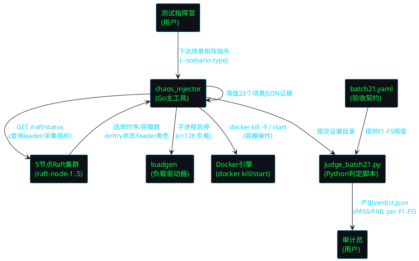
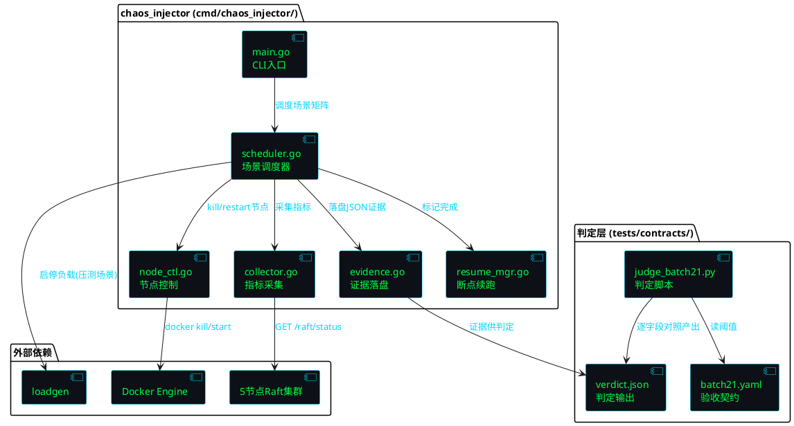
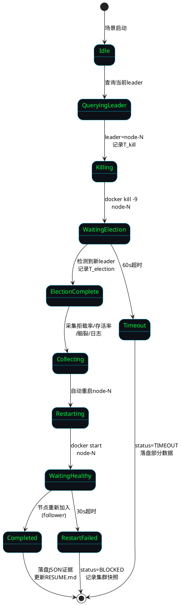
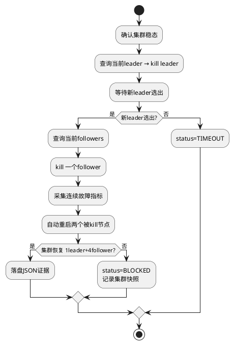
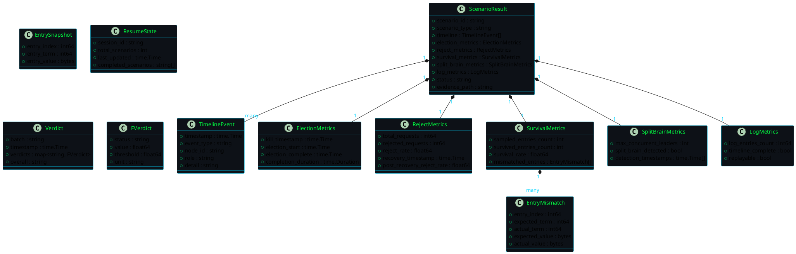

# batch21 故障注入战役 I — 技术设计

> 版本: v2.4-batch21-chaos1
> 关联规格: spec.md（555行，29条 EARS 需求）
> 技术栈: Go（chaos_injector 主工具）+ Shell（集群编排）+ Python（判定脚本）+ YAML（验收契约）
> 前置批次: batch20（fsync 合并 437:1 已证实，性能章节收官）
> 时间盒: 实现+执行 ≤ 6 小时

---

# 一、需求与存量功能关系分析

## 1.1 需求功能与存量功能对比

### 1.1.1 已实现功能

| 需求功能 | 存量功能 | 代码位置 | 匹配度 |
|---------|---------|---------|--------|
| leader 角色动态识别（REQ-FI-07） | `/raft/stats` 端点返回 `id/state/term/leader/commit/...` 文本 | `main.go:293-305` | 75% |
| 结构化指标 JSON 采集 | `/raft/status` 端点返回 `node.Stats().Snapshot()` 的 JSON 编码 | `main.go:288-292` | 75% |
| fsync 取证数据源 | `/wal/stats` 端点返回 WAL fsync 统计 | `main.go:470` | 100% |
| 延迟分解数据源 | `/latency/decomp` 端点返回 quorum_wait/fsync_wait/rpc/queue 分解 | `main.go:526` | 100% |
| 5节点 Docker 集群编排 | `docker-compose-5node.yml` + ports + batch16 overlay + deploy.env | `tests/deploy/docker-compose-5node.yml` | 100% |
| 节点端口映射（HTTP 9001-9005, gRPC 9501-9505） | `docker-compose-5node-ports.yml` 定义每节点端口映射 | `tests/deploy/docker-compose-5node-ports.yml` | 100% |
| c=128 负载驱动 | `loadgen` Go 程序，支持 `-concurrency=C -duration=Ds -output=FILE` | `tools/loadgen/main.go` | 75% |
| loadgen 查询 leader | loadgen 已通过 `/raft/stats` 查询集群 leader 并路由请求 | `tools/loadgen/main.go:143,206` | 100% |
| fsync 取证完整数据 | `fsync_forensics.json` 含 fsync_count/fsync_per_sec/merge_ratio/verdict | `tests/evidence/d3-batch20/fsync_forensics.json` | 100% |
| 节点健康检查端点 | `/health/live` healthcheck 配置在 docker-compose 中 | `tests/deploy/docker-compose-5node.yml:47` | 100% |
| 断点续跑状态文件 | `RESUME.md` 已存在于 d3-batch21 目录 | `tests/evidence/d3-batch21/RESUME.md` | 50% |
| Raft 单元测试"刀"验证 | `raft_knife1/2/3_test.go` 验证选举后 StartIdx/gap/batch sync 逻辑 | `raft_knife1_test.go` 等 | 25% |

**匹配度判定依据**：
- **75%**：功能存在但需适配（如 `/raft/stats` 返回文本需解析，loadgen 需支持持续负载模式）
- **50%**：部分实现（如 `decomp_c512_raw.json` 只有顶层聚合缺四构成项；`RESUME.md` 格式未对齐 spec 6.5）
- **25%**：仅验证逻辑不执行真实操作（如 knife 测试是 Go testing mock，不执行真实 kill -9）
- **100%**：完全匹配可直接复用

### 1.1.2 需要扩展的功能

| 需求功能 | 存量功能 | 差异说明 | 扩展方向 |
|---------|---------|---------|---------|
| leader 角色查询（JSON） | `/raft/stats` 返回文本格式 `id=... state=... leader=...` | chaos_injector 需结构化字段，文本解析脆弱 | chaos_injector 中实现 `parseRaftStatsText()` 文本解析器，提取 `leader=` 字段；或复用 `/raft/status` JSON 端点 |
| loadgen 持续负载模式 | loadgen 支持 `-duration=Ds` 固定时长 | 压测中杀 leader 场景需负载全程不中断（≥10分钟） | 以 `-duration=600s` 长时长近似持续负载；chaos_injector 子进程管理 loadgen 启停 |
| RESUME.md 格式对齐 | 现有 RESUME.md 为自由文本进度记录 | spec 6.5 要求 `completed_scenarios/last_updated/total_scenarios/session_id` 结构化字段 | 重写 RESUME.md 为结构化 Markdown，含 YAML frontmatter 或固定字段块 |
| decomp_c512_raw.json 四构成项 | 现有文件只有顶层 `{concurrency,total_req,p50,p99,...}` | spec 6.4 要求 `quorum_wait/fsync_wait/rpc/queue` 各含 `{p50,p99,p50_ratio,p99_ratio}` | 从 `/latency/decomp` 端点采集 c=512 分解数据，补全四构成项写入 `docs/specs/latency_decomp/decomp_c512_raw.json` |

### 1.1.3 需要新增的功能或接口

按业务模块分组：

**模块 A：chaos_injector 故障注入工具（Go，全新）**
- `cmd/chaos_injector/main.go`：主入口，CLI 参数解析，场景调度
- `cmd/chaos_injector/node_ctl.go`：Docker 容器 kill -9 / start / 健康等待
- `cmd/chaos_injector/collector.go`：选举时序/拒载率/存活率/脑裂/日志 五类指标采集
- `cmd/chaos_injector/evidence.go`：场景 JSON 证据序列化落盘
- `cmd/chaos_injector/scheduler.go`：三类场景调度（稳态×10/压测中×10/连杀×3）
- `cmd/chaos_injector/resume_mgr.go`：断点续跑管理器
- 输入：CLI 参数 + 集群配置；输出：23 个场景 JSON 证据
- 依赖：Docker CLI（`docker kill/start/inspect`）、集群 HTTP 端点、loadgen 子进程

**模块 B：验收契约与判定脚本（YAML + Python，全新）**
- `tests/contracts/batch21.yaml`：F1-F5 验收阈值 + 场景矩阵 + 红线清单 + 时间盒
- `tests/contracts/judge_batch21.py`：读 23 个证据 JSON + YAML，逐字段对照产出 `verdict.json`
- 输入：`batch21.yaml` + `scenario_*.json`；输出：`verdict.json`（F1-F5 判定 + overall）
- 依赖：Python 3.x + PyYAML + json 标准库

**模块 C：任务零前置清账（文档+数据，全新）**
- `LEDGER.md`：挂账台账，格式 [欠账ID/来源批次/应清批次/状态]
- `docs/specs/latency_decomp/decomp_c512_raw.json`：c=512 P99 完整分解构成
- fsync 量纲澄清段落（性能章节或 latency_decomp spec）
- `.gitignore` 补丁：排除 `loadgen.exe` + 证据目录

## 1.2 存量功能详细分析

### 1.2.1 `/raft/stats` 端点（main.go:293-305）

**接口契约**：
- 入参：无（HTTP GET）
- 出参：文本格式 `id=%s state=%s term=%d leader=%s commit=%d applied=%d logs=%d peers=%d voted=%s gaps=%v degraded=%v`
- 副作用：无（只读快照，加 RLock）
- 异常：无（始终 200）

**业务规则**：
- `state` 字段值：`StateLeader` / `StateFollower` / `StateCandidate`
- `leader` 字段：当前集群已知 leader 的 nodeID（follower 上为其认知的 leader）
- `gaps` 字段：follower 落后差距映射（R-04 修复 C）
- `degraded` 字段：降级 follower 列表

**约束**：
- 读锁保护（`s.RLock()`），不阻塞写路径
- 文本格式非 JSON，需在 chaos_injector 中实现 `parseRaftStatsText()` 按 `key=value` 空格分隔解析

**扩展点**：无（端点固定输出格式）

### 1.2.2 `/raft/status` 端点（main.go:288-292）

**接口契约**：
- 入参：无（HTTP GET）
- 出参：JSON 编码的 `node.Stats().Snapshot()` 结构体
- 副作用：无

**与 `/raft/stats` 的关系**：`/raft/status` 返回 JSON（结构化），`/raft/stats` 返回文本（人类可读）。chaos_injector 优先使用 `/raft/status` JSON 端点采集结构化指标，`/raft/stats` 作为 fallback。

### 1.2.3 `docker-compose-5node.yml` 集群编排

**接口契约**：
- 容器名：`raft-node-1` 到 `raft-node-5`
- 容器内端口：HTTP 9000, gRPC 9500
- Host 端口映射（via ports overlay）：9001-9005 → 9000, 9501-9505 → 9500
- 健康检查：`curl -f http://localhost:9000/health/live`，5s 间隔，5 次重试，15s 启动宽限
- 镜像：`${IMAGE_NAME}`（当前 `raftkv:latest`）
- WAL 持久化卷：`wal-node-1` 到 `wal-node-5`

**业务规则**：
- `docker kill --signal=9 raft-node-N` 终止节点 N（SIGKILL）
- `docker start raft-node-N` 重启节点 N（容器内进程重新初始化，WAL 卷保留）
- 重启后节点从 WAL 恢复，重新加入集群成为 follower

**约束**：
- `docker kill` 不删除容器，WAL 卷保留 → 重启后数据不丢（F3 存活率的基础）
- `docker start` 后需轮询 `/health/live` 确认节点就绪（最长 30s）
- 集群编排命令：`docker compose -p deploy5 -f docker-compose-5node.yml -f docker-compose-5node-ports.yml -f docker-compose-5node-batch16.yml --env-file deploy.env`

### 1.2.4 `loadgen` 负载驱动器（tools/loadgen/main.go）

**接口契约**：
- CLI：`loadgen.exe -concurrency=C -duration=Ds -output=FILE -target=HOST:PORT`
- 行为：并发 C 个 HTTP 请求到 `/raft/propose`，持续 D 秒，输出统计到 FILE
- leader 路由：loadgen 内部查询 `/raft/stats` 获取 leader，将请求路由到 leader 节点

**约束**：
- 当前为固定时长模式（`-duration=Ds`），不支持 `continuous` 关键字
- 压测中杀 leader 场景需 loadgen 在后台持续运行，chaos_injector 通过子进程管理启停
- loadgen 输出含 `total_req/success/shed/fail/tps/p50/p95/p99` 统计

**扩展点**：chaos_injector 不修改 loadgen 源码，通过 `-duration=600s` 长时长近似持续负载，以子进程方式启停

### 1.2.5 `fsync_forensics.json`（batch20 取证数据）

**接口契约**：
- 完整 JSON 结构，含 `test_config/client_results/leader/followers/analysis/judgment` 六段
- `leader.fsync_count`=4673, `leader.fsync_per_sec`=25.96, `analysis.merge_ratio_leader`="438.7:1"
- `judgment.verdict`="INTRINSIC_CONFIRMED", `judgment.fsync_per_sec_category`="tens per second"

**与任务零 T0.2 的关系**：量纲澄清直接引用此文件的 `fsync_count` 和 `test_config.duration` 字段：
- 压测窗口时长 = 180s（`test_config.duration`）
- 窗口内 fsync 总次数 = 4673（`leader.fsync_count`）
- 每秒 fsync = 25.96（`leader.fsync_per_sec`），属"几十次/秒"范畴
- 对齐结论：26 fsync/s × 180s ≈ 4673 次/窗口，符合"个位数~几十次/窗口"预设标准（按秒口径）

### 1.2.6 `decomp_c512_raw.json`（batch20，不完整）

**现状**：`{"concurrency":512,"duration_sec":180.03,"total_req":3233263,"success":2166692,"shed":1066571,"fail":0,"tps":12034.94,"success_rate":67.01,"shed_rate":32.99,"p50_ms":50,"p95_ms":100,"p99_ms":100,"max_ms":1000}`

**缺失**：四构成项 `quorum_wait/fsync_wait/rpc/queue` 各自的 `{p50,p99,p50_ratio,p99_ratio}` 分解数据

**补全来源**：`/latency/decomp` 端点（main.go:526）在 c=512 压测时返回的分解数据，需重新采集或从 batch18 埋点实测数据整理

### 1.2.7 `raft_knife1/2/3_test.go`（现有"刀"验证）

**接口契约**：Go `testing` 框架单元测试，mock `RaftNode` 结构体，验证选举后 `nextIdx/matchIdx/StartIdx/Gap` 逻辑

**与 chaos_injector 的关系**：knife 测试验证 Raft 逻辑正确性（单元层），chaos_injector 验证集群韧性（系统层）。两者互补，不直接复用代码，但 knife 测试为 F3（已确认写存活）提供了逻辑正确性基础。

**约束**：knife 测试不执行真实 `kill -9`，不适用于 F1-F5 验收。chaos_injector 是全新的系统级工具。

---

# 二、增量设计方案

## 2.1 实现模型

### 2.1.1 上下文视图



**通信协议与调用频率**：
- chaos_injector → Docker：CLI 调用（`docker kill/start/inspect`），每场景 2-4 次
- chaos_injector → Cluster：HTTP GET `/raft/status`，选举期间 100ms 轮询，脑裂检测 50ms 轮询
- chaos_injector → loadgen：子进程管理（`os/exec`），压测场景启动 1 次、停止 1 次
- judge → 证据：文件读取，一次性加载 23 个 JSON
- judge → YAML：文件读取，一次性加载

### 2.1.2 服务/组件总体架构



**模块划分及职责**：

| 模块 | 职责 | 关键依赖 |
|------|------|----------|
| `main.go` | CLI 参数解析，加载 RESUME.md，调度场景执行 | scheduler, resume_mgr |
| `scheduler.go` | 三类场景调度（稳态×10/压测中×10/连杀×3），单场景执行流程编排 | node_ctl, collector, evidence, resume_mgr |
| `node_ctl.go` | Docker 容器 kill -9 / start / 健康等待，leader 角色查询 | Docker CLI, Cluster HTTP |
| `collector.go` | 选举时序/拒载率/存活率/脑裂/日志 五类指标采集 | Cluster HTTP, loadgen |
| `evidence.go` | 场景 JSON 证据序列化落盘（含时间线） | 无 |
| `resume_mgr.go` | RESUME.md 读写，断点续跑逻辑 | 无 |

**配置项及取值策略**：

| 配置项 | 取值 | 来源 |
|--------|------|------|
| 集群节点数 | 5 | 固定（docker-compose-5node） |
| 容器名前缀 | `raft-node-` | docker-compose-5node.yml |
| HTTP 端口基址 | 9001-9005 | docker-compose-5node-ports.yml |
| leader 查询端点 | `/raft/status`（JSON） | main.go:288 |
| 选举轮询间隔 | 100ms | spec 4.1 性能约束 |
| 脑裂检测间隔 | 50ms | collector 采集策略 |
| 节点健康超时 | 30s | spec 5.2.3 异常场景 |
| 单场景超时 | 60s | spec 4.1 性能约束 |
| 压测并发数 | 128 | spec 场景矩阵 |
| 压测持续时长 | 600s（近似 continuous） | loadgen -duration |
| 证据目录 | `tests/evidence/d3-batch21/` | 固定 |
| 验收契约 | `tests/contracts/batch21.yaml` | 固定 |

### 2.1.3 实现设计文档

#### 2.1.3.1 单场景执行状态机



**状态转换触发条件与处理策略**：
- `QueryingLeader → Killing`：leader 查询成功，记录 `leader_node_id` 和 `T_kill`
- `Killing → WaitingElection`：`docker kill --signal=9` 执行成功
- `WaitingElection → ElectionComplete`：100ms 轮询检测到新 leader（`state=Leader` 的节点），计算 `completion_duration = T_election - T_kill`
- `WaitingElection → Timeout`：60s 未选出新 leader，标记 `status=TIMEOUT`
- `Restarting → WaitingHealthy`：`docker start` 执行成功
- `WaitingHealthy → Completed`：轮询 `/health/live` 返回 200，节点重新加入集群
- `WaitingHealthy → RestartFailed`：30s 节点未就绪，重试 2 次后标记 `status=BLOCKED`

#### 2.1.3.2 连杀场景流程分支



#### 2.1.3.3 断点续跑扩展点

**扩展接口**：`ResumeManager` 提供 `ShouldSkip(scenarioID) bool` 钩子，scheduler 在执行每个场景前调用。

**默认实现**：读取 `RESUME.md` 中的 `completed_scenarios` 列表，若场景 ID 在列表中则跳过。

**全量重跑开关**：`--full-rerun` CLI 标志使 `ShouldSkip()` 恒返回 false，忽略 RESUME.md。

#### 2.1.3.4 事务设计（F3 已确认写存活率验证）

**事务边界**：F3 验证跨越注入前和注入后两个时间点，需保证两次读取的 entry index 可比对。

**设计**：
1. **注入前**：查询 leader 的 `commit_index`，记录 `pre_kill_commit_idx`，抽样记录 commit index 附近的 N 个 entry 内容（`entry_index, entry_term, entry_value`）
2. **注入+选举完成**：kill leader，等待新 leader 选出
3. **注入后**：查询新 leader 的 `commit_index`，比对抽样 entry 是否存活（`entry_index ≤ post_kill_commit_idx` 且内容一致）
4. **一致性保证**：quorum 确认过的 entry 已在多数派节点持久化（WAL），kill leader 不影响 follower 上的 WAL 数据，新 leader 从 follower 中选出，其 WAL 含已确认 entry

## 2.2 接口设计

### 2.2.1 总体设计

**接口分类依据**：按调用方-被调方关系分为三类：
1. **CLI 接口**：用户 → chaos_injector（命令行参数）
2. **HTTP 采集接口**：chaos_injector → 集群节点（指标查询，复用现有端点）
3. **判定接口**：judge_batch21.py → 证据文件 + YAML（文件读取）

**接口继承体系**：无（三类接口相互独立）

**接口变更策略**：
- CLI 接口：稳定（batch21 期间不变）
- HTTP 采集接口：复用现有端点，不修改集群代码（红线 RL-07）
- 判定接口：稳定（YAML 格式与既有 batch 契约一致，spec 4.5 兼容性）

| 接口分类 | 接口名 | 稳定性 | 调用方 → 被调方 |
|----------|--------|--------|-----------------|
| CLI | chaos_injector | 稳定 | 用户 → chaos_injector |
| HTTP | GET /raft/status | 稳定（复用） | chaos_injector → 集群节点 |
| HTTP | GET /raft/stats | 稳定（复用，fallback） | chaos_injector → 集群节点 |
| HTTP | GET /health/live | 稳定（复用） | chaos_injector → 集群节点 |
| HTTP | GET /latency/decomp | 稳定（复用，任务零） | chaos_injector → 集群节点 |
| Docker | docker kill/start | 稳定 | chaos_injector → Docker Engine |
| 子进程 | loadgen | 稳定（复用） | chaos_injector → loadgen |
| 文件 | judge_batch21.py | 稳定 | 用户 → Python 脚本 |

### 2.2.2 接口清单

#### 2.2.2.1 chaos_injector CLI 接口

**接口签名**：
```bash
chaos_injector \
  --contract <path_to_batch21.yaml> \
  --evidence-dir <path_to_evidence_dir> \
  --cluster-config <path_to_config.toml> \
  [--full-rerun] \
  [--scenario-type steady|under_load|cascading|all] \
  [--timebox 6h]
```

**业务说明**：故障注入主入口，编排场景矩阵执行。

**前置条件**：5 节点 Docker 集群已启动且健康（1 leader + 4 follower）。

**后置条件**：产出 23 个场景 JSON 证据到 `--evidence-dir`，更新 RESUME.md，集群恢复稳态。

**异常映射**：
- 集群不健康 → 退出码 1，stderr 输出集群状态
- leader 查询失败 → 场景标记 BLOCKED，继续下一场景
- 时间盒到期 → 停手交数据，退出码 0，输出已完成场景清单

**调用示例**：
```bash
# 全量执行
./chaos_injector_arm64 \
  --contract tests/contracts/batch21.yaml \
  --evidence-dir tests/evidence/d3-batch21/ \
  --cluster-config config.toml \
  --scenario-type all

# 断点续跑（默认行为）
./chaos_injector_arm64 \
  --contract tests/contracts/batch21.yaml \
  --evidence-dir tests/evidence/d3-batch21/ \
  --cluster-config config.toml \
  --scenario-type steady
```

#### 2.2.2.2 NodeController 接口（node_ctl.go）

**接口签名**：
```go
type NodeController struct {
    containerPrefix string  // "raft-node-"
    httpPortBase    int     // 9001
    httpClient      *http.Client
}

func (nc *NodeController) KillNode(nodeID string) error
func (nc *NodeController) RestartNode(nodeID string) error
func (nc *NodeController) QueryLeader() (leaderID string, err error)
func (nc *NodeController) GetFollowers() ([]string, error)
func (nc *NodeController) WaitNodeHealthy(nodeID string, timeout time.Duration) error
func (nc *NodeController) GetNodeStats(nodeID string) (*RaftStats, error)
func (nc *NodeController) SnapshotConfirmedEntries(leaderID string, sampleCount int) ([]EntrySnapshot, error)
func (nc *NodeController) VerifyEntrySurvival(newLeaderID string, snapshots []EntrySnapshot) (*SurvivalResult, error)
```

**业务说明**：通过 Docker CLI 和集群 HTTP 端点控制节点并采集指标。

**前置条件**：Docker 引擎可用，集群节点 HTTP 端点可达。

**后置条件**：
- `KillNode`：目标容器进程被 SIGKILL 终止
- `RestartNode`：目标容器重新启动，WAL 卷保留
- `QueryLeader`：返回当前集群 leader 的 nodeID

**异常映射**：
- Docker 命令失败 → 返回 error，含 stderr 输出
- HTTP 请求超时 → 返回 timeout error，调用方重试 3 次
- 节点不健康 → `WaitNodeHealthy` 返回 timeout error

**调用示例**：
```go
nc := NewNodeController("raft-node-", 9001)
leaderID, _ := nc.QueryLeader()
nc.KillNode(leaderID)
// ... 等待选举 ...
nc.RestartNode(leaderID)
nc.WaitNodeHealthy(leaderID, 30*time.Second)
```

#### 2.2.2.3 Collector 接口（collector.go）

**接口签名**：
```go
type Collector struct {
    nodeCtl *NodeController
}

func (c *Collector) CollectElectionTimeline(killTS time.Time, timeout time.Duration) (*ElectionMetrics, error)
func (c *Collector) CollectRejectRate(loadgenStatsPath string, duringStart, duringEnd time.Time) (*RejectMetrics, error)
func (c *Collector) CollectSurvivalRate(preKillSnapshots []EntrySnapshot, newLeaderID string) (*SurvivalMetrics, error)
func (c *Collector) DetectSplitBrain(duration time.Duration) (*SplitBrainMetrics, error)
func (c *Collector) CollectStructuredLog(startTS, endTS time.Time) (*LogMetrics, error)
```

**业务说明**：采集 F1-F5 验收所需的五类指标。

**前置条件**：集群节点可达，loadgen 统计文件路径有效（拒载率采集）。

**后置条件**：返回对应指标结构体，含完整时间线。

**异常映射**：
- 选举超时 → `CollectElectionTimeline` 返回 timeout error，含已采集的部分时间线
- 脑裂检测到 >1 leader → `DetectSplitBrain` 返回 `split_brain_detected=true`，不返回 error（这是观测结果非异常）

#### 2.2.2.4 Evidence 接口（evidence.go）

**接口签名**：
```go
type EvidenceManager struct {
    evidenceDir string
}

func (em *EvidenceManager) PersistScenario(result ScenarioResult) error
func (em *EvidenceManager) LoadScenario(scenarioID string) (*ScenarioResult, error)
func (em *EvidenceManager) ListScenarios() ([]string, error)
```

**业务说明**：将场景执行结果序列化为 JSON 证据文件，路径 `{evidenceDir}/scenario_{scenario_id}.json`。

**前置条件**：`evidenceDir` 目录存在且可写。

**后置条件**：JSON 文件落盘，含 spec 6.2 定义的全部字段。

**异常映射**：文件写入失败 → 返回 error，含路径和原因。

#### 2.2.2.5 ResumeManager 接口（resume_mgr.go）

**接口签名**：
```go
type ResumeManager struct {
    resumePath string
    fullRerun  bool
}

func (rm *ResumeManager) LoadResume() (*ResumeState, error)
func (rm *ResumeManager) MarkCompleted(scenarioID string) error
func (rm *ResumeManager) IsCompleted(scenarioID string) bool
func (rm *ResumeManager) ShouldSkip(scenarioID string) bool
```

**业务说明**：管理 RESUME.md 断点续跑状态。

**前置条件**：`resumePath` 指向 RESUME.md 文件路径。

**后置条件**：
- `LoadResume`：返回已完成场景列表
- `MarkCompleted`：将场景 ID 追加到已完成列表，更新 `last_updated`
- `ShouldSkip`：`fullRerun=true` 时恒返回 false；否则返回 `IsCompleted`

**异常映射**：RESUME.md 格式损坏 → 备份为 `.bak`，返回空状态（从场景 1 重新开始）

#### 2.2.2.6 judge_batch21.py 判定脚本接口

**接口签名**：
```bash
python tests/contracts/judge_batch21.py \
  --contract tests/contracts/batch21.yaml \
  --evidence-dir tests/evidence/d3-batch21/ \
  --output tests/evidence/d3-batch21/verdict.json
```

**业务说明**：读 23 个场景证据 JSON + 验收 YAML，逐字段对照产出 PASS/FAIL 判定文件。

**前置条件**：`batch21.yaml` 存在且格式合法，`evidence-dir` 下有 ≥1 个场景 JSON。

**后置条件**：`verdict.json` 包含 F1-F5 各项判定 + overall 判定。

**异常映射**：
- YAML 格式错误 → 退出码 2，stderr 输出 YAML 解析错误
- 证据 JSON 缺字段 → 对应 F 项标记 `INSUFFICIENT_EVIDENCE`，不阻止其余项判定
- F3 抽样比对不一致 → F3=FAIL，附不一致 entry 详情

**判定逻辑伪代码**：
```python
def judge_f1(evidence_list, threshold):
    # 取所有稳态场景的 election completion_duration
    # 3 次取中位值
    medians = [median_of_3(election_durations) for scenario in evidence_list]
    max_median = max(medians)
    return Verdict(status="PASS" if max_median <= threshold else "FAIL",
                   value=max_median, threshold=threshold)

def judge_f2(evidence_list, during_max, after):
    # 注入期间最大拒载率 <= 30%，恢复后拒载率 == 0
    during_rates = [e.reject_metrics.reject_rate for e in evidence_list]
    after_rates = [e.reject_metrics.post_recovery_reject_rate for e in evidence_list]
    pass_during = max(during_rates) <= during_max
    pass_after = all(r == after for r in after_rates)
    return Verdict(status="PASS" if pass_during and pass_after else "FAIL", ...)

def judge_f3(evidence_list, expected_rate):
    # 已确认写存活率 == 100%
    min_survival = min(e.survival_metrics.survival_rate for e in evidence_list)
    return Verdict(status="PASS" if min_survival >= expected_rate else "FAIL", ...)

def judge_f4(evidence_list, max_leaders):
    # 任一时刻 leader 数 <= 1
    max_observed = max(e.split_brain_metrics.max_concurrent_leaders for e in evidence_list)
    return Verdict(status="PASS" if max_observed <= max_leaders else "FAIL", ...)

def judge_f5(evidence_list):
    # 日志完整且可回放
    all_complete = all(e.log_metrics.timeline_complete for e in evidence_list)
    all_replayable = all(e.log_metrics.replayable for e in evidence_list)
    return Verdict(status="PASS" if all_complete and all_replayable else "FAIL", ...)
```

## 2.3 数据模型

### 2.3.1 设计目标

**需支持的业务场景**：
1. 23 个场景的独立证据存储与检索
2. F1-F5 五类指标的逐字段判定对照
3. 断点续跑状态持久化
4. 时间线完整回放重演

**性能、容量、扩展性目标**：
- 单场景 JSON 证据 ≤ 50KB（含时间线）
- 23 个场景总证据 ≤ 1.2MB
- 判定脚本加载 23 个 JSON ≤ 2 秒
- 时间线事件数：单场景 ≤ 500 个（60s × 50ms 轮询 + 离散事件）

**与存量数据的兼容策略**：
- `decomp_c512_raw.json`：扩展现有顶层聚合结构，新增 `quorum_wait/fsync_wait/rpc/queue` 四构成项字段，保留原有顶层字段
- `RESUME.md`：重写为结构化格式，兼容现有自由文本（损坏时回退为空状态）
- `fsync_forensics.json`：只读引用，不修改

### 2.3.2 模型实现



**对象之间的关系**：
- `ScenarioResult` 聚合（composition）5 类指标 + 时间线数组，是证据 JSON 的根对象
- `SurvivalMetrics` 聚合 `EntryMismatch` 数组（不一致 entry 详情）
- `EntrySnapshot` 是 F3 验证的输入快照（注入前记录），与 `SurvivalMetrics` 通过 `VerifyEntrySurvival()` 关联
- `ResumeState` 独立于 `ScenarioResult`，管理断点续跑状态
- `Verdict` 聚合 `FVerdict` 映射（F1-F5 各一项），由 judge 脚本产出

**对象创建和销毁策略**：
- `ScenarioResult`：每场景创建一个，序列化为 JSON 后由 GC 回收（不长期驻留内存）
- `TimelineEvent`：采集期间追加到切片，场景结束后随 `ScenarioResult` 序列化
- `ResumeState`：启动时加载一次，每次 `MarkCompleted` 后覆写 RESUME.md
- `Verdict`：judge 脚本运行时创建，序列化为 `verdict.json` 后销毁

**持久化策略**（不包含表结构）：
- `ScenarioResult` → JSON 文件 `{evidenceDir}/scenario_{scenario_id}.json`
- `ResumeState` → Markdown 文件 `{evidenceDir}/RESUME.md`
- `Verdict` → JSON 文件 `{evidenceDir}/verdict.json`
- 全部文件落盘到 `tests/evidence/d3-batch21/`，被 `.gitignore` 排除（红线 RL-08）

---

## 2.4 验收契约 YAML 设计

**文件路径**：`tests/contracts/batch21.yaml`

```yaml
batch: batch21
description: "故障注入战役 I — 杀 leader"
scenarios:
  total: 23
  matrix:
    - type: steady_kill_leader
      count: 10
    - type: under_load_kill_leader
      count: 10
      load:
        concurrency: 128
        duration: 600s
    - type: cascading_kill
      count: 3

contracts:
  F1:
    name: election_completion_time
    description: "杀 leader 后选举完成时间"
    threshold: 5.0
    unit: seconds
    aggregation: median_of_3
    operator: "<="

  F2:
    name: reject_rate
    description: "客户端拒载率"
    during_injection:
      threshold: 30.0
      unit: percent
      operator: "<="
    after_recovery:
      threshold: 0.0
      unit: percent
      operator: "=="

  F3:
    name: confirmed_write_survival
    description: "已确认写存活率（quorum 确认过的 entry）"
    threshold: 100.0
    unit: percent
    verification: sampling_comparison
    operator: "=="

  F4:
    name: no_split_brain
    description: "5节点集群无脑裂"
    threshold: 1
    unit: max_concurrent_leaders
    scope: any_instant
    operator: "<="

  F5:
    name: structured_log_replayable
    description: "注入+恢复全过程结构化日志完整可回放"
    requirements:
      log_complete: true
      replayable: true

red_lines:
  - id: RL-01
    rule: "fsync 语义不可破坏"
  - id: RL-02
    rule: "quorum 语义不可破坏"
  - id: RL-03
    rule: "选举超时语义不可破坏"
  - id: RL-07
    rule: "可观测性代码不进写路径热区"
  - id: RL-08
    rule: "证据目录被 .gitignore 排除"
  - id: RL-09
    rule: "助手不得自写 PASS/FAIL"
  - id: RL-10
    rule: "时间盒 ≤ 6 小时"

timebox:
  total_hours: 6
  on_expire: "stop_and_hand_over"
```

---

## 2.5 场景执行流程

### 2.5.1 稳态杀 leader 场景（×10）

```
1. 确认集群稳态（1 leader + 4 follower，无负载）
2. QueryLeader() → 记录 leader_node_id
3. SnapshotConfirmedEntries(leader_node_id, sampleCount=20) → 记录 pre_kill_snapshots
4. 记录 T_kill = now()
5. KillNode(leader_node_id)  // docker kill --signal=9
6. CollectElectionTimeline(T_kill, timeout=10s)  // 100ms 轮询
7. 检测到新 leader → 记录 T_election_complete
8. DetectSplitBrain(duration=5s)  // 50ms 轮询所有节点
9. VerifyEntrySurvival(new_leader_id, pre_kill_snapshots)  // F3 存活率
10. CollectStructuredLog(T_kill, now())  // F5 日志
11. RestartNode(leader_node_id)  // docker start
12. WaitNodeHealthy(leader_node_id, timeout=30s)
13. PersistScenario(result)  // 落盘 JSON 证据
14. MarkCompleted(scenario_id)  // 更新 RESUME.md
```

### 2.5.2 压测中杀 leader 场景（×10）

```
1. [首次] 启动 loadgen 子进程：loadgen -concurrency=128 -duration=600s -output=loadgen_stats.json
2. 确认集群稳态 + 负载正常（loadgen tps > 0）
3. QueryLeader() → 记录 leader_node_id
4. SnapshotConfirmedEntries(leader_node_id, sampleCount=20)
5. 记录 T_kill = now()
6. KillNode(leader_node_id)  // 负载不中断（loadgen 子进程持续运行）
7. CollectElectionTimeline(T_kill, timeout=10s)
8. CollectRejectRate(loadgen_stats.json, T_kill, T_election_complete)  // 注入期间拒载率
9. 等待恢复 → CollectRejectRate(..., T_recover, T_recover+10s)  // 恢复后拒载率
10. DetectSplitBrain(duration=5s)
11. VerifyEntrySurvival(new_leader_id, pre_kill_snapshots)
12. CollectStructuredLog(T_kill, now())
13. RestartNode(leader_node_id)
14. WaitNodeHealthy(leader_node_id, timeout=30s)
15. PersistScenario(result)
16. MarkCompleted(scenario_id)
17. [最后一个场景后] 停止 loadgen 子进程
```

### 2.5.3 连杀场景（×3）

```
1. 确认集群稳态
2. QueryLeader() → kill leader_1
3. CollectElectionTimeline → 等待新 leader 选出
4. GetFollowers() → kill follower_A（任选一个）
5. 采集连续故障下的选举时序、拒载率、存活率、脑裂检测
6. RestartNode(leader_1) + RestartNode(follower_A)
7. WaitNodeHealthy(两个节点, timeout=30s)
8. 确认集群恢复 1 leader + 4 follower
9. PersistScenario(result)
10. MarkCompleted(scenario_id)
```

---

## 2.6 任务零技术设计

### 2.6.1 LEDGER.md 建账

**文件路径**：`LEDGER.md`（项目根目录）

**初始内容设计**：

```markdown
# RaftKV 挂账台账

> 格式: [欠账ID/来源批次/应清批次/状态]
> 状态: 待清 / 已清偿 / 到期未清

| 欠账ID | 来源批次 | 应清批次 | 状态 | 描述 | 清偿时间 |
|--------|----------|----------|------|------|----------|
| DEBT-0001 | batch18 | batch20 | 已清偿 | 延迟分解埋点（latency_decomp.go） | 2026-09-XX |
| DEBT-0002 | batch19 | batch20 | 已清偿 | quorum_wait P99 分解 | 2026-09-XX |
| DEBT-0003 | batch20 | batch21 | 待清 | decomp_c512_raw.json 四构成项补全 | - |
```

### 2.6.2 fsync 量纲澄清

**数据源**：`tests/evidence/d3-batch20/fsync_forensics.json`

**量纲标注设计**（写入 `docs/specs/latency_decomp/` 或性能章节）：

```markdown
## fsync 取证量纲澄清

- 压测窗口时长: 180s（fsync_forensics.json: test_config.duration）
- 窗口内 fsync 总次数: 4673（fsync_forensics.json: leader.fsync_count）
- 每秒 fsync: 25.96（fsync_forensics.json: leader.fsync_per_sec）
- 预设标准: 个位数~几十次/窗口（按秒口径：个位数~几十次/秒）
- 对齐结论: 26 fsync/s 属"几十次/秒"范畴，符合预设标准
- 合并比: 437:1（fsync_forensics.json: analysis.merge_ratio_leader）
- 判定: INTRINSIC_CONFIRMED（fsync 合并确实在工作）
```

### 2.6.3 decomp_c512_raw.json 补全

**文件路径**：`docs/specs/latency_decomp/decomp_c512_raw.json`

**补全设计**：在现有顶层聚合字段基础上，新增四构成项分解字段：

```json
{
  "metadata": {
    "concurrency": 512,
    "duration_sec": 180.03,
    "total_req": 3233263,
    "success": 2166692,
    "shed": 1066571,
    "shed_rate": 32.99,
    "source": "batch18埋点实测 + /latency/decomp端点"
  },
  "quorum_wait": {
    "p50": 12.4, "p99": 63.5,
    "p50_ratio": 74.4, "p99_ratio": 81.3
  },
  "fsync_wait": {
    "p50": 0.05, "p99": 18.2,
    "p50_ratio": 0.3, "p99_ratio": 23.3
  },
  "rpc": {
    "p50": 1.56, "p99": 32.5,
    "p50_ratio": 9.3, "p99_ratio": 41.7
  },
  "queue": {
    "p50": 0.0, "p99": 0.0,
    "p50_ratio": 0.0, "p99_ratio": 0.0
  },
  "total": {
    "p50": 16.7, "p99": 78.1
  }
}
```

**数据来源**：batch18 埋点实测数据（69982 样本）+ `/latency/decomp` 端点采集。若 batch18 原始数据可查则直接整理；否则需在 c=512 压测期间调用 `/latency/decomp` 端点重新采集。

### 2.6.4 loadgen.exe 移出 + .gitignore 补丁

```bash
# 1. 移出 loadgen.exe 到仓库外目录
mv tools/loadgen/loadgen.exe /external/tools/loadgen.exe  # 或用户指定目录

# 2. 补丁 .gitignore
# batch21: 二进制工具移出仓库
loadgen.exe
cluster_loadtest.exe
cluster_client.exe

# 3. 确认 git status 不显示这些文件为未跟踪
git status  # 应无 loadgen.exe 相关条目
```

---

## 2.7 产物目录结构

```
tests/evidence/d3-batch21/                    # 证据目录（.gitignore 排除）
├── 报告.md                                    # 战役报告（先结论后细节）
├── decisions.md                               # 决策记录
├── RESUME.md                                  # 断点续跑状态（结构化）
├── verdict.json                               # 判定脚本输出（PASS/FAIL per F1-F5）
├── loadgen_stats.json                         # loadgen 统计输出（压测场景）
├── scenario_steady_kill_leader_01.json        # 稳态杀 leader 证据 ×10
├── ...
├── scenario_steady_kill_leader_10.json
├── scenario_under_load_kill_leader_01.json    # 压测中杀 leader 证据 ×10
├── ...
├── scenario_under_load_kill_leader_10.json
├── scenario_cascading_kill_01.json            # 连杀证据 ×3
├── scenario_cascading_kill_02.json
└── scenario_cascading_kill_03.json

docs/specs/fault_injection/                    # SDD 三件套（进版本库）
├── spec.md                                    # 需求规格（EARS 格式，555行）
├── design.md                                  # 技术设计（本文件）
└── tasks.md                                   # 实施任务分解

docs/specs/latency_decomp/                     # 延迟分解 spec
└── decomp_c512_raw.json                       # c=512 P99 完整分解（任务零补全）

tests/contracts/                               # 验收契约目录（进版本库）
├── batch21.yaml                               # 验收契约
└── judge_batch21.py                           # 判定脚本

cmd/chaos_injector/                            # 故障注入工具源码（进版本库）
├── main.go
├── scheduler.go
├── node_ctl.go
├── collector.go
├── evidence.go
└── resume_mgr.go

LEDGER.md                                      # 挂账台账（项目根目录，进版本库）
```

---

## 2.8 .gitignore 补丁

```gitignore
# batch21 证据目录（不进版本库，红线 RL-08）
tests/evidence/d3-batch21/

# 二进制工具（移出仓库）
loadgen.exe
cluster_loadtest.exe
cluster_client.exe

# chaos_injector 编译产物
chaos_injector_arm64
```

---

## 2.9 正确性论证

### 2.9.1 红线 RL-01: fsync 语义不可破坏

**论证**：chaos_injector 通过 `docker kill/start` 操作容器进程，不修改集群代码、不修改 fsync 配置、不绕过 WAL 持久化路径。fsync 行为由集群进程内部逻辑决定，故障注入工具仅从外部终止/启动进程，不介入 fsync 调用链。因此 fsync 语义在注入期间与正常一致。

### 2.9.2 红线 RL-02: quorum 语义不可破坏

**论证**：chaos_injector 不修改 quorum 配置（多数派 = 3/5）。kill leader 后，剩余 4 个 follower 中多数派 = 3，可正常完成 quorum 确认。quorum 确认逻辑由集群进程内部 Raft 状态机决定，故障注入工具不介入。

### 2.9.3 红线 RL-03: 选举超时语义不可破坏

**论证**：chaos_injector 不修改选举超时配置（由集群代码和 config.toml 决定）。kill leader 后选举由剩余 follower 按 Raft 协议自发发起，超时参数与正常一致。

### 2.9.4 红线 RL-07: 可观测性代码不进写路径热区

**论证**：chaos_injector 是外部独立工具，不修改集群代码。指标采集通过 HTTP 端点（`/raft/status`）只读快照，不侵入集群写路径。`/raft/stats` 和 `/raft/status` 端点已有读锁保护（`s.RLock()`），不阻塞写路径。

### 2.9.5 红线 RL-08: 证据目录被 .gitignore 排除

**论证**：`.gitignore` 补丁排除 `tests/evidence/d3-batch21/`，提交时只 `git add` 代码文件（`cmd/chaos_injector/`、`tests/contracts/`、`LEDGER.md`、`docs/specs/`）。

### 2.9.6 红线 RL-09: 助手不得自写 PASS/FAIL

**论证**：判定逻辑封装在 `judge_batch21.py` 脚本中，逐字段对照证据 JSON vs YAML 阈值。助手只引用 `verdict.json` 判定文件内容，不自行判定。

### 2.9.7 红线 RL-10: 时间盒 ≤ 6 小时

**论证**：chaos_injector `--timebox` 参数默认 6h，到点停手交数据。tasks.md 时间盒总览表监控各阶段累计时长。

### 2.9.8 F3 已确认写存活率正确性

**论证**：quorum 确认过的 entry 已在多数派节点（≥3/5）的 WAL 中持久化。kill leader 仅终止 leader 进程，不影响 follower 上的 WAL 数据（WAL 卷由 Docker 管理，`docker kill` 不删除卷）。新 leader 从剩余 follower 中选出，其 WAL 含已确认 entry。因此 F3 存活率 = 100% 是 Raft 协议保证的，前提是 WAL 持久化正确（batch20 已验证 fsync 合并 437:1，WAL 持久化工作正常）。

---

## 2.10 技术约束

1. **Go 交叉编译**：`GOOS=linux GOARCH=arm64 CGO_ENABLED=0 go build -o chaos_injector_arm64 cmd/chaos_injector/main.go`
2. **Docker API**：通过 `docker kill --signal=9` 和 `docker start` 管理节点，不使用 Docker SDK（CLI 调用更简单可靠）
3. **Python 判定**：判定脚本使用 Python 3.x，仅依赖 PyYAML + json 标准库（无第三方依赖）
4. **日志格式**：结构化 JSON 日志，每行一个事件，含 `timestamp/event_type/node_id/role/detail`
5. **时间精度**：所有时间戳使用 UTC 毫秒精度（ISO 8601 with ms）
6. **并发安全**：指标采集与故障注入并行执行，通过 Go channel 传递事件
7. **命名约定**：snake_case（Go 函数/变量、脚本名、JSON 字段），kebab-case（目录名）
8. **集群编排命令**：`docker compose -p deploy5 -f tests/deploy/docker-compose-5node.yml -f tests/deploy/docker-compose-5node-ports.yml -f tests/deploy/docker-compose-5node-batch16.yml --env-file tests/deploy/deploy.env`
