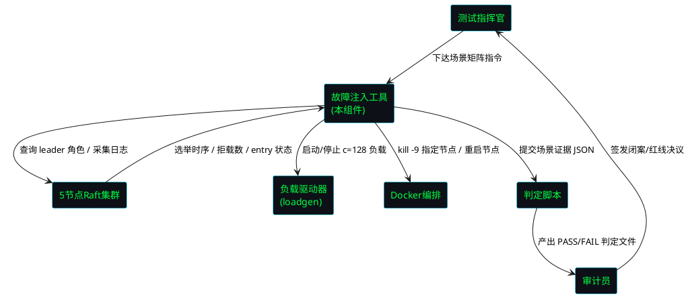
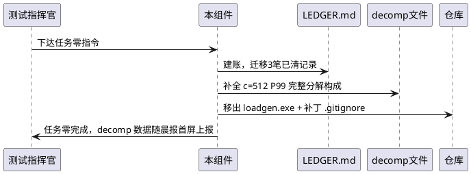
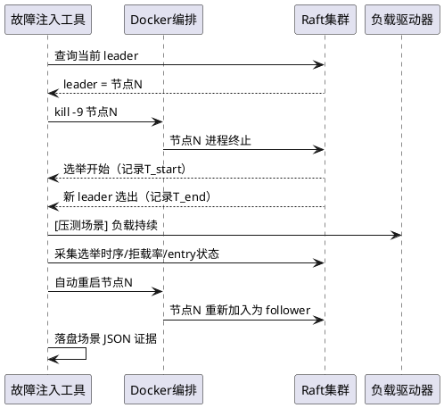
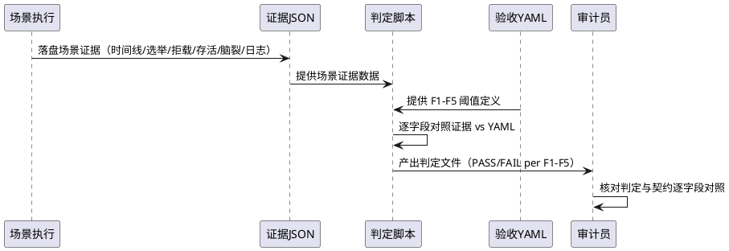

# batch21 故障注入战役 I — 需求规格（EARS 格式）

> 版本: v2.4-batch21-chaos1
> 来源指令: batch21 全闭环指令
> 前置批次: batch20（fsync 合并 437:1 已证实，性能章节收官）
> 验收契约: tests/contracts/batch21.yaml
> EARS 格式: Ubiquitous / Event-driven / State-driven / Optional / Unwanted

---

## 1. 组件定位

### 1.1 核心职责

本组件负责在 5 节点 Raft 集群中注入 leader 故障（kill -9）并自动恢复，采集选举时序、客户端拒载率、已确认写存活率、脑裂检测及结构化日志，对照验收契约 F1-F5 产出判定证据。

### 1.2 核心输入

1. **验收契约 YAML**：`tests/contracts/batch21.yaml`，定义 F1-F5 五条验收线及其阈值
2. **场景矩阵指令**：稳态杀 leader ×10 / 压测中杀 leader ×10（c=128 负载持续不断）/ leader+follower 连杀 ×3
3. **集群拓扑**：5 节点 Docker 集群配置（leader/follower 角色可动态识别）
4. **负载驱动信号**：c=128 压测负载（压测中杀 leader 场景需要）
5. **断点续跑状态**：RESUME.md 中记录的已完成场景编号（若中途崩溃重启）

### 1.3 核心输出

1. **场景证据 JSON 组**：每个场景独立 JSON，含时间线、选举耗时、拒载率、存活率、脑裂检测结果
2. **判定输出文件**：脚本读数据对照 YAML 产出的 PASS/FAIL 判定文件（助手只引用，不得自写）
3. **结构化日志**：注入+恢复全过程可回放的日志流
4. **性能章节补全数据**：`decomp_c512_raw.json` 完整分解构成
5. **LEDGER.md 挂账台账**：欠账记录与清偿状态
6. **报告三件套**：报告.md / decisions.md / RESUME.md

### 1.4 职责边界

- **不负责**：修改 fsync/quorum/选举超时语义（红线不可破坏）
- **不负责**：自行放宽验收 YAML 阈值（改 YAML 须晨批）
- **不负责**：将可观测性代码写入写路径热区
- **不负责**：提交证据目录内容（证据被 .gitignore 排除，提交时只 git add 代码文件）
- **不负责**：自行延期（时间盒 ≤ 6 小时，到点停手交数据）

---

## 2. 领域术语

**故障注入（Fault Injection）**
: 通过 kill -9 信号强制终止指定 Raft 节点进程，模拟 leader 崩溃场景的测试手段。

**选举完成时间（Election Completion Time）**
: 从 leader 进程被 kill 时刻起，到集群中新 leader 被选出并对外可服务时刻止的 wall-clock 时长。

**拒载率（Reject Rate）**
: 故障注入期间，客户端请求被集群拒绝（非正常响应）的请求数占该期间总请求数的比例。

**已确认写（Confirmed Write）**
: 已获得 quorum（多数派）节点确认的 Raft log entry，其存活性是数据安全的核心指标。

**脑裂（Split-Brain）**
: 集群中任一时刻存在多于 1 个 leader 的异常状态，违反 Raft 共识安全性。

**稳态杀 leader（Steady-State Kill）**
: 在无外部负载的稳定集群中 kill leader，观察纯选举恢复行为。

**压测中杀 leader（Under-Load Kill）**
: 在 c=128 负载持续不断的集群中 kill leader，观察负载下的选举恢复与拒载行为。

**连杀（Cascading Kill）**
: 先 kill leader，待新 leader 选出后立即 kill 一个 follower，观察连续故障下的集群韧性。

**挂账（Ledger Debt）**
: 在 LEDGER.md 中记录的、来自先前批次遗留的、需在指定批次清偿的待办事项。
: 备注：格式为 [欠账ID/来源批次/应清批次/状态]。

**量纲澄清（Dimensional Clarification）**
: 对 fsync 取证数据的测量窗口、窗口内总次数等量纲进行明确标注，使其与"个位数~几十次/窗口"预设标准可对齐。

**断点续跑（Checkpoint Resume）**
: 场景执行中途崩溃后，依据 RESUME.md 中记录的已完成场景编号，跳过已完成场景、从断点继续执行的协议。

**三等级处置（Three-Tier Disposition）**
: 对验收结果按 PASS / PARTIAL / FAIL 三等级分类处置的协议，每等级有明确的后续动作定义。

---

## 3. 角色与边界

### 3.1 核心角色

- **测试指挥官（Test Commander）**：下达故障注入指令，设定场景矩阵，审核判定结果，签发闭案决议。
- **审计员（Auditor）**：核对证据完整性，验证判定与 YAML 契约逐字段对照，签发红线合规结论。

### 3.2 外部系统

- **5 节点 Raft 集群**：故障注入目标，提供 leader/follower 角色查询、进程管理接口。
- **负载驱动器（loadgen）**：c=128 压测负载生成，压测中杀 leader 场景的负载源。
- **Docker 集群编排**：节点容器启停、健康检查、网络隔离管理。
- **判定脚本**：读场景证据 JSON + 验收 YAML，产出 PASS/FAIL 判定文件。

### 3.3 交互上下文

---

## 4. DFX 约束

### 4.1 性能

1. **时间盒**：故障注入工具实现 + 全场景执行 ≤ 6 小时（wall-clock），到点停手交数据。
2. **单场景执行**：单个场景（含注入 + 等待选举 + 采集 + 恢复）≤ 60 秒。
3. **证据落盘**：单场景 JSON 证据落盘延迟 ≤ 2 秒（场景结束后）。

### 4.2 可靠性

1. **断点续跑**：场景执行中途崩溃后重启，已完成的场景不重复执行，从断点继续。
2. **证据完整性**：每个场景的 JSON 证据必须包含完整时间线，时间戳单调递增，无缺口。
3. **集群可恢复**：所有场景执行完毕后，5 节点集群恢复到健康稳态（1 leader + 4 follower）。

### 4.3 安全性

1. **红线不可破坏**：fsync 语义、quorum 语义、选举超时语义在注入期间不可被修改或绕过。
2. **证据隔离**：证据目录被 .gitignore 排除，提交时只 git add 代码文件，证据不进版本库。
3. **判定不可篡改**：PASS/FAIL 判定由脚本读数据对照 YAML 产出，助手只引用判定文件，不得自写 PASS/FAIL。

### 4.4 可维护性

1. **结构化日志**：注入+恢复全过程日志为结构化格式（含时间戳、事件类型、节点 ID、角色），可回放重演。
2. **可观测性隔离**：可观测性代码不进写路径热区，对正常写路径零侵入。
3. **挂账可追溯**：LEDGER.md 中每笔挂账有唯一 ID、来源批次、应清批次、状态，可审计追溯。

### 4.5 兼容性

1. **验收 YAML 兼容**：batch21.yaml 格式与既有 batch 契约 YAML 格式一致，判定脚本可复用。
2. **集群配置兼容**：故障注入工具适配现有 5 节点 Docker 集群配置，无需修改集群本身。

---

## 5. 核心能力

## 5.1 任务零：前置清账与遗留项

### 5.1.1 业务规则

1. **LEDGER.md 建账**（Ubiquitous）
   - 描述：系统应维护 LEDGER.md 挂账台账，格式为 [欠账ID/来源批次/应清批次/状态]，迁移三笔已清记录并标注 batch20 已清偿作为初始台账。
   - 验收条件：LEDGER.md 存在 → 包含 ≥3 笔已清记录，每笔格式合规，batch20 相关记录状态为"已清偿"。

2. **fsync 取证量纲澄清**（Ubiquitous）
   - 描述：系统应明确标注 fsync 取证数据的量纲，包括压测窗口时长、窗口内 fsync 总次数，使其与"个位数~几十次/窗口"预设标准可对齐。
   - 验收条件：量纲标注完成 → 窗口时长、fsync 总次数、与预设标准的对齐结论三者齐全且数值可验证。

3. **decomp_c512_raw.json 补全**（Ubiquitous）
   - 描述：系统应补全 c=512 P99 完整延迟分解构成，包含 quorum_wait / fsync_wait / RPC / 排队 各项的 P50 / P99 及占比，为 KB 级完整数据。
   - 验收条件：decomp_c512_raw.json 存在 → 包含四构成项 × {P50, P99, P50占比, P99占比} 全字段，文件大小 ≥ 1KB，数据可直接决定性能章节是否正式闭案。

4. **decomp 数据上报**（Event-driven）
   - 描述：当 decomp_c512_raw.json 补全完成后，系统应随晨报首屏上报该数据。
   - 验收条件：decomp 补全完成 → 晨报首屏包含 decomp 数据摘要。

5. **loadgen.exe 移出仓库**（Ubiquitous）
   - 描述：系统应将 loadgen.exe 从仓库中移出，并补丁 .gitignore 以排除该二进制文件。
   - 验收条件：仓库中不存在 loadgen.exe → .gitignore 包含 loadgen.exe 排除规则 → git status 不显示 loadgen.exe 为未跟踪文件。

### 5.1.2 交互流程

### 5.1.3 异常场景

1. **decomp 数据缺失字段**
   - 触发条件：decomp_c512_raw.json 中某构成项缺少 P50 或 P99 字段
   - 系统行为：标记该字段为"缺失"，不阻止其余字段补全
   - 用户感知：报告.md 中标注缺失字段，提示性能章节暂不闭案

2. **loadgen.exe 被其他进程占用**
   - 触发条件：移出 loadgen.exe 时文件被占用无法删除
   - 系统行为：记录占用错误，先补丁 .gitignore，延迟重试移出
   - 用户感知：警告日志，.gitignore 已生效，后续手动移出

---

## 5.2 故障注入工具

### 5.2.1 业务规则

1. **kill -9 指定节点**（Event-driven）
   - 描述：当故障注入工具收到注入指令时，系统应通过 kill -9 信号强制终止指定节点的进程。
   - 验收条件：注入指令指定节点 N → 节点 N 进程在 ≤1s 内被终止 → 进程状态确认为已死。

2. **自动重启**（Event-driven）
   - 描述：当被 kill 的节点完成故障观察后，系统应自动重启该节点并等待其重新加入集群。
   - 验收条件：节点被 kill 后观察窗口结束 → 节点自动重启 → 节点重新加入集群成为 follower → 集群恢复 1 leader + 4 follower。

3. **稳态杀 leader 场景**（State-driven）
   - 描述：在无外部负载的稳态集群状态下，系统应执行 10 次杀 leader 场景，每次 kill 当前 leader 并记录选举时序。
   - 验收条件：稳态集群 → 执行 10 次杀 leader → 每次记录独立 JSON 证据含完整时间线。

4. **压测中杀 leader 场景**（State-driven）
   - 描述：在 c=128 负载持续不断的集群状态下，系统应执行 10 次杀 leader 场景，负载在注入期间不中断。
   - 验收条件：c=128 负载持续 → 执行 10 次杀 leader → 负载全程不中断 → 每次记录独立 JSON 证据含拒载率统计。

5. **连杀场景**（Event-driven）
   - 描述：当执行连杀场景时，系统应先 kill leader，待新 leader 选出后立即 kill 一个 follower，共执行 3 次。
   - 验收条件：连杀指令 → kill leader → 新 leader 选出 → kill follower → 记录独立 JSON 证据 → 共 3 次。

6. **场景矩阵完整性**（Ubiquitous）
   - 描述：系统应执行完整场景矩阵：稳态杀 leader ×10 + 压测中杀 leader ×10 + 连杀 ×3 = 共 23 个场景。
   - 验收条件：场景执行完毕 → 产出 23 个独立 JSON 证据文件。

7. **leader 角色动态识别**（Event-driven）
   - 描述：当需要 kill leader 时，系统应实时查询集群当前 leader 角色，而非使用预设的固定节点。
   - 验收条件：kill leader 指令 → 实时查询集群 leader → kill 实际 leader 节点（非预设节点）。

### 5.2.2 交互流程

### 5.2.3 异常场景

1. **leader 查询失败**
   - 触发条件：kill leader 前查询集群 leader 角色时集群无响应
   - 系统行为：重试 3 次，间隔 1s；仍失败则标记场景为 BLOCKED，跳过该场景
   - 用户感知：JSON 证据中 status=BLOCKED，reason="leader_query_failed"

2. **节点重启失败**
   - 触发条件：自动重启节点后节点未在 30s 内重新加入集群
   - 系统行为：重试重启 2 次；仍失败则标记场景为 BLOCKED，记录集群状态快照
   - 用户感知：JSON 证据中 status=BLOCKED，reason="restart_failed"，附集群状态快照

3. **场景执行超时**
   - 触发条件：单场景执行超过 60s 未完成
   - 系统行为：强制结束当前场景，标记为 TIMEOUT，继续下一场景
   - 用户感知：JSON 证据中 status=TIMEOUT，记录已采集的部分数据

---

## 5.3 验收契约 F1-F5

### 5.3.1 业务规则

1. **F1: 选举完成时间**（Event-driven）
   - 描述：当 leader 被 kill 后，系统应在 5 秒内完成选举（新 leader 选出并对外可服务），以 3 次测量取中位值为准。
   - EARS 类型：Event-driven — When [leader is killed], the [system] shall [complete election within 5s (median of 3 runs)]
   - 验收条件：kill leader → 选举完成时间 ≤ 5s（3 次取中位）→ 判定 F1=PASS
   - 反条件：选举完成时间 > 5s → 判定 F1=FAIL

2. **F2: 客户端拒载率**（State-driven）
   - 描述：在故障注入期间（leader 被 kill 到新 leader 选出），系统应将客户端拒载率控制在 ≤ 30%；在故障恢复后，系统应使拒载率 = 0。
   - EARS 类型：State-driven — While [fault injection is active], the [system] shall [reject rate ≤ 30%]; While [fault is recovered], the [system] shall [reject rate = 0]
   - 验收条件：注入期间 → 拒载率 ≤ 30% → 恢复后 → 拒载率 = 0 → 判定 F2=PASS
   - 反条件：注入期间拒载率 > 30% 或 恢复后拒载率 > 0 → 判定 F2=FAIL

3. **F3: 已确认写不丢失**（Event-driven）
   - 描述：当 leader 被 kill 时，系统应保证所有已获得 quorum 确认的 entry 100% 存活，通过抽样比对验证。
   - EARS 类型：Event-driven — When [leader is killed], the [system] shall [preserve 100% of quorum-confirmed entries (verified by sampling)]
   - 验收条件：kill leader → 对 quorum 确认过的 entry 抽样比对 → 存活率 100% → 判定 F3=PASS
   - 反条件：任一已确认 entry 丢失 → 判定 F3=FAIL

4. **F4: 无脑裂**（State-driven）
   - 描述：在故障注入全过程中，系统应保证任一时刻 leader 至多 1 个，5 节点集群无脑裂。
   - EARS 类型：State-driven — While [fault injection is in progress], the [system] shall [have at most 1 leader at any instant]
   - 验收条件：注入+恢复全过程 → 任一时刻 leader 数 ≤ 1 → 判定 F4=PASS
   - 反条件：任一时刻检测到 > 1 个 leader → 判定 F4=FAIL

5. **F5: 结构化日志完整可回放**（Ubiquitous）
   - 描述：系统应保证故障注入+恢复全过程的结构化日志完整，可按时间线回放重演。
   - EARS 类型：Ubiquitous — The [system] shall [produce complete structured logs for the entire injection+recovery process that are replayable]
   - 验收条件：注入+恢复结束 → 日志时间线完整无缺口 → 可按时间戳重演事件序列 → 判定 F5=PASS
   - 反条件：日志存在缺口或无法回放 → 判定 F5=FAIL

6. **判定来源约束**（Ubiquitous）
   - 描述：系统应确保 PASS/FAIL 判定由脚本读数据对照 YAML 产出，助手只引用判定文件，不得自写 PASS/FAIL。
   - 验收条件：判定文件存在 → 判定由脚本产出 → 助手回复中只引用判定文件内容 → 无助手自写判定

7. **验收 YAML 变更约束**（Unwanted）
   - 描述：如果需要修改验收 YAML 阈值，则系统应要求晨批审批，禁止自行修改。
   - EARS 类型：Unwanted — If [YAML threshold modification is needed], then the [system] shall [require morning batch approval]
   - 验收条件：YAML 阈值变更请求 → 必须经晨批审批 → 未经审批的变更 → 红线违反

### 5.3.2 交互流程

### 5.3.3 异常场景

1. **判定脚本执行失败**
   - 触发条件：判定脚本读取证据 JSON 或 YAML 时格式错误
   - 系统行为：记录错误日志，标记对应 F 项为 ERROR，不阻止其余项判定
   - 用户感知：判定文件中对应 F 项 status=ERROR，附错误详情

2. **证据数据不完整**
   - 触发条件：场景 JSON 证据缺少判定所需字段（如缺少选举时间戳）
   - 系统行为：判定脚本标记该字段为 MISSING，对应 F 项判定为 INSUFFICIENT_EVIDENCE
   - 用户感知：判定文件中标注缺失字段，提示需补采

3. **F3 抽样比对失败**
   - 触发条件：quorum 确认 entry 抽样比对发现数据不一致
   - 系统行为：记录不一致 entry 详情（index/term/值），判定 F3=FAIL
   - 用户感知：判定文件中 F3=FAIL，附不一致 entry 详情，触发红线

---

## 5.4 断点续跑协议

### 5.4.1 业务规则

1. **断点记录**（Event-driven）
   - 描述：当每个场景执行完成并落盘证据后，系统应将该场景编号写入 RESUME.md。
   - EARS 类型：Event-driven — When [a scenario completes and evidence is persisted], the [system] shall [write the scenario ID to RESUME.md]
   - 验收条件：场景 N 完成 → RESUME.md 包含场景 N 编号 → 场景 N 证据 JSON 已落盘

2. **断点恢复**（Event-driven）
   - 描述：当故障注入工具启动时检测到 RESUME.md 存在，系统应跳过已记录的场景，从断点继续执行。
   - EARS 类型：Event-driven — When [tool starts and RESUME.md exists], the [system] shall [skip recorded scenarios and resume from checkpoint]
   - 验收条件：工具启动 + RESUME.md 存在 → 跳过已记录场景 → 从下一未完成场景继续

3. **断点完整性**（State-driven）
   - 描述：在断点续跑状态下，系统应保证已跳过场景的证据 JSON 完整存在，不重复执行已成功场景。
   - EARS 类型：State-driven — While [resuming from checkpoint], the [system] shall [ensure existing evidence is intact and not re-execute completed scenarios]
   - 验收条件：续跑完成 → 已跳过场景证据 JSON 存在且完整 → 未重复执行

4. **全量重跑开关**（Optional）
   - 描述：在显式指定全量重跑标志的情况下，系统应忽略 RESUME.md，从头执行全部场景。
   - EARS 类型：Optional — Where [full-rerun flag is specified], the [system] shall [ignore RESUME.md and execute all scenarios from scratch]
   - 验收条件：启动时带 --full-rerun → 忽略 RESUME.md → 执行全部 23 个场景

### 5.4.2 异常场景

1. **RESUME.md 损坏**
   - 触发条件：RESUME.md 格式损坏，无法解析已完成场景编号
   - 系统行为：备份损坏文件为 RESUME.md.bak，提示用户确认后从场景 1 重新开始
   - 用户感知：警告日志，要求确认全量重跑

2. **证据 JSON 与 RESUME.md 不一致**
   - 触发条件：RESUME.md 记录场景 N 已完成，但场景 N 的 JSON 证据不存在
   - 系统行为：标记场景 N 为"需重跑"，从场景 N 继续执行
   - 用户感知：警告日志，场景 N 重新执行

---

## 5.5 三等级处置协议

### 5.5.1 业务规则

1. **PASS 等级处置**（Event-driven）
   - 描述：当验收契约 F1-F5 全部判定为 PASS 时，系统应执行闭案处置：签发闭案决议、打 tag v2.4-post-batch21、性能章节正式闭案。
   - EARS 类型：Event-driven — When [all F1-F5 verdicts are PASS], the [system] shall [close the case, tag v2.4-post-batch21, and formally close the performance chapter]
   - 验收条件：F1-F5 全 PASS → 签发闭案决议 → 打 tag → commit D3-batch21-chaos1

2. **PARTIAL 等级处置**（Event-driven）
   - 描述：当 F1-F5 中部分（非全部）判定为 PASS，且无 FAIL 时，系统应执行挂账处置：将未通过项挂账至下一批次，记录根因初判，不闭案。
   - EARS 类型：Event-driven — When [some but not all F1-F5 are PASS and none are FAIL], the [system] shall [ledger the failing items to the next batch, record initial root-cause, and not close the case]
   - 验收条件：部分 PASS + 无 FAIL → 未通过项挂账 → 记录根因初判 → 不闭案

3. **FAIL 等级处置**（Event-driven）
   - 描述：当 F1-F5 中任一判定为 FAIL 时，系统应执行红线处置：触发红线告警，记录失败详情，不得自行修复后重判，须晨批审议。
   - EARS 类型：Event-driven — When [any F1-F5 verdict is FAIL], the [system] shall [trigger red-line alert, record failure details, prohibit self-repair-and-rejudge, and require morning batch review]
   - 验收条件：任一 F 项 FAIL → 红线告警 → 记录失败详情 → 须晨批审议

4. **挂账到期红线**（Unwanted）
   - 描述：如果挂账到期未清，则系统应自动判定为红线违反。
   - EARS 类型：Unwanted — If [a ledger debt expires without clearance], then the [system] shall [automatically flag a red-line violation]
   - 验收条件：挂账到期 + 未清 → 自动红线违反

5. **时间盒到期处置**（Event-driven）
   - 描述：当时间盒（6 小时）到期时，系统应停手交数据，不得自行延期，将已完成场景的判定结果和未完成场景清单一并上报。
   - EARS 类型：Event-driven — When [the 6-hour timebox expires], the [system] shall [stop and hand over data, prohibit self-extension, and report completed verdicts plus pending scenario list]
   - 验收条件：时间盒到期 → 停手 → 交数据 → 上报已完成判定 + 未完成清单 → 不自行延期

### 5.5.2 异常场景

1. **闭案后发现问题**
   - 触发条件：闭案决议签发后，审计复核发现某 F 项实际未通过
   - 系统行为：撤销闭案决议，回退 tag，重新挂账，触发红线告警
   - 用户感知：闭案撤销公告，红线告警，须晨批审议

2. **晨批审议未通过**
   - 触发条件：FAIL 项经晨批审议后认定需返工
   - 系统行为：记录审议结论，分配返工批次，挂账至返工批次
   - 用户感知：审议结论记录，返工批次分配

---

## 6. 数据约束

### 6.1 验收契约 YAML（batch21.yaml）

1. **契约文件路径**：tests/contracts/batch21.yaml
2. **F1 阈值**：election_completion_time_max = 5s（单位：秒，3 次取中位）
3. **F2 阈值**：reject_rate_during_injection_max = 30（单位：百分比），reject_rate_after_recovery = 0
4. **F3 阈值**：confirmed_write_survival_rate = 100（单位：百分比，抽样比对）
5. **F4 阈值**：max_leader_count = 1（任一时刻）
6. **F5 要求**：structured_log_complete = true，replayable = true

### 6.2 场景证据 JSON

1. **scenario_id**：场景唯一标识（格式：steady_kill_leader_01 ~ 10, under_load_kill_leader_01 ~ 10, cascading_kill_01 ~ 03）
2. **scenario_type**：场景类型（steady_kill_leader / under_load_kill_leader / cascading_kill）
3. **timeline**：时间线数组，每个元素含 {timestamp, event_type, node_id, role, detail}
4. **election_metrics**：选举指标 {kill_timestamp, election_start, election_complete, completion_duration}
5. **reject_metrics**：拒载指标 {total_requests, rejected_requests, reject_rate, recovery_timestamp, post_recovery_reject_rate}
6. **survival_metrics**：存活指标 {sampled_entries_count, survived_entries_count, survival_rate, mismatched_entries[]}
7. **split_brain_metrics**：脑裂指标 {max_concurrent_leaders, split_brain_detected, detection_timestamps[]}
8. **log_metrics**：日志指标 {log_entries_count, timeline_complete, replayable}
9. **status**：场景状态（PASS / FAIL / BLOCKED / TIMEOUT）
10. **evidence_path**：证据文件路径

### 6.3 LEDGER.md 挂账记录

1. **debt_id**：欠账唯一 ID（格式：DEBT-XXXX）
2. **source_batch**：来源批次（如 batch20）
3. **target_batch**：应清批次（如 batch21）
4. **status**：状态（待清 / 已清偿 / 到期未清）
5. **description**：欠账描述
6. **cleared_at**：清偿时间戳（已清偿时填写）

### 6.4 decomp_c512_raw.json

1. **quorum_wait**：{p50, p99, p50_ratio, p99_ratio}
2. **fsync_wait**：{p50, p99, p50_ratio, p99_ratio}
3. **rpc**：{p50, p99, p50_ratio, p99_ratio}
4. **queue**：{p50, p99, p50_ratio, p99_ratio}
5. **total**：{p50, p99}（服务端总计）
6. **metadata**：{sample_count, shed_rate, window_duration}

### 6.5 RESUME.md

1. **completed_scenarios**：已完成场景编号列表
2. **last_updated**：最后更新时间戳
3. **total_scenarios**：总场景数（23）
4. **session_id**：当前执行会话 ID

---

## 7. 需求追溯矩阵

| 需求 ID | EARS 类型 | 描述 | 对应验收 |
|---------|-----------|------|----------|
| REQ-T0-01 | Ubiquitous | LEDGER.md 建账 | 任务零 |
| REQ-T0-02 | Ubiquitous | fsync 量纲澄清 | 任务零 |
| REQ-T0-03 | Ubiquitous | decomp_c512_raw.json 补全 | 任务零 |
| REQ-T0-04 | Event-driven | decomp 数据随晨报上报 | 任务零 |
| REQ-T0-05 | Ubiquitous | loadgen.exe 移出仓库 | 任务零 |
| REQ-FI-01 | Event-driven | kill -9 指定节点 | 故障注入工具 |
| REQ-FI-02 | Event-driven | 自动重启 | 故障注入工具 |
| REQ-FI-03 | State-driven | 稳态杀 leader ×10 | 故障注入工具 |
| REQ-FI-04 | State-driven | 压测中杀 leader ×10 | 故障注入工具 |
| REQ-FI-05 | Event-driven | 连杀 ×3 | 故障注入工具 |
| REQ-FI-06 | Ubiquitous | 场景矩阵完整性（23 场景） | 故障注入工具 |
| REQ-FI-07 | Event-driven | leader 角色动态识别 | 故障注入工具 |
| REQ-F1 | Event-driven | 选举完成时间 ≤ 5s | F1 |
| REQ-F2 | State-driven | 拒载率 ≤ 30%，恢复后 = 0 | F2 |
| REQ-F3 | Event-driven | 已确认写 100% 存活 | F3 |
| REQ-F4 | State-driven | 无脑裂（leader ≤ 1） | F4 |
| REQ-F5 | Ubiquitous | 结构化日志完整可回放 | F5 |
| REQ-JUDGE | Ubiquitous | 判定由脚本产出 | 判定约束 |
| REQ-YAML | Unwanted | YAML 变更须晨批 | 红线 |
| REQ-RESUME-01 | Event-driven | 断点记录 | 断点续跑 |
| REQ-RESUME-02 | Event-driven | 断点恢复 | 断点续跑 |
| REQ-RESUME-03 | State-driven | 断点完整性 | 断点续跑 |
| REQ-RESUME-04 | Optional | 全量重跑开关 | 断点续跑 |
| REQ-DISP-PASS | Event-driven | PASS 等级处置 | 三等级处置 |
| REQ-DISP-PARTIAL | Event-driven | PARTIAL 等级处置 | 三等级处置 |
| REQ-DISP-FAIL | Event-driven | FAIL 等级处置 | 三等级处置 |
| REQ-DISP-EXPIRE | Unwanted | 挂账到期红线 | 三等级处置 |
| REQ-DISP-TIMEBOX | Event-driven | 时间盒到期处置 | 三等级处置 |

---

## 8. 红线清单

1. **RL-01**：fsync 语义不可破坏 — 注入期间 fsync 行为与正常一致
2. **RL-02**：quorum 语义不可破坏 — 注入期间 quorum 确认逻辑与正常一致
3. **RL-03**：选举超时语义不可破坏 — 注入期间选举超时配置不可修改
4. **RL-04**：PASS 判定逐字段对照验收 YAML — 判定脚本须逐字段比对
5. **RL-05**：改 YAML 须晨批 — 验收阈值变更须晨批审批
6. **RL-06**：挂账到期未清 = 自动红线违反
7. **RL-07**：可观测性代码不进写路径热区
8. **RL-08**：证据目录被 .gitignore 排除 — 提交时只 git add 代码文件
9. **RL-09**：助手不得自写 PASS/FAIL — 判定只引用脚本产出
10. **RL-10**：时间盒 ≤ 6 小时 — 到点停手交数据，不得自行延期