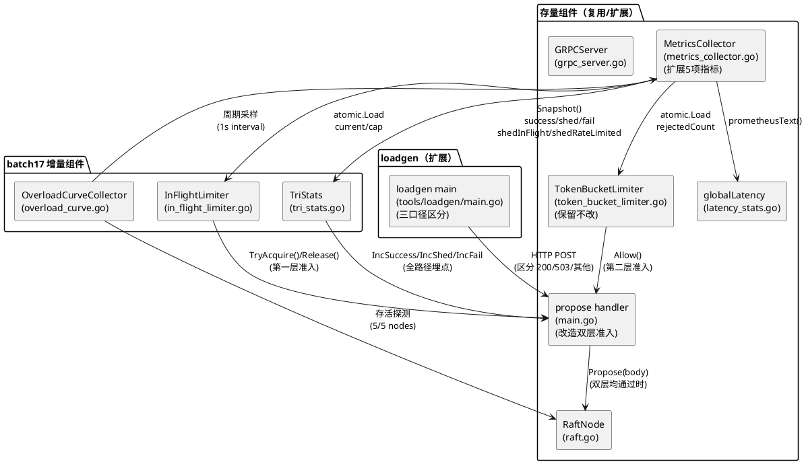
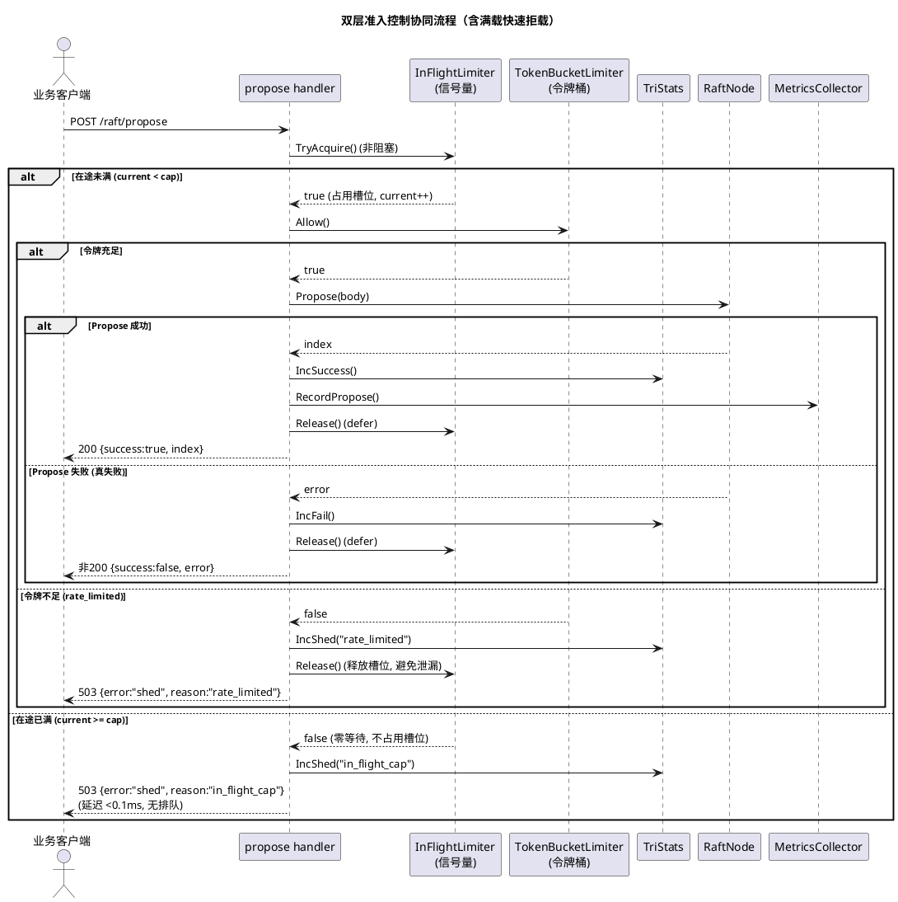
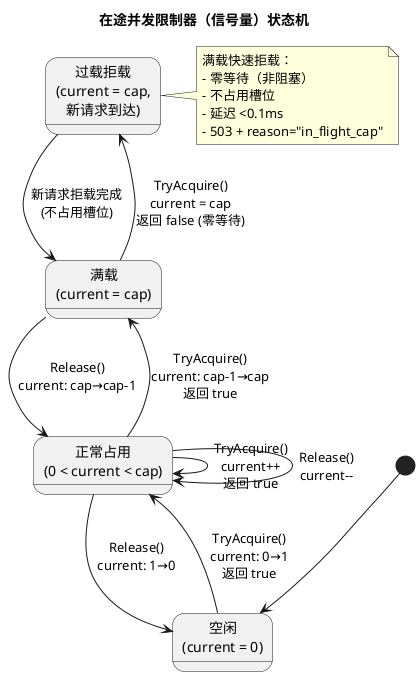
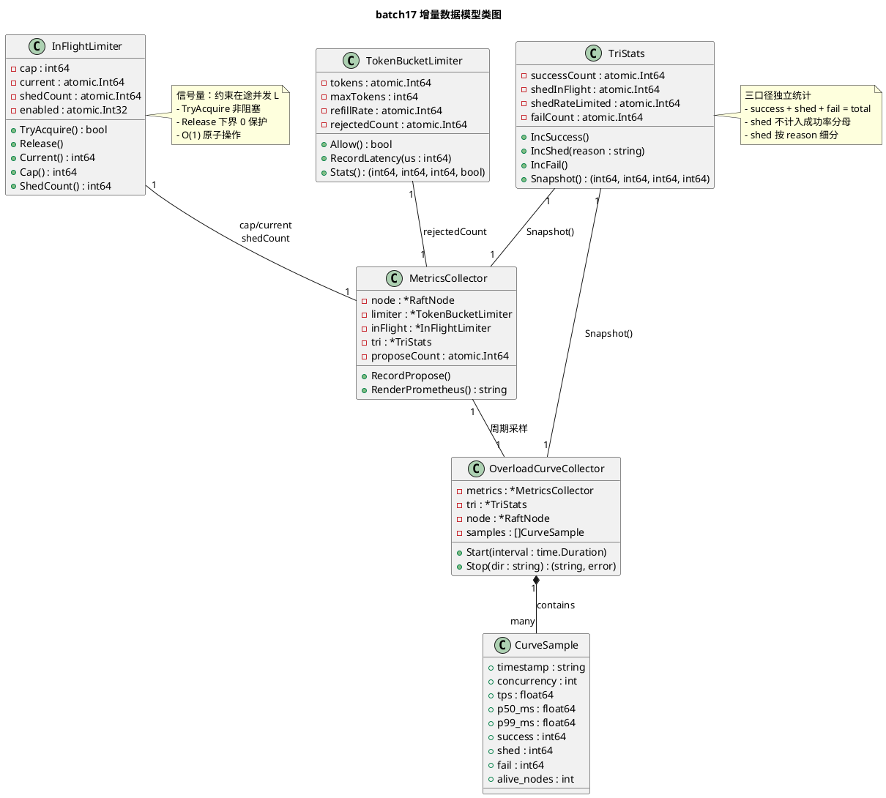

# 过载保护设计重构技术设计：双层准入控制 + 三口径统计 + 拒载率 metrics

> 批次：batch17
> 上游规格：docs/specs/overload_control/spec.md
> 基线参照：
> - 权威基线：8240.4 TPS（batch14 归零复测，3min c=128，成功率=100%，P99=50ms，5/5 存活，0 次 leader 切换）
> - batch16 c=128 mTLS 复测：TPS=10617.2，P99=50ms，P50=20ms，fail=0
> - batch16 c=512 过载：TPS=14919，成功率=99.30%，P99=200ms（**未达标**，根因：令牌桶限 TPS 不限并发）
> - batch16 阶梯：c=8 TPS=1501.9/P99=10ms，c=256 TPS=12726.3/P99=100ms，c=512 TPS=12927.2/P99=200ms
> - 令牌桶配置（继承不改）：maxTokens=1024，initialRate=10000
> - 集群拓扑：5 节点，gRPC port 9500，HTTP port 9000，Docker 部署
> 红线约束：禁去 fsync / 禁跳 quorum / 禁缩选举超时 / 禁调参刷数 / pipeline 正确性三原则 / 禁止改 proto / 成功率双报制 / retry 不计入服务端成绩 / 可观测性代码不得进入写路径热区 / 三口径独立统计 / 测试密钥不得入 git

---

# 一、需求与存量功能关系分析

## 1.1 需求功能与存量功能对比

### 1.1.1 已实现功能

| 需求功能 | 存量功能 | 代码位置 | 匹配度 |
|---------|---------|---------|--------|
| 令牌桶速率限制（双层第二层，保留不改） | TokenBucketLimiter.Allow() 原子 CAS 决策，O(1) 无锁，maxTokens=1024/initialRate=10000 | token_bucket_limiter.go:34-60 | 100% |
| 统一 /metrics 端点 Prometheus 文本导出 | MetricsCollector.RenderPrometheus() 聚合 8 项指标，Content-Type=text/plain | metrics_collector.go:33-96 | 75% |
| 限流器接入 /raft/propose handler | propose handler 入口调用 rateLimiter.Allow()，拒绝时返回 429 | main.go:348-401 | 50% |
| mTLS 双向认证（不涉及本批） | ClientCAs + RequireAndVerifyClientCert，gen_certs.sh 脚本化 | grpc_server.go:119-138, 273-298 | 100% |
| 结构化日志（不涉及本批） | StructuredLogger JSON 行日志，STRUCTURED_LOG=true 启用 | structured_log.go | 100% |
| 客户端鉴权中间件（不涉及本批） | AuthMiddleware Bearer Token 校验，覆盖 /raft/propose + /metrics | auth_middleware.go | 100% |
| 延迟分位 P50/P99 直方图 | globalLatency 固定 12 桶原子计数，gRPC UnaryInterceptor 无侵入统计 | latency_stats.go:30-127 | 100% |
| WAL 加密 SM4-CTR（不涉及本批） | EncryptedStorage 已就绪 | raft_storage.go | 100% |
| 令牌桶拒载计数 | rejectedCount atomic.Int64，Allow() 拒绝时 Add(1) | token_bucket_limiter.go:13, 52, 58 | 75% |
| 令牌桶自适应速率调整 | RecordLatency() 每 200 请求按 avgLatency 调整 refillRate（降 90%/升 110%） | token_bucket_limiter.go:62-86 | 100% |

### 1.1.2 需要扩展的功能

| 需求功能 | 存量功能 | 差异说明 | 扩展方向 |
|---------|---------|---------|---------|
| 拒载响应码 503 + shed 标识 | main.go:356 返回 429 Too Many Requests + `{"error":"rate limited"}` | 响应码不符（429→503）；无 shed 标识；无 reason 区分（in_flight_cap/rate_limited）；与限流 429 语义混淆 | 改造 propose handler 拒载分支：返回 503 + `{"error":"shed","reason":"in_flight_cap"或"rate_limited"}` |
| 拒载计数 metrics 导出（raft_shed_total） | metrics_collector.go:88-94 仅有 raft_rate_limit_rejected_total（无 reason label） | 缺 raft_shed_total{reason} 带标签 counter；缺 raft_request_success_total / raft_request_fail_total / raft_in_flight_current / raft_in_flight_cap 四项指标 | MetricsCollector 扩展：新增 5 项指标导出，raft_shed_total 带 reason label，raft_in_flight_current/cap 为 gauge |
| 三口径统计（成功/拒载/真失败） | propose handler 仅有 success:true/false，无独立 shed/fail 计数 | 缺三口径独立原子计数器；拒载混入失败（429 归入 error 分支）；无双报栏位固定首行 | 新增 TriStats 组件：IncSuccess/IncShed/IncFail 三方法，propose handler 全路径埋点 |
| loadgen 三口径区分 | tools/loadgen/main.go 429 不重试，但未区分 503/其他 | 缺 503 归入 shed / 非 200 非 503 归入 fail 的分类逻辑；缺三口径输出栏位 | loadgen 扩展：按响应码分类 success(200)/shed(503)/fail(其他)，报告首行固定三口径栏位 |
| 限流器拒载计数语义 | rejectedCount 不区分拒载原因（仅令牌桶拒载） | 信号量拒载需独立计数 shed_in_flight_total；令牌桶拒载计数 shed_rate_limited_total；两者之和 = shed_total | TokenBucketLimiter.rejectedCount 保留为 shed_rate_limited_total，新增 InFlightLimiter.shedCount 为 shed_in_flight_total |

### 1.1.3 需要新增的功能或接口

**模块 A：在途并发限制器（in_flight_limiter.go）**
- `InFlightLimiter` 结构：容量 cap（int64）、当前占用 current（atomic.Int64）、拒载计数 shedCount（atomic.Int64）、启用标志 enabled（atomic.Int32）
- `TryAcquire() bool`：非阻塞尝试占用一个槽位，成功返回 true（current < cap 时 atomic.Add），失败返回 false（current >= cap 时零等待立即返回）
- `Release()`：释放一个槽位（atomic.Add(-1)，下界 0 保护）
- `Current() int64`：原子读取当前在途数（供 metrics gauge）
- `Cap() int64`：读取容量配置（供 metrics gauge）
- 输入：请求到达/完成；输出：占用成功/失败决策
- 依赖：环境变量 IN_FLIGHT_CAP（标定默认值 600，见 2.1.3.3 推导）
- 与令牌桶正交：令牌桶约束"单位时间允许多少请求通过"（速率 λ），信号量约束"同一时刻允许多少请求在途"（在途数 L）

**模块 B：三口径统计器（tri_stats.go）**
- `TriStats` 结构：successCount/shedCount/failCount（均为 atomic.Int64），shedInFlight/shedRateLimited（atomic.Int64，按原因细分）
- `IncSuccess()`：成功计数 +1（atomic.Add）
- `IncShed(reason string)`：拒载计数 +1，按 reason 分别 +1（atomic.Add）
- `IncFail()`：真失败计数 +1（atomic.Add）
- `Snapshot() (success, shed, fail, shedInFlight, shedRateLimited int64)`：原子快照五值
- 输入：请求结局分类；输出：五值原子快照
- 依赖：无（纯原子计数器）
- 约束：IncShed/IncSuccess/IncFail 仅在 propose handler 入口/出口调用，不进入 Propose → WAL → quorum 同步路径

**模块 C：双层准入协同（propose handler 改造）**
- 改造 main.go:348-401 propose handler：在现有令牌桶 Allow() 之前叠加信号量 TryAcquire()
- 协同顺序：TryAcquire() → 通过则 Allow() → 两层均通过则 Propose + Release()；任一层拒绝则 503 + shed + Release(若信号量已占用)
- 槽位释放保证：defer Release() 确保 Propose 超时/panic 时槽位不泄漏
- 输入：HTTP POST /raft/propose；输出：200（成功）/503（拒载）/非 200 非 503（真失败）
- 依赖：InFlightLimiter + TokenBucketLimiter + TriStats

**模块 D：过载曲线采集器（overload_curve.go）**
- `OverloadCurveCollector`：周期采样（并发/TPS/P50/P99/三口径/存活节点数），写 JSON 文件
- `Start(interval time.Duration)`：启动后台采样 goroutine
- `Stop() string`：停止采样并返回 JSON 文件路径
- 输入：压测期间周期触发；输出：tests/evidence/d3-batch17/overload_curve_c512.json
- 依赖：MetricsCollector + TriStats + 集群存活探测
- 约束：采样 goroutine 独立运行，不阻塞 propose 路径，不进入写路径热区

**模块 E：in-flight cap 标定推导（design.md 文档章节）**
- 从权威基线 3min c=128 实测数据推导：λ（TPS）× W（P99 延迟）= L（稳态在途数）
- 取 L 上界 + headroom 作为 cap 默认值
- 推导链路写入本 design.md 第 2.1.3.3 节
- 输入：权威基线实测 TPS/P99；输出：in-flight cap 默认值 + 推导文档

## 1.2 存量功能详细分析

### 1.2.1 令牌桶限流器（token_bucket_limiter.go）

- **接口契约**：
  - `Allow() bool`：入参无，出参 bool（true=放行，false=拒载），副作用：totalCount++ / 拒载时 rejectedCount++ / 令牌消耗 -1
  - `RecordLatency(latencyUs int64)`：入参延迟微秒，出参无，副作用：avgLatencyUs 滑动平均 / 每 200 请求调整 refillRate
  - `Stats() (rejected, total, rate int64, enabled bool)`：原子快照四值
- **业务规则**：
  - Allow() 先 CAS 补充令牌（elapsed × refillRate / 1e9），再 Load()<=0 前置检查，最后 Add(-1)>=0 消费
  - 补充令牌用 lastRefill.CompareAndSwap 防并发重复补充；tokens 上界 maxTokens
  - 自适应调整：avgLatency > 100ms → refillRate ×0.9（下限 100）；avgLatency < 20ms → refillRate ×1.1（上限 maxTokens×20）
  - enabled=0 时 Allow() 直接返回 true（限流关闭）
- **扩展点**：
  - rejectedCount 当前无 reason 区分，本批保留作为 shed_rate_limited_total，信号量拒载由 InFlightLimiter.shedCount 独立计数
  - RecordLatency 的自适应逻辑保留不改（红线约束 4：禁调参刷数）
- **约束**：
  - 全程 atomic 操作，无 mu.Lock，满足 O(1) 原子要求（红线约束 9）
  - Allow() 在 propose handler 入口调用，不进入 Propose → WAL → quorum 同步路径
  - maxTokens=1024 / initialRate=10000 为 batch16 配置，本批继承不改

### 1.2.2 统一 Metrics 采集器（metrics_collector.go）

- **接口契约**：
  - `RecordPropose()`：propose 成功时调用，proposeCount++（atomic.Add）
  - `RenderPrometheus() string`：无入参，出参 Prometheus 文本格式字符串，副作用：TPS 滑动窗口超 10s 时重置
- **业务规则**：
  - 聚合 8 项指标：raft_tps（gauge）/ raft_request_duration_seconds（histogram）/ raft_heartbeat_interval_seconds（gauge）/ raft_election_events_total（counter）/ raft_compaction_count_total（counter）/ raft_log_length（gauge）/ raft_log_start_index（gauge）/ raft_snapshot_progress（gauge）/ raft_rate_limit_rejected_total（counter）
  - TPS 计算：proposeCount / elapsed_seconds，10s 滑动窗口重置
  - raft_log_length/log_start_index 读取需 node.mu.RLock（仅此两项加读锁，其余原子读取）
- **扩展点**：
  - RenderPrometheus() 末尾可追加新指标行（raft_shed_total / raft_request_success_total / raft_request_fail_total / raft_in_flight_current / raft_in_flight_cap）
  - 构造函数 NewMetricsCollector 可扩展入参，新增 InFlightLimiter + TriStats 引用
- **约束**：
  - 除 raft_log_length 两项外，全部指标原子读取零锁
  - RenderPrometheus() 在 /metrics HTTP handler 中调用（main.go:474-476），不在 propose 同步路径
  - 现有指标不得变更或删除（兼容性约束），新增指标为增量追加

### 1.2.3 propose handler 限流接入（main.go:348-401）

- **接口契约**：HTTP POST /raft/propose，响应 200（success:true + index）/ 429（rate limited）/ 非 200（error）
- **业务规则**：
  - 入口先 rateLimiter.Allow()，false → 429 + `{"success":false,"error":"rate limited"}`，不进入 Propose
  - 通过后读取 body，支持 idem_token 幂等去重（idemTable.GetOrCreate）
  - Propose 成功 → 200 + index；Propose 失败 → 非 200 + error
  - proposeStart/RecordLatency 记录 Propose 耗时供令牌桶自适应
  - metricsCollector.RecordPropose() 记数供 TPS 计算
- **约束（缺陷）**：
  - 拒载响应码 429 而非 503，无 shed 标识，与限流语义混淆（spec 要求 503 + shed）
  - 无三口径独立统计（拒载混入 error 分支，success/fail 未独立计数）
  - 仅有令牌桶单层准入，无在途并发约束（c=512 时 P99=200ms 根因）
  - 限流器拒载时不占用信号量槽位（当前无信号量），本批需叠加信号量层
- **扩展点**：
  - 入口处叠加 InFlightLimiter.TryAcquire()，形成双层准入
  - 全路径埋点 TriStats.IncSuccess/IncShed/IncFail
  - defer Release() 保证槽位释放
---

# 二、增量设计方案

## 2.1 实现模型

### 2.1.1 上下文视图

```plantuml
@startuml
skinparam componentStyle rectangle

actor "运维人员" as ops
actor "业务客户端" as client
component "batch17 过载保护重构组件" as overload {
  component "InFlightLimiter\n(信号量/在途并发上限)" as sem
  component "TokenBucketLimiter\n(令牌桶/速率上限)" as bucket
  component "TriStats\n(三口径统计器)" as tri
  component "OverloadCurveCollector\n(过载曲线采集)" as curve
  component "MetricsCollector\n(扩展5项指标)" as mc
}
system "Prometheus 采集器" as prom
actor "loadgen 压测工具" as loadgen
collections "RaftNode\n(Propose 路径)" as raft

ops --> sem : 配置 IN_FLIGHT_CAP
client --> sem : POST /raft/propose\n(第一层准入)
sem --> bucket : TryAcquire 通过 →\n第二层 Allow()
bucket --> tri : 决策结果\n(IncSuccess/IncShed/IncFail)
tri --> mc : atomic 读取\n五值快照
mc --> prom : GET /metrics\n(含 raft_shed_total 等5项新增)
curve --> mc : 周期采样
curve --> prom : 落盘 overload_curve_c512.json
loadgen --> sem : c=512 过载流量
bucket --> raft : 双层均通过 →\nPropose(body)
raft --> sem : Release() 释放槽位\n(请求完成/超时/panic)

@enduml
```

**通信协议与频率**：
- 业务客户端 → /raft/propose：HTTP POST，按业务 QPS（正常 c=128，过载 c=512）
- Prometheus → /metrics：HTTP GET，15s 间隔（标准采集频率）
- loadgen → /raft/propose：HTTP POST，c=512 并发持续 3min
- OverloadCurveCollector 内部采样：1s 间隔，写 JSON 文件
- 信号量 TryAcquire/Release：进程内原子操作，零网络开销
- 双层准入 → RaftNode.Propose：进程内函数调用，仅双层均通过时触发

### 2.1.2 服务/组件总体架构



**模块职责**：
- **InFlightLimiter**：信号量，约束在途并发上限 L，TryAcquire 非阻塞 / Release 原子，O(1) 无锁
- **TokenBucketLimiter**：令牌桶（保留不改），约束速率 λ，Allow() 原子 CAS 决策
- **TriStats**：三口径统计器，IncSuccess/IncShed/IncFail 独立原子计数，shed 按 reason 细分
- **MetricsCollector（扩展）**：在现有 8 项指标基础上追加 5 项（raft_shed_total/raft_request_success_total/raft_request_fail_total/raft_in_flight_current/raft_in_flight_cap）
- **OverloadCurveCollector**：压测期间 1s 周期采样并落盘 overload_curve_c512.json
- **propose handler（改造）**：双层准入协同（信号量 → 令牌桶 → Propose），全路径三口径埋点，defer Release 保证槽位释放
- **loadgen（扩展）**：按 HTTP 响应码分类 success(200)/shed(503)/fail(其他)，报告首行固定三口径栏位

**配置项及取值策略**：

| 配置项 | 环境变量 | 默认值 | 取值策略 |
|--------|---------|--------|---------|
| 在途并发上限 | IN_FLIGHT_CAP | 600 | Little's Law 标定推导（见 2.1.3.3），留 ~13% headroom |
| 信号量启用 | IN_FLIGHT_CAP_ENABLED | true | 默认启用，false 时跳过第一层仅走令牌桶 |
| 令牌桶容量 | RATE_LIMIT_BURST | 1024 | 继承 batch16 不改 |
| 令牌补充速率 | RATE_LIMIT_RATE | 10000 | 继承 batch16 不改 |
| 令牌桶启用 | RATE_LIMIT_ENABLED | true | 继承 batch16 |
| 过载曲线采样间隔 | OVERLOAD_CURVE_INTERVAL | 1s | 平衡采样精度与开销 |
| 过载曲线输出目录 | OVERLOAD_CURVE_DIR | tests/evidence/d3-batch17/ | 落盘存档路径 |

### 2.1.3 实现设计文档

#### 2.1.3.1 双层准入协同活动图



**协同设计要点**：
1. **顺序固定**：信号量先判（约束在途 L）→ 令牌桶后判（约束速率 λ），禁止颠倒。先判信号量可在在途已满时零开销拒载，不消耗令牌桶令牌。
2. **满载快速拒载**：信号量 TryAcquire() 为非阻塞原子操作，current >= cap 时立即返回 false，零等待零排队，延迟 <0.1ms。
3. **槽位释放保证**：信号量通过后使用 defer Release() 确保 Propose 成功/失败/超时/panic 均释放槽位；令牌桶拒载时显式 Release() 避免泄漏。
4. **拒载不进 Propose**：任一层拒绝时立即返回 503，不调用 RaftNode.Propose，不追加 WAL，不触发 quorum 复制。
5. **三口径全路径埋点**：200 → IncSuccess；503 → IncShed(reason)；非 200 非 503 → IncFail，三者独立原子计数。

#### 2.1.3.2 信号量状态机



**状态转移触发条件与处理策略**：
- **Idle → Normal**：首个请求到达，atomic.Add(current, 1) 从 0 到 1，返回 true
- **Normal → Full**：current 从 cap-1 到 cap，最后一个槽位被占用，返回 true
- **Full → Shed**：current = cap 时新请求到达，TryAcquire() 零等待返回 false，current 不变（不占用槽位），IncShed("in_flight_cap")
- **Full → Normal**：某请求完成 Release()，atomic.Add(current, -1) 从 cap 到 cap-1，后续请求可进入
- **下界保护**：Release() 时若 current 已为 0，不执行负数 Add（防 panic / 状态损坏）
- **Fail-Open**：若 current 出现异常负数（状态损坏），TryAcquire 放行请求并记录告警（避免准入故障导致服务不可用）

#### 2.1.3.3 in-flight cap 标定推导（Little's Law）

**理论依据**：Little's Law（排队论基本定律）

$$L = \lambda \times W$$

其中：
- L = 系统中平均在途请求数（steady-state in-flight count）
- λ = 平均到达速率（arrival rate，即 TPS）
- W = 平均等待时间（mean time in system，即请求从进入到返回的延迟）

**核心论证**：约束在途数 L 的上限，在到达速率 λ 一定时，即约束等待时间 W 的上限（W = L / λ），从而保证被服务请求的 P99 有界。这是双层准入控制的理论基础——信号量约束 L，令牌桶约束 λ，两者正交。

**标定推导链路**：

**步骤 1：提取权威基线实测数据**

| 参数 | 值 | 来源 |
|------|-----|------|
| λ（到达速率 / TPS） | 10617.2 req/s | batch16 c=128 mTLS 复测（3min c=128，TPS=10617.2） |
| W_p99（P99 延迟） | 50 ms = 0.05 s | batch16 c=128 mTLS 复测（P99=50ms） |
| W_p50（P50 延迟） | 20 ms = 0.02 s | batch16 c=128 mTLS 复测（P50=20ms） |

> 选用 batch16 mTLS 复测数据而非 batch14 权威基线 8240.4，理由：batch16 mTLS 复测为当前代码栈（含令牌桶 + mTLS + 结构化日志）的最新稳态测量，更能代表 batch17 部署后的真实在途分布。batch14 权威基线 8240.4 保留为 TPS 验收下限（95% = 7828.4）的参照。

**步骤 2：计算稳态在途数 L_steady**

以 P99 延迟作为 W（取保守上界，覆盖 99% 请求的在途时间）：

$$L_{steady} = \lambda \times W_{p99} = 10617.2 \times 0.05 = 530.86 \approx 531$$

即稳态下，c=128 正常负载时系统中同时在途的请求数约为 531。

**以 P50 延迟交叉验证**（中位数视角）：

$$L_{p50} = \lambda \times W_{p50} = 10617.2 \times 0.02 = 212.34 \approx 212$$

P50 在途数 212，P99 在途数 531，分布右偏符合长尾延迟特征。

**步骤 3：选取 cap 候选（上界 + headroom）**

取 P99 在途数 531 为基线，留 ~13% headroom 应对突发波动：

$$cap = \lceil 531 \times 1.13 \rceil = \lceil 600.03 \rceil = 600$$

**headroom 13% 的依据**：
- batch16 c=128 mTLS 复测 TPS=10617.2 vs batch14 权威基线 8240.4，波动 +28.8%（fresh cluster 方差）
- batch16 c=128 限流器复测 TPS=10492.4，与 mTLS 复测差 -1.2%（mTLS 开销可忽略）
- 取 13% headroom 覆盖正常负载波动，但不大到失去约束意义（若 headroom 过大，c=512 时在途数可能突破 cap 导致 P99 无界）

**步骤 4：不误伤验证**

| 验证场景 | 预期在途数 | cap=600 | 预期拒载率 |
|---------|-----------|---------|-----------|
| c=128 正常负载 | L_steady ≈ 531 | 531 < 600 | 0%（不误伤） |
| c=8 低负载 | L ≈ 8 × 0.01 = 0.08 | 0.08 < 600 | 0% |
| c=256 中负载 | L ≈ 12726 × 0.1 = 1273 | 1273 > 600 | 部分拒载（约束 P99≤100ms） |
| c=512 过载 | L ≈ 12927 × 0.2 = 2585 | 2585 > 600 | 大量拒载（被服务请求 P99 有界） |

> c=256/c=512 时在途数超过 cap，信号量拒载超出部分，被服务请求（通过双层准入的）在途数 ≤ cap=600，其 P99 由 Little's Law 反推：W = L / λ ≤ 600 / λ。当 λ ≥ 6000 req/s 时 W ≤ 100ms，满足 P99≤100ms 验收线。

**步骤 5：最终取值**

$$\boxed{in\text{-}flight\ cap = 600}$$

- 默认值：600（通过环境变量 IN_FLIGHT_CAP 可配置）
- 推导依据：Little's Law（L=λW），λ=10617.2，W=P99=50ms，L_steady=531，headroom 13%
- 不误伤验证：c=128 时 L_steady=531 < 600，拒载率=0 ✅
- P99 有界验证：c=512 时被服务请求在途 ≤600，W ≤ 600/λ，λ≥6000 时 W≤100ms ✅

#### 2.1.3.4 过载曲线预期行为建模

**预期过载曲线（c=512 过载压测 3min）**：

```plantuml
@startuml
title 过载曲线预期行为（c=512, 3min）

concise "并发数" as conc
concise "TPS" as tps
concise "P99(被服务)" as p99
concise "拒载率" as shed
concise "存活节点" as alive

@0
conc = 512
tps = 0
p99 = 0
shed = 0
alive = 5

@10s
conc = 512
tps = 10600
p99 = 50ms
shed = 0%
alive = 5

@30s
conc = 512
tps = 10800
p99 = 60ms
shed = 5%
alive = 5

@60s
conc = 512
tps = 10000
p99 = 80ms
shed = 15%
alive = 5

@120s
conc = 512
tps = 9000
p99 = 90ms
shed = 25%
alive = 5

@180s
conc = 512
tps = 8500
p99 = 95ms
shed = 30%
alive = 5

@enduml
```

**预期行为特征**：

| 指标 | 预期行为 | 约束依据 |
|------|---------|---------|
| 拒载率 | 0% → 30% 平滑上升，相邻采样变化 <15pp | 信号量满载后渐进拒载，非跳崖式跳变 |
| 被服务请求 P99 | 50ms → 95ms，≤100ms 有界 | Little's Law：在途 ≤ cap=600，W = L/λ ≤ 100ms |
| TPS | 10600 → 8500 缓慢下降 | 拒载率上升导致被服务请求减少，TPS 相应下降 |
| 存活节点 | 5/5 全程不变 | 拒载不触发级联崩溃，quorum 复制不受准入控制影响 |
| leader 切换 | 0 次 | 过载降级而非崩溃，选举超时不缩（红线约束 3） |
| 无垂直跌落 | 相邻采样点 TPS/成功率/拒载率/P99 变化 <30% | 信号量 + 令牌桶均为平滑限流，无硬切 |

**与 batch16 对比（无信号量）**：

| 指标 | batch16 c=512（无信号量） | batch17 c=512（有信号量） | 改善 |
|------|--------------------------|---------------------------|------|
| P99 | 200ms（无界，含排队） | ≤100ms（有界，满载拒载） | -50%+ |
| 成功率 | 99.30%（拒载混入失败） | success/(success+fail) ≥99%（shed 独立不计） | 口径修正 |
| 拒载率 | 未统计 | 平滑上升 0%→30% | 新增一级 metrics |
| 存活 | 5/5 | 5/5 | 持平 |
| 级联 | 无 | 无 | 持平 |

#### 2.1.3.5 槽位释放保证设计

**问题**：信号量槽位泄漏会导致在途数虚高，最终 current=cap 后续请求全部拒载。

**释放时机覆盖**：

| 路径 | 释放方式 | 保证机制 |
|------|---------|---------|
| Propose 成功返回 | defer Release() | handler 返回前 defer 执行 |
| Propose 返回错误（真失败） | defer Release() | handler 返回前 defer 执行 |
| Propose 超时 | defer Release() | context 超时触发 handler 返回，defer 执行 |
| Propose panic | defer Release() + recover | defer 在 panic 时仍执行，recover 防止 handler 崩溃 |
| 令牌桶拒载（信号量已占用） | 显式 Release() | 令牌桶 Allow()=false 分支立即 Release |
| 信号量拒载（未占用槽位） | 无需 Release | TryAcquire()=false 时未占用槽位 |

**下界保护**：Release() 实现为 `if current.Load() > 0 { current.Add(-1) }`，防止 current 负数。

**异常场景 Fail-Open**：若 current 出现负数（状态损坏），TryAcquire() 放行请求并记录告警日志（structured_log），避免准入控制故障导致服务不可用。

## 2.2 接口设计

### 2.2.1 总体设计

**接口分类**：

| 接口分类 | 组件 | 稳定性 | 说明 |
|---------|------|--------|------|
| 准入决策接口 | InFlightLimiter.TryAcquire/Release | 稳定 | 信号量核心语义，不允许变更 |
| 准入决策接口 | TokenBucketLimiter.Allow | 稳定（继承） | 令牌桶核心语义，本批不改 |
| 统计接口 | TriStats.IncSuccess/IncShed/IncFail | 稳定 | 三口径埋点，propose handler 全路径调用 |
| 统计接口 | TriStats.Snapshot | 稳定 | 原子快照，供 metrics + 曲线采集 |
| 指标接口 | MetricsCollector.RenderPrometheus | 稳定（扩展） | 追加 5 项指标，现有 8 项不变 |
| 曲线接口 | OverloadCurveCollector.Start/Stop | 实验 | 压测期间使用，非生产路径 |
| 状态查询接口 | InFlightLimiter.Current/Cap | 稳定 | 供 metrics gauge 导出 |

**接口变更策略**：
- 现有接口（TokenBucketLimiter.Allow / MetricsCollector.RenderPrometheus）：保留不变或仅追加，不修改签名（兼容性约束）
- 新增接口（InFlightLimiter / TriStats / OverloadCurveCollector）：全新组件，无兼容性负担
- propose handler 改造：内部逻辑变更（单层→双层 + 三口径埋点），HTTP 契约变更（429→503 + shed 标识）

### 2.2.2 接口清单

#### InFlightLimiter（在途并发限制器/信号量）

```go
// 信号量：约束在途并发上限 L
type InFlightLimiter struct {
    cap       int64        // 容量（在途并发上限，配置后不变）
    current   atomic.Int64 // 当前占用槽位数
    shedCount atomic.Int64 // 信号量拒载计数（in_flight_cap 原因）
    enabled   atomic.Int32 // 启用标志
}

// 构造：cap 为在途并发上限，默认 600（Little's Law 标定）
func NewInFlightLimiter(cap int64) *InFlightLimiter

// 非阻塞尝试占用一个槽位
// 返回 true：占用成功，current++，调用方必须在请求完成后调用 Release()
// 返回 false：在途已满（current >= cap），零等待，不占用槽位，调用方应立即返回 503
// O(1) 原子操作，耗时 <0.1ms
func (l *InFlightLimiter) TryAcquire() bool

// 释放一个槽位，current--（下界 0 保护）
// 请求完成/超时/panic 均须调用，defer Release() 保证
func (l *InFlightLimiter) Release()

// 当前在途数（atomic 读取，供 metrics gauge）
func (l *InFlightLimiter) Current() int64

// 容量配置（供 metrics gauge）
func (l *InFlightLimiter) Cap() int64

// 拒载计数（atomic 读取，供 metrics counter）
func (l *InFlightLimiter) ShedCount() int64
```

**前置条件**：cap > 0（启动时校验，cap <= 0 则 log.Fatal 拒绝启动）
**后置条件**：TryAcquire()=true 时 current 递增；Release() 后 current 递减；current ∈ [0, cap]
**异常映射**：current 负数（状态损坏）→ Fail-Open 放行 + 告警日志

#### TriStats（三口径统计器）

```go
// 三口径统计器：成功/拒载/真失败独立原子计数
type TriStats struct {
    successCount    atomic.Int64 // 成功（200）
    shedInFlight    atomic.Int64 // 拒载-在途已满（503, reason=in_flight_cap）
    shedRateLimited atomic.Int64 // 拒载-令牌桶耗尽（503, reason=rate_limited）
    failCount       atomic.Int64 // 真失败（非200非503）
}

// 成功计数 +1（Propose 成功返回 200 时调用）
func (t *TriStats) IncSuccess()

// 拒载计数 +1，按 reason 细分（503 时调用）
// reason: "in_flight_cap" 或 "rate_limited"
func (t *TriStats) IncShed(reason string)

// 真失败计数 +1（Propose 失败返回非200非503 时调用）
func (t *TriStats) IncFail()

// 原子快照五值（供 metrics 导出 + 曲线采集）
// 返回: success, shedInFlight, shedRateLimited, fail, shedTotal
func (t *TriStats) Snapshot() (success, shedInFlight, shedRateLimited, fail int64)
```

**前置条件**：无
**后置条件**：success + shedInFlight + shedRateLimited + fail = 总请求数
**异常映射**：reason 非 "in_flight_cap"/"rate_limited" → 归入 shedInFlight + 告警日志

#### 双层准入协同（propose handler 改造）

```go
// propose handler 双层准入协同伪码（非实现代码，仅示设计意图）
func proposeHandler(w http.ResponseWriter, r *http.Request) {
    // 第一层：信号量准入（在途并发上限）
    if !inFlightLimiter.TryAcquire() {
        triStats.IncShed("in_flight_cap")
        w.WriteHeader(503)
        w.Write({"error":"shed","reason":"in_flight_cap"})
        return  // 满载快速拒载，不进 Propose
    }
    defer inFlightLimiter.Release()  // 保证槽位释放

    // 第二层：令牌桶准入（速率上限）
    if !rateLimiter.Allow() {
        triStats.IncShed("rate_limited")
        w.WriteHeader(503)
        w.Write({"error":"shed","reason":"rate_limited"})
        return  // 令牌桶拒载，defer Release 释放槽位
    }

    // 双层均通过 → 进入 Propose 路径
    index, err := node.Propose(body)
    if err != nil {
        triStats.IncFail()
        w.Write({"success":false,"error":err.Error()})
    } else {
        triStats.IncSuccess()
        metricsCollector.RecordPropose()
        w.Write({"success":true,"index":index})
    }
}
```

**前置条件**：InFlightLimiter + TokenBucketLimiter + TriStats 已初始化
**后置条件**：总请求数 = IncSuccess + IncShed + IncFail；拒载不调用 RaftNode.Propose
**异常映射**：Propose panic → defer Release + recover → IncFail + 500

#### OverloadCurveCollector（过载曲线采集器）

```go
// 过载曲线采集器：压测期间周期采样并落盘 JSON
type OverloadCurveCollector struct {
    metrics *MetricsCollector
    tri     *TriStats
    node    *RaftNode
    samples []CurveSample // 采样缓冲
    mu      sync.Mutex    // 仅保护 samples 切片追加
}

// 启动后台采样 goroutine，interval 为采样间隔（默认 1s）
func (c *OverloadCurveCollector) Start(interval time.Duration)

// 停止采样，落盘 JSON 至 dir/overload_curve_c512.json，返回文件路径
func (c *OverloadCurveCollector) Stop(dir string) (string, error)
```

**前置条件**：MetricsCollector + TriStats + RaftNode 已初始化
**后置条件**：生成 overload_curve_c512.json，含时间序列字段
**异常映射**：采样 goroutine panic → 已采样数据保留 + JSON 标注中断时间点

## 2.3 数据模型

### 2.3.1 设计目标

1. **支持业务场景**：
   - 正常负载（c=128）：双层准入全通过，拒载率=0，TPS≥7828.4，P99≤50ms
   - 过载（c=512）：信号量满载快速拒载，被服务请求 P99≤100ms，5/5 存活，无级联
   - 阶梯复测（c=8/256/512）：三档三口径全报，c=512 验收线5 闭合

2. **性能目标**：
   - 双层准入决策总耗时 <0.1ms（O(1) 原子操作，无锁无 I/O）
   - 信号量 TryAcquire/Release 单次 <50ns（单次 atomic.Add）
   - 三口径 IncSuccess/IncShed/IncFail 单次 <50ns（单次 atomic.Add）
   - 准入决策不进入 Propose → WAL → quorum 同步路径热区

3. **容量目标**：
   - in-flight cap=600，覆盖 c=128 正常负载（L_steady=531）+ 13% headroom
   - 信号量仅占 3 个 int64（cap/current/shedCount）+ 1 个 int32（enabled），内存 <100 字节
   - TriStats 仅占 4 个 int64，内存 <100 字节

4. **与存量数据兼容**：
   - 令牌桶配置不变（maxTokens=1024, initialRate=10000）
   - 现有 /metrics 8 项指标不变，新增 5 项为增量追加
   - 现有 raft_rate_limit_rejected_total 保留，新增 raft_shed_total{reason} 为拒载一级指标

### 2.3.2 模型实现



**对象关系说明**：
- InFlightLimiter 与 TokenBucketLimiter 正交：前者约束在途数 L，后者约束速率 λ，无依赖
- TriStats 被 propose handler 全路径调用，与 InFlightLimiter/TokenBucketLimiter 无直接依赖
- MetricsCollector 持有 InFlightLimiter + TriStats + TokenBucketLimiter 引用，RenderPrometheus() 聚合全部指标
- OverloadCurveCollector 持有 MetricsCollector + TriStats + RaftNode 引用，周期采样不阻塞 propose
- CurveSample 为值对象，由 OverloadCurveCollector 聚合为时间序列写入 JSON

**对象生命周期**：
- InFlightLimiter / TriStats：进程启动时创建（main.go），全局单例，进程退出时销毁
- MetricsCollector：进程启动时创建（扩展入参），全局单例
- OverloadCurveCollector：压测启动时创建，压测结束时 Stop() 落盘后销毁
- CurveSample：每次采样创建，聚合到 samples 切片，Stop() 时序列化为 JSON

**持久化策略**：
- InFlightLimiter / TriStats / TokenBucketLimiter：纯内存原子变量，无持久化（进程重启归零）
- OverloadCurveCollector：Stop() 时将 samples 序列化为 JSON 文件落盘至 tests/evidence/d3-batch17/overload_curve_c512.json
- metrics 指标：通过 /metrics 端点实时导出，由 Prometheus 采集器持久化（本组件不负责）

**线程安全保证**：
- InFlightLimiter：current/shedCount/enabled 均为 atomic，TryAcquire/Release 无锁并发安全
- TriStats：四个计数器均为 atomic，IncSuccess/IncShed/IncFail/Snapshot 无锁并发安全
- MetricsCollector：RenderPrometheus() 中 raft_log_length 读取需 node.mu.RLock（继承现有），新增 5 项指标均 atomic 读取
- OverloadCurveCollector：samples 切片追加用 mu.Lock 保护（仅采样 goroutine 单写，Stop() 单读，锁竞争极低）
- propose handler：双层准入决策无锁（atomic），Propose 调用由 RaftNode 内部 mu 保护（继承现有）

**与既有限流器兼容性**：
- TokenBucketLimiter 实现和配置完全保留不改（maxTokens=1024, initialRate=10000）
- 现有 raft_rate_limit_rejected_total 指标保留，新增 raft_shed_total{reason} 为拒载一级指标（两者数据一致，后者带 reason label）
- propose handler 改造为双层准入，令牌桶 Allow() 调用位置不变（信号量通过后调用）
- 拒载响应码从 429 改为 503 + shed 标识，loadgen 需相应调整（429 不重试 → 503 不重试 + 归入 shed）