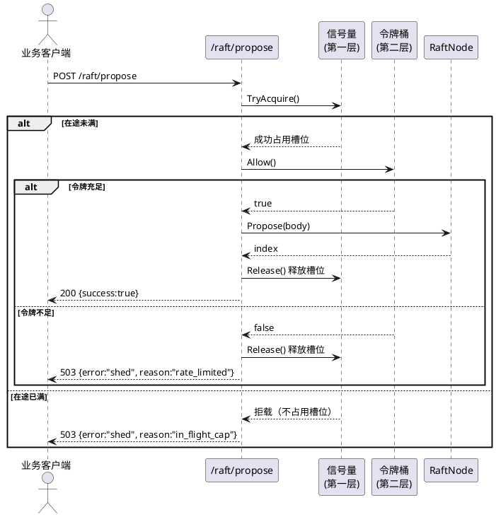
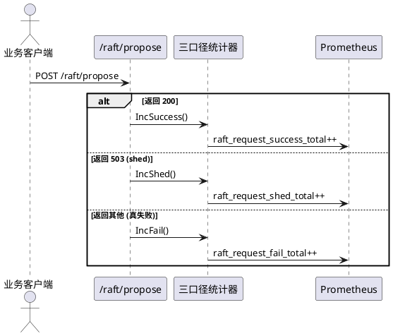
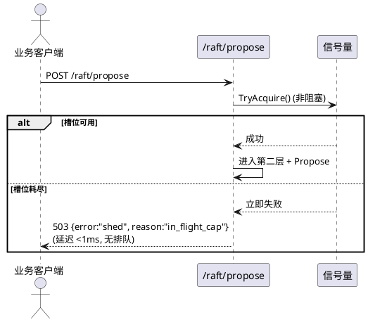
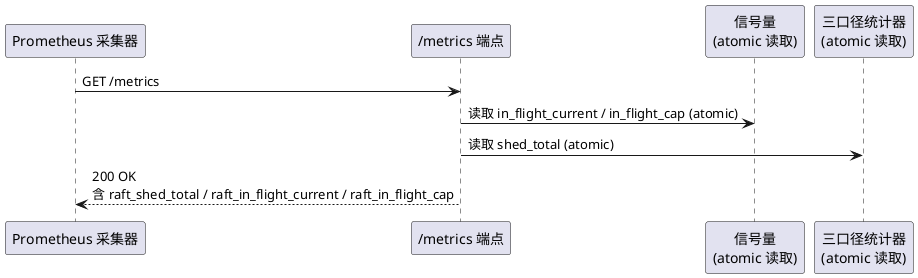
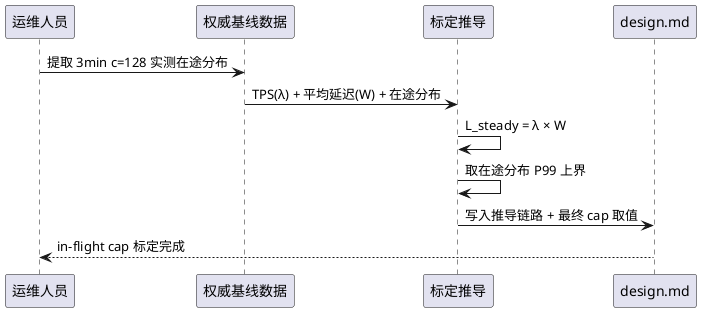
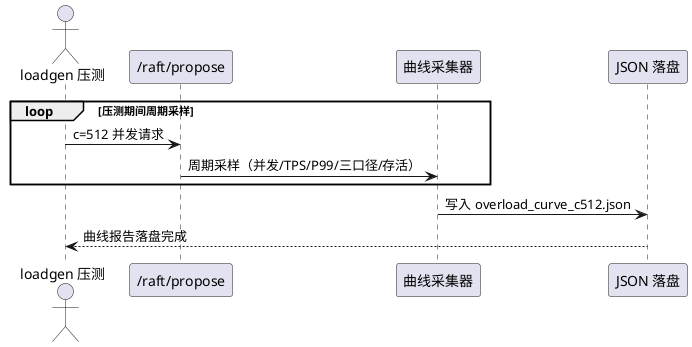
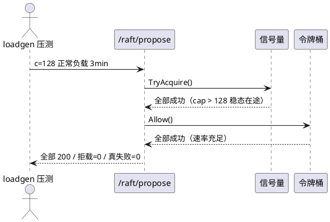
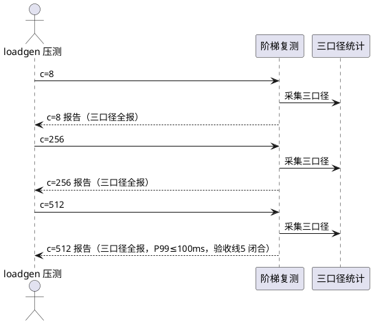
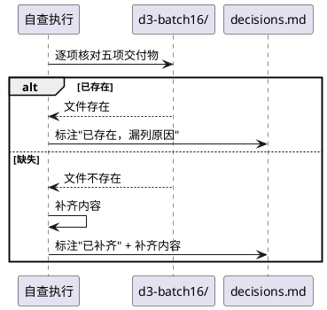
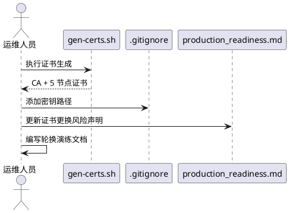

# 过载保护设计重构：双层准入控制 + 三口径统计 + batch16 交付物自查

> 批次：batch17
> 上游依据：docs/specs/production_hardening/spec.md（batch15 需求规格）/ tests/evidence/d3-batch16/（batch16 验收报告 + 决策记录）
> 基线参照：
> - 权威基线：8240.4 TPS（batch14 归零复测，3min c=128，成功率=100%，P99=50ms，5/5 存活，0 次 leader 切换）
> - batch16 c=128 mTLS 复测：TPS=10617.2，P99=50ms，fail=0
> - batch16 c=512 过载：TPS=14919，成功率=99.30%，P99=200ms（**未达标**）
> - batch16 阶梯：c=8 TPS=1501.9/P99=10ms，c=256 TPS=12726.3/P99=100ms，c=512 TPS=12927.2/P99=200ms
> - 令牌桶配置：maxTokens=1024，initialRate=10000
> - 集群拓扑：5 节点，gRPC port 9500，HTTP port 9000，Docker 部署
> 红线约束（逐条继承 + 新增）：
> - 继承：禁去 fsync / 禁跳 quorum / 禁缩选举超时（增大允许）/ 禁调参刷数 / pipeline 正确性三原则 / 禁止改 proto / 成功率双报制 / 客户端 retry 不计入服务端稳定性成绩 / 可观测性代码不得进入写路径热区
> - 新增1：三口径成功率——成功 / 拒载(shed) / 真失败，三者独立统计，拒载不得混入失败或成功。双报栏位固定报告首行，缺栏位报告直接不合格退回
> - 新增2：测试密钥不得再入 git（生成脚本化 + .gitignore）；生产部署前证书体系整体更换的风险写入 production_readiness.md

---

# **1. 组件定位**

## **1.1 核心职责**
本组件负责以双层准入控制重构过载保护，在令牌桶（约束速率 λ）之上叠加在途并发上限（约束在途数 L），实现被服务请求的 P99 有界，同时补齐 batch16 未报交付物。

## **1.2 核心输入**
1. 客户端写请求（来源：业务客户端，经 HTTP /raft/propose）
2. 过载压测流量（来源：loadgen 压测工具，c=512 并发）
3. 权威基线在途分布数据（来源：3min c=128 权威基线实测，用于 in-flight cap 标定推导）
4. 令牌桶配置参数（来源：环境变量 RATE_LIMIT_BURST / RATE_LIMIT_RATE，batch16 已就绪）
5. 信号量容量配置参数（来源：环境变量 IN_FLIGHT_CAP，本批新增）
6. Prometheus 采集器对 /metrics 端点的周期性抓取请求（来源：外部监控系统）

## **1.3 核心输出**
1. 双层准入决策（允许 / 拒载）回写至请求处理链路（目标：HTTP /raft/propose handler）
2. 三口径统计报告：成功数 / 拒载数 / 真失败数（目标：压测报告首行固定栏位 + /metrics 端点）
3. 拒载计数指标 raft_shed_total（目标：Prometheus 采集器，经 /metrics 端点导出）
4. 过载行为曲线 JSON 报告文件（目标：tests/evidence/d3-batch17/ 落盘存档）
5. batch16 交付物自查表（目标：tests/evidence/d3-batch17/decisions.md）
6. batch15 vs 16 vs 17 三列对照表（目标：tests/evidence/d3-batch17/report.md）

## **1.4 职责边界**
1. **不负责**统一 /metrics 端点聚合——已由 batch15 完成（metrics_collector.go）
2. **不负责**mTLS 证书体系——已由 batch16 完成（tls_config.go + gen_certs.sh）
3. **不负责**结构化日志——已由 batch16 完成（structured_log.go）
4. **不负责**客户端鉴权——已由 batch15 完成（auth_middleware.go）
5. **不负责**WAL 加密（SM4-CTR 已就绪）——已由 batch13 完成
6. **不负责**令牌桶限流器本体实现——已由 batch15/batch16 完成（token_bucket_limiter.go），本批在其之上叠加信号量层
7. **不负责**证书工程化全量实现——属任务三（附带，时间富余才做），本规格仅要求 gen-certs.sh 脚本化 + 密钥出库 + 轮换演练文档 + readiness 清单更新的需求声明
8. **不修改** proto 定义（红线约束 6）
9. **不进入**写路径热区（准入决策开销 P99 影响 <1ms，红线约束 9）
10. **不负责**令牌桶速率参数调优——令牌桶配置继承 batch16（maxTokens=1024, initialRate=10000），本批不调参刷数（红线约束 4）

---

# **2. 领域术语**

**双层准入控制**
: 在请求入口处依次执行两层准入检查的过载保护策略：第一层为在途并发上限（信号量），第二层为速率上限（令牌桶），两层均通过方进入 Propose 路径。
: 备注：对应 batch16 c=512 P99=200ms 未达标的根因修复——令牌桶仅约束速率 λ，未约束在途并发 L，请求在准入处排队，P99 含排队时间。

**在途并发（in-flight concurrency）**
: 某一时刻已通过准入但尚未返回响应的请求数量，记为 L。
: 备注：根据 Little's Law，L = λ × W，其中 λ 为到达速率，W 为平均等待时间。约束 L 即约束 W。

**信号量（semaphore）**
: 以计数器控制同时可占用的资源数量的同步原语，本组件用于约束在途并发上限。请求进入时计数器减一，请求完成时计数器加一，计数器为零时新请求被拒载。
: 备注：与令牌桶正交——令牌桶约束"单位时间允许多少请求通过"，信号量约束"同一时刻允许多少请求在途"。

**令牌桶（token bucket）**
: 以固定速率向桶中投放令牌、请求消耗令牌的限流策略，桶满时丢弃新令牌，桶空时拒绝请求。
: 备注：已由 batch15/batch16 实现（token_bucket_limiter.go），本批保留不改，作为双层准入的第二层。

**Little's Law**
: 排队论基本定律：L = λ × W，其中 L 为系统中平均在途数，λ 为平均到达速率，W 为平均等待时间。
: 备注：本组件的理论依据——约束在途数 L 的上限，在到达速率 λ 一定时，即约束等待时间 W 的上限，从而保证被服务请求的 P99 有界。

**拒载（shed）**
: 请求因在途并发已达上限或令牌桶耗尽而被拒绝的现象，返回明确的拒载错误码（HTTP 503 Service Unavailable + 响应体标识 shed），不计入成功也不计入真失败。
: 备注：与"真失败"（请求被服务但因业务/系统错误返回非 200）严格区分。三口径统计的核心概念。

**三口径成功率**
: 将请求结局分为三类独立统计的指标：成功（被服务且返回 200）、拒载（shed，未被服务）、真失败（被服务但返回非 200）。三者满足：总请求数 = 成功 + 拒载 + 真失败。
: 备注：红线新增1 要求三者独立统计，拒载不得混入失败或成功。双报栏位固定报告首行，缺栏位报告直接不合格退回。

**满载快速拒载（fail-fast shed）**
: 当在途并发已达上限时，新请求必须立即被拒载返回，禁止在入口处排队等待信号量释放。
: 备注：这是本批的核心设计原则——被服务请求的 P99 必须有界，排队等待会使 P99 含排队时间而无界。与 batch16 令牌桶"请求在准入处排队"的行为形成对比。

**in-flight cap**
: 在途并发上限的具体数值，即信号量的容量。本组件要求从 3min c=128 权威基线的实测在途分布推导，不拍脑袋。
: 备注：推导过程须写入 design.md。推导依据：权威基线 TPS=8240.4（或 batch16 mTLS 复测 10617.2），实测平均延迟 W，由 L = λ × W 计算稳态在途数，取其上界分位作为 cap。

**过载曲线**
: 在过载压测过程中，以时间序列记录并发数、TPS、P99 延迟、三口径成功率（成功/拒载/真失败）、存活节点数的曲线数据，用于验证降级平滑性和拒载率曲线。
: 备注：验收线要求过载曲线 JSON 落盘 + 拒载率曲线平滑非跳崖。

**被服务请求**
: 通过双层准入控制、实际进入 Propose 路径被处理的请求。其 P99 延迟是本批的核心验收指标——必须 ≤100ms。
: 备注：与被拒载请求区分。被拒载请求的延迟为准入决策耗时（<0.1ms），不计入被服务请求的 P99 统计。

**级联失败**
: 单节点拒载或过载导致其他节点崩溃、leader 异常切换、quorum 不可用等连锁反应。
: 备注：红线要求过载时无级联失败——5/5 存活，0 次 leader 异常切换。

**batch16 交付物自查**
: 对 batch16 已完成但未在报告中显式落盘的交付物进行逐项核对，缺则补齐，均已存在仅报告漏列的。
: 备注：任务零要求，包括 9232.5 对账表、mTLS 复测数字、结构化日志验证、验收线5 未达标回归点定位、tasks.md 状态回填五项。

---

# **3. 角色与边界**

## **3.1 核心角色**
- **运维人员**：配置 in-flight cap 参数、查阅过载曲线报告、核对 batch16 交付物自查表、执行证书工程化（附带任务）。
- **业务客户端**：通过 HTTP /raft/propose 发起写请求，可能收到 200（成功）或 503（拒载）或非 200（真失败）响应。
- **审计角色**：审阅三口径统计报告、过载曲线 JSON、batch15 vs 16 vs 17 三列对照表，签发验收结论。

## **3.2 外部系统**
- **Prometheus 采集器**：周期性抓取 /metrics 端点，解析新增的 raft_shed_total 拒载计数指标。
- **loadgen 压测工具**：发起 c=128/c=512 并发压测流量，需区分 200/503/其他响应码以支持三口径统计。
- **现有令牌桶限流器（token_bucket_limiter.go）**：作为双层准入的第二层，本批不修改其实现，仅在其前叠加信号量层。

## **3.3 交互上下文**

```plantuml
@startuml
skinparam componentStyle rectangle

actor "运维人员" as ops
actor "业务客户端" as client
component "过载保护重构组件\n(batch17)" as overload {
  component "信号量\n(在途并发上限)" as sem
  component "令牌桶\n(速率上限)" as bucket
  component "三口径统计" as tri
}
system "Prometheus 采集器" as prom
actor "loadgen 压测工具" as loadgen

ops --> sem : 配置 in-flight cap
client --> sem : 写请求 (第一层准入)
sem --> bucket : 通过 → 第二层准入
bucket --> tri : 决策结果
tri --> prom : raft_shed_total
loadgen --> sem : c=512 过载流量

@enduml
```

---

# **4. DFX约束**

## **4.1 性能**

1. **被服务请求 P99 有界**：双层准入控制开启后，c=512 过载压测中被服务请求的 P99 延迟必须 ≤100ms。
   - 验收条件：c=512 过载压测 3min → 被服务请求 P99 ≤100ms
2. **准入决策开销上限**：双层准入决策（信号量 + 令牌桶）总耗时必须 <0.1ms（O(1) 原子操作）。
   - 验收条件：单测基准 → 双层 Allow() 耗时 <0.1ms
3. **正常负载不误伤**：双层准入控制开启后，3min c=128 正常负载压测：拒载率必须 =0，TPS 必须 ≥权威基线 95%（8240.4 × 95% = 7828.4），P99 必须 ≤50ms。
   - 验收条件：3min c=128 复测 → 拒载率=0 / TPS≥7828.4 / P99≤50ms
4. **准入决策不得进入写路径热区**：双层准入决策代码不得在 Propose → WAL → quorum 同步路径中执行 I/O 或锁竞争操作。
   - 验收条件：代码审查 → 准入决策仅用 atomic 操作 / 无 mu.Lock / 无 I/O

## **4.2 可靠性**

1. **过载降级而非崩溃**：双层准入控制开启后 c=512 过载压测，系统必须降级运行，5/5 存活，0 次 leader 异常切换，无级联失败。
   - 验收条件：c=512 过载压测 3min → 5/5 存活 / 0 次 leader 异常切换 / 无节点崩溃
2. **拒载率曲线平滑上升**：过载时拒载率必须平滑上升，禁止跳崖式跳变（相邻采样点拒载率变化 <15 个百分点）。
   - 验收条件：过载曲线相邻采样点拒载率变化 <15 个百分点
3. **满载快速拒载**：当在途并发已达上限时，新请求必须立即被拒载返回，禁止入口排队。
   - 验收条件：在途并发达上限时新请求 → 立即返回 503（延迟 <1ms，不含排队等待）
4. **阶梯复测无回归**：8→256→512 阶梯复测必须对照权威基线无性能回归，三口径全报。
   - 验收条件：阶梯复测 8/256/512 各档 TPS/P99/三口径 不劣于权威基线（c=128 档）且 c=512 被服务请求 P99≤100ms

## **4.3 安全性**

1. **测试密钥不得入 git**：测试用证书/密钥材料必须通过生成脚本产出，不得提交至版本库，必须加入 .gitignore。
   - 验收条件：git status 无密钥文件 / .gitignore 含密钥路径 / gen-certs.sh 可一键生成
2. **生产证书更换风险写明**：生产部署前证书体系整体更换的风险必须写入 production_readiness.md。
   - 验收条件：production_readiness.md 含"生产部署前必须整体更换证书体系"风险声明

## **4.4 可维护性**

1. **三口径上报栏位固定**：压测报告首行必须固定包含三口径栏位（成功数/拒载数/真失败数），缺栏位的报告直接判定不合格退回。
   - 验收条件：压测报告首行 → 含三口径栏位 / 缺栏位 → 不合格退回
2. **拒载计数 metrics 导出**：拒载次数必须通过 raft_shed_total 指标导出至 /metrics 端点。
   - 验收条件：拒载发生 → raft_shed_total 递增 / curl /metrics 可见
3. **过载曲线 JSON 落盘**：过载压测必须产出曲线 JSON 报告文件（含时间序列数据），落盘至 tests/evidence/d3-batch17/。
   - 验收条件：过载压测结束 → 生成 overload_curve_c512.json（含并发/TPS/P99/三口径/存活节点数时间序列）
4. **单测护栏**：并发限制器状态机 / 满载拒载路径 / 双层协同三块必须有单测覆盖，全 PASS。
   - 验收条件：go test 三块单测 → 全 PASS
5. **batch15 vs 16 vs 17 三列对照**：验收报告必须包含 batch15/batch16/batch17 三列对照表，逐指标对照。
   - 验收条件：report.md 含三列对照表 / 每指标三批均有数值 / 未达标项显式标注

## **4.5 兼容性**

1. **现有令牌桶保留**：双层准入控制的第二层为现有令牌桶（token_bucket_limiter.go），其实现和配置不得修改。
   - 验收条件：token_bucket_limiter.go 无变更 / maxTokens=1024, initialRate=10000 不变
2. **现有 /metrics 端点兼容**：新增 raft_shed_total 指标为 /metrics 端点的增量，现有指标不得变更或删除。
   - 验收条件：curl /metrics → 含现有全部指标 + raft_shed_total
3. **拒载错误码明确**：拒载请求必须返回 HTTP 503 Service Unavailable，响应体必须包含 shed 标识，与限流 429 Too Many Requests 区分。
   - 验收条件：在途并发达上限时请求 → 503 + 响应体含 "shed" / 令牌桶耗尽时 → 503 + "shed"

---

# **5. 核心能力**

## **5.1 双层准入控制**

### **5.1.1 业务规则**

1. **双层准入顺序**：请求进入 /raft/propose handler 后，必须依次通过第一层信号量准入（在途并发上限）和第二层令牌桶准入（速率上限），两层均通过方可进入 Propose 路径。
   - 验收条件：请求到达 → 先信号量 Allow() → 通过后令牌桶 Allow() → 两层均通过 → 进入 Propose / 任一层拒绝 → 拒载返回

2. **信号量约束在途并发**：信号量必须约束当前在途请求数 L，请求进入时占用一个槽位（计数减一），请求完成时释放槽位（计数加一），槽位耗尽时新请求被拒载。
   - 验收条件：在途请求数 = in-flight cap 时新请求 → 拒载 / 请求完成 → 槽位释放 → 后续请求可进入

3. **令牌桶约束速率**：令牌桶必须约束请求通过速率 λ，配置继承 batch16（maxTokens=1024, initialRate=10000），本批不修改。
   - 验收条件：令牌桶配置 = maxTokens=1024, initialRate=10000 / token_bucket_limiter.go 无变更

4. **Little's Law 理论依据**：双层准入控制的理论依据必须为 Little's Law（L = λ × W），约束在途数 L 的上限即在到达速率 λ 一定时约束等待时间 W 的上限，从而保证被服务请求 P99 有界。
   - 验收条件：design.md 含 Little's Law 推导章节 / 含 L=λW 公式 / 含"约束 L 即约束 W"论证

5. **双层协同无死锁**：信号量与令牌桶的准入决策必须无死锁风险，信号量槽位释放不得依赖令牌桶状态，令牌桶补充不得依赖信号量状态。
   - 验收条件：单测双层并发调用 → 无死锁 / 无 goroutine 泄漏 / 无 panic

6. **拒载不得进入 Propose 路径**：任一层准入拒绝时，请求必须立即返回拒载响应，不得进入 Propose → WAL → quorum 路径。
   - 验收条件：拒载时 → 不调用 RaftNode.Propose / 不追加 WAL / 不触发 quorum 复制

7. **禁止项：禁止入口排队**：当在途并发已达上限时，新请求必须立即被拒载返回，禁止在入口处排队等待信号量释放。
   - 验收条件：在途并发达上限时新请求 → 立即返回 503（延迟 <1ms）/ 无排队等待时间

8. **禁止项：禁止准入控制影响 Raft 内部通信**：双层准入控制仅接入 /raft/propose 客户端写请求，不得接入 Raft 内部 gRPC 通信（AppendEntries/RequestVote/InstallSnapshot）。
   - 验收条件：过载压测期间 → quorum 复制正常 / leader-follower 同步不受准入控制影响 / 节点间 gRPC 通信无拦截

9. **禁止项：禁止双层准入进入写路径热区同步阻塞**：双层准入决策必须 O(1) 原子操作，禁止在决策中执行 I/O 或锁竞争。
   - 验收条件：双层 Allow() 耗时 <0.1ms / 无 mu.Lock / 无 I/O

### **5.1.2 交互流程**



### **5.1.3 异常场景**

1. **信号量状态损坏**
   a. 触发条件：信号量内部计数器异常（如负数）
   b. 系统行为：Fail-Open，放行请求并记录告警（避免准入控制故障导致服务不可用）
   c. 用户感知：请求正常处理 / 日志有告警

2. **令牌桶拒载但信号量已占用**
   a. 触发条件：信号量通过但令牌桶拒绝（两层准入部分通过）
   b. 系统行为：必须释放信号量槽位，返回 503 拒载，不得泄漏槽位
   c. 用户感知：503 + reason="rate_limited" / 信号量槽位无泄漏

3. **Propose 超时未返回**
   a. 触发条件：请求通过双层准入进入 Propose 后超时未返回
   b. 系统行为：超时后必须释放信号量槽位，避免槽位永久占用导致后续请求全部拒载
   c. 用户感知：客户端超时 / 信号量槽位最终释放 / 后续请求可正常进入

4. **过载压测中节点崩溃**
   a. 触发条件：c=512 过载压测中某节点 OOM 或 panic
   b. 系统行为：禁止级联崩溃，剩余节点必须维持 quorum 并继续服务
   c. 用户感知：拒载率上升但无全集群不可用 / 5/5 存活（或至少 3/5 维持 quorum）

5. **in-flight cap 配置错误**
   a. 触发条件：in-flight cap 配置为 0 或负数
   b. 系统行为：启动时校验，拒绝启动并报错
   c. 用户感知：启动失败 + 明确错误信息

---

## **5.2 三口径成功率统计**

### **5.2.1 业务规则**

1. **三口径独立定义**：请求结局必须分为三类独立统计：
   - **成功（success）**：被服务且返回 HTTP 200
   - **拒载（shed）**：因在途并发达上限或令牌桶耗尽而被拒载，返回 HTTP 503
   - **真失败（fail）**：被服务但因业务/系统错误返回非 200 且非 503
   - 验收条件：压测报告 → 三口径数值独立可辨 / 总请求数 = 成功 + 拒载 + 真失败

2. **拒载不得混入失败或成功**：拒载请求数必须独立统计，禁止计入成功数或真失败数。
   - 验收条件：统计逻辑审查 → shed 独立计数 / success 不含 shed / fail 不含 shed

3. **双报栏位固定报告首行**：压测报告首行必须固定包含三口径栏位（成功数/拒载数/真失败数），缺栏位的报告直接判定不合格退回。
   - 验收条件：压测报告首行 → 含"成功/拒载/真失败"三栏位 / 缺任一栏位 → 不合格退回

4. **三口径 metrics 导出**：三口径计数必须通过 /metrics 端点导出为 Prometheus 指标：
   - **raft_request_success_total**：成功计数（counter）
   - **raft_request_shed_total**：拒载计数（counter）
   - **raft_request_fail_total**：真失败计数（counter）
   - 验收条件：curl /metrics → 含上述三项指标 / 值与压测报告一致

5. **loadgen 三口径区分**：loadgen 压测工具必须能区分 HTTP 200/503/其他响应码，分别统计三口径。
   - 验收条件：loadgen 输出 → 含 success/shed/fail 三类计数 / 503 归入 shed / 非 200 非 503 归入 fail

6. **禁止项：禁止拒载计入服务端稳定性成绩**：服务端稳定性成绩（成功率）必须仅以"成功 / (成功 + 真失败)"计算，拒载不计入分母。
   - 验收条件：成功率计算公式 = success / (success + fail) / shed 不在分母中

### **5.2.2 交互流程**



### **5.2.3 异常场景**

1. **响应码无法分类**
   a. 触发条件：收到非 200/503/其他已知码的异常响应
   b. 系统行为：归入真失败口径，记录告警日志
   c. 用户感知：fail 计数递增 / 日志有告警

2. **三口径计数不一致**
   a. 触发条件：success + shed + fail ≠ 总请求数
   b. 系统行为：压测报告必须显式标注不一致并报错
   c. 用户感知：报告标注"三口径计数不一致" / 判定不合格

---

## **5.3 满载快速拒载**

### **5.3.1 业务规则**

1. **满载立即拒载**：当在途并发已达上限（信号量槽位耗尽）时，新请求必须立即被拒载返回，禁止排队等待。
   - 验收条件：在途并发达上限时新请求 → 立即返回 503 / 拒载延迟 <1ms / 无排队等待

2. **拒载错误码明确**：拒载请求必须返回 HTTP 503 Service Unavailable，响应体必须包含 shed 标识和拒载原因。
   - 验收条件：拒载响应 → 503 + {"error":"shed", "reason":"in_flight_cap" 或 "rate_limited"}

3. **拒载原因区分**：拒载原因必须区分"在途并发达上限"（in_flight_cap）和"令牌桶耗尽"（rate_limited），分别统计。
   - 验收条件：信号量拒载 → reason="in_flight_cap" / 令牌桶拒载 → reason="rate_limited" / 两者分别计数

4. **被服务请求 P99 有界**：满载快速拒载的核心目标——被服务请求（通过双层准入的请求）的 P99 延迟必须有界，≤100ms。
   - 验收条件：c=512 过载压测 → 被服务请求 P99 ≤100ms

5. **禁止项：禁止入口排队**：请求在准入处禁止排队等待，任一层准入拒绝必须立即返回。
   - 验收条件：准入拒绝 → 立即返回 / 无 channel 阻塞 / 无 mutex 等待

### **5.3.2 交互流程**



### **5.3.3 异常场景**

1. **拒载响应超时**
   a. 触发条件：拒载响应因网络问题未及时到达客户端
   b. 系统行为：服务端已立即释放资源（不占用信号量槽位），客户端按自身超时重试
   c. 用户感知：客户端超时重试 / 服务端无资源泄漏

2. **拒载风暴**
   a. 触发条件：过载时大量请求同时被拒载，拒载响应本身造成 CPU/网络压力
   b. 系统行为：拒载响应必须极轻量（仅写 HTTP 头 + 短 JSON 体），单次拒载开销 <0.1ms
   c. 用户感知：拒载率曲线平滑 / 无拒载风暴导致节点崩溃

---

## **5.4 拒载率 metrics**

### **5.4.1 业务规则**

1. **拒载计数指标导出**：拒载次数必须通过 raft_shed_total 指标导出至 /metrics 端点，为一级 metrics。
   - 验收条件：curl /metrics → 含 raft_shed_total（counter 类型，含 # HELP 和 # TYPE 行）/ 拒载发生时递增

2. **拒载原因标签**：raft_shed_total 必须以 Prometheus label 区分拒载原因（reason="in_flight_cap" 或 "rate_limited"）。
   - 验收条件：curl /metrics → raft_shed_total{reason="in_flight_cap"} 和 raft_shed_total{reason="rate_limited"} 分别可见

3. **在途并发指标导出**：当前在途并发数必须通过 raft_in_flight_current 指标导出（gauge 类型），供运维监控在途水位。
   - 验收条件：curl /metrics → 含 raft_in_flight_current（gauge 类型）/ 值 = 当前信号量占用数

4. **in-flight cap 指标导出**：在途并发上限配置必须通过 raft_in_flight_cap 指标导出（gauge 类型），供运维确认配置。
   - 验收条件：curl /metrics → 含 raft_in_flight_cap（gauge 类型）/ 值 = 配置的 in-flight cap

5. **禁止项：禁止拒载 metrics 进入写路径热区**：拒载计数更新必须为单次 atomic.AddInt64 操作，不得进入 Propose 同步路径。
   - 验收条件：代码审查 → IncShed() 仅 atomic.Add / 不在 Propose → WAL → quorum 路径

### **5.4.2 交互流程**



### **5.4.3 异常场景**

1. **metrics 采集与拒载并发**
   a. 触发条件：Prometheus 采集时恰好有拒载发生
   b. 系统行为：通过 atomic.Load 原子读取，不加锁，不阻塞拒载路径
   c. 用户感知：无（采集对拒载路径零干扰）

---

## **5.5 in-flight cap 标定**

### **5.5.1 业务规则**

1. **标定依据为权威基线**：in-flight cap 必须从 3min c=128 权威基线的实测在途分布推导，禁止拍脑袋设定。
   - 验收条件：design.md 含标定推导章节 / 推导输入为权威基线实测数据 / 非人为拍脑袋

2. **Little's Law 推导**：标定推导必须基于 Little's Law（L = λ × W）：
   - 从权威基线实测获取稳态 TPS（λ）和平均延迟（W）
   - 计算稳态在途数 L_steady = λ × W
   - 取实测在途分布的上界分位（如 P99）作为 cap 候选
   - 验证 cap 候选在 c=128 时不误伤（拒载率=0）
   - 验收条件：design.md 含 L=λW 推导 / 含 λ 和 W 实测值 / 含 L_steady 计算 / 含上界分位选取

3. **标定结果写入 design.md**：in-flight cap 的标定过程和最终取值必须写入 design.md，含推导链路和验证结果。
   - 验收条件：design.md → 含标定推导章节 / 含最终 in-flight cap 取值 / 含不误伤验证

4. **cap 可配置**：in-flight cap 必须通过环境变量 IN_FLIGHT_CAP 可配置，默认值为标定推导结果。
   - 验收条件：未设 IN_FLIGHT_CAP → 使用标定默认值 / 设 IN_FLIGHT_CAP=N → 使用 N

5. **禁止项：禁止拍脑袋设定**：in-flight cap 禁止无推导依据的人为设定，必须有从权威基线实测数据到最终取值的完整推导链路。
   - 验收条件：design.md 推导链路完整 / 无"经验值""拍脑袋"等无依据表述

### **5.5.2 交互流程**



### **5.5.3 异常场景**

1. **权威基线数据缺失**
   a. 触发条件：3min c=128 权威基线实测在途分布数据不可用
   b. 系统行为：标定无法进行，必须在 design.md 中显式标注数据缺失并暂停标定
   c. 用户感知：design.md 标注"基线数据缺失，标定暂停" / 需先补采基线数据

2. **标定值在 c=128 时误伤**
   a. 触发条件：标定推导的 cap 值在 c=128 正常负载时产生拒载（拒载率 >0）
   b. 系统行为：cap 值过小，必须上调并重新验证，直至 c=128 拒载率=0
   c. 用户感知：design.md 标注"cap 上调记录" / 最终 cap 经不误伤验证

---

## **5.6 过载曲线预期行为**

### **5.6.1 业务规则**

1. **预期过载曲线写明**：design.md 必须写明预期过载曲线行为：拒载率平滑上升、被服务请求 P99 有界、无级联崩溃。
   - 验收条件：design.md → 含预期过载曲线章节 / 含拒载率平滑上升描述 / 含 P99 有界描述 / 含无级联崩溃描述

2. **拒载率平滑上升**：过载时拒载率必须平滑上升，禁止跳崖式跳变（相邻采样点拒载率变化 <15 个百分点）。
   - 验收条件：过载曲线 JSON 相邻采样点拒载率变化 <15 个百分点

3. **被服务请求 P99 有界**：过载时被服务请求 P99 必须 ≤100ms，不随并发数增加而无界增长。
   - 验收条件：c=512 过载压测 → 被服务请求 P99 ≤100ms / 曲线 P99 不随并发数无界增长

4. **无级联崩溃**：过载时禁止级联失败——5/5 存活，0 次 leader 异常切换，无节点崩溃。
   - 验收条件：c=512 过载压测 → 5/5 存活 / 0 次 leader 异常切换 / 无节点崩溃

5. **过载曲线 JSON 落盘**：过载压测必须产出曲线 JSON 报告文件，含时间序列数据，落盘至 tests/evidence/d3-batch17/。
   - 报告内容：时间戳、并发数、TPS、P50、P99、三口径（成功/拒载/真失败）、存活节点数
   - 验收条件：过载压测结束 → 生成 overload_curve_c512.json / 含上述全部字段时间序列

6. **禁止项：禁止过载曲线有垂直跌落**：过载曲线中任一指标（TPS/成功率/拒载率/P99）禁止垂直跌落（相邻采样点变化 >30%）。
   - 验收条件：过载曲线 JSON → 相邻采样点 TPS/成功率/拒载率/P99 变化 <30%

### **5.6.2 交互流程**



### **5.6.3 异常场景**

1. **曲线采样中断**
   a. 触发条件：压测过程中曲线采集器异常停止
   b. 系统行为：已采样数据必须保留，标注采样中断时间点
   c. 用户感知：JSON 文件含中断标注 / 已采样数据完整

2. **曲线数据缺失字段**
   a. 触发条件：曲线 JSON 缺失任一必需字段（如缺拒载率）
   b. 系统行为：报告判定不合格，需重跑
   c. 用户感知：JSON 校验失败 + 缺失字段列表

---

## **5.7 正常负载不误伤**

### **5.7.1 业务规则**

1. **正常负载拒载率为零**：双层准入控制开启后，3min c=128 正常负载压测拒载率必须 =0。
   - 验收条件：3min c=128 复测 → 拒载率=0 / shed=0

2. **正常负载 TPS 不劣化**：3min c=128 正常负载压测 TPS 必须 ≥权威基线 95%（8240.4 × 95% = 7828.4）。
   - 验收条件：3min c=128 复测 → TPS ≥7828.4

3. **正常负载 P99 不劣化**：3min c=128 正常负载压测 P99 必须 ≤50ms。
   - 验收条件：3min c=128 复测 → P99 ≤50ms

4. **正常负载三口径全报**：3min c=128 正常负载压测必须三口径全报（成功=N，拒载=0，真失败=0）。
   - 验收条件：3min c=128 报告首行 → 成功/拒载/真失败三栏位均有值 / 拒载=0 / 真失败=0

5. **禁止项：禁止正常负载误拒**：in-flight cap 标定必须保证 c=128 正常负载时无误拒（拒载率=0）。
   - 验收条件：c=128 → 拒载率=0 / cap 值 > c=128 稳态在途数

### **5.7.2 交互流程**



### **5.7.3 异常场景**

1. **正常负载出现误拒**
   a. 触发条件：c=128 正常负载压测出现拒载（shed >0）
   b. 系统行为：in-flight cap 过小，判定标定失败，需上调 cap 并重验
   c. 用户感知：报告标注"正常负载误拒" / 判定不合格 / 需重新标定

---

## **5.8 阶梯复测三口径全报**

### **5.8.1 业务规则**

1. **阶梯复测覆盖三档**：阶梯复测必须覆盖 c=8 → c=256 → c=512 三档，每档三口径全报。
   - 验收条件：阶梯复测 → c=8/c=256/c=512 各档均有成功/拒载/真失败三口径数值

2. **阶梯对照权威基线**：阶梯复测必须对照权威基线，c=8 和 c=256 档不劣于 batch16 阶梯结果。
   - 验收条件：c=8 TPS ≥1501.9 / c=256 TPS ≥12726.3 / c=256 P99 ≤100ms

3. **c=512 被服务请求 P99 达标**：阶梯复测 c=512 档被服务请求 P99 必须 ≤100ms（验收线5 闭合）。
   - 验收条件：c=512 → 被服务请求 P99 ≤100ms / 验收线5 闭合

4. **阶梯三口径栏位固定**：阶梯复测报告每档必须固定包含三口径栏位，缺栏位判定不合格。
   - 验收条件：阶梯报告 c=8/c=256/c=512 各档 → 含三口径栏位 / 缺栏位 → 不合格

5. **验收线5 闭合**：阶梯复测 c=512 P99≤100ms 即验收线5（batch16 未达标项）闭合。
   - 验收条件：c=512 P99≤100ms → 验收线5 标注"闭合" / batch15 vs 16 vs 17 三列对照表显式标注

6. **禁止项：禁止阶梯复测缺档**：阶梯复测禁止缺档，c=8/c=256/c=512 三档必须全部执行并报告。
   - 验收条件：阶梯报告 → 含 c=8/c=256/c=512 三档 / 缺任一档 → 不合格

### **5.8.2 交互流程**



### **5.8.3 异常场景**

1. **阶梯复测中档间状态污染**
   a. 触发条件：前一档压测残留状态（如信号量槽位未释放）影响后一档
   b. 系统行为：每档压测前必须确认信号量槽位全部释放、在途并发归零
   c. 用户感知：每档独立干净 / 无档间状态污染

2. **c=512 P99 仍未达标**
   a. 触发条件：c=512 被服务请求 P99 >100ms
   b. 系统行为：验收线5 未闭合，需排查 in-flight cap 是否过大或 Propose 路径瓶颈
   c. 用户感知：报告标注"验收线5 未闭合" / 需进一步排查

---

## **5.9 batch16 交付物自查补齐**

### **5.9.1 业务规则**

1. **自查项逐项核对**：必须逐项核对 d3-batch16/ 是否落盘以下五项交付物，缺则补齐：
   - 9232.5 对账表（batch16 任务零，未报）
   - mTLS 开启后 3min c=128 复测数字（TPS/P99/双报）
   - 结构化日志验证记录 + 无回归复测
   - 验收线5 未达标的具体回归点定位（哪个并发档/哪个指标/对照哪个基线）
   - tasks.md T15-* 状态回填为实际状态
   - 验收条件：decisions.md 含 batch16 缺项自查表 / 五项逐项标注"已存在"或"已补齐"

2. **已存在仅报告漏列**：自查项均已存在的，仅需在 decisions.md 中说明漏列情况，不重跑。
   - 验收条件：已存在项 → decisions.md 标注"已存在，漏列原因" / 不重跑

3. **缺失项补齐方式**：缺失项必须补齐至 tests/evidence/d3-batch16/ 或 tests/evidence/d3-batch17/decisions.md。
   - 验收条件：缺失项 → 补齐落盘 / decisions.md 标注"已补齐" + 补齐内容

4. **自查表写入 decisions.md**：batch16 缺项自查表必须写入 tests/evidence/d3-batch17/decisions.md。
   - 验收条件：decisions.md → 含"batch16 交付物自查表"章节 / 五项逐项核对结果

5. **验收线5 未达标回归点定位**：必须明确标注验收线5 未达标的具体回归点——哪个并发档（c=512）、哪个指标（P99=200ms）、对照哪个基线（目标 ≤100ms）。
   - 验收条件：decisions.md → 含"验收线5 回归点" / 并发档=c=512 / 指标=P99 / 实测=200ms / 目标=≤100ms

6. **tasks.md 状态回填**：batch15 tasks.md 中 T15-* 任务状态必须回填为实际状态（TODO/DONE/SKIP）。
   - 验收条件：tasks.md T15-* → 状态与实际一致 / 已完成标 DONE / 未做标 TODO / 取消标 SKIP

### **5.9.2 交互流程**



### **5.9.3 异常场景**

1. **自查项无法判定存在性**
   a. 触发条件：交付物文件存在但内容不完整或格式不符
   b. 系统行为：判定为"存在但不完整"，在 decisions.md 中标注具体缺失内容
   c. 用户感知：decisions.md 标注"存在但不完整" + 缺失内容列表

---

## **5.10 证书工程化（附带，时间富余才做）**

### **5.10.1 业务规则**

1. **gen-certs.sh 脚本化**：证书生成必须脚本化，一键产出全部节点证书 + CA。
   - 验收条件：执行 gen-certs.sh → 产出 CA + 5 节点证书 / 无手动步骤

2. **密钥出库**：测试密钥必须从 git 历史中移除（如已误入），加入 .gitignore。
   - 验收条件：git status 无密钥 / .gitignore 含密钥路径 / git 历史无密钥（或标注需 force push 清理）

3. **轮换演练文档**：必须写明证书轮换演练步骤（含双证书并行窗口、轮换步骤、回滚方案）。
   - 验收条件：docs/ 含轮换演练文档 / 含双证书并行窗口 / 含回滚方案

4. **readiness 清单更新**：production_readiness.md 必须更新，含"生产部署前证书体系整体更换"风险声明。
   - 验收条件：production_readiness.md → 含证书整体更换风险声明

5. **禁止项：禁止测试密钥入 git**：测试用证书/密钥禁止提交至版本库。
   - 验收条件：.gitignore 含密钥路径 / git status 无密钥文件

### **5.10.2 交互流程**



### **5.10.3 异常场景**

1. **密钥已在 git 历史中**
   a. 触发条件：测试密钥已误入 git 历史提交
   b. 系统行为：标注需 git filter-branch 或 BFG 清理，加入 .gitignore 防止再次提交
   c. 用户感知：decisions.md 标注"密钥已在历史，需清理" / .gitignore 已更新

---

# **6. 数据约束**

## **6.1 三口径统计定义**

1. **成功数（success）**：非负整数，被服务且返回 HTTP 200 的请求计数，单调递增
2. **拒载数（shed）**：非负整数，因在途并发达上限或令牌桶耗尽被拒载的请求计数，单调递增
3. **真失败数（fail）**：非负整数，被服务但返回非 200 且非 503 的请求计数，单调递增
4. **总请求数（total）**：非负整数，total = success + shed + fail
5. **成功率（success_rate）**：浮点数，取值范围 [0.0, 1.0]，success_rate = success / (success + fail)，shed 不在分母
6. **拒载率（shed_rate）**：浮点数，取值范围 [0.0, 1.0]，shed_rate = shed / total

## **6.2 信号量状态**

1. **in-flight cap**：正整数，信号量容量，即在途并发上限，通过环境变量 IN_FLIGHT_CAP 配置，默认值为标定推导结果
2. **当前在途数（in_flight_current）**：非负整数，当前已占用槽位数，≤ in-flight cap
3. **拒载原因（shed_reason）**：枚举值，∈ {in_flight_cap, rate_limited}，区分信号量拒载和令牌桶拒载
4. **信号量拒载计数（shed_in_flight_total）**：非负整数，因在途并发达上限被拒载的计数，单调递增
5. **令牌桶拒载计数（shed_rate_limited_total）**：非负整数，因令牌桶耗尽被拒载的计数，单调递增
6. **总拒载计数（shed_total）**：非负整数，shed_total = shed_in_flight_total + shed_rate_limited_total

## **6.3 in-flight cap 标定数据**

1. **权威基线 TPS（λ）**：正浮点数，3min c=128 权威基线实测 TPS，参照值 8240.4（batch14）或 10617.2（batch16 mTLS 复测）
2. **权威基线平均延迟（W）**：正浮点数，单位秒，3min c=128 实测请求平均延迟
3. **稳态在途数（L_steady）**：正浮点数，L_steady = λ × W，由 Little's Law 计算
4. **在途分布上界分位**：正整数，实测在途分布的 P99（或 P99.9）上界，作为 cap 候选
5. **不误伤验证结果**：布尔值，cap 候选在 c=128 时拒载率=0 则 true，否则 false

## **6.4 过载曲线报告**

1. **时间戳（timestamp）**：ISO 8601 格式，记录每个采样点的时间
2. **并发数（concurrency）**：正整数，当前压测并发连接数
3. **TPS**：非负浮点数，当前每秒事务数
4. **P50 延迟**：非负浮点数，单位毫秒，被服务请求的 P50
5. **P99 延迟**：非负浮点数，单位毫秒，被服务请求的 P99
6. **成功数（success）**：非负整数，累计成功请求数
7. **拒载数（shed）**：非负整数，累计拒载请求数
8. **真失败数（fail）**：非负整数，累计真失败请求数
9. **存活节点数（alive_nodes）**：正整数，取值范围 [1, 5]
10. **采样间隔（sample_interval）**：正整数，单位秒，建议 1s 或 5s

## **6.5 batch16 交付物自查表**

1. **自查项名称（item）**：字符串，五项交付物之一的名称
2. **存在性状态（status）**：枚举值，∈ {exists, missing, incomplete}
3. **漏列原因（reason）**：字符串，已存在但未报告的原因说明
4. **补齐内容（remediation）**：字符串，缺失项的补齐内容摘要
5. **核对结果（verdict）**：枚举值，∈ {pass, remediated, fail}

## **6.6 新增 Prometheus 指标定义**

1. **raft_shed_total**：拒载总计数，counter 类型，非负整数，单调递增，label: reason ∈ {in_flight_cap, rate_limited}
2. **raft_request_success_total**：成功总计数，counter 类型，非负整数，单调递增
3. **raft_request_fail_total**：真失败总计数，counter 类型，非负整数，单调递增
4. **raft_in_flight_current**：当前在途并发数，gauge 类型，非负整数，≤ raft_in_flight_cap
5. **raft_in_flight_cap**：在途并发上限配置，gauge 类型，正整数，等于 IN_FLIGHT_CAP 配置值

---

# **7. 验收线（全部硬数字）**

> 以下为用户签发的验收线原文，全部为硬数字，必须逐条达成。

1. **单测全 PASS**：并发限制器状态机 / 满载拒载路径 / 双层协同，三块单测全 PASS。
   - 验收条件：go test 三块单测 → 全 PASS

2. **c=512 过载终审**：被服务请求 P99 ≤100ms / 三口径上报 / 拒载率曲线平滑非跳崖 / 5/5 存活 / 无级联失败 / 过载曲线 JSON 落盘。
   - 验收条件：c=512 过载压测 3min → 被服务请求 P99≤100ms / 三口径栏位固定首行 / 拒载率相邻采样变化 <15pp / 5/5 存活 / 0 次 leader 异常切换 / overload_curve_c512.json 落盘

3. **正常负载不误伤**：3min c=128 拒载率=0 / TPS≥7828.4（权威基线 95%）/ P99≤50ms。
   - 验收条件：3min c=128 复测 → 拒载率=0 / TPS≥7828.4 / P99≤50ms

4. **阶梯复测三口径全报**：8→256→512 三口径全报，对照权威基线，验收线5 闭合。
   - 验收条件：阶梯复测 → c=8/c=256/c=512 各档三口径全报 / c=512 被服务请求 P99≤100ms / 验收线5 标注"闭合"

5. **batch16 交付物自查补齐**：五项交付物逐项核对，缺则补齐，自查表写入 decisions.md。
   - 验收条件：decisions.md 含 batch16 缺项自查表 / 五项逐项标注"已存在"或"已补齐"

---

# **8. 红线约束（继承 + 新增）**

> 以下为用户签发的红线约束，全程不得违反。

**继承红线（batch15/batch16）**：
1. 禁去 fsync
2. 禁跳 quorum
3. 禁缩选举超时（增大允许）
4. 禁调参刷数
5. pipeline 正确性三原则
6. 禁止改 proto
7. 成功率双报制
8. 客户端 retry 不计入服务端稳定性成绩
9. 可观测性代码不得进入写路径热区（metrics 采集开销 P99 影响 <1ms）

**新增红线（batch17）**：
10. **三口径成功率独立统计**：成功 / 拒载(shed) / 真失败，三者独立统计，拒载不得混入失败或成功。双报栏位固定报告首行，缺栏位报告直接不合格退回。
11. **测试密钥不得入 git**：测试密钥不得再入 git（生成脚本化 + .gitignore）；生产部署前证书体系整体更换的风险写入 production_readiness.md。

---

# **9. 既有基线数据（供 design 参考）**

> 以下为既有基线数据，供 spec-design-agent 参考，不属于本规格的约束。

## **9.1 权威基线**
- 3min c=128：TPS=8240.4，成功率=100%，P99=50ms，5/5 存活，0 次 leader 切换（batch14 归零复测）

## **9.2 batch16 复测数据**
- 3min c=128 mTLS 复测：TPS=10617.2，P99=50ms，fail=0
- c=512 过载：TPS=14919，成功率=99.30%，P99=200ms（**未达标**）
- 阶梯 c=8：TPS=1501.9，P99=10ms
- 阶梯 c=256：TPS=12726.3，P99=100ms
- 阶梯 c=512：TPS=12927.2，P99=200ms（**未达标**）

## **9.3 令牌桶配置（继承，不改）**
- maxTokens=1024
- initialRate=10000

## **9.4 集群拓扑**
- 5 节点
- gRPC port 9500
- HTTP port 9000
- Docker 部署

## **9.5 未达标根因分析（batch16 decisions.md 结论）**
- c=512 P99=200ms 未达标原因：令牌桶限 TPS 不限并发。c=512 时 P99 由并发排队决定，非 TPS。
- 修复方向：并发限制器（信号量），约束在途并发 L，由 Little's Law（L=λW）约束等待 W，保证被服务请求 P99 有界。

## **9.6 batch16 交付物自查清单（任务零）**
1. 9232.5 对账表（batch16 任务零，未报）——已存在于 decisions.md，需确认是否在 report.md 显式落盘
2. mTLS 开启后 3min c=128 复测数字（TPS/P99/双报）——已存在于 report.md（TPS=10617.2, P99=50ms, fail=0）
3. 结构化日志验证记录 + 无回归复测——已存在于 report.md 任务三章节
4. 验收线5 未达标的具体回归点定位——已存在于 report.md（c=512, P99=200ms, 目标≤100ms），需确认定位精度
5. tasks.md T15-* 状态回填——需核对 tasks.md 中 T15-* 任务状态是否与实际一致