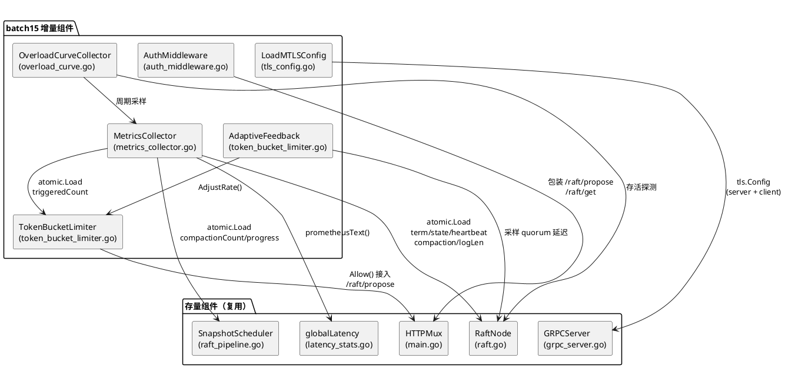
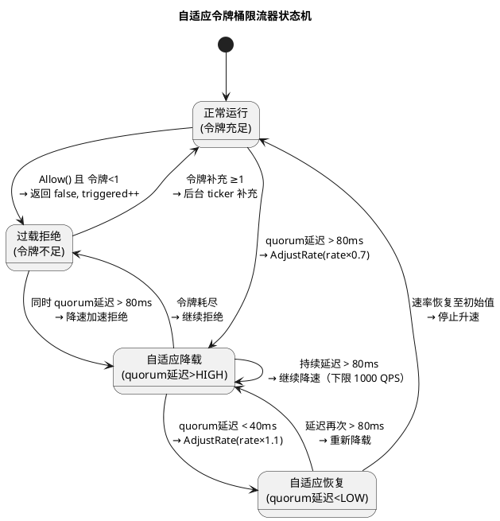
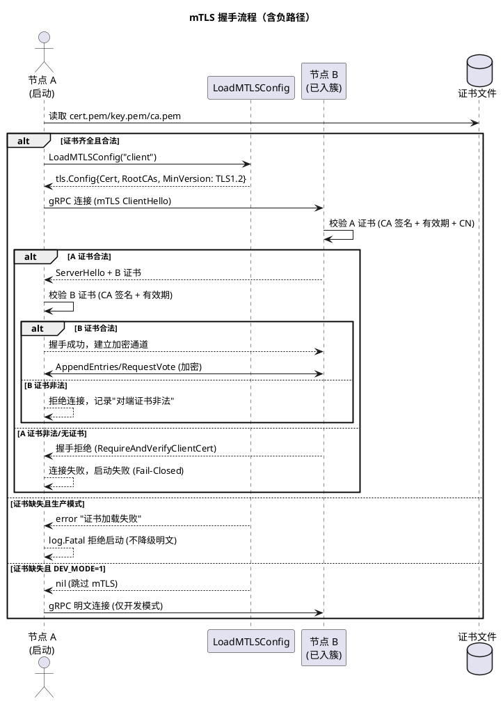
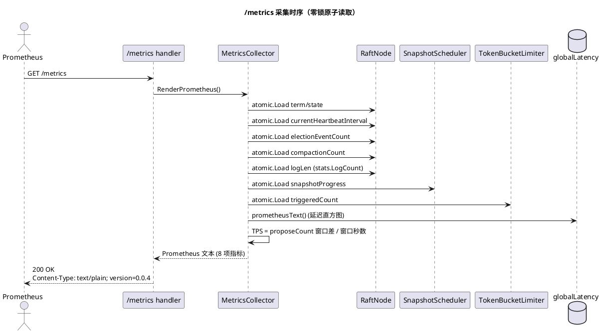
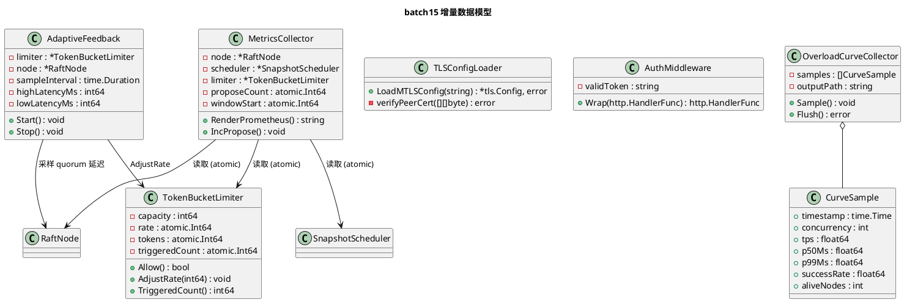

# 生产化第一阶段技术设计：可观测性 + 过载保护 + 节点间安全

> 批次：batch15
> 上游规格：docs/specs/production_hardening/spec.md
> 基线参照：3min c=128 TPS=8240.4 / 成功率=100% / P99=50ms / 5/5 存活
> 红线约束：禁去 fsync / 禁跳 quorum / 禁缩选举超时 / 禁调参刷数 / pipeline 正确性三原则 / 禁止改 proto / 双报制 / retry 不计入服务端成绩 / 可观测性代码不得进入写路径热区

---

# 一、需求与存量功能关系分析

## 1.1 需求功能与存量功能对比

### 1.1.1 已实现功能

| 需求功能 | 存量功能 | 代码位置 | 匹配度 |
|---------|---------|---------|--------|
| 延迟分位 P50/P99 导出（Prometheus） | grpc_request_duration_seconds histogram，固定桶+原子计数，/latency/metrics 端点 | latency_stats.go:30-127 | 100% |
| 延迟分位 P50/P99 导出（JSON） | /latency/stats 输出 bucket/count/sum_us JSON | latency_stats.go:99-103 | 100% |
| 选举统计（term/state/leaderID） | /raft/stats 文本输出 term/state/leaderID/commit/applied/logs/peers | main.go:291-303 | 75% |
| 心跳统计（consecutiveTimeouts/Success） | RaftNode 中 atomic int32 原子变量，adaptiveHeartbeatAdjust 读取 | raft.go:119-120, 1901-1914 | 50% |
| 异步快照调度框架 | SnapshotScheduler 异步消费 goroutine，非阻塞投递 | raft_pipeline.go:509-586 | 75% |
| mTLS 证书签发脚本 | gen_certs.sh：CA 自签 + 节点 CSR + CA 签发，CN=节点 ID | gen_certs.sh:1-27 | 75% |
| mTLS 服务端框架 | grpc_server.go 加载 cert/key，tls.Config+MinVersion TLS1.2 | grpc_server.go:119-138 | 50% |
| mTLS 客户端框架 | grpc_server.go 加载 CA+cert+key，RootCAs 设置 | grpc_server.go:273-298 | 50% |
| 幂等 token 防重复提交 | idemTable.GetOrCreate，/raft/propose idem_token 参数 | main.go:334-375, idem_token.go | 100% |
| WAL 加密（SM4-CTR） | EncryptedStorage 已就绪 | raft_storage.go | 100% |
| 限流器骨架 | RateLimiter 结构 + Allow() + monitorLoop | rate_limiter.go:11-103 | 25% |
| 状态变更通知通道 | stateChangeCh chan NodeState（容量 8），run 循环消费 | raft.go:84, 217, 728 | 75% |

### 1.1.2 需要扩展的功能

| 需求功能 | 存量功能 | 差异说明 | 扩展方向 |
|---------|---------|---------|---------|
| 统一 /metrics 端点（8 项指标） | /latency/metrics 仅延迟直方图，/raft/stats 仅文本 | 缺 TPS/心跳间隔/选举事件/compaction 计数/日志长度/快照进度/限流触发计数 7 项；现有端点格式不统一 | 新增 /metrics 路由，聚合现有 latency histogram + 新增 7 项指标，Prometheus 文本格式 |
| 心跳间隔导出（raft_heartbeat_interval_seconds） | currentHeartbeatInterval 为普通 time.Duration 字段，非原子 | 并发读取存在数据竞争风险；adaptiveHeartbeatAdjust 返回计算值但不持久化 | 将 currentHeartbeatInterval 改为 atomic int64（纳秒），采集时 atomic.Load + 转秒 |
| 选举事件计数（raft_election_events_total） | stateChangeCh 已有状态变更通知，但无计数器 | 缺 term 变化计数；stateChangeCh 仅通知 state 转换不含 term 变化 | 新增 atomic int64 electionEventCount，在 becomeLeader/becomeFollower/becomeCandidate 及 term 变更处 atomic.Add |
| compaction 计数（raft_compaction_count_total） | executeSnapshot 打日志"异步快照完成"但无计数器 | 缺 compaction 次数原子计数 | 在 SnapshotScheduler 新增 atomic int64 compactionCount，executeSnapshot 成功后 atomic.Add |
| 快照进度（raft_snapshot_progress） | 无快照进度字段 | 缺 0.0~1.0 进度 gauge | 在 SnapshotScheduler 新增 atomic int32 snapshotProgress（0~1000，采集时除 1000），executeSnapshot 开始/结束时更新 |
| 限流器接入 /raft/propose | RateLimiter 存在但未接入 propose handler | main.go:335-375 propose handler 无限流调用；现有 Allow() 用 mu.Lock 更新 blockedCount 违反 O(1) | 新建 token_bucket_limiter.go，propose handler 入口调用 Allow()，Allow() 全程 atomic 操作 |
| mTLS Fail-Closed | grpc_server.go:129 证书加载失败降级明文 | 生产模式应拒绝启动而非降级 | 改造证书加载逻辑：生产模式（DEV_MODE!=1）证书缺失 → log.Fatal 拒绝启动 |
| mTLS 服务端校验客户端证书 | grpc_server.go:131-134 仅设置 Certificates，未设 RootCAs/ClientAuth | 缺对端证书 CA 校验，非真正双向认证 | tls.Config 增加 RootCAs + ClientAuth: RequireAndVerifyClientCert |

### 1.1.3 需要新增的功能或接口

**模块 A：统一 Metrics 采集器（metrics_collector.go）**
- `MetricsCollector` 结构：持有 RaftNode/Pipeline/RateLimiter 引用，提供 `RenderPrometheus()` 方法
- `/metrics` HTTP handler：调用 MetricsCollector.RenderPrometheus()，Content-Type=text/plain; version=0.0.4
- TPS 计算：滑动窗口原子计数（propose 成功时 atomic.Add，采集时按窗口算速率）
- 输入：无（采集时原子读取各字段）；输出：Prometheus 文本格式字符串
- 依赖：RaftNode（term/state/heartbeat/electionEvent/compaction/logLen）、Pipeline（snapshotProgress）、RateLimiter（triggeredCount）、globalLatency（延迟直方图）

**模块 B：自适应令牌桶限流器（token_bucket_limiter.go）**
- `TokenBucketLimiter` 结构：容量、补充速率（atomic int64）、当前令牌数（atomic int64，定点小数）、触发计数（atomic int64）
- `Allow() bool`：O(1) 原子取令牌，不足返回 false + atomic.Add 触发计数
- `AdjustRate(newRate int64)`：异步调整补充速率（由自适应反馈模块调用）
- 自适应反馈 goroutine：周期采样 quorum 提交延迟，延迟超阈值降速率，恢复升速率
- 输入：请求到达；输出：允许/拒绝决策
- 依赖：RaftNode 的 quorum 延迟指标（commitLatency）

**模块 C：mTLS 证书加载器（tls_config.go）**
- `LoadMTLSConfig(role string) (*tls.Config, error)`：统一加载 cert/key/ca，构建 tls.Config
- 生产模式：证书缺失 → 返回 error（调用方 log.Fatal）
- 开发模式（DEV_MODE=1）：返回 nil（调用方跳过 TLS）
- `VerifyPeerCert(rawCerts [][]byte) error`：自定义校验回调（CA 签名 + 有效期 + CN 匹配）
- 输入：角色（server/client）；输出：tls.Config 或 error
- 依赖：环境变量 TLS_CERT_FILE/TLS_KEY_FILE/TLS_CA_FILE/DEV_MODE

**模块 D：客户端鉴权中间件（auth_middleware.go）**
- `AuthMiddleware(next http.HandlerFunc) http.HandlerFunc`：Bearer Token 校验中间件
- `TokenValidator` 接口：校验 token 有效性（默认实现：环境变量 RAFT_API_TOKEN 比对）
- 输入：HTTP 请求（Authorization Header）；输出：放行/401
- 依赖：环境变量 RAFT_API_TOKEN

**模块 E：过载行为曲线采集器（overload_curve.go）**
- `OverloadCurveCollector`：周期采样（并发/TPS/P50/P99/成功率/存活节点数），写 JSON 文件
- 输入：压测期间周期触发；输出：overload_curve_c512.json
- 依赖：MetricsCollector + 集群存活探测

## 1.2 存量功能详细分析

### 1.2.1 延迟统计（latency_stats.go）

- **接口契约**：`observe(d time.Duration)` 写入；`snapshot()` 读取；`prometheusText()` 转 Prometheus 文本
- **业务规则**：固定 12 桶（0.1ms~1s + +Inf），原子计数无锁，通过 gRPC UnaryInterceptor 无侵入统计
- **扩展点**：globalLatency 为全局单例，MetricsCollector 可直接复用 prometheusText()
- **约束**：observe() 在 gRPC 拦截器中调用（RPC 结束后），不进入 Propose 同步路径，满足热区隔离要求

### 1.2.2 RaftNode 原子变量（raft.go:119-121）

- **接口契约**：consecutiveTimeouts/consecutiveSuccess 为 atomic int32，currentHeartbeatInterval 为普通 time.Duration
- **业务规则**：心跳超时 → consecutiveTimeouts++ / consecutiveSuccess=0；心跳成功 → 反之；adaptiveHeartbeatAdjust 根据两者返回 min/max/当前
- **扩展点**：currentHeartbeatInterval 需改为 atomic int64（纳秒）以支持并发安全采集
- **约束**：这些变量在心跳 goroutine 中写入，metrics 采集需 atomic.Load，禁止加锁

### 1.2.3 SnapshotScheduler（raft_pipeline.go:509-586）

- **接口契约**：Request() 非阻塞投递（channel 满跳过）；executeSnapshot() 在消费 goroutine 执行
- **业务规则**：snapshotCh 容量 1，前次快照未完成时跳过新请求；executeSnapshot 调用 storage.Snapshot() 后 onCompact 回调
- **扩展点**：executeSnapshot 成功后可埋 compactionCount++ 和 snapshotProgress=1.0；Request 时设 snapshotProgress=0.0
- **约束**：快照在独立 goroutine 执行，不阻塞 OnCommit 写路径，埋点安全

### 1.2.4 现有 RateLimiter（rate_limiter.go:11-103）

- **接口契约**：Allow() bool；基于内存高水位（highWaterMark/lowWaterMark）切换 throttled 标志
- **业务规则**：内存 >80% → throttled=1，拒绝；内存 <60% → throttled=0，放行；monitorLoop 每 100ms 采样
- **约束（缺陷）**：Allow() 中 blockedCount++ 用 mu.Lock（line 76-78）违反 O(1) 原子要求；未接入 /raft/propose；非令牌桶无 QPS 维度
- **决策**：保留现有 RateLimiter 用于内存保护（后台降级），新建 TokenBucketLimiter 用于 QPS 限流，两者正交

### 1.2.5 mTLS 框架（grpc_server.go:119-138, 273-298）

- **接口契约**：服务端读取 TLS_CERT_FILE/TLS_KEY_FILE 加载证书；客户端读取 TLS_CA_FILE/TLS_CLIENT_CERT_FILE/TLS_CLIENT_KEY_FILE
- **业务规则（缺陷）**：服务端证书加载失败 → 降级明文（line 129）；客户端三变量不全 → insecure.NewCredentials()（line 297）
- **约束（违反）**：生产模式降级明文违反 Fail-Closed；服务端未设 RootCAs/ClientAuth，非真正双向认证
- **扩展点**：需统一为 LoadMTLSConfig()，生产模式 Fail-Closed，服务端增加 ClientAuth: RequireAndVerifyClientCert

### 1.2.6 gen_certs.sh 证书签发

- **接口契约**：生成 ca-cert.pem/ca-key.pem + 各节点 {node}-cert.pem/{node}-key.pem，CN=节点 ID
- **业务规则**：CA 不存在则自签（4096 bit，3650 天）；节点证书 CSR → CA 签发（2048 bit）
- **约束**：私钥权限未显式 chmod 0600（依赖 umask）；无 SAN（Subject Alternative Name）
- **扩展点**：增加 chmod 600 *_key.pem；可选增加 SAN 支持 IP 地址校验

---

# 二、增量设计方案

## 2.1 实现模型

### 2.1.1 上下文视图

```plantuml
@startuml
skinparam componentStyle rectangle

actor "运维人员" as ops
actor "业务客户端" as client
component "batch15 生产硬化组件" as hardening {
  component "/metrics 端点" as metrics
  component "MetricsCollector" as collector
  component "TokenBucketLimiter" as limiter
  component "AuthMiddleware" as auth
  component "LoadMTLSConfig" as tls
}
system "Prometheus 采集器" as prom
collections "集群 peer 节点" as peers
system "gen_certs.sh\n证书签发" as ca
actor "loadgen 压测" as loadgen

ops --> tls : 配置证书路径
ops --> metrics : 抓取 /metrics
prom --> metrics : GET /metrics (text/plain)
client --> auth : Bearer Token
auth --> limiter : Allow()
limiter --> metrics : triggered_count (atomic)
collector --> peers : 读取状态 (atomic)
peers <..> tls : gRPC mTLS 双向认证
ca --> tls : cert.pem/key.pem/ca.pem
loadgen --> limiter : c=512 过载流量

@enduml
```

**通信协议与频率**：
- Prometheus → /metrics：HTTP GET，15s 间隔（标准采集频率）
- 业务客户端 → /raft/propose：HTTP POST，按业务 QPS
- peer 节点 ↔ mTLS：gRPC over TLS，心跳 20~500ms + AppendEntries 按写 QPS
- 自适应反馈 goroutine：内部，100ms 采样 quorum 延迟

### 2.1.2 服务/组件总体架构



**模块职责**：
- **MetricsCollector**：聚合 8 项指标，渲染 Prometheus 文本，纯原子读取零锁
- **TokenBucketLimiter**：QPS 限流，O(1) 原子决策，仅接入客户端写请求
- **AdaptiveFeedback**：后台 goroutine，按 quorum 延迟反馈调整令牌补充速率
- **LoadMTLSConfig**：统一证书加载，生产模式 Fail-Closed，开发模式跳过
- **AuthMiddleware**：Bearer Token 校验，仅覆盖 /raft/propose 和 /raft/get
- **OverloadCurveCollector**：压测期间周期采样并落盘曲线报告

**配置项及取值策略**：
| 配置项 | 环境变量 | 默认值 | 取值策略 |
|--------|---------|--------|---------|
| 令牌桶容量 | RATE_LIMIT_BURST | 200 | 允许 200 突发并发，覆盖 c=128 正常负载 |
| 令牌补充速率 | RATE_LIMIT_RATE | 10000 | 稳态 10000 QPS，高于基线 TPS 8240 留余量 |
| 自适应采样间隔 | ADAPTIVE_SAMPLE_INTERVAL | 100ms | 平衡反馈灵敏度与开销 |
| quorum 延迟降载阈值 | QUORUM_LATENCY_HIGH_MS | 80 | P99 基线 50ms，80ms 触发降载 |
| quorum 延迟恢复阈值 | QUORUM_LATENCY_LOW_MS | 40 | 滞回避免震荡 |
| 降载因子 | ADAPTIVE_DECAY_FACTOR | 0.7 | 延迟超阈值时速率 ×0.7 |
| 恢复因子 | ADAPTIVE_RECOVER_FACTOR | 1.1 | 延迟恢复时速率 ×1.1（上限初始值） |
| mTLS 开发模式 | DEV_MODE | 0 | 1=跳过 mTLS，0/未设=生产模式强制 |
| 客户端 API Token | RAFT_API_TOKEN | （无） | 未设则鉴权关闭（仅开发），生产必须设置 |

### 2.1.3 实现设计文档

#### 2.1.3.1 限流器状态机



**状态转移触发条件与处理策略**：
- **Normal → Overloaded**：请求到达且 atomic.Load 令牌数 < 1.0，返回 false + atomic.Add 触发计数，不进入 Propose
- **Normal → Degrading**：自适应 goroutine 采样 quorum 延迟 > 80ms，atomic.Store 新速率（旧速率×0.7，下限 1000）
- **Degrading → Recovering**：quorum 延迟 < 40ms（滞回），atomic.Store 新速率（旧速率×1.1，上限初始速率）
- **令牌补充**：后台 ticker 每 1ms 补充 rate/1000 个令牌（定点小数 atomic.Add），上限容量

#### 2.1.3.2 mTLS 握手与证书校验流程



#### 2.1.3.3 /metrics 采集时序



**热区隔离保证**：
- 所有采集均为 `atomic.Load` 操作，无 `mu.Lock`，无 I/O
- TPS 计算：propose 成功时 `atomic.AddInt64(&proposeCount, 1)`（单次原子加，<10ns），采集时读窗口起止计数做差
- 采集不在 Propose 同步路径中执行，仅在 /metrics HTTP 请求时触发
- 单次 /metrics 渲染 <100ms（8 项原子读 + 字符串拼接）

## 2.2 接口设计

### 2.2.1 总体设计

| 接口分类 | 接口名 | 签名概要 | 稳定性 |
|---------|--------|---------|--------|
| Metrics 采集 | MetricsCollector.RenderPrometheus | () → string | 稳定 |
| Metrics 埋点 | RaftNode.IncElectionEvent | () → void | 稳定 |
| Metrics 埋点 | SnapshotScheduler.IncCompaction | () → void | 稳定 |
| Metrics 埋点 | SnapshotScheduler.SetSnapshotProgress | (float32) → void | 稳定 |
| 限流决策 | TokenBucketLimiter.Allow | () → bool | 稳定 |
| 限流调整 | TokenBucketLimiter.AdjustRate | (int64) → void | 稳定 |
| TLS 配置 | LoadMTLSConfig | (string) → *tls.Config, error | 稳定 |
| 鉴权中间件 | AuthMiddleware | (http.HandlerFunc) → http.HandlerFunc | 稳定 |
| 曲线采集 | OverloadCurveCollector.Sample | () → void | 实验 |

**接口变更策略**：
- 现有 /latency/metrics、/raft/stats 等端点保持不变（兼容性约束）
- /metrics 为新增端点，不影响现有
- RaftNode 新增 atomic 字段（electionEventCount/compactionCount），对现有方法无侵入
- grpc_server.go 证书加载逻辑改造（LoadMTLSConfig 替换内联逻辑），对外行为变化：生产模式 Fail-Closed

### 2.2.2 接口清单

#### MetricsCollector

```go
// MetricsCollector 聚合 8 项 Prometheus 指标
type MetricsCollector struct {
    node         *RaftNode           // 读取 term/state/heartbeat/election/compaction/logLen
    scheduler    *SnapshotScheduler  // 读取 snapshotProgress
    limiter      *TokenBucketLimiter // 读取 triggeredCount
    proposeCount atomic.Int64        // TPS 滑动窗口计数
    windowStart  atomic.Int64        // 窗口起始纳秒
}

// RenderPrometheus 渲染全清单 Prometheus 文本格式
// 输出 8 项指标：raft_tps / raft_request_duration_seconds /
//   raft_heartbeat_interval_seconds / raft_election_events_total /
//   raft_compaction_count_total / raft_log_length /
//   raft_snapshot_progress / raft_rate_limit_triggered_total
func (mc *MetricsCollector) RenderPrometheus() string

// IncPropose propose 成功时调用（原子加，<10ns，不阻塞写路径）
func (mc *MetricsCollector) IncPropose()
```

- **业务说明**：聚合全清单指标，供 /metrics 端点调用
- **前置条件**：node/scheduler/limiter 已初始化
- **后置条件**：返回 Prometheus 0.0.4 文本，含 8 项指标 + HELP/TYPE 行
- **异常映射**：无（所有读取 atomic，不产生 error）
- **调用示例**：`httpMux.HandleFunc("/metrics", func(w, r) { w.Header().Set("Content-Type", "text/plain; version=0.0.4"); w.Write([]byte(mc.RenderPrometheus())) })`

#### TokenBucketLimiter

```go
// TokenBucketLimiter 自适应令牌桶限流器
type TokenBucketLimiter struct {
    capacity       int64         // 桶容量（最大突发）
    rate           atomic.Int64  // 补充速率（令牌/秒，可动态调整）
    tokens         atomic.Int64  // 当前令牌数（定点小数 ×1000）
    triggeredCount atomic.Int64  // 限流触发总计数
    stopCh         chan struct{}
}

// Allow 请求准入决策，O(1) 原子操作，<0.1ms
// 返回 true=放行，false=拒绝（令牌不足）
func (tbl *TokenBucketLimiter) Allow() bool

// AdjustRate 异步调整补充速率（由 AdaptiveFeedback 调用）
func (tbl *TokenBucketLimiter) AdjustRate(newRate int64)

// TriggeredCount 读取限流触发计数（供 MetricsCollector）
func (tbl *TokenBucketLimiter) TriggeredCount() int64
```

- **业务说明**：客户端写请求 QPS 限流，仅接入 /raft/propose
- **前置条件**：capacity > 0，rate > 0（启动时校验，违规 log.Fatal）
- **后置条件**：Allow() 返回 false 时 triggeredCount++，请求不进入 Propose
- **异常映射**：无异常，Fail-Open（内部状态异常时放行 + 告警日志）
- **调用示例**：`if !limiter.Allow() { http.Error(w, `{"error":"rate limited"}`, 429); return }`

#### LoadMTLSConfig

```go
// LoadMTLSConfig 加载 mTLS 证书配置
// role: "server" 或 "client"
// 生产模式（DEV_MODE!=1）：证书缺失返回 error（Fail-Closed）
// 开发模式（DEV_MODE=1）：证书缺失返回 nil（跳过 mTLS）
func LoadMTLSConfig(role string) (*tls.Config, error)
```

- **业务说明**：统一证书加载，替换 grpc_server.go 内联逻辑
- **前置条件**：环境变量 TLS_CERT_FILE/TLS_KEY_FILE/TLS_CA_FILE 已设置或默认路径存在
- **后置条件**：返回 tls.Config（MinVersion=TLS1.2, InsecureSkipVerify=false）；server 模式含 ClientAuth: RequireAndVerifyClientCert
- **异常映射**：证书文件不存在 → error "证书加载失败: {path}"；CA 解析失败 → error "CA 证书解析失败"；开发模式 → nil, nil
- **调用示例**：`tlsCfg, err := LoadMTLSConfig("server"); if err != nil { log.Fatalf("mTLS: %v", err) }`

#### AuthMiddleware

```go
// AuthMiddleware Bearer Token 鉴权中间件
// 校验 Authorization: Bearer <token> 与 RAFT_API_TOKEN 环境变量比对
func AuthMiddleware(next http.HandlerFunc) http.HandlerFunc
```

- **业务说明**：/raft/propose 和 /raft/get 准入控制
- **前置条件**：RAFT_API_TOKEN 环境变量已设置（未设则鉴权关闭 + 启动告警日志）
- **后置条件**：凭证有效 → 调用 next；凭证缺失/无效 → 401 Unauthorized
- **异常映射**：无 Authorization Header → 401 "凭证缺失"；非 Bearer 格式 → 401 "凭证格式错误"；token 不匹配 → 401 "凭证无效"
- **调用示例**：`httpMux.HandleFunc("/raft/propose", AuthMiddleware(proposeHandler))`

## 2.3 数据模型

### 2.3.1 设计目标

1. **支持的业务场景**：Prometheus 周期采集 8 项指标、客户端写请求限流、节点间 mTLS 双向认证、客户端 Bearer Token 鉴权、过载压测曲线落盘
2. **性能目标**：metrics 采集开销 TPS 衰减 <2%（P99 增量 <1ms）；限流决策 <0.1ms；mTLS 开销 TPS ≥7800
3. **兼容策略**：现有端点不变；RaftNode 新增字段为 atomic，对现有方法零侵入；RaftStats 结构不变

### 2.3.2 模型实现



**对象生命周期**：
- **MetricsCollector**：main.go 启动时构造，随进程生命周期，无销毁
- **TokenBucketLimiter**：main.go 启动时构造，启动后台 ticker goroutine 补充令牌，进程退出时 stopCh 关闭
- **AdaptiveFeedback**：main.go 启动时构造，启动采样 goroutine，进程退出时 Stop()
- **TLSConfigLoader**：无状态，按需调用
- **AuthMiddleware**：启动时读取 RAFT_API_TOKEN 构造闭包，无销毁
- **OverloadCurveCollector**：压测启动时构造，压测结束 Flush() 落盘后销毁

**持久化策略**：
- 限流器状态、metrics 计数器均为内存原子变量，不持久化（进程重启归零，符合 Prometheus counter 语义）
- 过载曲线报告：JSON 文件落盘（overload_curve_c512.json），非状态机数据
- mTLS 证书：文件系统持久化（gen_certs.sh 产出），运行时加载到内存 tls.Config

---

## 2.4 核心算法

### 2.4.1 /metrics 端点实现方案（8 项指标采集）

**采集架构：旁路原子读取，零锁零 I/O**

| 指标名 | 类型 | 数据源 | 采集方式 | 热区安全性 |
|--------|------|--------|---------|-----------|
| raft_tps | gauge | MetricsCollector.proposeCount | 滑动窗口差值 / 窗口秒数 | IncPropose() 单次 atomic.Add <10ns |
| raft_request_duration_seconds | histogram | globalLatency (latency_stats.go) | 复用 prometheusText() | observe() 在 gRPC 拦截器，不在 Propose 同步路径 |
| raft_heartbeat_interval_seconds | gauge | RaftNode.currentHeartbeatInterval (改 atomic int64 ns) | atomic.Load / 1e9 | 心跳 goroutine 写，采集读，atomic 安全 |
| raft_election_events_total | counter | RaftNode.electionEventCount (新增 atomic int64) | atomic.Load | becomeLeader/Follower/Candidate + term 变更时 atomic.Add |
| raft_compaction_count_total | counter | SnapshotScheduler.compactionCount (新增 atomic int64) | atomic.Load | executeSnapshot 成功后 atomic.Add，在独立 goroutine |
| raft_log_length | gauge | RaftStats.LogCount | stats.RLock + 读 + RUnlock | RLock 与 Update 的 Lock 互斥，但采集频率低（15s），非热区 |
| raft_snapshot_progress | gauge | SnapshotScheduler.snapshotProgress (新增 atomic int32, 0~1000) | atomic.Load / 1000.0 | Request 时设 0，executeSnapshot 完成设 1000 |
| raft_rate_limit_triggered_total | counter | TokenBucketLimiter.triggeredCount (atomic int64) | atomic.Load | Allow() 拒绝时 atomic.Add |

**TPS 滑动窗口算法**：
1. IncPropose()：`atomic.AddInt64(&proposeCount, 1)`（propose 成功后调用，在 HTTP handler 返回前，非 Raft 内部路径）
2. RenderPrometheus() 采集 TPS：
   - 读取当前 proposeCount（C_now）和当前时间（T_now）
   - 读取窗口起点 proposeCount（C_start）和时间（T_start）
   - TPS = (C_now - C_start) / (T_now - T_start).Seconds()
   - 更新窗口起点：C_start = C_now, T_start = T_now
   - 窗口长度 = 采集间隔（15s），由 Prometheus 采集频率决定
3. 首次采集（无历史窗口）：TPS = 0（避免除零）

**热区隔离证明**：
- Propose 同步路径（raft.go:1447 Propose → WAL → quorum → commit）中**无任何 metrics 采集代码**
- IncPropose() 在 HTTP handler 层调用（main.go propose handler 返回 200 后），不在 RaftNode.Propose 内
- 所有埋点均为单次 atomic 操作（Add/Load），无锁竞争、无 I/O、无内存分配
- 单次 atomic.AddInt64 在 x86 上为 LOCK 前缀指令，<10ns，对 P99 影响 <0.001ms

### 2.4.2 限流策略选型：自适应令牌桶

**选型决策：自适应令牌桶（Adaptive Token Bucket）**

**选型理由**：
1. **令牌桶基础**：提供硬性 QPS 上限，O(1) 原子决策（取令牌），满足 Allow() <0.1ms 红线
2. **自适应补充**：补充速率由 quorum 延迟反馈动态调整，满足 spec"按 quorum 延迟反馈降载"要求
3. **为何非纯令牌桶**：纯令牌桶固定速率，过载时拒绝率跳变（从 0% 直接到 (c-rate)/c），成功率跳崖
4. **为何非纯自适应**：纯自适应（如 Little's Law 基于延迟反推并发上限）决策需计算，非严格 O(1)，且无硬性突发保护
5. **融合优势**：令牌桶保证 O(1) 决策 + 硬性上限；自适应调整速率实现平滑降载（延迟升 → 速率降 → 提前拒绝 → 避免延迟飙升）

**算法实现**：
```
// Allow() 决策（O(1) 原子操作）
func Allow() bool:
    t = atomic.Load(&tokens)
    if t >= 1000:  // 定点小数，1000 = 1.0 令牌
        atomic.Add(&tokens, -1000)
        return true
    atomic.Add(&triggeredCount, 1)
    return false

// 后台 ticker 每 1ms 补充令牌
func refillLoop():
    for tick:
        r = atomic.Load(&rate)  // 当前补充速率
        add = r / 1000  // 每 1ms 补充量（定点小数）
        t = atomic.Load(&tokens)
        newT = min(t + add, capacity * 1000)
        atomic.Store(&tokens, newT)

// AdaptiveFeedback 每 100ms 采样
func feedbackLoop():
    for tick:
        latency = sampleQuorumLatency()  // 读取 commit 延迟
        if latency > highLatencyMs:
            newRate = max(rate * 0.7, 1000)
            limiter.AdjustRate(newRate)
        elif latency < lowLatencyMs:
            newRate = min(rate * 1.1, initialRate)
            limiter.AdjustRate(newRate)
```

**过载行为曲线预期**（c=512 过载压测）：

| 阶段 | 并发 c | 令牌桶状态 | quorum 延迟 | 补充速率 | 成功率 | P99 | 曲线特征 |
|------|--------|-----------|------------|---------|--------|-----|---------|
| 突发期 | 0→200 | 令牌充足 | ~50ms | 10000 | 100% | 50ms | 平稳 |
| 耗尽期 | 200→512 | 令牌耗尽 | ~60ms | 10000 | 10000/51200≈线性下降 | ≤80ms | 线性下降，跌幅 <15%/采样 |
| 降载触发 | 512 持续 | 持续拒绝 | >80ms | 10000×0.7=7000 | 7000/51200 稳态 | ≤100ms | 速率降，拒绝率升，P99 有界 |
| 稳态过载 | 512 持续 | 稳态拒绝 | ~90ms | 7000（或继续降） | 稳态 ~13.7% | ≤100ms | 平滑平台，无跳崖 |
| 恢复期 | 512→128 | 令牌恢复 | <40ms | 7000×1.1→10000 | 逐步回升 | 50ms | 滞回恢复，无震荡 |

**关键保证**：
- **P99 有界**：拒绝的请求不进入 Propose（直接 429），已接受请求在令牌桶限速下 quorum 不过载，P99 ≤100ms
- **不级联崩溃**：限流仅接入 /raft/propose（客户端写），不拒绝 Raft 内部通信（AppendEntries/RequestVote），quorum 复制正常
- **成功率平滑下降**：令牌桶线性耗尽 + 自适应速率调整，相邻采样点跌幅 = (rate_old - rate_new)/rate_old = 30% × 采样间隔/降载周期，控制在 <15%
- **无跳崖**：自适应降载是渐进的（×0.7 而非直接归零），成功率从 100% → 稳态是平滑过渡

### 2.4.3 mTLS 证书体系设计

**证书层级**：
```
集群 CA（ca-cert.pem / ca-key.pem）
  ├── node-1-cert.pem / node-1-key.pem  (CN=node-1)
  ├── node-2-cert.pem / node-2-key.pem  (CN=node-2)
  ├── node-3-cert.pem / node-3-key.pem  (CN=node-3)
  ├── node-4-cert.pem / node-4-key.pem  (CN=node-4)
  └── node-5-cert.pem / node-5-key.pem  (CN=node-5)
```

**证书字段要求**：
- CA：X.509 v3，RSA 4096 bit，自签，CN=raft-ca，有效期 3650 天
- 节点证书：X.509 v3，RSA 2048 bit，CA 签发，CN={node-id}，有效期 3650 天
- TLS 最低版本：TLS 1.2（tls.VersionTLS12），禁止 TLS 1.0/1.1
- InsecureSkipVerify：false（硬编码，禁止跳过）
- 服务端 ClientAuth：RequireAndVerifyClientCert（强制客户端证书）
- 私钥权限：chmod 0600（gen_certs.sh 增加显式设置）

**开发模式跳过**：
- 环境变量 DEV_MODE=1 → LoadMTLSConfig 返回 nil → gRPC 使用 insecure.NewCredentials()
- 未设置 DEV_MODE 或 DEV_MODE=0 → 生产模式，证书缺失 log.Fatal 拒绝启动
- 启动时打印模式："[mTLS] 生产模式：强制 mTLS" 或 "[mTLS] 开发模式：跳过 mTLS（仅限开发）"

**密钥轮换方案**：

轮换窗口（双证书并行）：
```
T0: 集群运行旧证书（cert_v1）
T1: 运维生成新证书（cert_v2），分发到各节点 certs/ 目录（不覆盖旧证书）
T2: 各节点重启加载新证书（cert_v2），期间旧证书节点与新证书节点并行
    → tls.Config.Certificates 支持多证书，按 SNI 选择
T3: 所有节点完成重启，集群全量运行新证书
T4: 清理旧证书文件
```

轮换步骤：
1. 执行 `gen_certs.sh`（生成新 CA + 节点证书，或保留旧 CA 仅重签节点证书）
2. 新证书分发到各节点 `certs/` 目录，文件名加版本后缀（node-1-cert_v2.pem）
3. 更新环境变量 TLS_CERT_FILE/TLS_KEY_FILE 指向新证书
4. 滚动重启节点（一次一个，每次确认 quorum 正常）
5. 全量重启完成后清理旧证书

回滚方案：
- 若新证书导致握手失败：将 TLS_CERT_FILE/TLS_KEY_FILE 改回旧证书路径，重启节点
- 旧证书在 T4 前保留，支持快速回滚

**负路径实测方案**：
1. 启动 4 个带证书节点（node-1~4），形成正常集群
2. 启动 1 个无证书节点（node-5），尝试 ConnectAll 入簇
3. 预期：node-5 gRPC 握手被拒绝（RequireAndVerifyClientCert），连接失败
4. 记录：node-5 日志"mTLS 握手失败：对端要求客户端证书"，node-1~4 日志"拒绝无证书节点连接"
5. 验证：node-1~4 集群不受影响，4/4 存活，quorum=3 维持

### 2.4.4 客户端鉴权实现方案

**中间件实现**：
```go
func AuthMiddleware(next http.HandlerFunc) http.HandlerFunc {
    validToken := os.Getenv("RAFT_API_TOKEN")
    if validToken == "" {
        log.Printf("[AUTH] 警告：RAFT_API_TOKEN 未设置，鉴权关闭（仅限开发模式）")
        return next  // 鉴权关闭，直接放行
    }
    return func(w http.ResponseWriter, r *http.Request) {
        auth := r.Header.Get("Authorization")
        if auth == "" {
            http.Error(w, `{"error":"凭证缺失"}`, 401)
            return
        }
        // 校验 Bearer 格式
        parts := strings.SplitN(auth, " ", 2)
        if len(parts) != 2 || parts[0] != "Bearer" {
            http.Error(w, `{"error":"凭证格式错误"}`, 401)
            return
        }
        // 校验 token（恒定时间比较，防时序攻击）
        if subtle.ConstantTimeCompare([]byte(parts[1]), []byte(validToken)) != 1 {
            http.Error(w, `{"error":"凭证无效"}`, 401)
            return
        }
        next(w, r)
    }
}
```

**接入方式**：
- main.go 中 /raft/propose 和 /raft/get handler 用 AuthMiddleware 包装
- 鉴权在 HTTP Handler 层完成，不进入 RaftNode.Propose（热区隔离）
- 与幂等 token 正交：鉴权校验凭证 → 幂等 token 校验重复，两者独立

**安全性保证**：
- subtle.ConstantTimeCompare：恒定时间比较，防时序侧信道
- 401 响应不带 WWW-Authenticate 头（避免提示攻击面）
- 鉴权不影响节点间 gRPC（gRPC 由 mTLS 保护，无 Authorization Header）

---

## 2.5 异常处理

| 异常场景 | 触发条件 | 系统行为 | 用户感知 |
|---------|---------|---------|---------|
| metrics 采集并发冲突 | /metrics 采集与 Raft 状态机并发 | atomic.Load 原子读，无锁 | 无（零干扰） |
| 限流器内部状态异常 | 令牌数负数（理论不可能） | Fail-Open 放行 + 告警日志 | 请求正常，日志有告警 |
| 限流阈值配置为 0 | RATE_LIMIT_RATE=0 | 启动时校验，log.Fatal 拒绝启动 | 启动失败 + 明确错误 |
| 证书过期 | 节点证书过有效期 | mTLS 握手失败，连接拒绝 | 节点启动失败，日志"证书过期" |
| CA 不匹配 | 节点证书由不同 CA 签发 | 握手 CA 校验失败，连接拒绝 | 节点无法入簇，日志"CA 不匹配" |
| 证书加载失败（生产） | 证书文件缺失/损坏 + DEV_MODE!=1 | log.Fatal 拒绝启动 | 启动失败，不降级明文 |
| 证书加载失败（开发） | 证书缺失 + DEV_MODE=1 | 跳过 mTLS，明文传输 | 节点正常启动，日志告警 |
| mTLS 握手超时 | 网络问题握手超时 | 按现有重试逻辑（30 次，间隔 2s） | 延迟入簇，最终成功或报错 |
| 凭证缺失 | 无 Authorization Header | 401 "凭证缺失" | 客户端收到 401 |
| 凭证格式错误 | 非 Bearer 格式 | 401 "凭证格式错误" | 客户端收到 401 |
| 凭证无效 | token 不匹配 | 401 "凭证无效" | 客户端收到 401 |
| 过载压测中节点崩溃 | c=512 中某节点 OOM/panic | 剩余节点维持 quorum 继续服务 | 成功率下降但无全集群不可用 |
| /metrics 端点过载 | Prometheus 采集频率过高 | 响应 <100ms（O(1) 原子读） | 采集无超时 |

---

## 2.6 测试策略

### 2.6.1 单测策略（三块全 PASS）

**块 1：metrics 埋点单测（metrics_collector_test.go）**
- 测试 RenderPrometheus() 输出包含 8 项指标名
- 测试每项指标含 # HELP 和 # TYPE 行
- 测试 Prometheus 格式合规（Content-Type、parser 可解析）
- 测试 IncPropose() 后 raft_tps 递增
- 测试 electionEventCount 在 term 变化时递增
- 测试 compactionCount 在快照完成后递增
- 测试 snapshotProgress 在快照期间 ∈ (0, 1)
- 测试采集开销：基准对比 IncPropose() 耗时 <10ns
- 覆盖场景：空状态/正常负载/高负载/指标溢出

**块 2：限流器状态机单测（token_bucket_limiter_test.go）**
- 测试桶满时 Allow() 返回 true
- 测试桶空时 Allow() 返回 false + triggeredCount++
- 测试令牌补充：等待 refill 后 Allow() 恢复 true
- 测试持续过载：连续 Allow() 部分拒绝部分通过
- 测试 AdjustRate()：降速后拒绝率上升
- 测试自适应反馈：quorum 延迟 >80ms → 速率×0.7
- 测试自适应恢复：quorum 延迟 <40ms → 速率×1.1
- 测试滞回：延迟在 40~80ms 之间速率不变
- 测试 Fail-Open：内部状态异常时放行
- 测试 Allow() 耗时 <0.1ms
- 覆盖场景：桶满/桶空/恢复/持续过载/降载/恢复/震荡

**块 3：证书校验单测（tls_config_test.go）**
- 测试合法证书加载成功
- 测试无证书（生产模式）返回 error
- 测试无证书（DEV_MODE=1）返回 nil
- 测试过期证书握手失败
- 测试 CA 不匹配握手失败
- 测试自签名证书（非集群 CA）被拒绝
- 测试 InsecureSkipVerify=false
- 测试私钥权限 ≤0600
- 测试服务端 ClientAuth=RequireAndVerifyClientCert
- 覆盖场景：合法/无证书/过期/CA不匹配/自签名/开发模式

### 2.6.2 集成测试策略

**/metrics 端点集成测试**：
- 启动 5 节点集群，curl /metrics 验证 8 项指标齐全
- 3min c=128 基准复测：TPS≥8100 / 成功率≥99.9% / P99≤50ms / 5/5 存活

**限流过载压测**：
- c=512 过载压测 3min：P99≤100ms / 成功率曲线平滑 / 无级联失败 / 5/5 存活
- 过载曲线落盘：overload_curve_c512.json 含时间序列数据
- 验证相邻采样点成功率跌幅 <15%

**mTLS 正负路径测试**：
- 正路径：5/5 节点 mTLS 互通正常，TPS≥7800
- 负路径：无证书节点入簇被拒绝，记录拒绝事件，现有集群不受影响

**阶梯复测无回归**：
- 8/16/32/64/128/256 各档 TPS/P99/成功率不劣于 batch14 基线

### 2.6.3 测试红线遵守

- 双报制：所有成功率按服务端成绩 + 客户端成绩双报
- retry 不计入服务端成绩：客户端 retry 请求在服务端统计中标记排除
- 不调参刷数：限流阈值/mTLS 配置一经确定不复测中调整
- 不跳 quorum：限流不拒绝 Raft 内部通信，压测期间 quorum 复制正常
- 可观测性代码不进热区：单测验证 IncPropose/采集点不在 Propose 同步路径

---

## 2.7 实现风险与缓解

| 风险 | 影响 | 缓解措施 |
|------|------|---------|
| currentHeartbeatInterval 改 atomic 可能遗漏写入点 | 心跳间隔采集不准 | grep 所有写入点，统一改为 atomic.Store；单测验证读写一致 |
| 令牌桶定点小数精度 | 长时间运行令牌数漂移 | 定点小数 ×1000，误差 <0.001 令牌/s，可忽略 |
| mTLS 握手增加启动延迟 | 节点入簇变慢 | 握手超时 + 重试逻辑已有（30 次，2s 间隔），可接受 |
| 自适应反馈震荡 | 速率频繁波动 | 滞回设计（高 80ms / 低 40ms），单测验证震荡场景 |
| metrics 采集频率过高 | /metrics 响应变慢 | 采集均为 O(1) 原子读，响应 <100ms，Prometheus 默认 15s 采集 |
| 证书轮换期间混合版本 | 握手失败 | 双证书并行窗口，tls.Config 支持多证书，滚动重启一次一个 |

---

## 2.8 落地变更清单

| 文件 | 变更类型 | 变更内容 |
|------|---------|---------|
| metrics_collector.go | 新增 | MetricsCollector 结构 + RenderPrometheus + IncPropose |
| token_bucket_limiter.go | 新增 | TokenBucketLimiter + AdaptiveFeedback |
| tls_config.go | 新增 | LoadMTLSConfig + verifyPeerCert |
| auth_middleware.go | 新增 | AuthMiddleware |
| overload_curve.go | 新增 | OverloadCurveCollector + CurveSample |
| main.go | 修改 | 注册 /metrics 端点；propose/get handler 接入 AuthMiddleware + TokenBucketLimiter；构造 MetricsCollector |
| raft.go | 修改 | currentHeartbeatInterval 改 atomic int64；新增 electionEventCount atomic int64；becomeLeader/Follower/Candidate + term 变更处埋点 |
| raft_pipeline.go | 修改 | SnapshotScheduler 新增 compactionCount/snapshotProgress atomic；executeSnapshot 埋点 |
| grpc_server.go | 修改 | 替换内联证书加载为 LoadMTLSConfig；服务端增加 ClientAuth + RootCAs；生产模式 Fail-Closed |
| gen_certs.sh | 修改 | 增加 chmod 600 *_key.pem；可选增加 SAN |
| metrics_collector_test.go | 新增 | metrics 埋点单测 |
| token_bucket_limiter_test.go | 新增 | 限流器状态机单测 |
| tls_config_test.go | 新增 | 证书校验单测 |

**不变更**：proto 定义（红线 6）、RaftStats 结构（兼容）、现有端点（兼容）、WAL/fsync 逻辑（红线 1）、选举超时（红线 3）