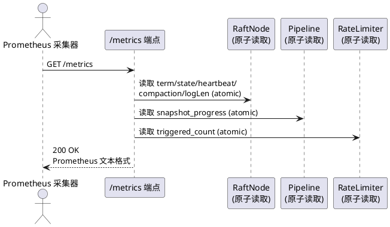
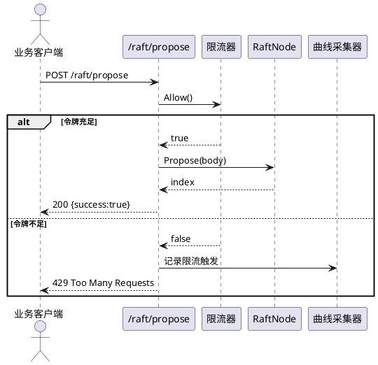
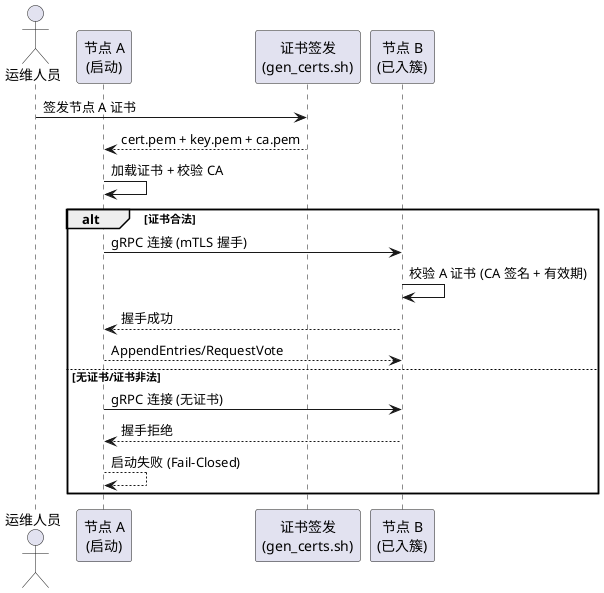
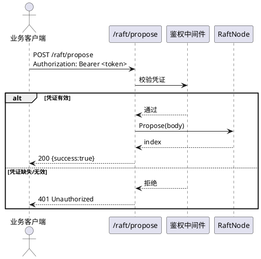

# 生产化第一阶段：可观测性 + 过载保护 + 节点间安全

> 批次：batch15
> 上游依据：docs/specs/production_readiness.md（batch14 差距清单，38% 就绪度）
> 基线参照：3min c=128 TPS=8240.4 / 成功率=100% / P99=50ms / 5/5 存活 / 0 次 leader 切换
> 红线约束：禁去 fsync / 禁跳 quorum / 禁缩选举超时（增大允许）/ 禁调参刷数 / pipeline 正确性三原则 / 禁止改 proto / 成功率双报制 / 客户端 retry 不计入服务端稳定性成绩 / 可观测性代码不得进入写路径热区

---

# **1. 组件定位**

## **1.1 核心职责**
本组件负责为 Raft 共识引擎补齐生产级可观测性、过载保护、节点间安全三维度能力，实现"系统敢不敢托付"的最低门槛跨越。

## **1.2 核心输入**
1. Prometheus 采集器对 /metrics 端点的周期性抓取请求（来源：外部监控系统）
2. 客户端写/读请求（来源：业务客户端，经 HTTP /raft/propose、/raft/get）
3. 节点间 gRPC 通信（来源：集群内 peer 节点，AppendEntries/RequestVote/Snapshot 流）
4. 过载压测流量（来源：loadgen 压测工具，c=512 并发）
5. 证书/密钥材料（来源：运维侧证书签发流程，gen_certs.sh 产出）

## **1.3 核心输出**
1. 统一 /metrics 端点的 Prometheus 文本格式指标流（目标：Prometheus 采集器）
2. 限流决策（允许/拒绝）回写至请求处理链路（目标：HTTP/gRPC 处理器）
3. 过载行为曲线报告文件（目标：运维侧落盘存档）
4. mTLS 加密通道建立/拒绝事件（目标：节点间通信层 + 日志）
5. 客户端鉴权决策（允许/拒绝 + 401/403 响应）（目标：业务客户端）

## **1.4 职责边界**
1. **不负责**结构化日志（JSON 格式、日志级别、traceID）——属 batch16
2. **不负责**链路追踪（慢查询检测、全链路 traceID）——属 batch16
3. **不负责**配置热更新（参数运行时变更）——属 batch16
4. **不负责**滚动升级/节点替换自动化——属 batch16
5. **不负责**备份恢复演练——属 batch16
6. **不负责**WAL 加密（SM4-CTR 已就绪）——已由 batch13 完成
7. **不负责**幂等 token 防重复提交——已就绪
8. **不负责**磁盘满处理/网络分区实测——本批仅涉及过载保护中的限流策略，磁盘满降级属 batch15 并行项但不在本规格范围
9. **不修改** proto 定义（红线约束 6）
10. **不进入**写路径热区（metrics 采集开销 P99 影响 <1ms，红线约束 9）

---

# **2. 领域术语**

**Metrics 清单**
: 本组件对外导出的全部 Prometheus 指标的集合，包含 TPS、延迟分位、心跳间隔、选举事件、compaction 计数、日志长度、快照进度、限流触发计数八类。
: 备注：对应 production_readiness.md §1.1 中标注 batch15 的六项差距。

**统一 /metrics 端点**
: 将原本分散在 /latency/metrics、/raft/stats、/pipeline/stats 等多端点的指标，聚合为单一 Prometheus 文本格式输出的 HTTP 端点。
: 备注：现有 /latency/metrics 仅导出延迟直方图，不包含 TPS/心跳/选举/compaction 等。

**令牌桶限流**
: 以固定速率向桶中投放令牌、请求消耗令牌的限流策略，桶满时丢弃新令牌，桶空时拒绝请求。
: 备注：与现有 rate_limiter.go 中基于内存高水位的简单限流不同，令牌桶提供独立的 QPS 维度控制。

**自适应限流**
: 根据 quorum 延迟反馈动态调整限流阈值的策略，当 quorum 提交延迟上升时主动降载，延迟恢复时放宽阈值。
: 备注：与令牌桶为二选一关系，本规格要求选型决策并写明理由。

**过载行为曲线**
: 在过载压测过程中，以时间序列记录并发数、TPS、P99 延迟、成功率、存活节点数的曲线数据，用于验证降级平滑性。
: 备注：验收线第 2 条要求"过载行为曲线落盘"。

**mTLS**
: 节点间双向 TLS 认证，客户端和服务端均需出示证书并由对方验证 CA 签名，建立加密通道。
: 备注：现有 grpc_server.go 已有 mTLS 框架代码，但"证书不存在时降级为明文"不满足生产级负路径要求。

**证书轮换**
: 在不中断服务的前提下，将节点间通信证书从旧版本替换为新版本的流程，含双证书并行窗口。
: 备注：本规格要求写明轮换方案，不要求实现自动化轮换（属 batch16+）。

**负路径实测**
: 验证系统在异常/非法输入下的拒绝行为，特指 mTLS 场景下"无证书节点尝试入簇时被拒绝"的实测验证。
: 备注：验收线第 3 条要求"无证书时节点拒绝入簇（负路径实测并记录）"。

**客户端鉴权最小集**
: 对 /raft/propose 和 /raft/get 端点施加的最小鉴权机制，仅覆盖"谁能写、谁能读"的准入控制，不涉及细粒度权限。
: 备注：现有端点无鉴权，幂等 token 仅防重复提交不防伪冒。

**写路径热区**
: Raft 共识引擎中 Propose → WAL 追加 → quorum 复制 → commit 的同步关键路径，任何额外开销直接影响 TPS 和 P99。
: 备注：红线约束 9 要求可观测性代码不得进入此路径。

**采集开销基准对比**
: 在开启 metrics 采集前后分别运行 3min c=128 基准压测，对比 TPS/P99 差值以验证采集开销可忽略。
: 备注：验收线第 1 条要求 TPS≥8100（基线 98%），P99≤50ms。

---

# **3. 角色与边界**

## **3.1 核心角色**
- **运维人员**：通过 /metrics 端点接入 Prometheus、配置 mTLS 证书材料、执行证书轮换、查阅过载行为曲线报告。
- **业务客户端**：通过 HTTP /raft/propose、/raft/get 发起读写请求，需通过客户端鉴权。

## **3.2 外部系统**
- **Prometheus 采集器**：周期性抓取 /metrics 端点，解析 Prometheus 文本格式指标。
- **集群内 peer 节点**：通过 gRPC 进行 AppendEntries/RequestVote/InstallSnapshot 通信，需通过 mTLS 双向认证。
- **loadgen 压测工具**：发起 c=128/c=512 并发压测流量，用于验收线复测。
- **证书签发流程（gen_certs.sh）**：产出节点证书、私钥、CA 证书，供 mTLS 加载。

## **3.3 交互上下文**

```plantuml
@startuml
skinparam componentStyle rectangle

actor "运维人员" as ops
actor "业务客户端" as client
component "生产硬化组件\n(batch15)" as hardening
system "Prometheus 采集器" as prom
collections "集群 peer 节点" as peers
system "证书签发流程\n(gen_certs.sh)" as ca
actor "loadgen 压测工具" as loadgen

ops --> hardening : 配置证书 / 查阅过载曲线
client --> hardening : 读写请求 (鉴权)
prom --> hardening : 抓取 /metrics
peers <--> hardening : gRPC (mTLS)
ca --> hardening : 证书材料
loadgen --> hardening : 压测流量 c=128/512

@enduml
```

---

# **4. DFX约束**

## **4.1 性能**

1. **metrics 采集开销上限**：开启全清单 metrics 采集后，3min c=128 复测 TPS 必须 ≥8100（基线 8240.4 的 98%），P99 必须 ≤50ms。
   - 验收条件：采集开启前后基准对比 → TPS 衰减 <2%，P99 无劣化
2. **metrics 采集不得进入写路径热区**：metrics 埋点代码的采集开销对单次 Propose 的 P99 影响必须 <1ms。
   - 验收条件：基准对比微基准测试 → 单次 Propose 耗时增量 <1ms
3. **mTLS 开销上限**：mTLS 开启后 TPS 必须 ≥7800（基线 8240.4 的 ~95%）。
   - 验收条件：mTLS 开启后 3min c=128 复测 → TPS≥7800
4. **限流器决策开销**：限流器 Allow() 决策耗时必须 <0.1ms（O(1) 原子操作）。
   - 验收条件：单测基准 → Allow() 耗时 <0.1ms

## **4.2 可靠性**

1. **过载降级而非崩溃**：限流开启后 c=512 过载压测，系统必须降级运行，P99 必须 ≤100ms，5/5 存活，无级联失败。
   - 验收条件：c=512 过载压测 3min → P99≤100ms / 5/5 存活 / 无级联失败
2. **成功率曲线平滑下降**：过载时成功率必须平滑下降，禁止跳崖式跌落（相邻采样点跌幅 <15%）。
   - 验收条件：过载行为曲线相邻采样点成功率跌幅 <15%
3. **mTLS 不影响集群互通**：mTLS 开启后 5/5 节点必须互通正常，共识功能不受影响。
   - 验收条件：mTLS 开启后 5/5 节点互通 / leader 选举正常 / 读写正常
4. **阶梯复测无回归**：8→256 阶梯复测必须对照 batch14 基线无性能回归。
   - 验收条件：阶梯复测 8/16/32/64/128/256 各档 TPS/P99/成功率 不劣于 batch14 基线

## **4.3 安全性**

1. **mTLS 强制双向认证**：节点间通信必须启用 mTLS，无证书节点必须被拒绝入簇。
   - 验收条件：无证书节点尝试入簇 → 连接被拒绝（负路径实测并记录）
2. **mTLS 降级禁止**：生产模式下证书加载失败时必须拒绝启动，禁止降级为明文传输。
   - 验收条件：生产模式 + 证书缺失 → 节点启动失败（Fail-Closed）
3. **客户端鉴权强制**：/raft/propose 和 /raft/get 必须施加鉴权，无凭证请求必须返回 401/403。
   - 验收条件：无凭证请求 /raft/propose → 401；无凭证请求 /raft/get → 401
4. **证书密钥安全**：私钥文件权限必须 ≤0600，禁止明文存储私钥。
   - 验收条件：ls -l 私钥文件 → 权限 ≤0600

## **4.4 可维护性**

1. **过载行为曲线落盘**：过载压测必须产出曲线报告文件（含时间序列数据），落盘存档。
   - 验收条件：过载压测结束 → 生成曲线报告文件（含并发/TPS/P99/成功率/存活节点数时间序列）
2. **metrics 端点可被发现**：/metrics 端点必须遵循 Prometheus 标准文本格式（Content-Type: text/plain; version=0.0.4）。
   - 验收条件：curl /metrics → Content-Type 正确 / 格式可被 prometheus parser 解析
3. **单测护栏**：metrics 埋点、限流器状态机、证书校验三块必须有单测覆盖，全 PASS。
   - 验收条件：go test 三块单测 → 全 PASS

## **4.5 兼容性**

1. **现有端点保持兼容**：统一 /metrics 端点为新增，现有 /latency/metrics、/raft/stats 等端点必须保持不变。
   - 验收条件：现有端点响应格式/内容不变
2. **mTLS 可降级为开发模式**：非生产模式（如单测/本地开发）允许通过环境变量显式声明跳过 mTLS。
   - 验收条件：DEV_MODE=1 → 跳过 mTLS（仅开发模式，生产模式禁止）

---

# **5. 核心能力**

## **5.1 统一 Prometheus /metrics 端点**

### **5.1.1 业务规则**

1. **指标清单完整性**：/metrics 端点必须导出以下全清单指标，禁止遗漏任何一项。
   - **raft_tps**：每秒事务数（counter 派生 gauge）
   - **raft_request_duration_seconds**：延迟分位 P50/P99（histogram，现有 /latency/metrics 已就绪，需聚合）
   - **raft_heartbeat_interval_seconds**：当前心跳间隔（gauge）
   - **raft_election_events_total**：选举事件计数（counter，含 term 变化、state 转换）
   - **raft_compaction_count_total**：compaction 执行总次数（counter）
   - **raft_log_length**：当前日志长度（gauge，即 LogCount）
   - **raft_snapshot_progress**：快照进度（gauge，0.0~1.0 表示进度百分比）
   - **raft_rate_limit_triggered_total**：限流触发计数（counter）
   - 验收条件：curl /metrics → 输出包含上述全部指标名 / 无遗漏

2. **Prometheus 格式合规**：/metrics 端点输出必须符合 Prometheus 文本 exposition 格式。
   - 验收条件：curl /metrics → Content-Type=text/plain; version=0.0.4 / 每指标含 # HELP 和 # TYPE 行 / prometheus parser 可解析

3. **指标来源聚合**：/metrics 必须聚合现有分散端点的指标，禁止仅导出部分。
   - 现有 /latency/metrics 的 grpc_request_duration_seconds histogram 必须纳入
   - 现有 /raft/stats 的 consecutiveTimeouts/consecutiveSuccess 必须以 Prometheus 格式纳入
   - 现有 /raft/stats 的 term/state/leaderID 必须以 Prometheus gauge/label 形式纳入
   - compaction 计数必须从 raft_pipeline.go 的异步快照调度器中提取并纳入
   - 验收条件：/metrics 输出 ⊇ 现有 /latency/metrics + /raft/stats + /pipeline/stats 的全部指标

4. **采集开销隔离**：metrics 采集代码不得进入 Propose → WAL → quorum 写路径热区，必须通过异步/原子/旁路方式采集。
   - 验收条件：代码审查 → metrics 埋点不在 Propose 同步路径 / 基准对比 P99 增量 <1ms

5. **心跳间隔导出**：raft_heartbeat_interval_seconds 必须反映当前自适应心跳间隔（adaptiveHeartbeatAdjust 的实际值）。
   - 验收条件：触发连续心跳超时 → raft_heartbeat_interval_seconds 升至 heartbeatIntervalMax / 恢复后降回 min

6. **选举事件导出**：raft_election_events_total 必须在每次 term 变化或 state 转换时递增。
   - 验收条件：触发 leader 切换 → raft_election_events_total 递增 / term 变化 → 递增

7. **compaction 计数导出**：raft_compaction_count_total 必须在每次异步快照完成（日志压缩）时递增。
   - 验收条件：触发快照 → raft_compaction_count_total 递增 / 值 = 实际 compaction 次数

8. **快照进度导出**：raft_snapshot_progress 必须反映当前快照执行进度（0.0=未开始/进行中=0.0~1.0/1.0=完成）。
   - 验收条件：快照执行中 → raft_snapshot_progress ∈ (0,1) / 快照完成 → 1.0

9. **禁止项：禁止在写路径同步采集**：metrics 采集禁止在 Propose/WAL 追加/quorum 复制的同步路径中执行 I/O 或锁竞争操作。
   - 验收条件：代码审查 → 采集点仅用 atomic.Load / 无 mu.Lock / 无 I/O

### **5.1.2 交互流程**



### **5.1.3 异常场景**

1. **指标采集冲突**
   a. 触发条件：metrics 采集与 Raft 状态机并发访问同一字段
   b. 系统行为：通过 atomic.Load 原子读取，不加锁，不阻塞写路径
   c. 用户感知：无（采集对写路径零干扰）

2. **指标值溢出**
   a. 触发条件：counter/gauge 值超过 int64 上限（极端长时间运行）
   b. 系统行为：Prometheus counter 自然回绕（符合 Prometheus 规范）
   c. 用户感知：Prometheus 采集器自动处理回绕

3. **/metrics 端点过载**
   a. 触发条件：Prometheus 采集频率过高导致 /metrics 响应缓慢
   b. 系统行为：/metrics 响应必须 <100ms（指标读取均为 O(1) 原子操作）
   c. 用户感知：Prometheus 采集无超时

---

## **5.2 过载保护**

### **5.2.1 业务规则**

1. **限流策略选型决策**：必须在令牌桶与自适应限流之间做出选型，并写明选型理由。
   - 令牌桶：固定速率投放令牌，桶空时拒绝，提供独立 QPS 维度控制
   - 自适应：按 quorum 延迟反馈降载，延迟升时降阈值，延迟恢复时放宽
   - 验收条件：spec/design 文档 → 明确选型 + 理由 + 预期行为曲线描述

2. **限流器接入请求处理链路**：限流器必须接入 /raft/propose 请求处理链路，在 Propose 调用前执行 Allow() 决策。
   - 验收条件：限流触发时 /raft/propose → 返回 429 Too Many Requests / 限流未触发时 → 正常处理

3. **过载时 P99 有界**：限流开启后 c=512 过载压测，P99 必须 ≤100ms。
   - 验收条件：c=512 过载压测 3min → P99≤100ms

4. **过载时不级联崩溃**：过载时禁止级联失败（单节点拒绝不得导致其他节点崩溃或 leader 切换）。
   - 验收条件：c=512 过载压测 → 0 次 leader 切换 / 5/5 存活 / 无节点崩溃

5. **过载时成功率平滑下降**：过载时成功率必须平滑下降，禁止跳崖式跌落。
   - 验收条件：过载行为曲线相邻采样点成功率跌幅 <15% / 曲线无垂直跌落

6. **过载行为曲线落盘**：过载压测必须产出曲线报告文件，含时间序列数据。
   - 报告内容：时间戳、并发数、TPS、P50、P99、成功率、存活节点数
   - 验收条件：过载压测结束 → 生成报告文件（如 overload_curve_c512.json/csv）

7. **限流触发计数导出**：限流触发次数必须通过 raft_rate_limit_triggered_total 指标导出。
   - 验收条件：限流触发 → raft_rate_limit_triggered_total 递增 / curl /metrics 可见

8. **限流器状态机单测**：限流器状态机必须有单测覆盖，验证 Allow/Deny 状态流转。
   - 验收条件：go test 限流器单测 → 全 PASS（覆盖桶满/桶空/恢复/持续过载场景）

9. **禁止项：禁止限流导致 quorum 不可用**：限流不得拒绝 Raft 内部通信（AppendEntries/RequestVote），仅限流客户端写请求。
   - 验收条件：过载压测期间 → quorum 复制正常 / leader-follower 同步不受限流影响

10. **禁止项：禁止限流器进入写路径热区同步阻塞**：限流决策必须 O(1) 原子操作，禁止在决策中执行 I/O 或锁竞争。
    - 验收条件：Allow() 耗时 <0.1ms / 无 mu.Lock / 无 I/O

### **5.2.2 交互流程**



### **5.2.3 异常场景**

1. **限流器状态损坏**
   a. 触发条件：限流器内部状态异常（如负数令牌计数）
   b. 系统行为：Fail-Open，放行请求并记录告警（避免限流器故障导致服务不可用）
   c. 用户感知：请求正常处理 / 日志有告警

2. **过载压测中节点崩溃**
   a. 触发条件：c=512 过载压测中某节点 OOM 或 panic
   b. 系统行为：禁止级联崩溃，剩余节点必须维持 quorum 并继续服务
   c. 用户感知：成功率下降但无全集群不可用 / 5/5 存活（或至少 3/5 维持 quorum）

3. **限流阈值配置错误**
   a. 触发条件：限流阈值配置为 0 或负数
   b. 系统行为：启动时校验，拒绝启动并报错
   c. 用户感知：启动失败 + 明确错误信息

---

## **5.3 节点间 mTLS 安全**

### **5.3.1 业务规则**

1. **mTLS 强制启用**：生产模式下节点间 gRPC 通信必须启用 mTLS，禁止明文传输。
   - 验收条件：生产模式启动 → gRPC 通道 TLS 加密 / 抓包可见加密流量

2. **无证书拒绝入簇（负路径）**：无证书或证书无效的节点尝试加入集群时，必须被拒绝。
   - 验收条件：无证书节点 ConnectAll → 连接被拒绝 / 日志记录拒绝事件 / 不影响现有集群

3. **证书加载失败 Fail-Closed**：生产模式下证书加载失败时必须拒绝启动，禁止降级为明文。
   - 验收条件：生产模式 + 证书缺失/损坏 → 节点启动失败 + 明确错误 / 不降级为明文

4. **开发模式显式跳过**：非生产模式允许通过环境变量（如 DEV_MODE=1）显式声明跳过 mTLS。
   - 验收条件：DEV_MODE=1 → 跳过 mTLS / 未设置 → 生产模式强制 mTLS

5. **mTLS 开销可控**：mTLS 开启后 TPS 必须 ≥7800（基线 ~95%）。
   - 验收条件：mTLS 开启后 3min c=128 复测 → TPS≥7800

6. **5/5 节点互通正常**：mTLS 开启后 5/5 节点必须互通正常，共识功能不受影响。
   - 验收条件：mTLS 开启 → 5/5 节点互通 / leader 选举正常 / 读写正常 / 0 次 leader 异常切换

7. **证书校验单测**：证书校验逻辑必须有单测覆盖，验证合法/非法/过期/CA 不匹配场景。
   - 验收条件：go test 证书校验单测 → 全 PASS（覆盖合法证书/无证书/过期证书/CA 不匹配/自签名）

8. **密钥轮换方案写明**：必须写明证书密钥轮换方案（含双证书并行窗口、轮换步骤、回滚方案）。
   - 验收条件：spec/design 文档 → 含密钥轮换方案章节

9. **禁止项：禁止明文降级（生产模式）**：生产模式下禁止从 mTLS 降级为明文，即使证书加载失败。
   - 验收条件：生产模式 + 证书加载失败 → 启动失败（不降级）

10. **禁止项：禁止跳过证书校验**：mTLS 必须校验对端证书的 CA 签名和有效期，禁止 InsecureSkipVerify。
    - 验收条件：代码审查 → tls.Config 中 InsecureSkipVerify=false / RootCAs 已设置

### **5.3.2 交互流程**



### **5.3.3 异常场景**

1. **证书过期**
   a. 触发条件：节点证书已过有效期
   b. 系统行为：mTLS 握手失败，连接被拒绝，节点无法入簇
   c. 用户感知：节点启动失败 / 日志记录"证书过期" / 需运维重新签发

2. **CA 不匹配**
   a. 触发条件：节点证书由不同 CA 签发
   b. 系统行为：mTLS 握手时 CA 校验失败，连接被拒绝
   c. 用户感知：节点无法入簇 / 日志记录"CA 不匹配"

3. **证书加载失败（生产模式）**
   a. 触发条件：生产模式下证书文件缺失或格式错误
   b. 系统行为：Fail-Closed，节点拒绝启动
   c. 用户感知：启动失败 + 明确错误信息（不降级为明文）

4. **证书加载失败（开发模式）**
   a. 触发条件：DEV_MODE=1 且证书文件缺失
   b. 系统行为：跳过 mTLS，明文传输，日志告警
   c. 用户感知：节点正常启动 / 日志有"开发模式跳过 mTLS"告警

5. **mTLS 握手超时**
   a. 触发条件：mTLS 握手因网络问题超时
   b. 系统行为：按现有重试逻辑重试（最多 30 次，间隔 2s）
   c. 用户感知：节点延迟入簇 / 最终成功或报错

---

## **5.4 客户端鉴权最小集**

### **5.4.1 业务规则**

1. **鉴权端点覆盖**：/raft/propose 和 /raft/get 必须施加鉴权，无凭证请求必须被拒绝。
   - 验收条件：无凭证 POST /raft/propose → 401 Unauthorized / 无凭证 GET /raft/get → 401

2. **鉴权方式最小化**：鉴权机制必须为最小集，仅覆盖"谁能写、谁能读"的准入控制，不涉及细粒度权限。
   - 验收条件：鉴权仅校验凭证有效性 → 不涉及字段级/行级权限

3. **鉴权凭证形式**：鉴权凭证必须通过 HTTP Header 传递（如 Authorization: Bearer <token> 或 X-API-Key）。
   - 验收条件：curl 无 Authorization Header → 401 / curl 带有效 Header → 正常处理

4. **鉴权不影响内部通信**：客户端鉴权仅施加于 HTTP 端点，不得施加于节点间 gRPC 通信（gRPC 由 mTLS 保护）。
   - 验收条件：节点间 gRPC 通信无鉴权 Header → 正常通信（由 mTLS 保护）

5. **鉴权与幂等 token 正交**：鉴权与现有 idem_token 防重复提交机制正交，不互相干扰。
   - 验收条件：带鉴权 + idem_token → 正常去重 / 带鉴权无 idem_token → 正常处理 / 无鉴权 → 401

6. **禁止项：禁止鉴权进入写路径热区**：鉴权校验必须在请求入口完成，不得进入 Propose 同步路径。
   - 验收条件：鉴权校验在 HTTP Handler 层 → 不在 RaftNode.Propose 内

### **5.4.2 交互流程**



### **5.4.3 异常场景**

1. **凭证过期**
   a. 触发条件：客户端凭证已过期
   b. 系统行为：返回 401 Unauthorized
   c. 用户感知：401 + 错误信息"凭证过期"

2. **凭证格式错误**
   a. 触发条件：Authorization Header 格式错误（如非 Bearer 格式）
   b. 系统行为：返回 401 Unauthorized
   c. 用户感知：401 + 错误信息"凭证格式错误"

3. **鉴权服务不可用**
   a. 触发条件：鉴权依赖的外部服务（如有）不可用
   b. 系统行为：Fail-Closed，拒绝请求（避免无鉴权放行）
   c. 用户感知：503 Service Unavailable + 错误信息"鉴权服务不可用"

---

# **6. 数据约束**

## **6.1 Metrics 指标定义**

1. **raft_tps**：每秒事务数，gauge 类型，非负浮点数，单位 transactions/second
2. **raft_request_duration_seconds**：请求耗时分布，histogram 类型，非负浮点数，单位秒，桶边界与现有 latencyBuckets 一致
3. **raft_heartbeat_interval_seconds**：当前心跳间隔，gauge 类型，正浮点数，单位秒，取值范围 [heartbeatIntervalMin, heartbeatIntervalMax]
4. **raft_election_events_total**：选举事件总计数，counter 类型，非负整数，单调递增
5. **raft_compaction_count_total**：compaction 执行总次数，counter 类型，非负整数，单调递增
6. **raft_log_length**：当前日志长度，gauge 类型，非负整数，等于 RaftStats.LogCount
7. **raft_snapshot_progress**：快照执行进度，gauge 类型，浮点数，取值范围 [0.0, 1.0]
8. **raft_rate_limit_triggered_total**：限流触发总计数，counter 类型，非负整数，单调递增

## **6.2 限流器状态**

1. **限流策略类型**：枚举值，∈ {token_bucket, adaptive}，启动时确定，运行时不变
2. **令牌桶容量**：正整数，单位令牌数，决定最大突发并发
3. **令牌补充速率**：正浮点数，单位令牌/秒，决定稳态 QPS 上限
4. **当前令牌数**：非负浮点数，≤ 令牌桶容量
5. **限流触发计数**：非负整数，单调递增，对应 raft_rate_limit_triggered_total
6. **自适应阈值（如选型 adaptive）**：正浮点数，随 quorum 延迟反馈动态调整，单位 QPS

## **6.3 mTLS 证书体系**

1. **节点证书（cert.pem）**：X.509 证书，含节点 ID（CN 或 SAN），由集群 CA 签发，有有效期
2. **节点私钥（key.pem）**：PEM 格式私钥，文件权限 ≤0600，禁止明文存储
3. **CA 证书（ca.pem）**：集群根证书，用于校验对端节点证书签名，所有节点共享
4. **证书有效期**：正整数，单位天，必须在过期前完成轮换
5. **TLS 最低版本**：TLS 1.2（tls.VersionTLS12），禁止 TLS 1.0/1.1
6. **InsecureSkipVerify**：必须为 false，禁止跳过证书校验

## **6.4 客户端鉴权凭证**

1. **凭证类型**：Bearer Token 或 API Key，通过 Authorization Header 传递
2. **凭证有效期**：正整数，单位秒，过期后返回 401
3. **凭证权限范围**：最小集，仅区分"可写"/"可读"，不涉及细粒度权限

## **6.5 过载行为曲线报告**

1. **时间戳**：ISO 8601 格式，记录每个采样点的时间
2. **并发数**：正整数，当前压测并发连接数
3. **TPS**：非负浮点数，当前每秒事务数
4. **P50 延迟**：非负浮点数，单位毫秒
5. **P99 延迟**：非负浮点数，单位毫秒
6. **成功率**：浮点数，取值范围 [0.0, 1.0]
7. **存活节点数**：正整数，取值范围 [1, 5]
8. **采样间隔**：正整数，单位秒，建议 1s 或 5s

---

# **7. 验收线（全部硬数字）**

> 以下为用户签发的验收线原文，全部为硬数字，必须逐条达成。

1. **/metrics 端点全清单 + 采集开销复测**：/metrics 端点输出全清单指标（§5.1.1 第 1 条），采集开启后 3min c=128 复测：TPS≥8100（基线 8240 的 98%，允许观测开销）/ 双报成功率≥99.9% / P99≤50ms / 5/5 存活。

2. **限流过载压测 + 曲线落盘**：限流开启后 c=512 过载压测：系统降级而非崩溃——P99≤100ms 且成功率曲线平滑、无级联失败、5/5 存活，过载行为曲线落盘。

3. **mTLS 正负路径 + 开销复测**：mTLS 开启后：5/5 节点互通正常，无证书时节点拒绝入簇（负路径实测并记录），mTLS 开销复测 TPS≥7800。

4. **单测护栏**：metrics 埋点 / 限流器状态机 / 证书校验 三块单测，全 PASS。

5. **阶梯复测无回归**：阶梯复测 8→256 确认无性能回归（对照 batch14 基线）。

---

# **8. 红线约束（继承）**

> 以下为用户签发的红线约束，全程不得违反。

1. 禁去 fsync
2. 禁跳 quorum
3. 禁缩选举超时（增大允许）
4. 禁调参刷数
5. pipeline 正确性三原则
6. 禁止改 proto
7. 成功率双报制
8. 客户端 retry 不计入服务端稳定性成绩
9. 可观测性代码不得进入写路径热区（metrics 采集开销 P99 影响 <1ms）

---

# **9. 现有代码基线（供 design 参考）**

> 以下为代码探查发现，供 spec-design-agent 参考，不属于本规格的约束。

## **9.1 可观测性现状**
- RaftStats 结构（types.go:63）：含 ID/State/Term/LeaderID/CommitIndex/LastApplied/LogCount/PeerCount/VotedFor/ElectionTime，**不含** consecutiveTimeouts/consecutiveSuccess（在 raft.go RaftNode 中为 int32 原子变量）
- /latency/metrics：已有 Prometheus 格式延迟直方图（grpc_request_duration_seconds histogram），仅延迟分位
- /raft/stats：输出文本格式统计，未导出 Prometheus
- raft_pipeline.go：有"异步快照完成"日志计数，无端点导出
- 无统一 /metrics 端点

## **9.2 过载保护现状**
- rate_limiter.go：已有基于内存高水位的 RateLimiter（highWaterMark/lowWaterMark），非令牌桶、非自适应
- RateLimiter.Allow()：内存超 highWaterMark 时 throttled=1，返回 false
- replicateCh 缓冲 256，channel 满时阻塞，无显式背压策略

## **9.3 节点间安全现状**
- grpc_server.go：已有 mTLS 框架代码（服务端 119-138 行 / 客户端 273-298 行）
- 关键问题：当前"证书不存在时降级为明文"不满足生产级 Fail-Closed 要求
- 客户端鉴权：/raft/propose 和 /raft/get 无鉴权
- 幂等 token：已就绪（idem_token 防重复提交）
- WAL 加密：SM4-CTR 已就绪