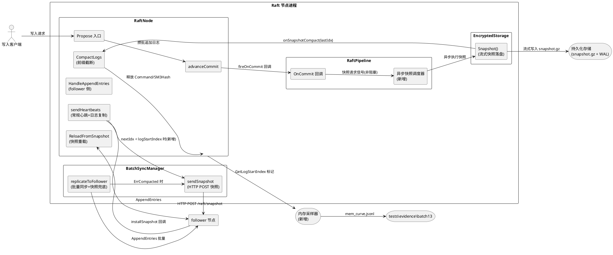
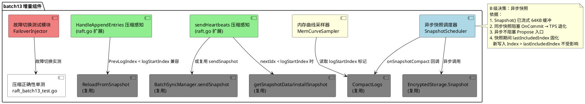
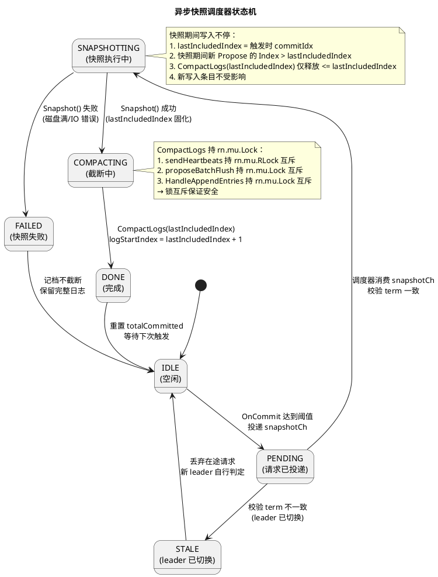
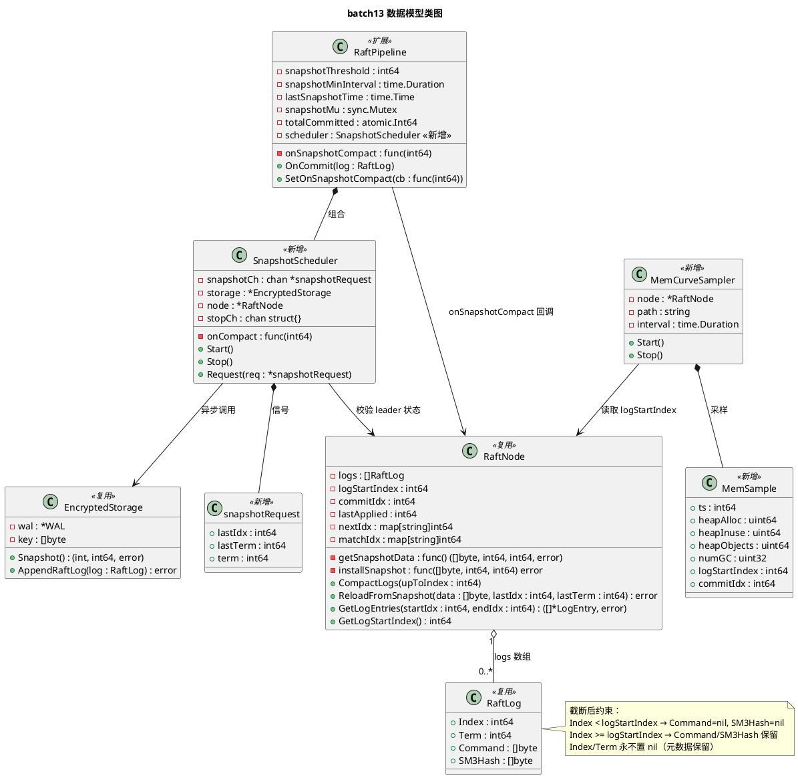
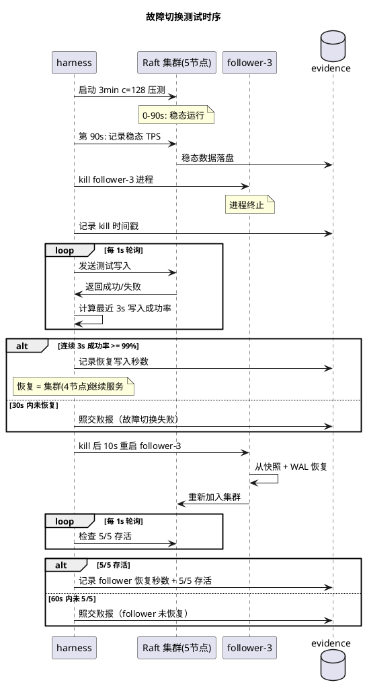

# batch13 log compaction 技术设计

# 一、需求与存量功能关系分析

## 1.1 需求功能与存量功能对比

### 1.1.1 已实现功能

| 需求功能 | 存量功能 | 代码位置 | 匹配度 |
|---------|---------|---------|--------|
| 日志前缀截断（释放 Command/SM3Hash 大字段，保留 Index/Term 元数据） | `CompactLogs(upToIndex)` 方法：遍历 logs 数组，将 Index<=upToIndex 的条目 Command/SM3Hash 置 nil，设置 logStartIndex=upToIndex+1 | raft.go:663-683 | 100% |
| 压缩后起始索引标记 | `logStartIndex int64` 字段，初始值 0，CompactLogs 后设为 upToIndex+1 | raft.go:70 | 100% |
| 已压缩请求返回 ErrCompacted 指示走快照路径 | `GetLogEntries(startIdx,endIdx)` 在 startIdx < logStartIndex 时返回 (nil, ErrCompacted) | raft.go:421-441 | 100% |
| ErrCompacted 错误定义 | `var ErrCompacted = errors.New("log compacted: requested index < logStartIndex")` | raft.go:28-29 | 100% |
| 从快照重载日志（崩溃恢复 / follower 安装快照） | `ReloadFromSnapshot(snapshotData, lastIncludedIndex, lastIncludedTerm)`：json 反序列化 → 赋值 logs/commitIdx/lastApplied/logStartIndex=1 | raft.go:461-483 | 100% |
| 获取 logStartIndex（供外部观测 compaction 是否发生） | `GetLogStartIndex()` 返回 rn.logStartIndex | raft.go:444-448 | 100% |
| 快照数据生成回调 | `getSnapshotData func() ([]byte, int64, int64, error)` 回调字段；main.go:223-246 已接入实现（读 snapshot 文件 → gzip 解压 → json 反序列化 → 返回 (data, last.Index, last.Term)） | raft.go:148; main.go:223-246 | 100% |
| 快照安装回调 | `installSnapshot func([]byte, int64, int64) error` 回调字段；main.go:248-257 已接入实现（gzip 压缩 → 写 snapshot 文件 → ReloadFromSnapshot） | raft.go:149; main.go:248-257 | 100% |
| 快照落盘（流式 gzip(json([]RaftLog))，64KB 固定缓冲） | `EncryptedStorage.Snapshot()`：WAL Flush → Replay → SM4 解密 → 流式合并写入临时文件 → rename | raft_storage.go:186-362 | 100% |
| 快照触发联动（阈值触发 → 落盘 → 调用 CompactLogs） | `RaftPipeline.OnCommit()` 中当 totalCommitted >= snapshotThreshold 且距上次快照 >= snapshotMinInterval 时触发 Snapshot() → onSnapshotCompact(log.Index)；main.go:162 已接入 `pipeline.SetOnSnapshotCompact(node.CompactLogs)` | raft_pipeline.go:277-306; main.go:162 | 75% |
| 快照节流（防止频繁快照） | `snapshotMinInterval`（默认 60s）+ `lastSnapshotTime` + `snapshotMu` 互斥锁 | raft_pipeline.go:104-106,288-305 | 100% |
| 落后 follower 追赶走快照路径（批量同步） | `BatchSyncManager.replicateToFollower()` 中 GetLogEntries 返回 ErrCompacted 时调 `sendSnapshot(peerID)`（HTTP POST 快照） | batch_sync.go:155-161,244-306 | 75% |
| 快照兜底 HTTP 传输端点 | main.go:306-320 注册 `/raft/snapshot` HTTP handler，调用 installSnapshot 回调 | main.go:306-320 | 100% |
| 内存自监控（runtime.MemStats + pprof heap dump） | main.go:538-562 goroutine：每 10s 采样 MemStats，Alloc>4GB 时 pprof.WriteHeapProfile | main.go:538-562 | 75% |
| CompactLogs 单测（logStartIndex 设置 / ErrCompacted / 元数据保留 / 单调递增） | raft_knife2_test.go: 5 个测试用例覆盖 CompactLogs 各场景 | raft_knife2_test.go | 100% |
| ReloadFromSnapshot 单测（重载正确性 / 空数据拒绝） | raft_knife3_test.go: TestKnife3_ReloadFromSnapshot + TestKnife3_ReloadFromSnapshot_EmptyData | raft_knife3_test.go:17-63 | 100% |
| 快照节流单测（首次立即触发 / 节流期不触发 / 节流后触发） | raft_snapshot_throttle_test.go: TestSnapshotThrottle + TestSnapshotThrottleConfig | raft_snapshot_throttle_test.go:17-95 | 100% |
| CompactLogs 内存释放单测 | raft_storage_wal_test.go:144-170（CompactLogs 后验证 Command/SM3Hash 为 nil） | raft_storage_wal_test.go:144-170 | 100% |

### 1.1.2 需要扩展的功能

| 需求功能 | 存量功能 | 差异说明 | 扩展方向 |
|---------|---------|---------|---------|
| 快照触发阈值适配 3min c=128 负载 | `snapshotThreshold` 默认 10000，`snapshotMinInterval` 默认 60s | 3min c=128 TPS≈8000 → 约 1.44M 条目；当前 10000 阈值 + 60s 间隔 → 3min 内最多 3 次快照，压缩频率不足，1.35M 条目仍累积；且 totalCommitted.Store(0) 重置后需重新累积 10000 才触发，实际触发间隔远大于 60s | 调整 `WAL_SNAPSHOT_THRESHOLD` 与 `WAL_SNAPSHOT_MIN_INTERVAL_MS` 环境变量；阈值改为 50000（约每 6.25s 累积满），间隔改为 10s，3min 内约 18 次快照，每次释放 50000 条 Command/SM3Hash |
| 快照异步执行（写入不停） | 当前快照在 `OnCommit` 回调中同步执行（raft_pipeline.go:287-306），持 `snapshotMu` 锁阻塞下一个 OnCommit；Snapshot() 含 WAL Replay + SM4 解密 + gzip 压缩 + 文件写入，耗时可能数十 ms | 同步快照阻塞 `fireOnCommit`（raft.go:1202），进而阻塞 advanceCommit 的下一个 commit 推进周期；高并发下 OnCommit 排队 → Propose waitForCommit 超时 → TPS 退化 | 将快照生成与落盘移至独立 goroutine（异步快照），OnCommit 中仅投递快照请求信号到 channel；快照完成后异步调用 onSnapshotCompact（CompactLogs） |
| sendHeartbeats 压缩感知（防止发送已压缩空 Command 条目） | `sendHeartbeats`（raft.go:1028-1159）中 `start = nextIdxSnapshot[p.ID]`，直接访问 `rn.logs[i-1]` 构造 entries，未检查 `start < logStartIndex` | 若 follower 的 nextIdx < logStartIndex，sendHeartbeats 会构造 Command=nil 的 entries 发送给 follower，follower 用空 Command 覆盖现有日志 → 数据丢失 | sendHeartbeats 中增加 `if start < logStartIndex` 检查，走 InstallSnapshot 路径（调用 sendSnapshot 或等价逻辑） |
| HandleAppendEntries 压缩感知（prevLogIndex < logStartIndex 时的处理） | `HandleAppendEntries`（raft.go:1633-1768）中 `req.PrevLogIndex > 0` 时直接访问 `rn.logs[req.PrevLogIndex-1].Term`，未检查 PrevLogIndex < logStartIndex | 若 leader 发送 prevLogIndex < follower.logStartIndex 的 AppendEntries（follower 已压缩该前缀），follower 访问的 Term 仍正确（元数据保留），但语义上 follower 已通过快照拥有该前缀，应返回 Success=true 跳过 | HandleAppendEntries 中增加 PrevLogIndex < logStartIndex 时的兼容处理：若 PrevLogIndex < logStartIndex 且 follower 已通过快照拥有该 index，返回 Success=true（日志已包含） |
| 全程内存曲线采样落盘 | main.go:538-562 仅 10s 采样 + 4GB 阈值 dump，不落盘曲线 | spec 要求全程堆内存占用采样序列落盘 evidence，验证 compaction 后有界；当前无定期采样落盘机制 | 新增内存采样 goroutine，每 5s 采样 HeapAlloc/HeapInuse/HeapObjects 落盘 evidence/batch13/mem_curve.jsonl |
| 故障切换实测（杀 follower 测恢复写入秒数） | 无现成自动化故障注入与恢复计时机制 | spec 要求 3min c=128 中途杀 1 follower，实测恢复写入秒数；当前需 harness 侧手动注入 | 压测 harness 增加故障注入模块：中途 kill 1 follower → 轮询写入成功率恢复 → 记录恢复秒数落盘 evidence |

### 1.1.3 需要新增的功能或接口

**模块一：异步快照调度器（raft_pipeline.go 扩展）**

| 功能点 | 输入 | 输出 | 核心逻辑 | 依赖 |
|--------|------|------|---------|------|
| 异步快照请求信号投递 | 当前 commit 的 RaftLog | 无（非阻塞投递 snapshotCh） | OnCommit 中达到阈值时向 `snapshotCh chan *snapshotRequest` 投递请求，不阻塞 OnCommit | snapshotCh（新增，容量 1） |
| 异步快照执行 goroutine | snapshotRequest{lastIdx, lastTerm, logRef} | 调用 onSnapshotCompact(lastIdx) | 独立 goroutine 消费 snapshotCh → 调用 storage.Snapshot() → 成功后调用 onSnapshotCompact → 失败记档不截断 | EncryptedStorage.Snapshot()、onSnapshotCompact 回调 |
| 快照期间 leader 切换作废 | 旧 leader 的 term | 丢弃在途 snapshotRequest | snapshotRequest 携带 term 字段，执行前校验 `rn.Term() == req.term && rn.IsLeader()`，不满足则丢弃 | RaftNode.Term()、RaftNode.IsLeader() |

**模块二：sendHeartbeats 压缩感知路径（raft.go 扩展）**

| 功能点 | 输入 | 输出 | 核心逻辑 | 依赖 |
|--------|------|------|---------|------|
| follower nextIdx < logStartIndex 检测 | nextIdxSnapshot[p.ID]、logStartIndex | bool needsSnapshot | sendHeartbeats 锁内构造 plan 时检查 `start < logStartIndex`，标记 needsSnapshot=true | logStartIndex（已有） |
| needsSnapshot 时走 InstallSnapshot | peerID、snapshotData | follower 应答 | 锁外调用 getSnapshotData() → HTTP POST /raft/snapshot → follower installSnapshot → ReloadFromSnapshot → 更新 nextIdx=lastIncludedIndex+1 | getSnapshotData（已有）、sendSnapshot（已有） |

**模块三：内存曲线采样器（main.go 扩展）**

| 功能点 | 输入 | 输出 | 核心逻辑 | 依赖 |
|--------|------|------|---------|------|
| 定期内存采样落盘 | 无 | mem_curve.jsonl 行 | 每 5s 调用 runtime.ReadMemStats → 写入 {ts, heapAlloc, heapInuse, heapObjects, numGC, pauseNs} JSON 行 | runtime.MemStats（已有） |
| compaction 触发标记 | CompactLogs 调用时的 logStartIndex | mem_curve.jsonl 标记行 | CompactLogs 内部 logf 已有；采样器读取 logStartIndex 并写入标记行 | GetLogStartIndex()（已有） |

**模块四：故障切换测试模块（harness 扩展）**

| 功能点 | 输入 | 输出 | 核心逻辑 | 依赖 |
|--------|------|------|---------|------|
| 杀 follower 注入 | follower 进程 PID | 进程终止 | 3min 压测第 90s 时 kill 1 follower 进程 | os.Process.Kill |
| 恢复写入计时 | 写入成功率轮询 | 恢复秒数 | kill 后每 1s 轮询写入成功率，连续 3s >=99% 视为恢复，记录总秒数 | 压测 harness 写入统计 |
| follower 重启 | follower 启动命令 | 进程重启 | kill 后 10s 重启 follower 进程，从快照 + WAL 恢复 | docker-compose / 进程启动 |

**模块五：压缩正确性单测（新增 raft_batch13_test.go）**

| 功能点 | 输入 | 输出 | 核心逻辑 | 依赖 |
|--------|------|------|---------|------|
| 日志匹配链完整单测 | 构造 N 条日志 → CompactLogs(K) → 验证 prevLogIndex/prevLogTerm 衔接 | PASS/FAIL | CompactLogs 后遍历 logs[K:]，验证每条 logs[i].Index == i+1 且 Term 保留 | CompactLogs（已有） |
| 追赶跨越截断点单测 | leader CompactLogs(K) → follower nextIdx < logStartIndex → InstallSnapshot → 增量追赶 | PASS/FAIL | 模拟 follower 落后 → 触发 sendSnapshot → ReloadFromSnapshot → AppendEntries 增量 → 验证日志一致 | sendSnapshot（已有）、ReloadFromSnapshot（已有） |
| 崩溃恢复单测 | 写入 N 条 → 快照 → CompactLogs → 模拟崩溃（仅保留 snapshot 文件） → 从快照重载 | PASS/FAIL | 快照落盘后模拟节点重启 → ReloadFromSnapshot → 验证 commitIdx/lastApplied/logStartIndex 恢复正确 | ReloadFromSnapshot（已有） |
| 快照期间写入语义不变单测 | 触发快照 → 快照执行期间并发 Propose → 快照完成后验证新写入完整 | PASS/FAIL | 异步快照期间持续 Propose → 快照完成后验证快照期间写入的日志 Index > lastIncludedIndex 且 Command 完整 | 异步快照调度器（新增）、Propose（已有） |

## 1.2 存量功能详细分析

### 1.2.1 CompactLogs(upToIndex) — raft.go:663-683

**接口契约**：
- 入参：`upToIndex int64`（截断至此 index，含）
- 出参：无（void）
- 副作用：修改 `rn.logs[i].Command` 和 `rn.logs[i].SM3Hash`（i 对应 Index<=upToIndex 的条目）置 nil；修改 `rn.logStartIndex = upToIndex + 1`
- 异常：无显式返回 error；若 upToIndex 超出 logs 范围，循环自然终止（break）
- 锁：持 `rn.mu.Lock()` 全程

**业务规则**：
- 遍历 logs 数组从头开始，Index<=upToIndex 的条目释放大字段
- 遇到第一个 Index>upToIndex 的条目即 break（利用 Index 单调递增特性）
- 仅当 compacted>0 时才更新 logStartIndex（避免无操作时误改）
- 不改变 logs 数组长度与结构，1-based 索引 rn.logs[idx-1] 访问语义不变

**扩展点**：
- 无显式扩展接口；通过 `onSnapshotCompact` 回调（raft_pipeline.go:300-301）被 pipeline 调用
- main.go:162 `pipeline.SetOnSnapshotCompact(node.CompactLogs)` 完成注入

**约束**：
- 必须持 rn.mu 写锁（修改 logs 字段）
- upToIndex 必须 <= commitIdx 且 <= lastApplied（调用方保证，CompactLogs 内部不校验）
- logStartIndex 单调递增（CompactLogs 不检查单调性，但调用方应保证 upToIndex+1 >= 当前 logStartIndex）

### 1.2.2 RaftPipeline.OnCommit — 快照触发联动 — raft_pipeline.go:277-306

**接口契约**：
- 入参：`log RaftLog`（新提交的日志条目）
- 出参：无
- 副作用：WAL 追加；可能触发快照（Snapshot() + CompactLogs）；可能触发 Sink 写入
- 锁：`snapshotMu.Lock()` 仅在快照触发路径中持有；WAL 追加内部自有锁

**业务规则**：
- `totalCommitted` 原子递增（每次 OnCommit 调用）
- 快照触发条件：`snapshotThreshold > 0 && totalCommitted >= snapshotThreshold && time.Since(lastSnapshotTime) >= snapshotMinInterval`
- 快照执行：`storage.Snapshot()` → 成功后 `totalCommitted.Store(0)` 重置计数器 → 调用 `onSnapshotCompact(log.Index)`
- 快照失败：记日志，不重置计数器，不截断（保留完整日志）
- 节流：`snapshotMu` 互斥 + `lastSnapshotTime` 时间戳双重保护

**扩展点**：
- `onSnapshotCompact` 回调可注入任意压缩函数（当前注入 node.CompactLogs）
- `snapshotThreshold` 和 `snapshotMinInterval` 通过环境变量配置

**约束**：
- **同步执行**：Snapshot() 在 OnCommit 调用栈中同步执行，阻塞 fireOnCommit 返回
- **锁顺序**：snapshotMu 与 rn.mu 无嵌套（Snapshot 不持 rn.mu，CompactLogs 持 rn.mu 但在 OnCommit 锁外调用）
- **totalCommitted 语义**：快照后 Store(0) 重置，意味着计数的是"距上次快照的新增条目数"而非"总条目数"

### 1.2.3 BatchSyncManager.replicateToFollower — 落后 follower 追赶 — batch_sync.go:140-236

**接口契约**：
- 入参：`f *syncTask`（含 PeerID、StartIdx、EndIdx、BatchSize）
- 出参：无
- 副作用：向 follower 发送 AppendEntries 或 InstallSnapshot；更新 nextIdx/matchIdx
- 锁：调用 GetLogEntries（持 rn.mu.RLock 短暂）；调用 UpdateFollowerProgress（持 rn.mu.Lock 短暂）

**业务规则**：
- 循环从 startIdx 到 endIdx，每批发送 batchSize 条
- `GetLogEntries(startIdx, endIdx)` 返回 ErrCompacted 时 → 调用 `sendSnapshot(peerID)` 走快照路径
- follower 拒绝时（resp.Success=false）→ 递减 startIdx 和 nextIdx（标准 Raft 回退探测）
- 重试超限 → MarkFollowerDegraded 标记降级

**扩展点**：
- sendSnapshot 通过 HTTP POST 传输快照（非 gRPC InstallSnapshot RPC）
- follower 侧 main.go:306-320 接收 → installSnapshot 回调 → ReloadFromSnapshot

**约束**：
- 仅在 BatchSyncManager 启用时走此路径；未启用时走 sendHeartbeats 常规心跳路径
- sendSnapshot 是"兜底"路径，非高频路径；正常追赶走 AppendEntries 增量

### 1.2.4 sendHeartbeats — 常规心跳 + 日志复制 — raft.go:1028-1159

**接口契约**：
- 入参：无（读 rn 内部状态）
- 出参：无（异步发送 AppendEntries RPC）
- 副作用：向每个 follower 发送 AppendEntries；更新 nextIdx/matchIdx；推进 commit
- 锁：`rn.mu.RLock()` 构造 plans → 解锁 → 锁外发送 RPC → `rn.mu.Lock()` 更新 nextIdx/matchIdx

**业务规则**：
- 锁内为每个 follower 构造 `peerPlan{prevIdx, prevTerm, entries}`
- `start = nextIdxSnapshot[p.ID]`；若 start > 1，prevIdx = start-1，prevTerm = logs[start-2].Term
- entries 从 start 到 logEnd 的所有日志条目（含 Command/SM3Hash）
- 锁外并行发送 AppendEntries RPC；resp.Success 时更新 matchIdx=logEnd, nextIdx=logEnd+1

**扩展点**：
- 无显式压缩感知：未检查 `start < logStartIndex`
- 若 start < logStartIndex，entries 中会包含 Command=nil 的已压缩条目

**约束**：
- 持 rn.mu.RLock 期间不做网络 IO（plans 构造完即解锁）
- resp.Term > term 时 stepDown 转 follower
- pipeline 正确性：resp.Success 按 term/index 对账（matchIdx 更新受 `rn.state == StateLeader && rn.term == term` 双重校验）

### 1.2.5 HandleAppendEntries — follower 侧日志追加 — raft.go:1633-1768

**接口契约**：
- 入参：`req *pb.AppendEntriesRequest`（Term, LeaderId, PrevLogIndex, PrevLogTerm, Entries, LeaderCommit）
- 出参：`*pb.AppendEntriesResponse`（Term, Success）
- 副作用：修改 rn.logs/commitIdx/lastApplied/term/state
- 锁：`rn.mu.Lock()` 全程

**业务规则**：
- Term 检查：req.Term < rn.term 拒绝；req.Term > rn.term 更新 term 转 follower
- PrevLogIndex 检查：`req.PrevLogIndex > lastLogIdx` 拒绝（follower 日志不够长）；`logs[PrevLogIndex-1].Term != PrevLogTerm` 拒绝（任期不匹配）
- Entries 追加：Index <= lastLogIdx 且 Term 不匹配时截断冲突部分；Index > len(logs) 时追加
- LeaderCommit 推进：`req.LeaderCommit > rn.commitIdx` 时推进 commitIdx

**扩展点**：
- 无显式压缩感知：未检查 `req.PrevLogIndex < rn.logStartIndex`
- 若 follower 已压缩 PrevLogIndex 前缀（PrevLogIndex < logStartIndex），logs[PrevLogIndex-1].Term 仍可访问（元数据保留），但语义上 follower 已通过快照拥有该前缀

**约束**：
- 持 rn.mu.Lock 全程（含 fireOnCommit 前解锁）
- walGateClosed 时拒绝写入
- 仅 Follower 根据 LeaderCommit 推进 commitIdx（防外部请求直接推进）
# 二、增量设计方案

## 2.1 实现模型

### 2.1.1 上下文视图



**上下文关系说明**：
1. **上游调用方**：写入客户端通过 Propose 发起写入；advanceCommit 通过 fireOnCommit 触发 OnCommit 回调
2. **下游依赖方**：EncryptedStorage.Snapshot() 负责快照落盘；CompactLogs 负责内存释放；sendSnapshot 负责 follower 快照传输
3. **中间件**：snapshotCh（新增，容量 1 的非阻塞信号 channel）连接 OnCommit 与异步快照调度器
4. **通信协议**：节点间 gRPC（AppendEntries）+ HTTP（快照传输）；进程内 channel（snapshotCh、commitNotify）

### 2.1.2 服务/组件总体架构



**组件职责与依赖说明**：

| 组件 | 职责 | 新增/扩展 | 依赖 |
|------|------|----------|------|
| SnapshotScheduler | 异步快照调度：接收快照请求信号 → 异步执行 Snapshot() → 成功后调用 CompactLogs | 新增（raft_pipeline.go） | EncryptedStorage.Snapshot、onSnapshotCompact |
| sendHeartbeats 压缩感知 | 锁内构造 plan 时检查 nextIdx < logStartIndex，走快照路径 | 扩展（raft.go:1028-1159） | getSnapshotData、sendSnapshot |
| HandleAppendEntries 压缩感知 | PrevLogIndex < logStartIndex 时兼容处理（follower 已通过快照拥有该前缀） | 扩展（raft.go:1633-1768） | logStartIndex |
| MemCurveSampler | 每 5s 采样 runtime.MemStats 落盘 mem_curve.jsonl | 新增（main.go） | runtime.ReadMemStats、GetLogStartIndex |
| FailoverInjector | 3min 压测中途杀 1 follower，计时恢复写入秒数 | 新增（harness） | os.Process.Kill、写入成功率轮询 |
| raft_batch13_test.go | 4 项压缩正确性单测 | 新增 | CompactLogs、ReloadFromSnapshot、sendSnapshot |

**配置项及取值策略**：

| 配置项 | 当前值 | batch13 建议值 | 取值依据 |
|--------|--------|---------------|---------|
| WAL_SNAPSHOT_THRESHOLD | 10000 | 50000 | 3min c=128 TPS≈8000 → 每 6.25s 累积 50000 条；阈值过小→快照频繁；过大→内存累积 |
| WAL_SNAPSHOT_MIN_INTERVAL_MS | 60000 | 10000 | 3min 内允许约 18 次快照，每次释放 50000 条 Command/SM3Hash；间隔过短→IO 压力；过长→内存峰值高 |
| 内存采样间隔 | 10s（仅 dump） | 5s（采样落盘） | 3min 内 36 个采样点，足够绘制内存曲线 |
| 故障注入时机 | 无 | 3min 第 90s | 前半段验证稳态，后半段验证恢复 |

### 2.1.3 实现设计文档

#### 2.1.3.1 异步快照状态机



#### 2.1.3.2 快照触发与截断流程

```plantuml
@startuml
title 快照触发与截断活动图

start

partition "OnCommit 回调（RaftPipeline）" {
  :OnCommit(log);
  :totalCommitted.Add(1);
  :WAL 追加 log;
  if (totalCommitted >= snapshotThreshold\n且距上次快照 >= snapshotMinInterval?) then (yes)
    :snapshotMu.Lock();
    if (双重校验仍满足?) then (yes)
      :lastSnapshotTime = now;
      :lastIdx = log.Index;
      :lastTerm = log.Term;
      :term = rn.Term();
      |异步快照调度器|
      :非阻塞投递 snapshotCh <- {lastIdx, lastTerm, term};
      note right：不阻塞 OnCommit 返回
    else (no)
      :跳过（竞态丢失）;
    endif
    :snapshotMu.Unlock();
  else (no)
    :跳过（未达阈值/节流中）;
  endif
  :Sink 写入（非阻塞）;
  :OnCommit 返回;
end

partition "异步快照 goroutine" {
  :从 snapshotCh 消费请求;
  if (rn.Term() == req.term\n且 rn.IsLeader()?) then (yes)
    :storage.Snapshot() 流式快照;
    if (Snapshot 成功?) then (yes)
      :onSnapshotCompact(req.lastIdx);
      note right：即 node.CompactLogs(req.lastIdx)
      :totalCommitted.Store(0);
      :记档快照成功;
    else (no)
      :记档快照失败;
      note right：不截断，保留完整日志
    endif
  else (no)
    :丢弃（leader 已切换）;
  endif
}

stop

@enduml
```

#### 2.1.3.3 落后 follower 追赶流程

```plantuml
@startuml
title 落后 follower 追赶活动图

start

partition "leader: sendHeartbeats（扩展）" {
  :锁内构造 peerPlan;
  :start = nextIdxSnapshot[p.ID];
  :logStart = rn.logStartIndex;
  if (start < logStart?) then (yes)
    :标记 needsSnapshot = true;
    :plan.entries = nil;
  else (no)
    :正常构造 entries;
  endif
  :解锁;
}

if (needsSnapshot?) then (yes)
  partition "leader: 快照路径" {
    :getSnapshotData();
    if (快照数据获取成功?) then (yes)
      :HTTP POST /raft/snapshot 给 follower;
      if (follower 应答成功?) then (yes)
        :更新 nextIdx = lastIncludedIndex + 1;
        :更新 matchIdx = lastIncludedIndex;
      else (no)
        :记档失败，下次心跳重试;
      endif
    else (no)
      :记档 getSnapshotData 失败;
    endif
  }
else (no)
  partition "leader: 常规 AppendEntries" {
    :发送 AppendEntries(prevLogIndex, entries);
    if (resp.Success?) then (yes)
      :更新 matchIdx = logEnd;
      :更新 nextIdx = logEnd + 1;
      :advanceCommit(term);
    else (no)
      :递减 nextIdx;
    endif
  }
endif

partition "follower: 收到 InstallSnapshot" {
  :installSnapshot(data, lastIdx, lastTerm);
  :gzip 压缩 → 写 snapshot 文件;
  :ReloadFromSnapshot(data, lastIdx, lastTerm);
  :commitIdx = lastIdx;
  :lastApplied = lastIdx;
  :logStartIndex = 1;
  note right：等待后续 AppendEntries 增量追赶
}

stop

@enduml
```

#### 2.1.3.4 快照期间写入语义保证

```plantuml
@startuml
title 快照期间写入语义不变证明

start

:时刻 T0: 快照触发;
:lastIncludedIndex = commitIdx(T0);
note right：快照捕获 [1, lastIncludedIndex] 的日志

partition "快照执行期间 [T0, T1]" {
  :客户端持续 Propose;
  :新日志 Index = len(logs) + 1 > lastIncludedIndex;
  :新日志正常 append 到 logs 数组;
  :新日志正常走 advanceCommit → commit;
  note right
    异步快照不持 rn.mu：
    1. Snapshot() 仅读 WAL + 写文件，不持 rn.mu
    2. Propose/advanceCommit 持 rn.mu 正常工作
    3. 新写入不受快照影响
  end note
}

:时刻 T1: 快照落盘成功;
:CompactLogs(lastIncludedIndex);
note right
  CompactLogs 释放 Index <= lastIncludedIndex 的 Command/SM3Hash
  新写入的 Index > lastIncludedIndex → Command/SM3Hash 保留完整
end note

:验证：快照期间写入的日志;
if (Index > lastIncludedIndex?) then (yes)
  :Command/SM3Hash 保留完整;
  :已 commit 的日志不丢失;
  :写入语义不变 ✓;
else (no)
  :不可能：lastIncludedIndex 在 T0 固化;
  :快照期间新 Index 必 > lastIncludedIndex;
endif

stop

@enduml
```

## 2.2 接口设计

### 2.2.1 总体设计

| 接口分类 | 接口名 | 所在组件 | 稳定性 | 变更类型 |
|---------|--------|---------|--------|---------|
| 快照调度 | `SnapshotScheduler.Start()` | RaftPipeline | 稳定 | 新增 |
| 快照调度 | `SnapshotScheduler.Stop()` | RaftPipeline | 稳定 | 新增 |
| 快照调度 | `SnapshotScheduler.Request(req)` | RaftPipeline | 稳定 | 新增 |
| 压缩感知 | `RaftNode.GetLogStartIndex()` | RaftNode | 稳定 | 复用（已有） |
| 压缩感知 | `RaftNode.GetLogEntries(startIdx, endIdx)` | RaftNode | 稳定 | 复用（已有 ErrCompacted） |
| 快照回调 | `RaftNode.getSnapshotData` | RaftNode | 稳定 | 复用（已有） |
| 快照回调 | `RaftNode.installSnapshot` | RaftNode | 稳定 | 复用（已有） |
| 前缀截断 | `RaftNode.CompactLogs(upToIndex)` | RaftNode | 稳定 | 复用（已有） |
| 快照重载 | `RaftNode.ReloadFromSnapshot(data, idx, term)` | RaftNode | 稳定 | 复用（已有） |
| 内存采样 | `MemCurveSampler.Start(path)` | main | 稳定 | 新增 |
| 内存采样 | `MemCurveSampler.Stop()` | main | 稳定 | 新增 |

**接口变更策略**：
- 所有新增接口与现有接口正交，不修改现有接口签名
- sendHeartbeats 与 HandleAppendEntries 为内部方法扩展，非公共接口
- 环境变量配置变更（WAL_SNAPSHOT_THRESHOLD、WAL_SNAPSHOT_MIN_INTERVAL_MS）向后兼容

### 2.2.2 接口清单

#### SnapshotScheduler — 异步快照调度器

**接口签名**：
```go
// snapshotRequest 快照请求（投递到 snapshotCh）
type snapshotRequest struct {
    lastIdx  int64  // 快照包含的最大日志 Index（触发时的 commitIdx）
    lastTerm int64  // lastIdx 对应的 Term
    term     int64  // 触发时的 leader term（用于校验 leader 是否已切换）
}

// SnapshotScheduler 异步快照调度器
type SnapshotScheduler struct {
    snapshotCh      chan *snapshotRequest // 容量 1，非阻塞投递
    storage         *EncryptedStorage     // 快照存储
    onCompact       func(int64)           // 快照后压缩回调（node.CompactLogs）
    node            *RaftNode             // 用于校验 leader 状态
    wg              sync.WaitGroup        // goroutine 生命周期
    stopCh          chan struct{}         // 停止信号
    logger          *log.Logger
}

func (s *SnapshotScheduler) Start()
func (s *SnapshotScheduler) Stop()
func (s *SnapshotScheduler) Request(req *snapshotRequest) // 非阻塞投递
```

**业务说明**：异步执行快照生成与落盘，完成后调用 CompactLogs 截断前缀日志。替代 OnCommit 中的同步快照逻辑。

**前置条件**：
- `storage != nil`（EncryptedStorage 已初始化）
- `onCompact != nil`（CompactLogs 回调已注入）
- `node != nil`（RaftNode 已初始化，用于校验 leader 状态）

**后置条件**：
- 快照成功：`onCompact(lastIdx)` 被调用 → logStartIndex = lastIdx + 1；snapshot 文件更新
- 快照失败：不调用 onCompact，日志完整保留，错误记档
- leader 切换：丢弃在途请求，不执行快照

**异常映射**：
- `storage.Snapshot()` 失败 → 记 walErrors++，不截断，不重置 totalCommitted
- `snapshotCh` 满 → Request 非阻塞跳过（select+default），下次 OnCommit 再触发

**调用示例**：
```go
// main.go 初始化
scheduler := &SnapshotScheduler{
    snapshotCh: make(chan *snapshotRequest, 1),
    storage:    pipeline.Storage(),
    onCompact:  node.CompactLogs,
    node:       node,
    logger:     logger,
}
scheduler.Start()
defer scheduler.Stop()

// RaftPipeline.OnCommit 中（替代同步快照逻辑）
if p.totalCommitted.Load() >= p.snapshotThreshold &&
   time.Since(p.lastSnapshotTime) >= p.snapshotMinInterval {
    p.lastSnapshotTime = time.Now()
    scheduler.Request(&snapshotRequest{
        lastIdx:  log.Index,
        lastTerm: log.Term,
        term:     p.node.Term(),
    })
}
```

#### sendHeartbeats 压缩感知扩展

**接口签名**（内部方法扩展，无新公共接口）：
```go
// sendHeartbeats 锁内构造 plan 时增加压缩感知检查
// 新增逻辑（raft.go sendHeartbeats 内）：
//   if start < rn.logStartIndex {
//       pp.needsSnapshot = true
//       pp.entries = nil  // 不发送已压缩条目
//   }
// 锁外发送时：
//   if plan.needsSnapshot {
//       m.sendSnapshot(p.ID)  // 走快照路径
//       continue
//   }
```

**业务说明**：防止 sendHeartbeats 向落后 follower 发送 Command=nil 的已压缩条目。

**前置条件**：`getSnapshotData` 回调已设置；`peerHttpAddrs` 已配置

**后置条件**：follower 收到 InstallSnapshot → ReloadFromSnapshot → nextIdx = lastIncludedIndex + 1

**异常映射**：getSnapshotData 失败 → 记日志，下次心跳重试

#### HandleAppendEntries 压缩感知扩展

**接口签名**（内部方法扩展）：
```go
// HandleAppendEntries 中 PrevLogIndex 检查前增加压缩感知
// 新增逻辑（raft.go HandleAppendEntries 内）：
//   if req.PrevLogIndex > 0 && req.PrevLogIndex < rn.logStartIndex {
//       // follower 已通过快照拥有该前缀，视为匹配成功
//       // 继续处理 Entries（从快照点之后开始）
//   }
```

**业务说明**：follower 已通过快照拥有 PrevLogIndex 前缀时，不应因 Term 查询失败而拒绝 AppendEntries。

**前置条件**：`req.PrevLogIndex < rn.logStartIndex`（follower 已压缩该前缀）

**后置条件**：follower 视为 prevLog 匹配成功，继续处理 Entries

#### MemCurveSampler — 内存曲线采样器

**接口签名**：
```go
// MemCurveSampler 内存曲线采样器
type MemCurveSampler struct {
    node      *RaftNode    // 读取 logStartIndex
    path      string       // 落盘路径 evidence/batch13/mem_curve.jsonl
    interval  time.Duration // 采样间隔（5s）
    stopCh    chan struct{}
    wg        sync.WaitGroup
}

func (m *MemCurveSampler) Start()
func (m *MemCurveSampler) Stop()
```

**业务说明**：定期采样堆内存占用并落盘 JSONL，用于验证 compaction 后内存有界。

**前置条件**：`path` 目录存在；`node` 已初始化

**后置条件**：`mem_curve.jsonl` 每行含 `{ts, heapAlloc, heapInuse, heapObjects, numGC, logStartIndex, commitIdx}`

**调用示例**：
```go
sampler := &MemCurveSampler{
    node:     node,
    path:     "tests/evidence/batch13/mem_curve.jsonl",
    interval: 5 * time.Second,
}
sampler.Start()
defer sampler.Stop()
```

## 2.3 数据模型

### 2.3.1 设计目标

1. **支持的业务场景**：3min c=128 持续写入（约 1.44M 条目）下内存有界；落后 follower 跨越截断点追赶；崩溃恢复从快照重载
2. **性能目标**：快照期间 TPS 不退化（异步快照不阻塞 Propose）；内存上界 ≈ snapshotThreshold 条条目的 Command/SM3Hash 大小
3. **容量目标**：3min 内 logs 数组长度有界（≈ snapshotThreshold + 快照期间新增），不随时间线性增长
4. **兼容策略**：复用现有 CompactLogs/ReloadFromSnapshot/ErrCompacted 语义；logs 数组结构与 1-based 索引不变；snapshot 文件格式不变（gzip(json([]RaftLog))）

### 2.3.2 模型实现



**对象生命周期**：
- `SnapshotScheduler`：进程启动时创建，进程退出时 Stop()，生命周期与 RaftPipeline 相同
- `snapshotRequest`：OnCommit 达到阈值时创建，异步 goroutine 消费后丢弃，生命周期 < snapshotMinInterval
- `MemCurveSampler`：进程启动时创建，进程退出时 Stop()，生命周期与进程相同
- `MemSample`：每 5s 创建一个，写入 jsonl 文件后由 GC 回收

**持久化策略**：
- `RaftLog`：Index/Term 永久保留（内存）；Command/SM3Hash 在 CompactLogs 后释放（内存）；WAL 中完整保留（磁盘）
- `snapshotRequest`：纯内存信号，不持久化
- `MemSample`：写入 `tests/evidence/batch13/mem_curve.jsonl`（JSONL 格式，追加写入）
- 快照文件：`<wal_path>.snapshot.gz`（gzip(json([]RaftLog))），原子写入（tmp → rename）

**内存有界性分析**：
- 假设单条 RaftLog 的 Command 平均大小 = C 字节，SM3Hash = 32 字节
- 快照触发阈值 = 50000，快照间隔 = 10s
- 快照期间新增条目数 ≈ TPS × snapshotMinInterval = 8000 × 10 = 80000
- 内存中未压缩条目数上界 ≈ snapshotThreshold + 快照期间新增 = 50000 + 80000 = 130000
- 内存占用上界 ≈ 130000 × (C + 32 + 16) 字节（Command + SM3Hash + Index/Term 元数据）
- 已压缩条目仅保留 Index/Term = 16 字节/条，1.44M 条已压缩条目 ≈ 23MB（可接受）
- **结论**：compaction 后内存有界，不随总日志条目数线性增长

**CompactLogs 与 pipeline 交互安全分析**：

| 交互场景 | 锁持有方 | 安全性 | 说明 |
|---------|---------|--------|------|
| CompactLogs vs sendHeartbeats | CompactLogs 持 rn.mu.Lock；sendHeartbeats 持 rn.mu.RLock | 互斥安全 | RLock 与 Lock 互斥，sendHeartbeats 构造 entries 时 CompactLogs 无法执行 |
| CompactLogs vs proposeBatchFlush | CompactLogs 持 rn.mu.Lock；proposeBatchFlush 持 rn.mu.Lock | 互斥安全 | Lock 与 Lock 互斥，串行执行 |
| CompactLogs vs HandleAppendEntries | CompactLogs 持 rn.mu.Lock；HandleAppendEntries 持 rn.mu.Lock | 互斥安全 | Lock 与 Lock 互斥，串行执行 |
| CompactLogs vs advanceCommit | CompactLogs 持 rn.mu.Lock；advanceCommit 持 rn.mu.Lock | 互斥安全 | Lock 与 Lock 互斥，串行执行 |
| CompactLogs vs GetLogEntries | CompactLogs 持 rn.mu.Lock；GetLogEntries 持 rn.mu.RLock | 互斥安全 | RLock 与 Lock 互斥 |
| 异步 Snapshot() vs Propose | Snapshot() 不持 rn.mu；Propose 持 rn.mu | 无锁冲突 | Snapshot 仅读 WAL + 写文件，不访问 rn.logs |
| 异步 Snapshot() vs advanceCommit | Snapshot() 不持 rn.mu；advanceCommit 持 rn.mu | 无锁冲突 | Snapshot 通过 WAL Flush 保证数据一致性 |

**关键安全保证**：
1. CompactLogs 不改变 logs 数组长度与结构 → 1-based 索引 rn.logs[idx-1] 访问不变
2. CompactLogs 仅释放 Command/SM3Hash，保留 Index/Term → GetLogTerm 仍可正确返回已压缩条目的 Term
3. CompactLogs 持 rn.mu.Lock 全程 → 与所有 logs 访问者互斥
4. 异步 Snapshot() 不持 rn.mu → 不阻塞 Propose/advanceCommit/sendHeartbeats
5. CompactLogs 在 Snapshot() 完成后调用 → 快照落盘成功方截断（满足"禁止截断未落盘日志"约束）

## 2.4 异常处理设计

### 2.4.1 快照落盘失败

| 阶段 | 触发条件 | 系统行为 | 用户感知 | 落档 |
|------|---------|---------|---------|------|
| Snapshot() 执行 | 磁盘满 / IO 错误 / WAL Replay 失败 | 不调用 onCompact（不截断）；保留完整日志；totalCommitted 不重置 | 内存未释放但功能不受影响 | decisions.md 记 walErrors++；日志记录失败原因 |
| 快照文件损坏 | gzip 写入中断 / tmp rename 失败 | Snapshot() 返回 error；同上处理 | 同上 | 同上 |

### 2.4.2 快照期间 leader 切换

| 阶段 | 触发条件 | 系统行为 | 用户感知 | 落档 |
|------|---------|---------|---------|------|
| snapshotRequest 投递后、执行前 | 选举发生，rn.Term() != req.term | 调度器校验 term 不一致 → 丢弃请求 | 写入短暂中断（选举超时范围内） | 日志记录"快照请求丢弃：leader 已切换" |
| Snapshot() 执行中 | 选举发生 | Snapshot() 继续执行（已开始的 IO 不中断）；完成后校验 term → 不一致则不截断 | 同上 | 同上 |
| CompactLogs 执行前 | 选举发生 | CompactLogs 不执行（onCompact 在 term 校验后才调用） | 同上 | 同上 |

### 2.4.3 落后 follower 追赶异常

| 阶段 | 触发条件 | 系统行为 | 用户感知 | 落档 |
|------|---------|---------|---------|------|
| sendSnapshot HTTP 传输 | 网络中断 / follower 不可达 | 记日志，下次心跳重试 | follower 追赶延迟 | [SYNC] 日志记录失败 |
| follower installSnapshot | 快照数据损坏 / 反序列化失败 | installSnapshot 返回 error；follower 拒绝安装 | follower 追赶失败并重试 | follower 日志记录损坏事件 |
| follower ReloadFromSnapshot | 快照为空 / json 解析失败 | ReloadFromSnapshot 返回 error；follower 保持原状态 | follower 追赶失败 | follower 日志记录错误 |

### 2.4.4 内存无界异常

| 阶段 | 触发条件 | 系统行为 | 用户感知 | 落档 |
|------|---------|---------|---------|------|
| 3min 压测后内存曲线分析 | 内存曲线显示 compaction 后仍持续增长 | 照交败报，附内存曲线与 compaction 触发记录 | 败报告 | evidence/batch13/mem_curve.jsonl + 报告.md |
| compaction 未触发 | logStartIndex 全程 = 0 | 照交败报，定位阈值/间隔配置问题 | 败报告 | decisions.md + 报告.md |

## 2.5 测试策略

### 2.5.1 压缩正确性单测（raft_batch13_test.go）

| 测试名 | 测试目的 | 前置条件 | 验证点 | 通过标准 |
|--------|---------|---------|--------|---------|
| TestBatch13_LogMatchingChainAfterCompaction | 快照截断后日志匹配链完整 | 构造 10000 条日志 → CompactLogs(5000) | 遍历 logs[5000:]，验证 logs[i].Index==i+1 且 Term 保留；prevLogIndex=5000 时 prevLogTerm=logs[4999].Term 正确 | 所有断言通过 |
| TestBatch13_CatchUpAcrossCompactionPoint | follower 追赶跨越截断点 | leader CompactLogs(5000) → follower nextIdx=100 → InstallSnapshot → 增量追赶 | follower 收到快照后 logStartIndex=1，commitIdx=5000；增量追赶后 commitIdx==leader.commitIdx | 日志一致 |
| TestBatch13_CrashRecoveryFromSnapshot | 崩溃恢复从快照重载 | 写入 10000 条 → 快照 → CompactLogs(5000) → 模拟崩溃（仅保留 snapshot.gz） → ReloadFromSnapshot | 重载后 commitIdx=5000，lastApplied=5000，logStartIndex=1，logs 长度=5000 | 状态恢复正确 |
| TestBatch13_WriteSemanticsDuringSnapshot | 快照期间写入语义不变 | 触发异步快照 → 快照执行期间并发 Propose 100 条 → 快照完成后验证 | 快照期间写入的 100 条日志 Index > lastIncludedIndex；Command 完整保留；全部 commit 成功 | 写入不丢失 |

### 2.5.2 3min c=128 持续负载全项验收

| 验收项 | 验收线 | 采样方式 | 落盘路径 | 异常处理 |
|--------|--------|---------|---------|---------|
| TPS | ≥ 8000 | 每 30s 窗口平均 | evidence/batch13/tps_curve.jsonl | 未达标照交败报 |
| TPS 不退化 | 首 30s vs 末 30s 衰减 < 5% | 首末窗口对比 | evidence/batch13/tps_degradation.json | 衰减≥5% 照交败报 + 新瓶颈定位 |
| 首试成功率 | ≥ 99% | 全程统计 | evidence/batch13/success_rate.json | <99% 照交败报 |
| 重试后成功率 | ≥ 99.9% | 全程统计 | 同上 | <99.9% 照交败报 |
| P99 | ≤ 50ms | 全程统计 | evidence/batch13/latency.json | >50ms 照交败报 |
| P50/P95 | 必报 | 全程统计 | 同上 | 缺席 A 级停机 |
| 存活数 | 5/5 | 每 30s 检查 | evidence/batch13/alive.jsonl | <5/5 照交败报 |
| leader 切换次数 | 报告实数 | 全程统计 | 同上 | 必报 |
| 内存曲线 | compaction 后有界 | 每 5s 采样 | evidence/batch13/mem_curve.jsonl | 无界照交败报 |
| 故障切换 | 杀 1 follower 后恢复写入秒数 | 第 90s 注入 | evidence/batch13/failover.json | 未恢复照交败报 |

### 2.5.3 30min 混合读写浸泡验收

| 验收项 | 验收线 | 采样方式 | 落盘路径 |
|--------|--------|---------|---------|
| 前置门禁 | 3min c=128 全项达标方可执行 | — | — |
| 并发数 | 64 | — | — |
| 读写比 | 7:3 | — | — |
| 持续时间 | 30min | — | — |
| 存活数 | 5/5 | 全程 | evidence/batch13/soak_alive.jsonl |
| 重试后成功率 | ≥ 99.9% | 全程 | evidence/batch13/soak_success.json |
| [SYNC] startIdx | 所有 follower 恒 > 1 | 浸泡结束后核对 | evidence/batch13/sync_startidx.json |

### 2.5.4 c=256 饱和边界定性复测

| 验收项 | 要求 | 落盘路径 |
|--------|------|---------|
| 成功率 | 如实记录 | evidence/batch13/c256_result.json |
| P99 | 如实记录 | 同上 |
| TPS | 如实记录 | 同上 |
| 存活数 | 如实记录 | 同上 |
| 优化操作 | 禁止 | — |

### 2.5.5 故障切换测试方案



**故障切换测试要点**：
1. **注入时机**：3min 压测第 90s（前 90s 验证稳态，后 90s 验证恢复）
2. **注入方式**：kill 1 个 follower 进程（SIGKILL，模拟硬故障）
3. **恢复判定**：连续 3s 写入成功率 >= 99% 视为恢复（容忍短暂抖动）
4. **恢复计时**：从 kill 时刻到恢复判定通过的总秒数
5. **follower 重启**：kill 后 10s 重启，验证从快照 + WAL 恢复并重新加入集群
6. **leader 切换**：若 kill 的是 leader（非 follower），记录 leader 选举时长；spec 要求杀 follower，但实现上可兼容杀任意节点
7. **落盘内容**：kill 时间戳、恢复写入秒数、follower 重启恢复秒数、5/5 存活状态、leader 切换次数

## 2.6 决策记录

### 2.6.1 异步快照 vs 短暂停快照（B 级自主决策）

**决策**：选择异步快照

**决策依据**：
1. **现有 Snapshot() 已流式优化**：batch7 流式快照（64KB 固定缓冲，峰值内存与快照总量无关），异步执行不引入内存风险
2. **同步快照是 TPS 退化根因之一**：OnCommit 中同步执行 Snapshot()（含 WAL Replay + SM4 解密 + gzip 压缩 + 文件写入）阻塞 fireOnCommit → 阻塞 advanceCommit 下一个 commit 周期 → 高并发下 Propose waitForCommit 超时
3. **异步不阻塞 Propose 入口**：snapshotCh 非阻塞投递（select+default），OnCommit 立即返回，Propose 无感知
4. **快照期间写入语义可证明**：lastIncludedIndex 在触发时固化（= commitIdx(T0)），快照期间新 Propose 的 Index > lastIncludedIndex，CompactLogs(lastIncludedIndex) 仅释放 <= lastIncludedIndex 的条目，新写入不受影响
5. **短暂停方案劣势**：暂停写入期间 TPS 归零，3min 内若触发 18 次快照、每次暂停 50ms → 累计 900ms 停顿 → TPS 损失约 0.5%；异步方案无此损失

**安全前提验证**：
- ✓ CompactLogs 持 rn.mu.Lock，与所有 logs 访问者互斥
- ✓ Snapshot() 不持 rn.mu，不阻塞 Propose/advanceCommit
- ✓ lastIncludedIndex 在快照请求创建时固化，不受快照期间新写入影响
- ✓ leader 切换时通过 term 校验丢弃在途请求
- ✓ 快照落盘成功后方调用 CompactLogs（满足"禁止截断未落盘日志"约束）

**落档**：decisions.md 记录决策时间、所选方案、安全前提验证结论、决策依据

### 2.6.2 快照触发阈值选择（B 级自主决策）

**决策**：WAL_SNAPSHOT_THRESHOLD=50000，WAL_SNAPSHOT_MIN_INTERVAL_MS=10000

**决策依据**：
1. **3min c=128 TPS≈8000**：总条目数 ≈ 8000 × 180 = 1.44M
2. **阈值 50000**：约每 6.25s 累积满，与 10s 间隔配合 → 3min 内约 18 次快照
3. **每次释放 50000 条 Command/SM3Hash**：单条 Command 假设 256B → 每次释放 ≈ 12.8MB
4. **内存上界**：未压缩条目数 ≈ 50000 + 8000×10 = 130000 → 内存 ≈ 130000 × 288B ≈ 37.4MB（可接受）
5. **阈值过小（如 10000）**：快照频繁，IO 压力大；且 totalCommitted 重置后需重新累积
6. **阈值过大（如 100000）**：内存峰值高（100000 × 288B ≈ 28.8MB 未压缩 + 已压缩元数据）
7. **间隔 10s**：防止选举风暴期间频繁快照；3min 内 18 次足够保持内存有界

**落档**：decisions.md 记录阈值选择依据与内存上界计算
