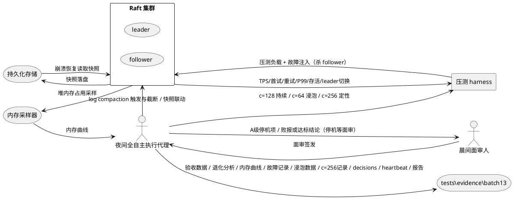
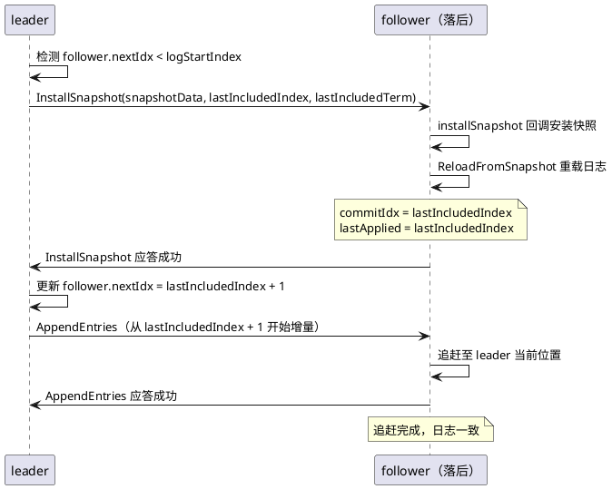
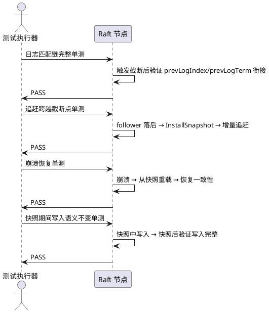

# **1. 组件定位**

## **1.1 核心职责**
本组件负责对 Raft 日志内存膨胀实施 log compaction 主体手术，复用既有快照机制在日志达到阈值后触发快照、落盘后截断已固化前缀日志释放内存，并完成 3min c=128 持续负载全项验收与 30min 混合读写浸泡，达成 TPS≥8000 且不退化、首试成功率≥99%、重试后成功率≥99.9%、P99≤50ms、5/5 存活、内存有界的验收线。

前置背景：batch12 pipeline AppendEntries 优化已完成，1min c=128 阶梯测试全达标（TPS=8088.6, 成功率=99.95%, P99=50ms, 5/5 存活）。3min 持续测试存在 TPS 退化，根因定位为内存 log 无 compaction，1.35M 条目导致 GC 压力。代码中已有 CompactLogs(upToIndex) 方法（释放 Command/SM3Hash 大字段，保留 Index/Term 元数据）、logStartIndex 字段、ReloadFromSnapshot()、getSnapshotData/installSnapshot 回调、ErrCompacted 错误，本批次在此基础上完成触发联动与全项验收。

## **1.2 核心输入**
1. **持续写入负载（c=128）**：来源压测 harness，内容为 128 并发持续 3min 的双报写入请求序列，用于验收 TPS 不退化与成功率双报。
2. **混合读写负载（c=64, 7:3）**：来源压测 harness，内容为 64 并发 7:3 读写比持续 30min 的浸泡负载，用于验收长期稳定性。
3. **饱和边界负载（c=256）**：来源压测 harness，内容为 256 并发压测负载，用于定性复测饱和边界行为。
4. **日志条目累积信号**：来源 Raft 节点内部，内容为当前 logs 数组长度与 logStartIndex，用于判定是否达到快照触发阈值。
5. **快照数据回调**：来源 getSnapshotData 回调，内容为 (snapshotData, lastIncludedIndex, lastIncludedTerm)，用于快照落盘。
6. **落后 follower 追赶请求**：来源 nextIdx < logStartIndex 的 follower，内容为 AppendEntries 请求中 prevLogIndex < logStartIndex，触发 InstallSnapshot 路径。
7. **故障注入信号**：来源压测 harness，内容为中途杀 1 个 follower 的指令，用于实测故障切换与恢复写入时长。
8. **内存采样信号**：来源 runtime.MemStats / pprof heap profile，内容为全程堆内存占用曲线，用于验证 compaction 后内存有界。

## **1.3 核心输出**
1. **截断后的内存日志**：目标 Raft 节点内存，内容为释放 Command/SM3Hash 后的 logs 数组（保留 Index/Term 元数据）与更新后的 logStartIndex。
2. **快照文件**：目标持久化存储，内容为 gzip(json([]RaftLog)) 格式的快照数据与 lastIncludedIndex/lastIncludedTerm 元信息。
3. **3min c=128 验收数据**：落盘至 `tests/evidence/batch13/`，内容为逐 30s 窗口的 TPS / 首试成功率 / 重试后成功率 / P99 / 存活数 / leader 切换次数 / 内存占用原始数据。
4. **TPS 退化分析报告**：落盘至 `tests/evidence/batch13/`，内容为首 30s vs 末 30s TPS 衰减率计算与原始数据。
5. **内存曲线记录**：落盘至 `tests/evidence/batch13/`，内容为全程堆内存占用采样序列，验证 compaction 后有界。
6. **故障切换实测记录**：落盘至 `tests/evidence/batch13/`，内容为杀 follower 后恢复写入秒数与 leader 切换次数实数。
7. **30min 浸泡验收数据**：落盘至 `tests/evidence/batch13/`，内容为 64 并发 7:3 读写全程 TPS / 成功率 / P99 / 存活数与 [SYNC] startIdx 核对结果。
8. **c=256 定性复测记录**：落盘至 `tests/evidence/batch13/`，内容为 c=256 成功率与 P99 实测值，定性记录不优化。
9. **压缩正确性单测结果**：目标 Go test 产物，内容为快照截断后日志匹配链完整 / 追赶跨越截断点 / 崩溃恢复 / 快照期间写入语义不变的测试通过证据。
10. **decisions.md**：落盘至 `tests/evidence/batch13/`，A/B/C 分级决策逐条落盘（含异步快照 vs 短暂停决策依据）。
11. **heartbeat.log**：落盘至 `tests/evidence/batch13/`，5 分钟一行全时段。
12. **报告.md**：落盘至 `tests/evidence/batch13/`，先结论后细节，败报照交不追责。

## **1.4 职责边界**
1. **禁去 fsync**：不得移除或弱化 fsync 持久化保证，快照落盘与 WAL 持久化语义不变。
2. **禁跳 quorum**：不得绕过 quorum 确认逻辑，commit 推进仍需多数派应答。
3. **禁缩选举超时**：选举超时只允许增大不允许缩小，当前范围 5000-7000ms。
4. **禁调参刷数**：不得通过调参数来掩盖性能问题，未达标照交败报 + 新瓶颈定位。
5. **pipeline 正确性三原则**：不得破坏 pipeline 的正确性（乱序应答按 term/index 对账、遇更高 term 停在途批次转 follower、选举发生时在途 RPC 全部作废并重置 nextIdx）。
6. **禁止改 proto**：protoc 不可用，不得修改 .proto / .pb.go 文件。
7. **成功率双报制**：所有报告必须同时报"首试成功率"与"重试后成功率"，客户端 retry 不计入服务端稳定性成绩，只作补充参考。
8. **复用既有快照机制**：本批次复用已存在的 CompactLogs / logStartIndex / ReloadFromSnapshot / getSnapshotData / installSnapshot / ErrCompacted，不另起炉灶。
9. **c=256 只定性不优化**：任务三仅如实记录成功率与 P99，不进行任何优化操作。
10. **不负责后续优化方向裁决**：本组件止于 batch13 产物签发与败报交付，达标后停机等面审。

# **2. 领域术语**

**log compaction**
: 对 Raft 内存日志的前缀进行压缩释放，将已固化（committed 且 applied）的日志条目的 Command 和 SM3Hash 大字段置为 nil，仅保留 Index/Term 元数据，以降低内存占用与 GC 压力。

**snapshot**
: Raft 状态机在某一时刻的持久化快照，包含 lastIncludedIndex 与 lastIncludedTerm 元信息及状态机数据，用于落后 follower 追赶与崩溃恢复。

**logStartIndex**
: 日志压缩后的起始索引，所有 Index < logStartIndex 的条目已被压缩（Command/SM3Hash 为 nil），GetLogEntries 对此类请求返回 ErrCompacted。

**ErrCompacted**
: 请求的日志索引小于 logStartIndex 时返回的错误，指示调用方应走 InstallSnapshot 路径而非 AppendEntries 增量追赶。

**CompactLogs(upToIndex)**
: 既有日志压缩方法，释放 Index <= upToIndex 的日志的 Command 和 SM3Hash 大字段，保留 Index/Term 元数据，设置 logStartIndex = upToIndex + 1，不改变 logs 数组结构与 1-based 索引。

**前缀截断**
: 快照落盘后，将已固化日志前缀（Index <= lastIncludedIndex）的大字段释放的操作，是 log compaction 的核心动作。

**异步快照**
: 快照生成与落盘在独立 goroutine 中执行，快照期间 leader 继续接收写入请求，不阻塞 propose 入口。
: 备注：与"短暂停"方案二选一，由 B 级自主决策并记档依据。

**短暂停快照**
: 快照生成期间短暂暂停写入，验证安全后恢复，快照完成后截断前缀。
: 备注：与"异步快照"方案二选一，由 B 级自主决策并记档依据。

**落后 follower 追赶**
: nextIdx < logStartIndex 的 follower 无法通过 AppendEntries 增量追赶，须走 InstallSnapshot 路径接收完整快照后继续增量追赶。

**TPS 退化**
: 3min 持续测试中吞吐量随时间下降的现象，batch12 根因为内存 log 无 compaction 导致 GC 压力。
: 备注：验收要求首 30s vs 末 30s TPS 衰减 < 5%。

**首试成功率**
: 客户端首次请求即成功的比例，不计入 retry，作为服务端稳定性的核心成绩指标。
: 备注：验收要求 ≥ 99%。

**重试后成功率**
: 客户端首次失败后经 retry 最终成功的比例，作为服务端稳定性的补充参考。
: 备注：验收要求 ≥ 99.9%，但不计入服务端稳定性成绩。

**双报制**
: 所有成功率报告必须同时报"首试成功率"与"重试后成功率"两个指标的报告规范。

**浸泡测试**
: 长时间持续负载下的稳定性测试，本批次为 30min 64 并发 7:3 读写比。

**[SYNC] startIdx**
: 快照同步后 follower 的日志起始索引，验收要求恒 > 1，证明 compaction 确实发生且快照同步生效。

**A/B/C 分级授权**
: 夜间全自主执行的决策分级：A级停机等面审 / B级记录绕行 / C级忽略记档。
: 备注：异步快照 vs 短暂停方案选择为 B 级自主决策项。

**内存有界**
: compaction 后堆内存占用不随日志条目数线性增长，存在上界，通过全程内存曲线验证。

**饱和边界定性复测**
: c=256 并发压测，仅如实记录成功率与 P99，不进行优化，用于确认 compaction 后饱和边界行为。

# **3. 角色与边界**

## **3.1 核心角色**
1. **夜间全自主执行代理**：在 A/B/C 分级授权下执行任务一至任务三，逐条落盘 decisions.md。
2. **晨间面审人**：对 A 级停机项与最终败报/达标结论进行面审签发。

## **3.2 外部系统**
1. **Raft 集群（leader/follower）**：被实施 log compaction 的对象，提供日志累积信号、快照触发、截断执行、落后 follower 追赶、崩溃恢复、写入语义。
2. **压测 harness**：提供 c=128 持续负载、c=64 7:3 浸泡负载、c=256 饱和负载，采集 TPS / 首试成功率 / 重试后成功率 / P99 / 存活数 / leader 切换次数。
3. **持久化存储**：接收快照文件落盘，提供崩溃恢复时的快照读取。
4. **内存采样器（pprof / runtime.MemStats）**：提供全程堆内存占用曲线，用于验证 compaction 后内存有界。

## **3.3 交互上下文**


# **4. DFX约束**

## **4.1 性能**
1. **TPS 下限**：3min c=128 持续测试验收线 TPS≥8000。
2. **TPS 不退化**：3min 持续测试首 30s vs 末 30s TPS 衰减率 < 5%，原始数据落盘。
3. **尾延迟上限**：3min c=128 持续测试验收线 P99≤50ms。
4. **分级延迟必报**：P99 / P50 / P95 每窗口必报；缺席视为 A 级停机项。
5. **30min 浸泡性能**：64 并发 7:3 读写浸泡，成功率≥99.9%，5/5 存活。

## **4.2 可靠性**
1. **首试成功率下限**：3min c=128 持续测试首试成功率必须 ≥ 99%。
2. **重试后成功率下限**：3min c=128 持续测试重试后成功率 ≥ 99.9%。
3. **存活要求**：5/5 存活。
4. **故障切换实测**：中途杀 1 个 follower，实测恢复写入秒数并记档，leader 切换次数报告实数。
5. **快照期间写入语义不变**：快照生成与落盘期间，写入语义不变，已 commit 的日志不丢失。
6. **崩溃恢复语义不变**：崩溃恢复后日志一致性不变，快照 + 增量追赶照旧可用。
7. **日志匹配链完整**：快照截断后日志匹配链（prevLogIndex/prevLogTerm 衔接）完整，不破坏 Raft 安全性。
8. **pipeline 正确性不变**：log compaction 不得破坏 pipeline 正确性三原则。

## **4.3 安全性**
1. **禁去 fsync**：不得移除或弱化 fsync 持久化保证。
2. **禁跳 quorum**：不得绕过 quorum 确认逻辑。
3. **禁缩选举超时**：选举超时只允许增大不允许缩小。
4. **禁调参刷数**：不得通过调参数来掩盖性能问题。
5. **pipeline 正确性三原则**：乱序应答按 term/index 对账、遇更高 term 停在途批次转 follower、选举发生时在途 RPC 全部作废并重置 nextIdx。
6. **禁止改 proto**：不得修改 .proto / .pb.go 文件。

## **4.4 可维护性**
1. **内存有界**：compaction 后堆内存占用不随日志条目数线性增长，全程内存曲线落盘验证。
2. **决策落盘**：A/B/C 分级决策全部逐条落盘 decisions.md，含异步快照 vs 短暂停决策依据。
3. **心跳日志**：heartbeat.log 5 分钟一行全时段。
4. **报告规范**：报告.md 先结论后细节，败报照交不追责。
5. **成功率双报制**：所有报告必须同时报"首试成功率"与"重试后成功率"。

## **4.5 兼容性**
1. **复用既有快照机制**：复用 CompactLogs / logStartIndex / ReloadFromSnapshot / getSnapshotData / installSnapshot / ErrCompacted，不另起炉灶。
2. **commit 语义兼容**：commit 推进逻辑不变。
3. **崩溃恢复兼容**：崩溃恢复语义不变，快照 + 增量追赶照旧可用。
4. **pipeline 兼容**：log compaction 不破坏 pipeline AppendEntries 优化成果。

# **5. 核心能力**

## **5.1 日志压缩触发与快照截断**

### **5.1.1 业务规则**
1. **阈值触发规则**：当 leader 或 follower 的内存日志条目数达到预设阈值时，系统应当触发快照生成。
   a. 验收条件：当日志条目数达到阈值时 → 系统触发快照生成并记录触发时的 lastIncludedIndex/lastIncludedTerm。
2. **快照落盘规则**：快照生成后必须落盘至持久化存储，落盘成功后方可执行前缀截断。
   a. 验收条件：当快照生成完成时 → 系统将快照数据写入持久化存储并确认落盘成功后再执行截断。
3. **前缀截断规则**：快照落盘成功后，系统应当调用 CompactLogs(lastIncludedIndex) 释放 Index <= lastIncludedIndex 的日志的 Command/SM3Hash 大字段，保留 Index/Term 元数据，设置 logStartIndex = lastIncludedIndex + 1。
   a. 验收条件：当快照落盘成功时 → 系统执行 CompactLogs 后 logStartIndex = lastIncludedIndex + 1，且被截断条目的 Command/SM3Hash 为 nil。
4. **已固化前缀方可截断规则**：只有已 committed 且已 applied 的日志前缀方可截断，禁止截断未固化日志。
   a. 验收条件：当触发截断时 → lastIncludedIndex <= commitIdx 且 lastIncludedIndex <= lastApplied。
5. **截断后索引连续规则**：截断后 logs 数组结构与 1-based 索引不变，rn.logs[idx-1] 访问语义不变。
   a. 验收条件：当截断完成后 → 对任意 Index >= logStartIndex 的条目，rn.logs[Index-1].Index == Index 且 Term 字段保留。
6. **GetLogEntries 压缩感知规则**：当请求 startIdx < logStartIndex 时，GetLogEntries 应当返回 ErrCompacted，指示调用方走 InstallSnapshot 路径。
   a. 验收条件：当 startIdx < logStartIndex 时 → GetLogEntries 返回 (nil, ErrCompacted)。
7. **快照期间写入不停规则**：快照生成与落盘期间，leader 应当继续接收并处理写入请求，已 commit 的日志不丢失。
   a. 验收条件：当快照进行中且有新写入到达时 → 写入请求正常处理并 commit，快照完成后新写入日志保留完整。
8. **异步快照 vs 短暂停决策规则**：异步快照与短暂停二选一，由 B 级自主决策并记档依据。
   a. 验收条件：当选择快照方案时 → decisions.md 记录所选方案、安全前提验证结论与决策依据。
9. **禁止项：截断未落盘日志**：禁止在快照未成功落盘前执行前缀截断。
   a. 验收条件：当快照未落盘时 → 系统不执行 CompactLogs，日志前缀完整保留。

### **5.1.2 交互流程**
```plantuml
@startuml
actor "写入客户端" as Client
participant "leader" as Leader
participant "follower" as Follower
storage "持久化存储" as Storage

Client -> Leader : 写入请求
Leader -> Leader : 日志条目数达到阈值
Leader -> Leader : getSnapshotData() 生成快照
note over Leader : 快照期间写入不停（异步或短暂停）
Client -> Leader : 新写入请求（快照进行中）
Leader -> Leader : 处理新写入并 commit
Leader -> Storage : 快照落盘
Storage -> Leader : 落盘成功确认
Leader -> Leader : CompactLogs(lastIncludedIndex) 截断前缀
note over Leader : logStartIndex = lastIncludedIndex + 1
Leader -> Follower : InstallSnapshot（落后 follower）
Follower -> Follower : ReloadFromSnapshot 重载日志
Follower -> Follower : 增量追赶至 leader 当前位置
@enduml
```

### **5.1.3 异常场景**
1. **快照落盘失败**
   a. 触发条件：快照数据写入持久化存储失败（磁盘满 / IO 错误）。
   b. 系统行为：不执行前缀截断，保留完整日志，记录错误日志，按 A/B/C 分级处置。
   c. 用户感知：日志保留完整，内存未释放但功能不受影响，decisions.md 记录落盘失败事件。
2. **快照期间 leader 切换**
   a. 触发条件：快照生成或落盘期间发生 leader 选举切换。
   b. 系统行为：旧 leader 的在途快照作废，新 leader 上任后按自身日志状态重新判定是否触发快照。
   c. 用户感知：写入短暂中断（选举超时范围内），恢复后正常服务。
3. **截断后请求已截断索引**
   a. 触发条件：follower 请求 AppendEntries 但 prevLogIndex < logStartIndex。
   b. 系统行为：leader 返回 ErrCompacted 或直接发送 InstallSnapshot。
   c. 用户感知：follower 走 InstallSnapshot 路径追赶，最终一致。

## **5.2 落后 follower 跨越截断点恢复**

### **5.2.1 业务规则**
1. **跨越截断点检测规则**：当 leader 发现 follower 的 nextIdx < logStartIndex 时，系统应当走 InstallSnapshot 路径而非 AppendEntries 增量追赶。
   a. 验收条件：当 follower.nextIdx < leader.logStartIndex 时 → leader 发送 InstallSnapshot 而非 AppendEntries。
2. **快照安装规则**：follower 收到 InstallSnapshot 后，应当调用 installSnapshot 回调安装快照数据，并调用 ReloadFromSnapshot 重载日志。
   a. 验收条件：当 follower 收到 InstallSnapshot 时 → follower 安装快照、重载日志、设置 commitIdx/lastApplied = lastIncludedIndex。
3. **快照后增量追赶规则**：快照安装完成后，follower 应当从 lastIncludedIndex + 1 开始继续 AppendEntries 增量追赶至 leader 当前位置。
   a. 验收条件：当快照安装完成时 → follower 从 lastIncludedIndex + 1 开始接收 AppendEntries 并追赶至 leader.commitIdx。
4. **追赶一致性规则**：追赶完成后 follower 日志应当与 leader 日志一致（已截断部分通过快照恢复，未截断部分通过增量追赶）。
   a. 验收条件：当追赶完成时 → follower 的 commitIdx == leader 的 commitIdx，且日志内容一致。
5. **禁止项：跳过快照直接增量追赶**：禁止在 nextIdx < logStartIndex 时仍尝试 AppendEntries 增量追赶。
   a. 验收条件：当 nextIdx < logStartIndex 时 → 系统不发送 AppendEntries 而是发送 InstallSnapshot。

### **5.2.2 交互流程**


### **5.2.3 异常场景**
1. **InstallSnapshot 传输中断**
   a. 触发条件：快照传输过程中网络中断或 leader 切换。
   b. 系统行为：follower 保留已接收的部分快照（如有），等待新 leader 重新发送 InstallSnapshot。
   c. 用户感知：follower 追赶延迟，恢复后重新走 InstallSnapshot 路径。
2. **快照数据损坏**
   a. 触发条件：follower 收到的快照数据反序列化失败或校验不通过。
   b. 系统行为：follower 拒绝安装损坏快照，记录错误日志，请求重传。
   c. 用户感知：follower 追赶失败并重试，decisions.md 记录损坏事件。

## **5.3 压缩正确性单测验证**

### **5.3.1 业务规则**
1. **日志匹配链完整单测规则**：快照截断后，系统应当验证日志匹配链（prevLogIndex/prevLogTerm 衔接）完整，不破坏 Raft 安全性。
   a. 验收条件：当执行日志匹配链完整单测时 → 截断后任意相邻条目的 prevLogIndex/prevLogTerm 衔接正确，测试通过。
2. **追赶跨越截断点单测规则**：系统应当验证 follower 追赶跨越截断点时走 InstallSnapshot 路径并最终一致。
   a. 验收条件：当执行追赶跨越截断点单测时 → follower 从落后状态追赶，跨越截断点后日志与 leader 一致，测试通过。
3. **崩溃恢复单测规则**：系统应当验证崩溃恢复后从快照重载日志并恢复一致性。
   a. 验收条件：当执行崩溃恢复单测时 → 节点崩溃重启后从快照重载日志，commitIdx/lastApplied 恢复正确，测试通过。
4. **快照期间写入语义不变单测规则**：系统应当验证快照生成与落盘期间写入语义不变，已 commit 日志不丢失。
   a. 验收条件：当执行快照期间写入语义不变单测时 → 快照期间写入的日志在快照完成后完整保留且可 commit，测试通过。
5. **单测全部通过规则**：上述四项单测必须全部通过，任一失败为 A 级停机项。
   a. 验收条件：当执行全部单测时 → 四项单测全部通过，Go test 输出 PASS。

### **5.3.2 交互流程**


### **5.3.3 异常场景**
1. **单测失败**
   a. 触发条件：任一压缩正确性单测未通过。
   b. 系统行为：判定为 A 级停机项，落盘 decisions.md，停机等面审。
   c. 用户感知：A级停机等面审，不继续后续验收任务。

## **5.4 3min c=128 持续负载全项验收**

### **5.4.1 业务规则**
1. **TPS 达标规则**：3min c=128 持续测试 TPS 必须 ≥ 8000。
   a. 验收条件：当 3min c=128 持续测试完成时 → 全程平均 TPS ≥ 8000。
2. **TPS 不退化规则**：3min 持续测试首 30s 窗口平均 TPS vs 末 30s 窗口平均 TPS 衰减率必须 < 5%，原始数据落盘。
   a. 验收条件：当计算首 30s vs 末 30s TPS 衰减率时 → 衰减率 = (首30s TPS - 末30s TPS) / 首30s TPS < 5%。
3. **首试成功率达标规则**：3min c=128 持续测试首试成功率必须 ≥ 99%。
   a. 验收条件：当 3min c=128 持续测试完成时 → 首试成功率 ≥ 99%。
4. **重试后成功率达标规则**：3min c=128 持续测试重试后成功率必须 ≥ 99.9%。
   a. 验收条件：当 3min c=128 持续测试完成时 → 重试后成功率 ≥ 99.9%。
5. **P99 达标规则**：3min c=128 持续测试 P99 必须 ≤ 50ms。
   a. 验收条件：当 3min c=128 持续测试完成时 → P99 ≤ 50ms。
6. **存活达标规则**：3min c=128 持续测试必须 5/5 存活。
   a. 验收条件：当 3min c=128 持续测试完成时 → 5 个节点全部存活。
7. **leader 切换次数报告规则**：3min 持续测试期间 leader 切换次数必须报告实数。
   a. 验收条件：当 3min c=128 持续测试完成时 → 报告含 leader 切换次数实数。
8. **内存曲线全程记录规则**：3min 持续测试全程堆内存占用必须采样记录并落盘，验证 compaction 后有界。
   a. 验收条件：当 3min c=128 持续测试完成时 → 内存曲线落盘且显示 compaction 后内存不持续增长。
9. **故障切换实测规则**：3min 持续测试中途杀 1 个 follower，必须实测恢复写入秒数并记档。
   a. 验收条件：当中途杀 1 个 follower 时 → 记录故障切换时长与恢复写入秒数，5/5 恢复存活。
10. **双报制规则**：3min c=128 持续测试报告必须同时报首试成功率与重试后成功率。
    a. 验收条件：当生成 3min c=128 报告时 → 报告同时含首试成功率与重试后成功率两个指标。
11. **禁止项：调参刷数**：禁止通过调参数来掩盖性能问题，未达标照交败报 + 新瓶颈定位。
    a. 验收条件：当 3min c=128 未达标时 → 照交败报与新瓶颈定位，不调参刷数。

### **5.4.2 交互流程**
```plantuml
@startuml
actor "夜间全自主执行代理" as Agent
participant "压测 harness" as Harness
participant "Raft 集群" as Raft
storage "内存采样器" as MemSampler
storage "evidence" as Evidence

Agent -> Harness : 启动 3min c=128 持续压测
Harness -> Raft : 128 并发持续写入
Raft -> MemSampler : 全程堆内存采样

loop 每 30s 窗口
  Raft -> Harness : TPS / 首试成功率 / 重试后成功率 / P99 / 存活数
  Harness -> Evidence : 窗口数据落盘
end

Agent -> Raft : 中途杀 1 个 follower
Raft -> Harness : 故障切换 + 恢复写入
Harness -> Evidence : 故障切换时长 + 恢复写入秒数

Agent -> Evidence : 首末 30s TPS 衰减率计算
Agent -> Evidence : 内存曲线有界验证
Agent -> Evidence : leader 切换次数实数
Agent -> Evidence : 双报成功率报告
@enduml
```

### **5.4.3 异常场景**
1. **TPS 退化超 5%**
   a. 触发条件：首 30s vs 末 30s TPS 衰减率 ≥ 5%。
   b. 系统行为：照交败报，附 TPS 退化曲线与内存曲线，定位新瓶颈。
   c. 用户感知：败报告，含退化数据与新瓶颈定位，不调参刷数。
2. **首试成功率 < 99%**
   a. 触发条件：3min c=128 首试成功率 < 99%。
   b. 系统行为：照交败报，附失败形态分析与 leader 切换次数。
   c. 用户感知：败报告，含首试成功率实数与失败形态。
3. **内存无界**
   a. 触发条件：内存曲线显示 compaction 后内存仍持续增长。
   b. 系统行为：照交败报，附内存曲线与 compaction 触发记录，定位 compaction 未生效根因。
   c. 用户感知：败报告，含内存曲线与根因定位。
4. **故障切换后未恢复**
   a. 触发条件：杀 1 个 follower 后集群未恢复 5/5 存活或恢复写入超时。
   b. 系统行为：照交败报，附故障切换时长与恢复日志。
   c. 用户感知：败报告，含故障切换实测数据。

## **5.5 30min 混合读写浸泡验收**

### **5.5.1 业务规则**
1. **前置门禁规则**：30min 浸泡仅在 3min c=128 全项验收达标后方可执行。
   a. 验收条件：当 3min c=128 全项达标时 → 方可启动 30min 浸泡测试。
2. **浸泡参数规则**：30min 浸泡必须为 64 并发 7:3 读写比。
   a. 验收条件：当启动 30min 浸泡时 → 并发数 = 64，读写比 = 7:3，持续 30min。
3. **浸泡存活规则**：30min 浸泡必须 5/5 存活。
   a. 验收条件：当 30min 浸泡完成时 → 5 个节点全部存活。
4. **浸泡成功率规则**：30min 浸泡重试后成功率必须 ≥ 99.9%。
   a. 验收条件：当 30min 浸泡完成时 → 重试后成功率 ≥ 99.9%。
5. **[SYNC] startIdx 核对规则**：30min 浸泡结束后必须核对 [SYNC] startIdx 恒 > 1，证明 compaction 确实发生且快照同步生效。
   a. 验收条件：当 30min 浸泡完成时 → 所有 follower 的 [SYNC] startIdx 恒 > 1。
6. **禁止项：未达标即浸泡**：禁止在 3min c=128 未达标时启动 30min 浸泡。
   a. 验收条件：当 3min c=128 未达标时 → 系统不启动 30min 浸泡。

### **5.5.2 交互流程**
```plantuml
@startuml
actor "夜间全自主执行代理" as Agent
participant "压测 harness" as Harness
participant "Raft 集群" as Raft
storage "evidence" as Evidence

Agent -> Agent : 验证 3min c=128 全项达标
Agent -> Harness : 启动 30min c=64 7:3 浸泡
Harness -> Raft : 64 并发 7:3 读写持续 30min

loop 全程
  Raft -> Harness : TPS / 成功率 / P99 / 存活数
  Harness -> Evidence : 浸泡数据落盘
end

Agent -> Raft : 核对 [SYNC] startIdx
Raft -> Agent : 所有 follower startIdx > 1
Agent -> Evidence : 浸泡验收报告 + [SYNC] startIdx 核对结果
@enduml
```

### **5.5.3 异常场景**
1. **浸泡中节点失联**
   a. 触发条件：30min 浸泡期间某节点失联。
   b. 系统行为：记录失联时间与恢复时间，按存活要求判定是否败报。
   c. 用户感知：若未达 5/5 存活则败报，附失联与恢复记录。
2. **[SYNC] startIdx 未 > 1**
   a. 触发条件：浸泡结束后某 follower 的 [SYNC] startIdx <= 1。
   b. 系统行为：照交败报，附 startIdx 实数与 compaction 触发记录，定位 compaction 未生效或快照未同步根因。
   c. 用户感知：败报告，含 startIdx 核对结果与根因定位。

## **5.6 c=256 饱和边界定性复测**

### **5.6.1 业务规则**
1. **定性复测规则**：c=256 复测一轮，如实记录成功率与 P99，只定性不优化。
   a. 验收条件：当执行 c=256 复测时 → 记录成功率与 P99 实测值，不进行任何优化操作。
2. **定性记录规则**：c=256 复测结果必须如实落盘，包含成功率、P99、TPS、存活数。
   a. 验收条件：当 c=256 复测完成时 → evidence 含成功率 / P99 / TPS / 存活数实测记录。
3. **禁止项：优化 c=256**：禁止对 c=256 结果进行任何优化操作。
   a. 验收条件：当 c=256 复测完成时 → 系统不执行任何针对 c=256 的优化改动。

### **5.6.2 交互流程**
```plantuml
@startuml
actor "夜间全自主执行代理" as Agent
participant "压测 harness" as Harness
participant "Raft 集群" as Raft
storage "evidence" as Evidence

Agent -> Harness : 启动 c=256 饱和压测
Harness -> Raft : 256 并发压测
Raft -> Harness : TPS / 成功率 / P99 / 存活数
Harness -> Evidence : c=256 定性记录落盘
note over Agent : 只定性不优化
@enduml
```

### **5.6.3 异常场景**
1. **c=256 成功率或 P99 不理想**
   a. 触发条件：c=256 复测成功率或 P99 未达 c=128 验收线。
   b. 系统行为：如实记录，不优化，定性标注为饱和边界行为。
   c. 用户感知：定性记录落盘，标注饱和边界，不触发优化。

# **6. 数据约束**

## **6.1 RaftLog 日志条目**
1. **Index**：日志条目的全局唯一递增索引，从 1 开始，截断后保留不变。
2. **Term**：日志条目的创建任期，截断后保留不变。
3. **Command**：日志条目的命令数据，截断后置为 nil（释放内存）。
4. **SM3Hash**：日志条目的 SM3 完整性哈希，截断后置为 nil（释放内存）。
5. **截断后约束**：对任意 Index < logStartIndex 的条目，Command == nil 且 SM3Hash == nil；对任意 Index >= logStartIndex 的条目，Command 与 SM3Hash 保留完整。

## **6.2 快照数据**
1. **snapshotData**：gzip(json([]RaftLog)) 格式的快照数据，包含截断点之前所有已固化日志的完整内容。
2. **lastIncludedIndex**：快照中最后一条日志的索引，必须 <= commitIdx 且 <= lastApplied。
3. **lastIncludedTerm**：快照中最后一条日志的任期，必须与 logs[lastIncludedIndex-1].Term 一致。
4. **快照落盘约束**：快照数据必须成功写入持久化存储后方可执行前缀截断。

## **6.3 压缩元数据**
1. **logStartIndex**：日志压缩后的起始索引，截断后 = lastIncludedIndex + 1，初始值为 1。
2. **logStartIndex 单调递增约束**：logStartIndex 只允许增大不允许减小，除非通过 ReloadFromSnapshot 重置为 1。
3. **logStartIndex 与 commitIdx 关系约束**：logStartIndex - 1 <= commitIdx（截断点不超过 commitIdx）。
4. **logStartIndex 与 lastApplied 关系约束**：logStartIndex - 1 <= lastApplied（截断点不超过 lastApplied）。

## **6.4 压测指标**
1. **TPS**：每秒事务数，3min c=128 验收线 ≥ 8000，首 30s vs 末 30s 衰减率 < 5%。
2. **首试成功率**：客户端首次请求即成功的比例，3min c=128 验收线 ≥ 99%。
3. **重试后成功率**：客户端经 retry 最终成功的比例，3min c=128 验收线 ≥ 99.9%，30min 浸泡验收线 ≥ 99.9%。
4. **P99**：99 百分位延迟，3min c=128 验收线 ≤ 50ms。
5. **存活数**：存活节点数，验收线 5/5。
6. **leader 切换次数**：测试期间 leader 切换次数实数，必须报告。
7. **内存占用**：堆内存占用采样值，compaction 后不随日志条目数线性增长。
8. **故障切换时长**：杀 follower 后恢复写入的秒数，必须实测记档。
9. **[SYNC] startIdx**：快照同步后 follower 的日志起始索引，验收要求恒 > 1。