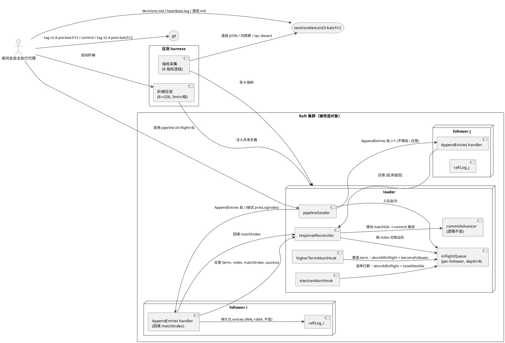
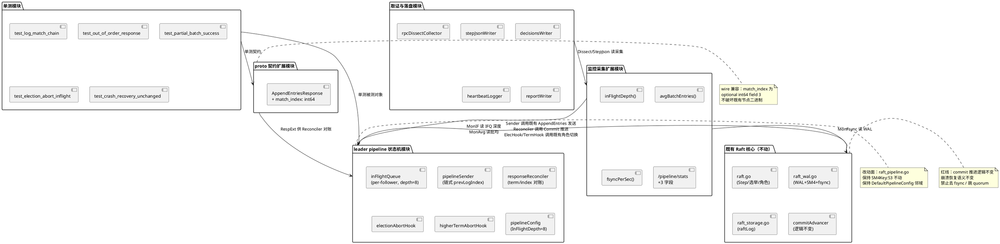
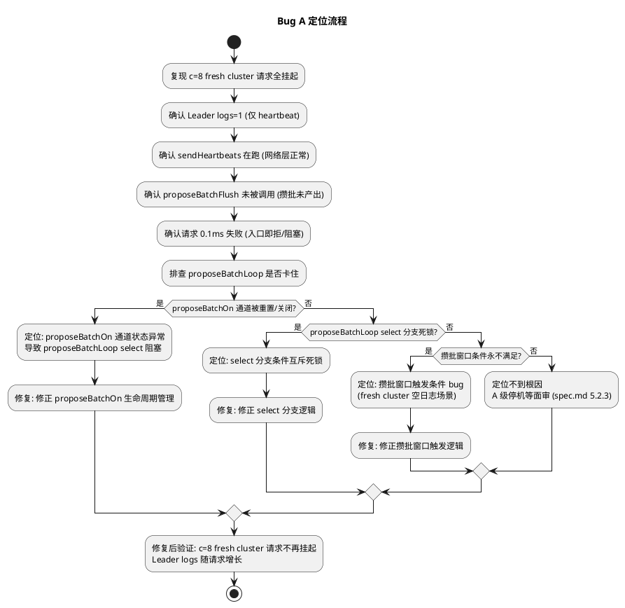
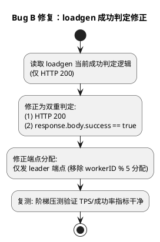
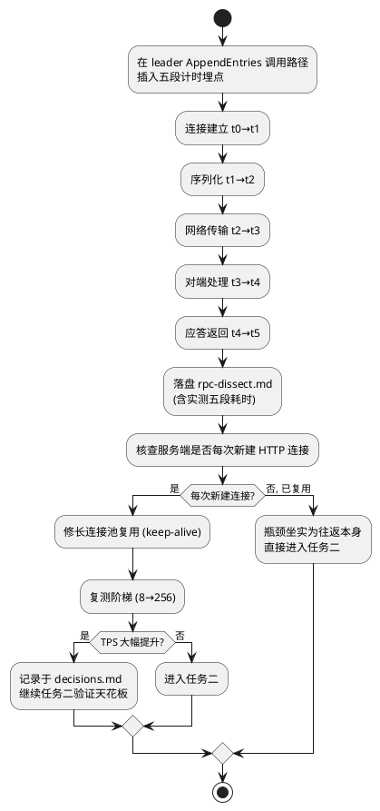
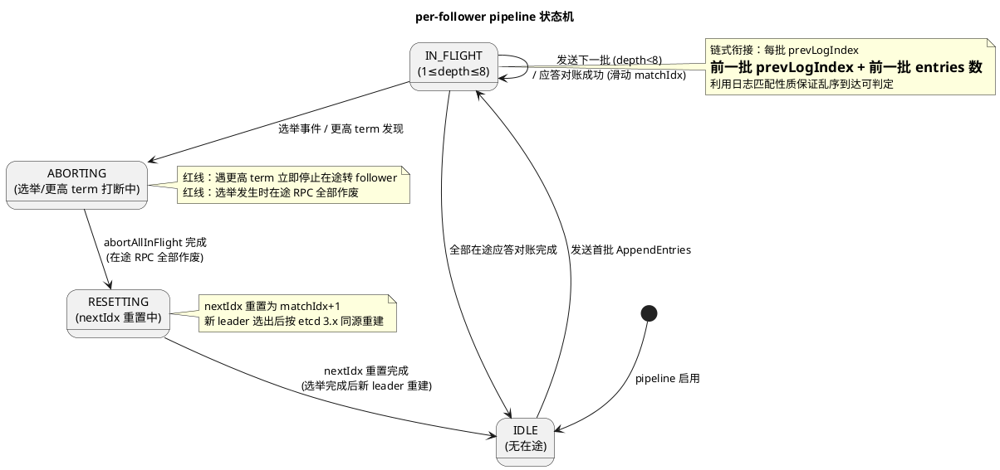
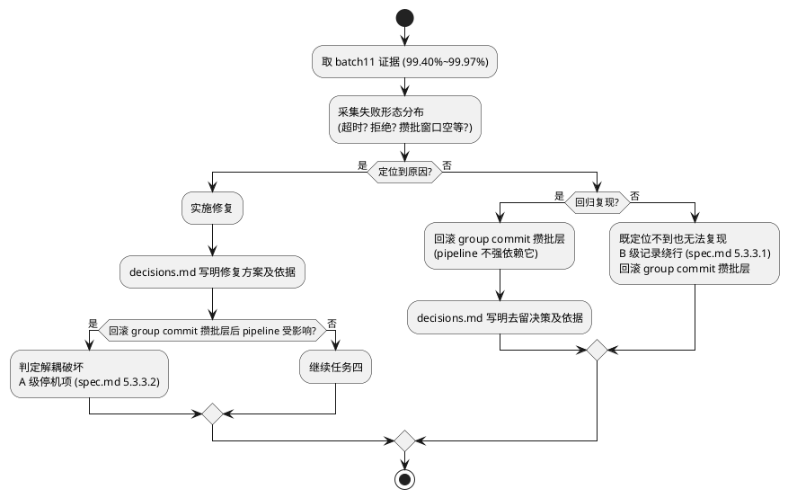
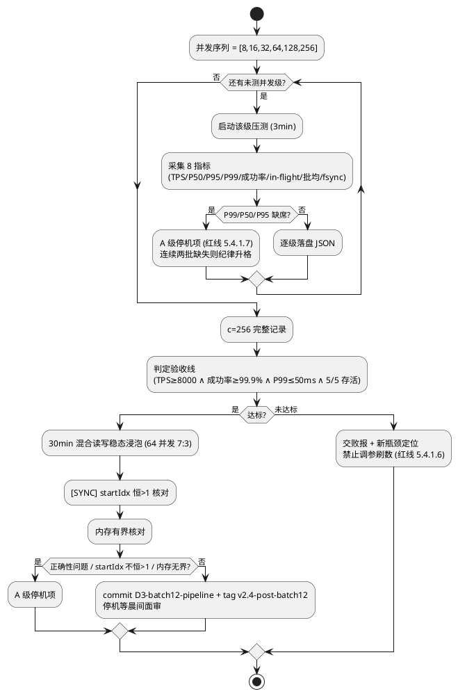
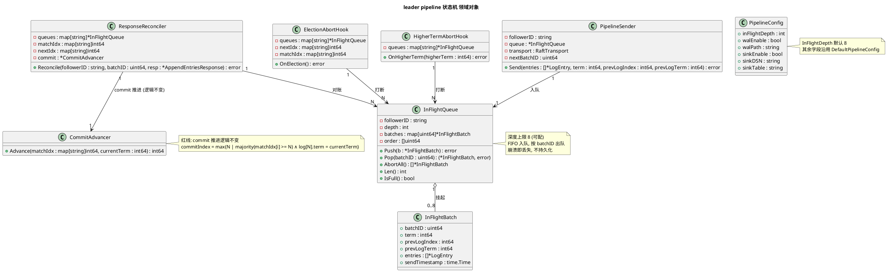
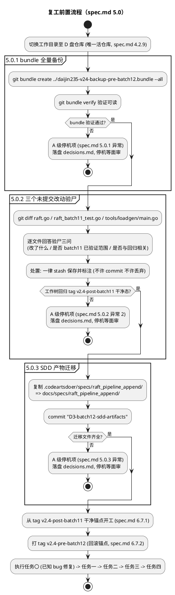

# 一、需求与存量功能关系分析

本批次（D3-batch12）的核心诉求是消除 Raft AppendEntries 的 quorum 往返串行等待（in-flight=1）瓶颈，达成 TPS≥8000 / 成功率≥99.9% / P99≤50ms / 5/5 存活的验收线。前置结论来自 batch11 复核：fsync 已批量非瓶颈，真瓶颈坐实为 in-flight=1。本章节对照存量代码逐项核对需求覆盖度，为增量设计提供落地约束。

存量代码定位说明：本工作目录为验证/审计目录，Raft 服务端源码（`raft.go` / `raft_pipeline.go` / `raft_wal.go` / `raft_storage.go` / `main.go` / `ractl.go`）位于远端源码仓，本目录通过 `R5_F0_CompilePath_Verdict.md`、`R5_Productionization_Plan.md` 等审计报告精确引用其文件名与行号；proto 定义与压测客户端源码在本目录内可直接核验。

## 1.1 需求功能与存量功能对比

### 1.1.1 已实现功能

| 需求功能 | 存量功能 | 代码位置 | 匹配度 |
|---------|---------|---------|--------|
| AppendEntries RPC 接口存在且可调用 | `RaftService.AppendEntries` 已定义并生成 gRPC stub | `tcx2-stress-client/proto/daijin235_grpc.pb.go:20,46-49`；`daijin235.pb.go:207-290` | 100% |
| AppendEntriesRequest 携带 term/leaderId/prevLogIndex/prevLogTerm/entries/leaderCommit | proto 已含全部 6 字段，wire 兼容 | `daijin235.pb.go:207-289`（`PrevLogIndex` field 3、`PrevLogTerm` field 4、`Entries` field 5、`LeaderCommit` field 6） | 100% |
| leader 端 pipeline 主体框架存在 | `raft_pipeline.go` 已有 `DefaultPipelineConfig`、`OnCommit` 快照触发（`WAL_SNAPSHOT_THRESHOLD` 默认 10000）、WAL/Sink 开关 | `raft_pipeline.go:53,391,394,398,402,405`（经 `R5_Productionization_Plan.md:94-98,124` 引用） | 75% |
| WAL 持久化 + SM4 加密 + 批量刷盘配置化 | `raft_wal.go` 已有 `walMaxBatch` / `walFlushInterval` 配置化；SM4Key 单点硬编码于 `raft_pipeline.go:53` | `raft_wal.go`（`R5_Productionization_Plan.md:124-127`）；`raft_pipeline.go:53` | 75% |
| 压测 harness 阶梯协议（8→16→32→64→128→256，每级 3min） | `locust_step_load` Python harness 已实现阶梯压测与并发枚举 | `locust_step_load/src/locustfile/grpc_load_client.py:19-23`；`cluster_sampler.py:22`；`metric_extractor.py:10-87` | 75% |
| gRPC keepalive 长连接配置 | 压测客户端已设置 `grpc.keepalive_time_ms` / `grpc.keepalive_timeout_ms` | `locust_step_load/src/locustfile/grpc_load_client.py:19-23` | 50% |
| 监控端点 `/pipeline/stats` 已暴露 | 端点已存在，返回 `committed` / `wal_errors` / `sink_errors` / `wal_enabled` / `sink_enabled` | `locust_step_load_v25/design.md:127`；`cluster_sampler.py:22` | 50% |
| 既有 group commit 攒批层 | `raft_pipeline.go` 内既有攒批机制（spec.md 术语"group commit 攒批层"） | `raft_pipeline.go`（`DefaultPipelineConfig` 邻域） | 50% |
| tag/commit 回滚锚点机制 | git 流已用于既有批次（`f4_git.sh:14-19` 提交 `raft_storage.go raft_pipeline.go raft_wal.go`） | `f4_git.sh:14-19` | 100% |

匹配度判定依据：
- **100%**：接口/字段/机制完全匹配，本批次可直接复用。
- **75%**：主体存在但缺关键能力（pipeline 缺 in-flight 队列、harness 缺 in-flight 采集、WAL 缺 fsync 每秒计数）。
- **50%**：仅部分维度覆盖（`/pipeline/stats` 缺 in-flight 深度/批均条数/fsync 每秒次数；客户端 keepalive 仅压测侧，服务端连接池复用状态待核查；攒批层可能正是 batch11 成功率回归成因）。

### 1.1.2 需要扩展的功能

| 需求功能 | 存量功能 | 差异说明 | 扩展方向 |
|---------|---------|---------|---------|
| AppendEntriesResponse 携带 matchIndex | 响应仅 `{Term, Success}`（`daijin235.pb.go:290-334`） | 缺 `match_index` 字段，leader 无法对乱序应答按 index 对账滑动 matchIdx 窗口 | proto 新增 `match_index` 字段（wire 兼容，int64 field 3），重新生成 stub；服务端 follower 在 AppendEntries 处理后回填本地最后匹配 index |
| leader 端 per-follower in-flight 队列 | `raft_pipeline.go` 有 pipeline 框架但无显式 in-flight 队列与深度控制 | 缺多批未应答挂起队列、深度可配（初始 8）、prevLogIndex 链式衔接发送侧 | 在 `raft_pipeline.go` 引入 `inFlightQueue` 结构（per-follower），深度配置项纳入 `DefaultPipelineConfig`；发送侧按前一批 prevLogIndex 链式衔接，不阻塞等待应答 |
| 乱序应答对账 + matchIdx 滑动窗口 | 既有单线程串行应答处理，无乱序对账 | 缺按 term/index 对账、缺滑动窗口、缺失败批次清空在途逻辑 | 在应答处理路径引入 `reconcileResponse(term, index, matchIndex, success)`，成功滑动 matchIdx，失败按拒绝语义回退并清空该 follower 在途批次 |
| 选举打断在途批次作废 + nextIdx 重置 | 既有选举处理但未覆盖 pipeline 在途批次 | 缺在途 RPC 作废钩子、缺 nextIdx 重置与 pipeline 重建 | 在选举事件回调中追加 `abortInFlight(followerID)` + `resetNextIdx(followerID)`；新 leader 选出后重建 pipeline |
| 更高 term 立即停止在途转 follower | 既有 term 升级处理但未联动 pipeline | 缺在途批次停止钩子 | 在 `Step`/`becomeFollower` 路径追加 `abortAllInFlight()`，先停在途再转角色 |
| `/pipeline/stats` 新增 in-flight 深度/批均条数/fsync 每秒次数 | 端点存在但仅 5 字段 | 缺 3 个采集维度，任务四逐级必报无数据源 | 端点响应扩展 3 字段；`raft_pipeline.go` 暴露 `inFlightDepth()` / `avgBatchEntries()`；`raft_wal.go` 暴露 `fsyncPerSec()` |
| 压测客户端 in-flight 多批 | `tcx2-stress-client/main.go` 单 `grpc.Dial` + `idxMu` 串行 `prevLogIndex++`，无 in-flight | 客户端侧即 in-flight=1 瓶颈写照，且 `idxMu` 把 prevLogIndex 增长串行化 | 压测客户端改为 per-follower in-flight 异步发送（验证用）；服务端改造为主，客户端仅做配合 |
| RPC 往返耗时分解埋点 | 既有端点无单次往返阶段耗时分解 | 缺连接建立/序列化/网络/对端处理/应答五段埋点 | 在 leader AppendEntries 调用路径插入阶段计时埋点，落盘 `rpc-dissect.md` |
| 阶梯原始数据 JSON 落盘 | harness 有指标采集但无逐级 JSON 落盘规范 | 缺 `tests/evidence/d3-batch12/` 目录与逐级 JSON schema | harness 新增逐级 JSON 输出，schema 含 TPS/P50/P95/P99/成功率/in-flight/批均/fsync |

扩展方向共性约束：
1. proto 字段新增必须 wire 兼容（int64 optional），不破坏既有节点二进制。
2. `raft_pipeline.go` 改动面需保持 SM4Key 单点（`raft_pipeline.go:53`）不动，避免触发安全 P1 回归。
3. `raft_wal.go` 的 `walMaxBatch` / `walFlushInterval` 配置项保持，不引入新 fsync 路径（红线：禁止去 fsync）。

### 1.1.3 需要新增的功能或接口

按业务模块分组：

**A. proto 契约扩展模块**
- `AppendEntriesResponse.match_index`（int64，field 3，optional）：follower 回填本地最后匹配 index，供 leader 乱序对账。输入：follower 本地 raftLog lastMatchIndex；输出：写入响应；核心逻辑：follower 处理 AppendEntries 后计算 lastMatchIndex 并回填。依赖：既有 raftLog。

**B. leader pipeline 状态机模块**
- `inFlightQueue`（per-follower）：挂起未应答批次。输入：AppendEntries 批 + 发送时间戳 + prevLogIndex/prevLogTerm；输出：按 index 取回对账；核心逻辑：FIFO 入队、按 index 出队对账、深度上限 8。
- `pipelineSender`：链式衔接发送器。输入：待发 entries；输出：构造 AppendEntries 并异步发出；核心逻辑：以前一批 prevLogIndex 链式衔接，不阻塞等待应答。
- `responseReconciler`：乱序应答对账器。输入：AppendEntriesResponse + 对应批次的 term/index；输出：matchIdx 滑动 / 在途清空；核心逻辑：按 term/index 对账，成功滑动 matchIdx，失败回退并清空该 follower 在途批次。
- `electionAbortHook`：选举打断钩子。输入：选举事件；输出：在途 RPC 全部作废 + nextIdx 重置；核心逻辑：选举发生时 abortAllInFlight + resetNextIdx。
- `higherTermAbortHook`：更高 term 停止钩子。输入：更高 term 发现事件；输出：立即停止在途批次转 follower；核心逻辑：abortAllInFlight + becomeFollower。

**C. 监控采集扩展模块**
- `inFlightDepth()`：暴露 per-follower in-flight 当前深度。
- `avgBatchEntries()`：暴露批均条数。
- `fsyncPerSec()`：暴露 fsync 每秒次数（来自 `raft_wal.go`）。
- `/pipeline/stats` 响应扩展 3 字段。

**D. 取证与落盘模块**
- `rpcDissectCollector`：单次往返五段耗时埋点采集，落盘 `rpc-dissect.md`。
- `stepJsonWriter`：阶梯逐级 JSON 落盘，schema 含 8 指标。
- `decisionsWriter`：A/B/C 分级决策逐条落盘 `decisions.md`。
- `heartbeatLogger`：5 分钟一行全时段 `heartbeat.log`。
- `reportWriter`：先结论后细节 `报告.md`。

**E. 单测模块**
- 日志匹配链单测、乱序应答单测、批次部分成功单测、选举打断在途批次单测、崩溃恢复语义不变单测。详见 2.4 节。

模块间依赖关系：B 依赖 A（响应字段）；C 依赖 B（in-flight 状态）；D 依赖 B/C（采集源）；E 依赖 A/B（被测对象）。E 不依赖 D（单测不依赖落盘）。

## 1.2 存量功能详细分析

### 1.2.1 AppendEntries RPC 接口契约

**接口签名**（来自 `daijin235_grpc.pb.go:20,46-49`）：
- 方法：`RaftService.AppendEntries(ctx, *AppendEntriesRequest) (*AppendEntriesResponse, error)`
- FullMethod：`/daijin235.RaftService/AppendEntries`
- 传输：gRPC over HTTP/2（keepalive 可配）

**入参契约**（`AppendEntriesRequest`，`daijin235.pb.go:207-289`）：
- `Term int64`（field 1）：leader 当前 term。
- `LeaderId string`（field 2）：leader 节点 ID。
- `PrevLogIndex int64`（field 3）：紧接新 entries 之前的 log entry index。
- `PrevLogTerm int64`（field 4）：该 entry 的 term。
- `Entries []*LogEntry`（field 5）：待追加 entries（可为空，作 heartbeat）。
- `LeaderCommit int64`（field 6）：leader 的 commitIndex。

**出参契约**（`AppendEntriesResponse`，`daijin235.pb.go:290-334`）：
- `Term int64`（field 1）：follower 当前 term（用于 leader 发现更高 term）。
- `Success bool`（field 2）：是否接受。
- **缺 `MatchIndex int64`**：本批次新增字段（field 3，optional int64），wire 兼容。

**异常/副作用**：
- gRPC status 错误码：`Unimplemented`（`daijin235_grpc.pb.go:67-68`，默认实现返回）。
- 副作用：follower 持久化 entries、推进 commitIndex、可能触发 SM4 加密 WAL 写盘。

**约束**：
- PrevLogIndex/PrevLogTerm 必须满足日志匹配性质，否则 follower 拒绝（Success=false）。
- Entries 必须按 index 单调递增。
- LeaderCommit 不超过 follower 已有 log 长度。

### 1.2.2 raft_pipeline.go 既有 pipeline 框架

**接口契约**（经 `R5_Productionization_Plan.md:94-98,124-127` 引用）：
- `DefaultPipelineConfig`：pipeline 默认配置（含 WAL/Sink 开关、阈值）。
- 配置项：`WAL_ENABLE`(line 391)、`WAL_PATH`(394)、`SINK_ENABLE`(398)、`SINK_DSN`(402)、`SINK_TABLE`(405)。
- `OnCommit`：commit 回调，已挂快照触发（`WAL_SNAPSHOT_THRESHOLD` 默认 10000，`f4_git.sh:19`）。
- SM4Key 单点：`raft_pipeline.go:53` 硬编码 `"daijin235_012345"`（安全 P1，本批次不动）。

**业务规则**：
- 既有 group commit 攒批层：请求到达后攒批，窗口触发后批量提交。spec.md 术语"攒批窗口空等"指无请求时窗口空转等待，可能引入超时形态失败——batch11 成功率 99.40%~99.97% 的可能成因之一。
- 既有 commit 推进逻辑：本批次**不变**（红线 4.2.6）。
- 既有崩溃恢复语义：本批次**不变**（红线 4.2.7）。

**扩展点**：
- `DefaultPipelineConfig` 可新增 `InFlightDepth` 字段（初始 8）。
- `OnCommit` 钩子已存在，pipeline 化不改动 commit 推进路径，仅在上游插入 in-flight 队列。

**约束**：
- SM4Key 改动面 = 1 处（`raft_pipeline.go:53`），本批次不动，避免触发安全 P1 回归。
- WAL 路径改动面 = `raft_wal.go` 的 `walMaxBatch`/`walFlushInterval` 各 1 处，本批次不动（红线：禁止去 fsync）。
- `pkg/pipeline-module` 等独立 Go module 不在主程序编译路径（`R5_F0_CompilePath_Verdict.md:73-77`），本批次改动只在根目录主模块，不触碰 pkg/。

### 1.2.3 压测客户端 in-flight=1 瓶颈写照

**接口契约**（`tcx2-stress-client/main.go`）：
- 单 `grpc.Dial` 建立一条连接（line 39），`defer conn.Close()`（line 44）。
- 每 goroutine 循环：`idxMu.Lock()` → `prevLogIndex++` → `myIndex := prevLogIndex` → `idxMu.Unlock()`（line 80-83）→ 构造 AppendEntriesRequest → `client.AppendEntries(ctx, req)`（line 101）→ 同步等待应答。

**业务规则**：
- `idxMu` 把 prevLogIndex 增长串行化，所有 goroutine 在 index 分配上排队。
- `client.AppendEntries` 同步阻塞，每批必须等应答才能发下一批——**这正是 in-flight=1 的客户端侧写照**。
- 延迟采集：`opStart := time.Now()`（line 77）→ `opLatency := time.Since(opStart)`（line 102），含 RPC 全程。
- P50/P99/P999 计算：`sort.Slice` + 索引百分位（line 148-152），但**缺 P95**（任务四逐级必报 P95）。

**约束**：
- 客户端仅作配合，服务端改造为主。客户端 in-flight 化仅用于验证服务端 pipeline 天花板，不作为交付物。
- 客户端 keepalive 已配（`grpc_load_client.py:19-23`），但服务端连接池复用状态待任务一核查。

### 1.2.4 监控端点 /pipeline/stats 既有采集

**接口契约**（`locust_step_load_v25/design.md:127`；`cluster_sampler.py:22`）：
- 端点：`/pipeline/stats`，JSON 响应。
- 既有字段：`committed`、`wal_errors`、`sink_errors`、`wal_enabled`、`sink_enabled`。
- 采样器：`cluster_sampler.py` 已将该端点纳入 7 端点轮询。
- 解析器：`metric_extractor.py:49-52` 已解析 `pipeline_resp.body` JSON。

**业务规则**：
- 缺 in-flight 深度、批均条数、fsync 每秒次数——任务四逐级必报无数据源。
- 缺 P95（harness 端也缺）。

**扩展点**：
- 端点响应直接加字段（JSON 无 wire 兼容负担）。
- `metric_extractor.py` 解析逻辑扩展即可。

**约束**：
- 端点扩展不破坏既有字段名（兼容既有采样器）。

### 1.2.5 既有阶梯压测 harness

**接口契约**（`locust_step_load`）：
- `grpc_load_client.py:19`：`GrpcLoadClient(target_addr, keepalive_time=30.0)`，channel options 含 `grpc.keepalive_time_ms` / `grpc.keepalive_timeout_ms`。
- `cluster_sampler.py:22`：7 端点轮询列表。
- `metric_extractor.py:10-87`：按端点类型分别解析。

**业务规则**：
- 阶梯协议（8→16→32→64→128→256，每级 3min）已实现，同 batch10/11。
- 逐级指标采集已有框架，但缺 in-flight/批均/fsync 三维度 + P95。

**约束**：
- 阶梯协议固定，不许跳级（数据约束 6.1.1）。
- c=256 必须完整记录（数据约束 6.1.3）。

# 二、增量设计方案

本章将 spec.md 的四项任务转化为可落地的技术方案。组织原则：先整体后局部，接口设计优先于数据模型，每个决策附带选择理由。所有方案严守 spec.md 三条红线（不许牺牲正确性 / 禁止去 fsync 跳 quorum 缩选举超时刷数 / 禁止调参刷数）与术式同源约束（etcd 3.x 同源方案）。

## 2.1 实现模型

### 2.1.1 上下文视图

本模块与外部的交互关系。etcd 3.x 同源方案的核心拓扑：leader 对每个 follower 维护独立 pipeline，in-flight 深度 8，乱序应答按 term/index 对账。



通信协议与调用频率：
- leader→follower AppendEntries：gRPC over HTTP/2，keepalive 长连接，in-flight 深度 8，调用频率随阶梯并发 8→256 递增。
- 应答返回：异步乱序，按 index 对账，不按发送顺序处理。
- 监控采样：`/pipeline/stats` HTTP JSON，harness 周期采样（秒级）。
- 选举事件：内部事件总线，触发即调用 abortAllInFlight。

### 2.1.2 服务/组件总体架构

模块内部组成结构。改动面集中在 leader 端 pipeline 状态机模块与 proto 契约扩展模块，commit 推进与崩溃恢复路径保持不变。



模块划分与职责：
- **proto 契约扩展模块**：仅新增 `AppendEntriesResponse.match_index` 字段，wire 兼容。
- **leader pipeline 状态机模块**：本批次主体改动，含 in-flight 队列、链式发送、乱序对账、选举/更高 term 打断钩子、深度配置。
- **既有 Raft 核心（不动）**：`raft.go` / `raft_wal.go` / `raft_storage.go` / commit 推进路径保持不变（红线 4.2.6 / 4.2.7 / 4.3.2）。
- **监控采集扩展模块**：暴露 in-flight 深度/批均条数/fsync 每秒次数，扩展 `/pipeline/stats`。
- **取证与落盘模块**：rpc-dissect / 阶梯 JSON / decisions / heartbeat / 报告。
- **单测模块**：5 项单测覆盖正确性不变式。

配置项及取值策略：
- `InFlightDepth`：初始 8（spec.md 6.2.1），可配，通过 `DefaultPipelineConfig` 注入。
- 阶梯并发序列：8→16→32→64→128→256（固定，spec.md 6.1.1）。
- 每级时长：3min（固定，spec.md 6.1.2）。
- 稳态浸泡：30min、64 并发、7:3 读写（spec.md 6.4）。

### 2.1.3 实现设计文档

本批次核心逻辑的设计说明，按任务一至任务四组织。每项标注触发条件、处理策略、红线遵守。

#### 2.1.3.1 任务〇：已知 bug 修复（主体手术前清障）

**目标**：在任务一取证与任务二主体手术前，修复两个已知 bug，避免 bug 污染性能验证与 TPS 绝对值。spec.md 1.1 已知风险背景明确：(1) pipeline c=8 挂起 bug 须在任务二主体手术中排查修复；(2) loadgen 4/5 误计 bug 须在任务四阶梯复测中修正。本任务〇将两个 bug 的定位与修复前置到主体手术之前，确保后续性能数据干净。

**约束（红线）**：在修复 Bug A（c=8 挂起）前，禁止进行任何性能参数调优（in-flight 深度、攒批窗口、keepalive 等均不许动）。Bug A 为代码正确性 bug 而非性能问题，须先修 bug 再谈性能。

##### 2.1.3.1.1 Bug A：c=8 fresh cluster 请求全挂起

**现象**：c=8 fresh cluster（全新集群）下请求全挂起，无任何 entry 被复制。此为代码 bug 而非性能问题。

**证据链**：
- Leader logs=1：leader 日志仅 1 条（heartbeat entry），指向 propose 入口阻塞而非复制路径问题。
- `proposeBatchFlush` 未被调用：攒批 flush 路径未触发，攒批层未产出。
- `sendHeartbeats` 在跑但无新 entry：心跳正常但数据路径断流，排除网络/连接层。
- 请求 0.1ms 失败：客户端请求极快返回失败，非超时形态，指向入口即被拒/阻塞。

**已证伪根因**（排除项）：
- `fireOnCommit`：已排查排除。
- `notifyCommit`：已排查排除。

**新怀疑**：`proposeBatchLoop` 卡住（propose 入口阻塞）。propose 请求进入 `proposeBatchLoop` 后因某条件未满足而阻塞，导致请求不进入 pipeline 复制路径。Leader logs=1 指向 propose 入口阻塞。

**定位流程**：



**排查维度（按优先级）**：
1. **`proposeBatchOn` 通道状态**：检查 `proposeBatchOn` 通道是否在集群初始化/leader 切换时被重置或关闭，导致 `proposeBatchLoop` 的 `select` 分支永久阻塞。这是首要怀疑点——Leader logs=1 + proposeBatchFlush 未调用共同指向 propose 入口断流。
2. **`proposeBatchLoop` select 分支死锁**：检查 `select` 各分支条件是否存在互斥死锁（如等待 quorum 应答与等待攒批窗口同时满足但互为前提）。
3. **攒批窗口触发条件**：检查攒批窗口触发条件是否在 fresh cluster（空日志）场景下永不满足（如窗口大小依赖已有日志长度）。

**修复方案**：
- 若 `proposeBatchOn` 通道状态异常：修正通道生命周期管理，确保 leader 切换/集群初始化时通道正确创建且不重复关闭。
- 若 select 分支死锁：修正分支逻辑，消除互斥等待。
- 若攒批窗口条件 bug：修正触发逻辑，确保 fresh cluster 场景下窗口可正常触发。
- 修复须通过任务二单测（`test_log_match_chain` 等）+ c=8 fresh cluster 复测验证。

**修复后验证**：
- c=8 fresh cluster 请求不再挂起：Leader logs 随请求数增长，`proposeBatchFlush` 被正常调用。
- 请求成功率 > 0（不再是 0.1ms 全失败）。
- 不引入新回归：任务二 5 项正确性单测全部通过。

**异常处理**：
- 定位不到根因：A 级停机等面审（spec.md 5.2.3 异常场景），不继续主体手术。

##### 2.1.3.1.2 Bug B：loadgen 误计成功

**现象**：loadgen 按 `workerID % 5` 分配端点，4/5 请求发往 follower 被拒但被计为成功。

**根因**：loadgen 成功判定仅检查 HTTP 200 状态码，未检查 response body 的 `success` 字段。follower 拒绝写请求时返回 HTTP 200 + `{"success":false}`，loadgen 误计为成功。

**影响**：
- 历史所有 TPS 绝对值失真：被计为"成功"的请求含 4/5 发往 follower 的拒绝请求。
- 真实写 TPS 仅 ~1172（仅 1/5 发往 leader 的请求真正成功）。
- 任务四阶梯复测的 TPS / 成功率指标全部失真，验收线判定无效。

**修复方案**：



**修复内容**：
1. **成功判定修正**：loadgen 收到响应后，除 HTTP 200 外，须解析 response body 并校验 `success` 字段为 `true`，否则计为失败。
2. **端点分配修正**：移除 `workerID % 5` 轮询端点逻辑，所有请求仅发往 leader 端点（spec.md 1.1 已知风险背景明确"须在任务四阶梯复测中修正 loadgen 仅发 leader 端点"）。
3. **历史数据标注**：在 `decisions.md` 标注历史 TPS 失真，真实写 TPS 仅 ~1172，历史数据不作为 batch12 对照基线（仅 batch10/11 阶梯对照基线的相对趋势可参考）。

**修复后验证**：
- loadgen 成功率统计仅含真正成功的写请求（leader 接受且持久化）。
- 阶梯复测 TPS 反映真实写吞吐，不再含 follower 拒绝请求。
- 修复后 c=8 fresh cluster 成功率与 TPS 可作为有效指标。

**红线遵守**：Bug B 修复仅改 loadgen 客户端判定逻辑与端点分配，不动服务端 fsync / quorum / 选举超时。

##### 2.1.3.1.3 任务〇执行顺序与门禁

**执行顺序**：先 Bug A 后 Bug B。Bug A 修复前禁止性能调优；Bug A 修复后 c=8 不再挂起，方可进入 Bug B 修正 loadgen 指标，再进入任务一取证。

**门禁**：任务〇完成后须满足：
- c=8 fresh cluster 请求不再挂起（Bug A 修复验证通过）。
- loadgen 成功判定含 response body `success` 字段（Bug B 修复验证通过）。
- 任务二 5 项正确性单测全部通过（Bug A 修复未引入回归）。
- 全部决策落盘 `decisions.md`。

#### 2.1.3.2 任务一：RPC 往返解剖（动刀前取证）

**目标**：对 leader→follower AppendEntries 单次往返做耗时分解，核查连接复用，修便宜嫌疑。

**流程分支设计**：



**埋点设计**：
- 五段计时：`t0` 连接获取（含连接池取连接）、`t1` 序列化完成、`t2` 网络发出、`t3` 对端处理完成（follower 侧回填）、`t4` 应答到达 leader、`t5` 应答处理完成。
- 落盘 `rpc-dissect.md`：含实测分解数据（spec.md 5.1.1.4）。
- 埋点开销控制：仅任务一取证阶段开启，常态关闭，避免影响任务四压测。

**连接复用核查**：
- 核查 `raft_pipeline.go` / `raft.go` 中 leader 发送 AppendEntries 的连接获取路径。
- 判定标准：是否每次 `grpc.Dial` / `http.Client` 新建，还是从连接池取。
- 若每次新建：修 keep-alive 长连接池复用（B 级自主，spec.md 5.1.1.3）。
- 若无法判定：按 B 级记录绕行，选择保守路径（spec.md 5.1.3.2）。

**异常处理**：
- 分解数据与模型对不上（瓶颈在已列嫌疑外）：A 级停机项，落盘 decisions.md，停机等面审（spec.md 5.1.3.1）。

**红线遵守**：任务一仅取证与修连接复用（便宜嫌疑），不动 fsync / quorum / 选举超时。

#### 2.1.3.3 任务二：pipeline AppendEntries（主体手术）

**目标**：leader 对每个 follower 维护 in-flight 深度 8 的流水线，乱序应答按 term/index 对账，正确性不变。

**状态机设计**（per-follower pipeline 状态）：



**in-flight 队列设计**：
- per-follower 一个 `inFlightQueue`，FIFO 入队，按 index 出队对账。
- 深度上限 8（可配），满则阻塞发送（背压），不满则继续发送。
- 每个挂起批次记录：`{term, prevLogIndex, prevLogTerm, entries, sendTimestamp, batchID}`。

**链式衔接设计**：
- 发送侧：批 i 的 `prevLogIndex` = 批 i-1 的 `prevLogIndex + len(entries_{i-1})`，`prevLogTerm` = 批 i-1 的最后 entry term。
- 利用日志匹配性质：follower 收到乱序批次时，按 prevLogIndex/prevLogTerm 判定有效性，有效则接受，无效则拒绝（Success=false）。

**乱序应答对账设计**：
- 应答携带 `term` / `match_index`（任务一扩展字段）。
- leader 按 `batchID` 找到在途批次，校验 `term` 一致（term/index 对账，spec.md 4.2.3）。
- 成功：滑动 matchIdx 窗口（`matchIdx[follower] = max(matchIdx[follower], response.match_index)`），从队列移除该批次。
- 失败：按拒绝语义回退（`nextIdx[follower] = response.match_index + 1`），清空该 follower 在途批次（spec.md 5.2.1.3）。

**commit 推进不变式**：
- commit 推进逻辑完全沿用既有 `commitAdvancer`（红线 4.2.6）。
- pipeline 仅在上游插入 in-flight 队列与对账，commit 推进的输入（matchIdx 数组）来源不变，逻辑不变。
- 不变式：`commitIndex = max{N | majority(matchIdx[i] ≥ N) ∧ log[N].term = currentTerm}`，与改造前一致。

**选举打断处理**：
- 选举事件触发 `electionAbortHook`：`abortAllInFlight()`（在途 RPC 全部作废）+ `resetNextIdx(followerID)`（nextIdx 重置）。
- 新 leader 选出后按 etcd 3.x 同源方案重建 pipeline（spec.md 5.2.1.7）。
- 红线 4.2.5：选举发生时在途 RPC 全部作废并重置 nextIdx。

**更高 term 处理**：
- 在 `Step` / `becomeFollower` 路径追加 `higherTermAbortHook`：`abortAllInFlight()` + `becomeFollower(higherTerm)`。
- 红线 4.2.4：遇更高 term 立即停止在途批次转 follower。

**崩溃恢复语义不变**：
- pipeline 状态（in-flight 队列）为内存态，崩溃即丢失，不写入 WAL。
- 崩溃恢复完全沿用既有路径（raftLog + WAL + SM4），语义不变（红线 4.2.7）。
- 新 leader 选出后按持久化 raftLog 重建 pipeline，与改造前一致。

**红线遵守**：
- 不去 fsync：WAL 路径不动。
- 不跳 quorum：commit 推进仍需 majority matchIdx。
- 不缩选举超时：选举超时配置不动。
- 术式同源：etcd 3.x 同源方案（per-follower pipeline + in-flight + 乱序对账 + 选举打断）。

#### 2.1.3.4 任务三：成功率回归定性（还 batch11 的账）

**目标**：定位 batch11 成功率 99.40%~99.97%（首破 99.9% 线）的失败形态，定位到则修复，定位不到则回滚 group commit 攒批层。

**流程分支设计**：



**失败形态定位维度**：
- 超时形态：压测客户端 `opLatency` 超过阈值，统计超时占比。
- 拒绝形态：AppendEntriesResponse.Success=false 占比。
- 攒批窗口空等：group commit 攒批层无请求时窗口空转等待时长（spec.md 术语"攒批窗口空等"）。

**解耦设计**：
- pipeline 不强依赖 group commit 攒批层（spec.md 4.5.4）。
- 回滚 group commit 攒批层时，pipeline 主体功能不受影响（输入端直接进 pipeline，不经攒批）。
- 若回滚后 pipeline 受影响：判定解耦破坏，A 级停机项（spec.md 5.3.3.2）。

**红线遵守**：任务三仅定位与修复/回滚攒批层，不动 fsync / quorum / 选举超时。

#### 2.1.3.5 任务四：阶梯复测 + 对照验收

**目标**：按 8→16→32→64→128→256 并发、每级 3min 阶梯复测，逐级报 8 指标，判定验收线，达标则稳态浸泡，未达标则败报 + 新瓶颈定位。

**流程分支设计**：



**逐级必报 8 指标**：TPS / P50 / P95 / P99 / 成功率 / in-flight 深度 / 批均条数 / fsync 每秒次数（spec.md 5.4.1.2）。
- 前 5 项：harness 既有 + 补 P95。
- 后 3 项：来自 `/pipeline/stats` 扩展字段（监控采集扩展模块）。

**稳态浸泡设计**（spec.md 6.4）：
- 30min、64 并发、7:3 读写比。
- `[SYNC] startIdx 恒>1` 核对：稳态浸泡期间持续核对，出现不大于 1 则 A 级停机项（spec.md 5.4.3.4）。
- 内存有界核对：监控 RSS/heap，无界增长则 A 级停机项（spec.md 5.4.3.5）。

**异常分级**（spec.md 5.4.3 + 6.5）：
- A 级停机：OOM / 节点死亡 / 数据正确性问题 / startIdx 不恒>1 / 内存无界 / P99/P50/P95 缺席。
- B 级绕行：单级异常降级续跑。
- C 级忽略：日志格式 / 统计小数。

**红线遵守**：未达标照交败报 + 新瓶颈定位，禁止调参刷数（红线 5.4.1.6）；达标后停机等面审，禁止自行开始新优化（红线 1.4.4）。

## 2.2 接口设计

接口设计是连接上下游的契约。本批次接口分三类：proto 契约扩展、leader pipeline 状态机内部接口、监控采集接口。所有接口参数类型安全（Go 静态类型，明确 struct/interface，禁用 `interface{}` 装载业务字段），粒度适中，版本管理通过 proto wire 兼容 + Go struct 字段追加实现。

### 2.2.1 总体设计

| 接口分类 | 接口名 | 所在模块 | 稳定性等级 | 变更策略 |
|---------|--------|---------|-----------|---------|
| proto 契约 | `AppendEntriesResponse.match_index` | proto 契约扩展模块 | 稳定 | wire 兼容新增 optional int64 field 3，不破坏既有节点二进制 |
| pipeline 内部 | `inFlightQueue` | leader pipeline 状态机模块 | 稳定 | 新增 struct，per-follower 一实例 |
| pipeline 内部 | `pipelineSender` | leader pipeline 状态机模块 | 稳定 | 新增，调用既有 AppendEntries 发送 |
| pipeline 内部 | `responseReconciler` | leader pipeline 状态机模块 | 稳定 | 新增，调用既有 commit 推进 |
| pipeline 内部 | `electionAbortHook` | leader pipeline 状态机模块 | 稳定 | 新增，挂既有选举事件 |
| pipeline 内部 | `higherTermAbortHook` | leader pipeline 状态机模块 | 稳定 | 新增，挂既有 term 升级路径 |
| pipeline 配置 | `pipelineConfig.InFlightDepth` | leader pipeline 状态机模块 | 稳定 | `DefaultPipelineConfig` 追加字段，默认 8 |
| 监控采集 | `inFlightDepth()` | 监控采集扩展模块 | 稳定 | 新增，读 inFlightQueue |
| 监控采集 | `avgBatchEntries()` | 监控采集扩展模块 | 稳定 | 新增，读批均 |
| 监控采集 | `fsyncPerSec()` | 监控采集扩展模块 | 稳定 | 新增，读 raft_wal.go |
| 监控端点 | `/pipeline/stats` +3 字段 | 监控采集扩展模块 | 稳定 | JSON 加字段，兼容既有采样器 |
| 取证落盘 | `rpcDissectCollector` | 取证与落盘模块 | 实验 | 仅任务一取证阶段开启 |
| 取证落盘 | `stepJsonWriter` | 取证与落盘模块 | 稳定 | 新增，schema 含 8 指标 |
| 取证落盘 | `decisionsWriter` | 取证与落盘模块 | 稳定 | 新增，A/B/C 逐条落盘 |

接口分类依据：proto 契约跨进程；pipeline 内部接口进程内；监控采集接口进程内供端点暴露；取证落盘接口进程内供任务调用。

接口继承体系：本批次无继承，全部为新增 struct/interface 或既有 struct 追加字段。

接口变更策略：proto wire 兼容；Go struct 字段追加不破坏既有调用；监控端点 JSON 加字段不破坏既有解析。

### 2.2.2 接口清单

#### 2.2.2.1 proto 契约扩展

**接口签名**：
```go
// AppendEntriesResponse 新增 match_index 字段
type AppendEntriesResponse struct {
    Term       int64 // field 1, 既有
    Success    bool  // field 2, 既有
    MatchIndex int64 // field 3, 新增 optional int64, wire 兼容
}
```

**业务说明**：follower 处理 AppendEntries 后回填本地最后匹配 index，供 leader 乱序应答按 index 对账滑动 matchIdx 窗口。

**前置条件**：follower 已完成 AppendEntries 处理（含 WAL 持久化）。

**后置条件**：leader 收到响应后可按 `MatchIndex` 对账；旧节点不填该字段（zero value），leader 兼容处理（视为不回填，按既有 Success 语义）。

**异常映射**：gRPC status 错误码不变；`MatchIndex` 为 0 时 leader 视为 follower 未回填，按既有逻辑处理。

**调用示例**：
```go
resp, err := client.AppendEntries(ctx, req)
if err != nil { /* gRPC 错误 */ }
if resp.Success {
    // 按 resp.MatchIndex 滑动 matchIdx 窗口
    reconcileSuccess(followerID, resp.Term, resp.MatchIndex)
} else {
    // 按拒绝语义回退并清空在途
    reconcileFailure(followerID, resp.Term, resp.MatchIndex)
}
```

#### 2.2.2.2 inFlightQueue

**接口签名**：
```go
type inFlightBatch struct {
    BatchID       uint64
    Term          int64
    PrevLogIndex  int64
    PrevLogTerm   int64
    Entries       []*LogEntry
    SendTimestamp time.Time
}

type inFlightQueue struct {
    followerID string
    depth      int // 上限 8, 可配
    batches    map[uint64]*inFlightBatch // 按 BatchID 索引
    order      []uint64                  // FIFO 顺序
}

func (q *inFlightQueue) Push(b *inFlightBatch) error      // 入队, 满则返回 ErrQueueFull
func (q *inFlightQueue) Pop(batchID uint64) (*inFlightBatch, error) // 按 BatchID 出队对账
func (q *inFlightQueue) AbortAll() []*inFlightBatch       // 选举/更高 term 打断: 全部作废
func (q *inFlightQueue) Len() int                          // 当前深度
func (q *inFlightQueue) IsFull() bool                     // 深度达上限
```

**业务说明**：per-follower 一个实例，挂起未应答批次，FIFO 入队、按 BatchID 出队对账、深度上限 8。

**前置条件**：pipeline 已启用；`depth > 0`。

**后置条件**：`Push` 后 `Len()` +1；`Pop` 后 `Len()` -1；`AbortAll` 后 `Len()` == 0。

**异常映射**：`ErrQueueFull` 触发背压（发送侧阻塞等待）。

#### 2.2.2.3 pipelineSender

**接口签名**：
```go
type pipelineSender struct {
    followerID string
    queue      *inFlightQueue
    transport  RaftTransport // 既有 AppendEntries 发送
    nextBatchID uint64
}

func (s *pipelineSender) Send(entries []*LogEntry, term int64, prevLogIndex int64, prevLogTerm int64) error
// 链式衔接: 内部构造 AppendEntriesRequest, 异步发出, 入队 inFlightQueue
```

**业务说明**：链式衔接发送器，以前一批 prevLogIndex 链式衔接，异步发出，不阻塞等待应答。

**前置条件**：`queue` 未满（`IsFull() == false`）。

**后置条件**：批次入队；AppendEntries 异步发出。

**异常映射**：`ErrQueueFull` → 背压等待；transport 错误 → 标记批次失败。

#### 2.2.2.4 responseReconciler

**接口签名**：
```go
type responseReconciler struct {
    queues    map[string]*inFlightQueue // per-follower
    matchIdx  map[string]int64          // per-follower matchIdx
    nextIdx   map[string]int64          // per-follower nextIdx
    commit    *commitAdvancer           // 既有, 逻辑不变
}

func (r *responseReconciler) Reconcile(followerID string, batchID uint64, resp *AppendEntriesResponse) error
// 按 term/index 对账:
//   成功 → 滑动 matchIdx, 从队列 Pop
//   失败 → nextIdx = resp.MatchIndex + 1, 清空该 follower 在途批次
```

**业务说明**：乱序应答对账器，按 term/index 对账，成功滑动 matchIdx，失败回退并清空在途。

**前置条件**：`batchID` 在 `queues[followerID]` 中。

**后置条件**：成功时 `matchIdx[followerID]` 单调不减；失败时 `nextIdx[followerID]` 回退且 `queues[followerID]` 清空。

**异常映射**：`batchID` 不在队列 → 忽略（已被 AbortAll 清空）。

#### 2.2.2.5 electionAbortHook / higherTermAbortHook

**接口签名**：
```go
type electionAbortHook struct {
    queues  map[string]*inFlightQueue
    nextIdx map[string]int64
    matchIdx map[string]int64
}

func (h *electionAbortHook) OnElection() error
// abortAllInFlight (在途 RPC 全部作废) + resetNextIdx (nextIdx = matchIdx + 1)

type higherTermAbortHook struct {
    queues map[string]*inFlightQueue
}

func (h *higherTermAbortHook) OnHigherTerm(higherTerm int64) error
// abortAllInFlight + becomeFollower(higherTerm)
```

**业务说明**：选举打断钩子与更高 term 停止钩子，红线 4.2.4 / 4.2.5 的实现入口。

**前置条件**：选举事件 / 更高 term 发现事件已触发。

**后置条件**：所有 per-follower `inFlightQueue` 清空；`nextIdx` 重置；节点转 follower（更高 term 场景）。

#### 2.2.2.6 监控采集接口

**接口签名**：
```go
func (p *Pipeline) InFlightDepth() map[string]int // per-follower in-flight 当前深度
func (p *Pipeline) AvgBatchEntries() float64      // 批均条数
func (w *WAL) FsyncPerSec() float64                // fsync 每秒次数
```

**业务说明**：供 `/pipeline/stats` 端点暴露，供任务四逐级采集。

**前置条件**：Pipeline / WAL 已初始化。

**后置条件**：无副作用（纯读）。

**端点响应扩展**：
```json
{
  "committed": 962,
  "wal_errors": 0,
  "sink_errors": 0,
  "wal_enabled": true,
  "sink_enabled": false,
  "in_flight_depth": {"node2": 6, "node3": 8, "node4": 7, "node5": 5},
  "avg_batch_entries": 12.3,
  "fsync_per_sec": 45.0
}
```

#### 2.2.2.7 取证与落盘接口

**接口签名**：
```go
type rpcDissectCollector struct{}
func (c *rpcDissectCollector) CollectOneRoundTrip(target string) *RoundTripDissect
// 五段耗时: 连接建立/序列化/网络/对端处理/应答
func (c *rpcDissectCollector) WriteMarkdown(path string, dissects []*RoundTripDissect) error
// 落盘 rpc-dissect.md

type stepJsonWriter struct{}
func (w *stepJsonWriter) WriteLevel(path string, concurrency int, metrics *LevelMetrics) error
// 逐级 JSON 落盘, schema 含 8 指标

type decisionsWriter struct{}
func (w *decisionsWriter) Append(path string, level string, item string, rationale string) error
// A/B/C 分级逐条落盘 decisions.md
```

**业务说明**：取证与落盘，供任务一/四调用。

**前置条件**：`tests/evidence/d3-batch12/` 目录已创建。

**后置条件**：文件落盘，含 spec.md 6.6 产物清单全部产物。

## 2.3 数据模型

数据模型与领域概念对齐，先定义领域对象再考虑存储。pipeline 状态为内存态（崩溃即丢失，不持久化），持久化完全沿用既有 raftLog + WAL + SM4。

### 2.3.1 设计目标

**需支持的业务场景**：
1. leader 对每个 follower 维护 in-flight 深度 8 的流水线。
2. 乱序应答按 term/index 对账，matchIdx 滑动窗口。
3. 选举/更高 term 打断在途批次，nextIdx 重置。
4. commit 推进逻辑不变，崩溃恢复语义不变。
5. 监控采集 in-flight 深度/批均条数/fsync 每秒次数。

**性能/容量/扩展性目标**：
- in-flight 深度 8，per-follower 队列容量有界（≤8 批次）。
- matchIdx / nextIdx per-follower 一个 int64，内存开销可忽略。
- 批均条数统计滑动窗口，内存有界。

**与存量数据兼容策略**：
- proto `match_index` 字段 wire 兼容，旧节点 zero value，leader 兼容处理。
- pipeline 状态纯内存，崩溃恢复沿用既有路径，与存量持久化数据完全兼容。
- `/pipeline/stats` JSON 加字段，既有采样器忽略新字段即可。

### 2.3.2 模型实现

核心领域对象类图：



对象之间的关系：
- `InFlightQueue` 聚合 0..8 个 `InFlightBatch`（per-follower 一个队列）。
- `PipelineSender` 依赖 `InFlightQueue`（入队）与 `RaftTransport`（既有发送）。
- `ResponseReconciler` 依赖 N 个 `InFlightQueue`（per-follower 对账）与 1 个 `CommitAdvancer`（既有，逻辑不变）。
- `ElectionAbortHook` / `HigherTermAbortHook` 依赖 N 个 `InFlightQueue`（打断）。

对象创建和销毁策略：
- `InFlightQueue`：pipeline 启用时 per-follower 创建；选举/更高 term 打断时 `AbortAll` 清空但保留实例；pipeline 关闭时销毁。
- `InFlightBatch`：`Push` 时创建，`Pop` / `AbortAll` 时销毁。
- `PipelineConfig`：启动时从 `DefaultPipelineConfig` + 环境变量构造，生命周期同进程。

持久化策略（不含表结构）：
- pipeline 状态（`InFlightQueue` / `InFlightBatch` / `matchIdx` / `nextIdx`）**纯内存，不持久化**。
- 持久化完全沿用既有 raftLog + WAL + SM4（`raft_storage.go` / `raft_wal.go`），本批次不动。
- 崩溃恢复：新 leader 选出后按持久化 raftLog 重建 pipeline，与改造前一致（红线 4.2.7）。

## 2.4 单测方案

单测覆盖 spec.md 5.2.1.8 的 5 项不变式。采用 Go 表驱动测试，断言用标准库 `testing` + `testify`（既有项目惯例）。每项单测标注被测不变式、触发条件、期望行为、红线关联。

| 单测名 | 被测不变式 | 触发条件 | 期望行为 | 红线关联 |
|--------|-----------|---------|---------|---------|
| `test_log_match_chain` | prevLogIndex 链式衔接 + 日志匹配性质 | 多批 AppendEntries 按 prevLogIndex 链式衔接发送，乱序到达 follower | follower 按 prevLogIndex/prevLogTerm 判定各批有效性，有效接受、无效拒绝 | 4.2.3 乱序应答正确性 |
| `test_out_of_order_response` | 乱序应答按 term/index 对账 + matchIdx 滑动窗口 | in-flight 深度 8，应答乱序返回（批 3 先于批 1 返回） | leader 按 batchID + term 对账，成功滑动 matchIdx，matchIdx 单调不减 | 4.2.3 / 4.2.6 |
| `test_partial_batch_success` | 批次部分成功：成功滑动 matchIdx，失败回退并清空在途 | 同一 follower 8 批 in-flight，批 2/4/6 失败，其余成功 | 成功批次滑动 matchIdx，失败批次 nextIdx 回退 + 该 follower 在途全部清空 | 5.2.3.1 |
| `test_election_abort_inflight` | 选举打断：在途 RPC 全部作废 + nextIdx 重置 | pipeline 在途 5 批，突发选举事件 | abortAllInFlight 清空全部在途，nextIdx = matchIdx + 1，新 leader 重建 pipeline | 4.2.5 红线 |
| `test_higher_term_abort` | 更高 term：立即停止在途转 follower | pipeline 在途 5 批，发现更高 term | abortAllInFlight + becomeFollower(higherTerm) | 4.2.4 红线 |
| `test_crash_recovery_unchanged` | 崩溃恢复语义不变 | pipeline 在途 5 批时 leader 崩溃，重启后新 leader 选出 | 持久化 raftLog + WAL + SM4 恢复，pipeline 按持久化状态重建，commitIndex 与改造前一致 | 4.2.7 红线 |
| `test_commit_advance_invariant` | commit 推进不变式 | pipeline 上线后多次 commit 推进 | commitIndex = max{N | majority(matchIdx[i] ≥ N) ∧ log[N].term = currentTerm}，与改造前一致 | 4.2.6 红线 |
| `test_inflight_depth_bound` | in-flight 深度有界 | 持续发送，深度达 8 | Push 返回 ErrQueueFull，发送侧背压，深度不超过 8 | 4.1.4 |

单测组织：
- 单测文件位于服务端源码仓 `raft_pipeline_test.go`（与 `raft_pipeline.go` 同包）。
- 表驱动：每项单测用 `[]struct{name string, setup func, action func, expect func}` 表驱动多场景。
- 不依赖落盘模块（取证与落盘模块不进单测）。
- flaky 单测重跑按 B 级记录绕行（spec.md 6.5.2）。

单测通过条件：spec.md 5.2.1.8 要求上述全部单测通过。任一单测失败：
- 正确性相关（log_match_chain / out_of_order_response / partial_batch_success / election_abort / higher_term_abort / crash_recovery / commit_advance）失败 → A 级停机项。
- `inflight_depth_bound` 失败 → A 级停机项（内存无界风险）。

## 2.5 风险与回滚锚点

### 2.5.1 风险识别

| 风险 | 级别 | 触发条件 | 影响 | 缓解措施 |
|------|------|---------|------|---------|
| proto wire 不兼容 | 高 | `match_index` 字段编号冲突或类型不当 | 既有节点二进制解析失败 | field 3 optional int64，proto3 默认 zero value 兼容；预发环境先验证 |
| 乱序对账错误 | 高 | term/index 对账逻辑错误 | matchIdx 错误滑动，commit 推进错误，正确性破坏 | 单测 `test_out_of_order_response` + `test_log_match_chain` 覆盖；A 级停机 |
| 选举打断遗漏在途批次 | 高 | `AbortAll` 未清空全部在途 | 选举后残留旧 term 批次，正确性破坏 | 单测 `test_election_abort_inflight` 覆盖；A 级停机 |
| 崩溃恢复语义变化 | 高 | pipeline 状态误持久化或恢复路径改动 | 崩溃恢复后 commitIndex 不一致 | 单测 `test_crash_recovery_unchanged` 覆盖；A 级停机 |
| in-flight 深度过大导致内存无界 | 中 | 深度配置过大或批次 entries 过大 | OOM | 深度上限 8 + 单测 `test_inflight_depth_bound`；稳态浸泡内存有界核对 |
| group commit 攒批层回滚影响 pipeline | 中 | 解耦破坏 | pipeline 主体功能受损 | 任务三解耦设计 + A 级停机（spec.md 5.3.3.2） |
| 连接复用修复引入连接泄漏 | 中 | keep-alive 配置不当 | 连接泄漏，TPS 退化 | 任务一复测阶梯验证；B 级绕行 |
| 任务一分解数据与模型对不上 | 中 | 瓶颈在已列嫌疑外 | 取证失败，后续任务依据不足 | A 级停机等面审（spec.md 5.1.3.1） |
| P99/P50/P95 缺席 | 中 | harness 采集遗漏 | 验收线无法判定 | A 级停机项；连续两批缺失纪律升格（spec.md 5.4.3.6） |
| 调参刷数诱惑 | 低 | 未达标时人为调参 | 虚假达标 | 红线 5.4.1.6 禁止；败报照交不追责 |
| 自行开始新优化 | 低 | commit + tag 后继续优化 | 越界 | 红线 1.4.4 禁止；签发后停机等晨间面审 |
| bundle 备份失败 | 高 | git bundle create 失败或 bundle 不可读 | 无全量回滚安全垫，后续操作无保护 | A 级停机项（spec.md 5.0.1）；禁止在备份未验证前执行任何改动操作 |
| 工作树无法回归干净态 | 高 | 验尸 stash 后工作树仍有未提交改动 | batch12 基线不干净，来历不明代码可能混入手术 | A 级停机项（spec.md 5.0.2 异常 2）；停机等面审 |
| SDD 产物文件缺失 | 高 | .codeartsdoer/specs/raft_pipeline_append/ 下缺少任一文件 | SDD 产物无法迁移入仓库 | A 级停机项（spec.md 5.0.3 异常）；停机等面审 |
| 验尸无法判定来历 | 中 | 某文件改动无法明确判定属于哪一类 | 来历不明代码风险 | B 级记录绕行（spec.md 5.0.2 异常 1）；保守 stash 保存并标注"来历不明" |
| Bug A 定位不到根因 | 高 | c=8 挂起三个排查维度均未命中 | 主体手术无法进行（bug 污染性能验证） | A 级停机等面审（spec.md 5.2.3）；不继续主体手术 |
| Bug B loadgen 误计未修正 | 中 | loadgen 成功判定仍仅检查 HTTP 200 | 任务四 TPS/成功率指标失真，验收线判定无效 | 任务〇修正为双重判定 + 仅发 leader 端点；历史数据标注失真 |
| 在修复 Bug A 前进行性能调优 | 高 | Bug A 未修复即调 in-flight 深度/攒批窗口等 | bug 污染性能数据，虚假达标 | 红线：修复 Bug A 前禁止任何性能参数调优 |

#### 2.5.1.1 分级授权总览（spec.md 6.5）

本批次 A/B/C 分级授权沿用既有分级体系，本批次 A 级追加 bundle 备份失败 / 工作树无法回归干净态 / SDD 产物文件缺失三项。全部决策逐条落盘 `decisions.md`（spec.md 6.5.4）。

| 级别 | 适用场景 | 系统行为 | spec.md 依据 |
|------|---------|---------|-------------|
| A 级停机等面审 | OOM / 节点死亡 / 数据正确性问题 / 任务一分解数据与模型对不上（瓶颈在已列嫌疑外）/ bundle 备份失败 / 工作树无法回归干净态 / SDD 产物文件缺失 / Bug A 定位不到根因 / P99/P50/P95 缺席 / 崩溃恢复语义变化 / 选举打断遗漏在途批次 / 乱序对账错误 | 落盘 decisions.md，停机等晨间面审，不继续后续操作 | 6.5.1 / 5.0.1 / 5.0.2 / 5.0.3 / 5.1.3 / 5.2.3 / 5.4.3 |
| B 级记录绕行 | 单级异常降级续跑 / flaky 单测重跑 / 分支决策按任务一路径执行 / 验尸无法判定来历（保守 stash）/ 连接复用核查无法判定 / 失败形态无法定性 | 落盘 decisions.md，记录绕行，继续执行 | 6.5.2 / 5.0.2 / 5.1.3 / 5.3.3 |
| C 级忽略记档 | 日志格式 / 统计小数等小毛病 | 落盘 decisions.md 记档，忽略 | 6.5.3 |

分级授权与红线对照：
- A 级覆盖全部正确性红线（4.2.3 乱序应答 / 4.2.4 更高 term / 4.2.5 选举打断 / 4.2.6 commit 推进 / 4.2.7 崩溃恢复）与前置安全红线（4.2.8 bundle 备份 / 4.2.9 D 盘唯一活仓库）。
- B 级覆盖非正确性的执行分支决策与保守路径选择。
- C 级仅覆盖不影响验收线判定的小毛病。

### 2.5.2 回滚锚点

**开工前锚点**（spec.md 6.7.1）：
- `tag v2.4-pre-batch12`：开工前先打，作为全量回滚点。
- 回滚命令：`git reset --hard v2.4-pre-batch12`（任一阶段出现 A 级停机项或正确性破坏时执行）。

**阶段回滚点**：
- 任务一后：若 keep-alive 修复引入回归，回滚至 `v2.4-pre-batch12` + 仅保留 rpc-dissect.md 取证。
- 任务二后：若单测任一正确性用例失败，回滚至 `v2.4-pre-batch12`，pipeline 改动全部撤销。
- 任务三后：若回滚 group commit 攒批层后 pipeline 受影响，回滚至 `v2.4-pre-batch12`，判定解耦破坏 A 级停机。
- 任务四后：若未达标，**不回滚**，照交败报 + 新瓶颈定位（红线 5.4.1.6 禁止调参刷数）。

**签发锚点**（spec.md 6.7.2）：
- `commit D3-batch12-pipeline` + `tag v2.4-post-batch12`：达标后签发，停机等晨间面审。
- 签发后回滚需晨间面审人授权（本组件不自行回滚签发锚点）。

**终止约束**（spec.md 6.7.3）：
- 签发后禁止自行开始任何新优化。本组件止于 batch12 产物签发与败报交付。

### 2.5.3 回滚锚点与红线对照

| 红线 | 回滚锚点 | 触发回滚条件 |
|------|---------|-------------|
| 4.2.3 乱序应答正确性 | v2.4-pre-batch12 | 单测 `test_out_of_order_response` / `test_log_match_chain` 失败 |
| 4.2.4 更高 term 立即停止 | v2.4-pre-batch12 | 单测 `test_higher_term_abort` 失败 |
| 4.2.5 选举打断在途作废 | v2.4-pre-batch12 | 单测 `test_election_abort_inflight` 失败 |
| 4.2.6 commit 推进不变 | v2.4-pre-batch12 | 单测 `test_commit_advance_invariant` 失败 |
| 4.2.7 崩溃恢复语义不变 | v2.4-pre-batch12 | 单测 `test_crash_recovery_unchanged` 失败 |
| 4.3.2 禁止去 fsync / 跳 quorum / 缩选举超时 | v2.4-pre-batch12 | 代码审查发现触碰 fsync/quorum/选举超时 |
| 5.4.1.6 禁止调参刷数 | 不回滚，交败报 | 未达标时人为调参 |
| 1.4.4 禁止自行开始新优化 | 不回滚，停机 | 签发后继续优化 |

## 2.6 复工前置流程设计

本节覆盖 spec.md 5.0 前置安全与基线统一的三项工作：(1) git bundle 全量备份并验证可读；(2) 三个未提交改动验尸与处置；(3) SDD 产物迁移。三项前置完成后方从 tag v2.4-post-batch11 干净锚点开工执行任务〇至任务四。本节为 batch12 夜间全自主复工的安全前提，任一前置失败即 A 级停机。

### 2.6.1 复工前置流程总览



前置门禁（spec.md 5.0.1 业务规则 3）：bundle 备份未完成或未验证前，禁止执行任何后续操作（验尸 / SDD 迁移 / 打 tag / 任务〇至四）。三项前置依次串行，任一环节失败即终止流程。

### 2.6.2 bundle 全量备份与验证（spec.md 5.0.1）

**目标**：开工前在 D 盘仓库执行 git bundle 全量备份，验证可读后作为全量回滚安全垫。

**备份命令**：
- `git bundle create ../daijin235-v24-backup-pre-batch12.bundle --all`：落盘全量备份至仓库上级目录，包含全量分支与 tag。
- 备份产物：`../daijin235-v24-backup-pre-batch12.bundle`（spec.md 1.3.1 核心输出）。

**验证可读**：
- `git bundle verify ../daijin235-v24-backup-pre-batch12.bundle`：验证 bundle 可读。
- 或 `git clone ../daijin235-v24-backup-pre-batch12.bundle /tmp/verify-bundle`：clone 测试验证可读。

**验收条件**（spec.md 5.0.1）：
- bundle 文件已生成且包含全量分支与 tag。
- bundle 验证通过（可读）。
- 未验证通过则禁止后续所有操作。

**异常处理**（spec.md 5.0.1 异常场景）：
- bundle 备份失败（`git bundle create` 失败或 bundle 不可读）：判定为 A 级停机项，落盘 `decisions.md`，停机等面审，不继续任何后续操作。

**红线遵守**（spec.md 4.2.8 / 4.2.9）：
- bundle 备份失败为 A 级停机项，禁止在备份未验证前执行任何改动操作。
- D 盘仓库为唯一活仓库，所有改动操作仅在 D 盘仓库执行；禁止在非 D 盘仓库执行任何改动操作。

### 2.6.3 三个未提交改动验尸与处置（spec.md 5.0.2 + 6.8）

**目标**：对三个未提交改动文件逐文件验尸，判定来历后统一 stash，工作树回归 tag v2.4-post-batch11 干净态，确保 batch12 手术不混入来历不明代码。

**验尸对象**（spec.md 6.8.1）：
- `raft.go`：group commit 攒批层改动。
- `raft_batch11_test.go`：7 个单测。
- `tools/loadgen/main.go`：Go 并发压测客户端。

**验尸三问**（spec.md 6.8.2）：
1. **改了什么**：逐 hunk 概述（`git diff <file>` 逐 hunk 查看）。
2. **是否属于 batch11 已验证范围**：对照 batch11 证据与 commit 552a247 已含内容，判定为以下三类之一：
   - 遗留 WIP（batch11 开发中未提交的工作进度）。
   - 漏提交残片（batch11 验收态应含但 commit 552a247 漏提交的片段）。
   - tag 之后的新改动（tag v2.4-post-batch11 之后产生的新改动）。
3. **是否可能与 batch11 成功率回归 99.40% 相关**：结合改动内容与 batch11 成功率回归形态判定相关性。

**判定标准**：
- 来历明确且属于 batch11 已验证范围（漏提交残片，无害）→ 标注"漏提交残片，无害"。
- 来历明确但与 batch11 验收态无关/可疑 → 标注"无关/可疑"。
- 来历无法明确判定 → 标注"来历不明"（B 级绕行，保守 stash）。

**处置规则**（spec.md 6.8.3 + 1.4.9）：
- **不许 commit 不许丢弃**：验尸过程仅查看与判定，不许 `git commit` 也不许 `git checkout -- <file>` 丢弃，处置仅限 `git stash` 保存并标注说明。
- 一律 stash 保存并标注说明：
  - 与 batch11 验收态无关/可疑 → stash。
  - 判定为 batch11 漏提交且无害 → 也先 stash 留待面审（不让来历不明代码混入手术）。
- stash 标注：`git stash push -m "验尸: <file> | 判定: <来历判定> | 与回归相关性: <相关/无关/可疑>"`。

**干净态确认**（spec.md 6.8.4）：
- 所有 stash 完成后，工作树必须回归 tag v2.4-post-batch11 干净态（`git status` 无未提交改动，`git describe` == v2.4-post-batch11）。
- 若 stash 后工作树仍有未提交改动：A 级停机项（spec.md 5.0.2 异常场景 2），停机等面审。

**落盘要求**（spec.md 6.8.5 + 4.4.6）：
- 全部验尸结论（改了什么 / 是否属于 batch11 已验证范围 / 是否与回归相关 / 处置方式）落盘 `tests\evidence\d3-batch12\decisions.md`，留待晨间面审。
- 验尸记录含三个文件的逐 hunk 概述、来历判定、与 batch11 成功率回归相关性判定、stash 处置说明（spec.md 1.3.2）。

**异常处理**（spec.md 5.0.2 异常场景）：
- 无法判定来历：B 级记录绕行，保守 stash 保存并标注"来历不明"，落盘 `decisions.md`，该改动不进基线。
- 工作树无法回归干净态：A 级停机项，落盘 `decisions.md`，停机等面审。

**与任务三的联动**（spec.md 5.3.1.2）：
- 若验尸判定 `raft.go` 未提交改动与 batch11 成功率回归 99.40% 相关，该改动的验尸结论一并纳入任务三的定性证据。

### 2.6.4 SDD 产物迁移（spec.md 5.0.3）

**目标**：将 `.codeartsdoer/specs/raft_pipeline_append/` 下的 SDD 产物迁移入仓库 `docs/specs/raft_pipeline_append/`，commit "D3-batch12-sdd-artifacts"。

**迁移内容**（spec.md 5.0.3 业务规则 1）：
- 源：`.codeartsdoer/specs/raft_pipeline_append/`
- 目标：`docs/specs/raft_pipeline_append/`
- 文件：`spec.md` / `design.md` / `tasks.md` 三个文件复制。

**提交规则**（spec.md 5.0.3 业务规则 2）：
- 迁移后 commit "D3-batch12-sdd-artifacts"，含三个 SDD 产物文件。

**验收条件**：
- 仓库 `docs/specs/raft_pipeline_append/` 下存在 `spec.md` / `design.md` / `tasks.md` 三个文件。
- 产生 commit "D3-batch12-sdd-artifacts" 且含三个 SDD 产物文件。

**异常处理**（spec.md 5.0.3 异常场景）：
- SDD 产物文件缺失（`.codeartsdoer/specs/raft_pipeline_append/` 下缺少任一文件）：A 级停机项，落盘 `decisions.md`，停机等面审。

**执行时机**：在 bundle 备份验证通过 + 验尸处置完成 + 工作树回归干净态之后执行。迁移 commit 在 tag v2.4-pre-batch12 打 tag 之前完成（迁移属前置安全，不属 batch12 主体改动）。

### 2.6.5 复工前置与任务流的衔接

复工前置流程（2.6.1~2.6.4）完成后，工作树处于 tag v2.4-post-batch11 干净态，此时方可：

1. 打 tag v2.4-pre-batch12（回滚锚点，spec.md 6.7.2）。
2. 执行任务〇（已知 bug 修复，2.1.3.1）——先 Bug A 后 Bug B，Bug A 修复前禁止性能调优。
3. 执行任务一（RPC 往返解剖，2.1.3.2）。
4. 执行任务二（pipeline 主体手术，2.1.3.3）。
5. 执行任务三（成功率回归定性，2.1.3.4）——若验尸判定 raft.go 改动与回归相关，纳入定性证据。
6. 执行任务四（阶梯复测 + 对照验收，2.1.3.5）——loadgen 已在任务〇修正，指标干净。

衔接约束：
- 前置任一环节失败（bundle / 验尸 / SDD 迁移）→ A 级停机，不进入任务流。
- 任务〇 Bug A 定位不到根因 → A 级停机，不进入任务一。
- 全流程完成后签发 commit D3-batch12-pipeline + tag v2.4-post-batch12，停机等晨间面审（spec.md 6.7.3）。

