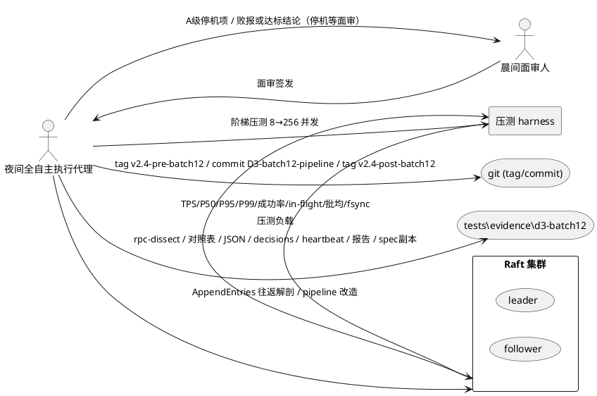
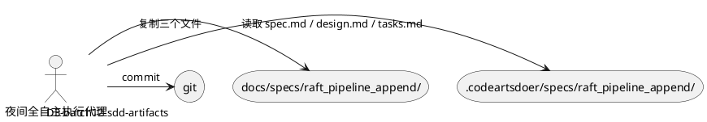
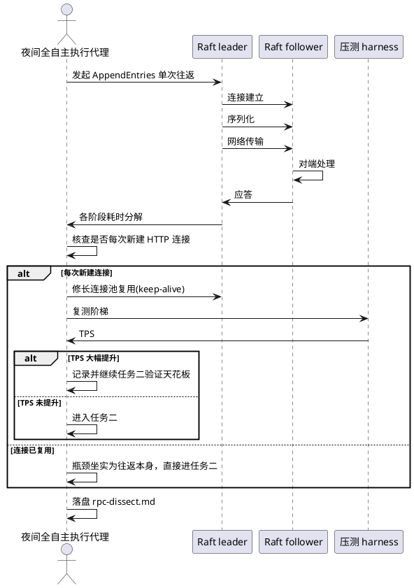
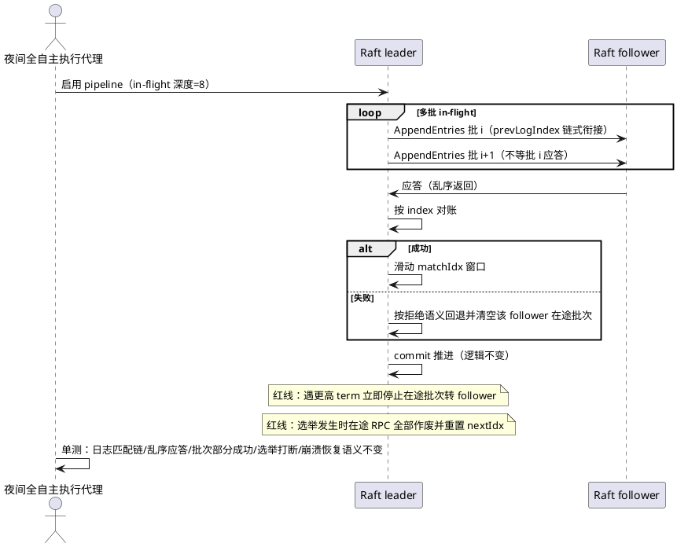
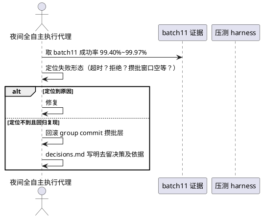
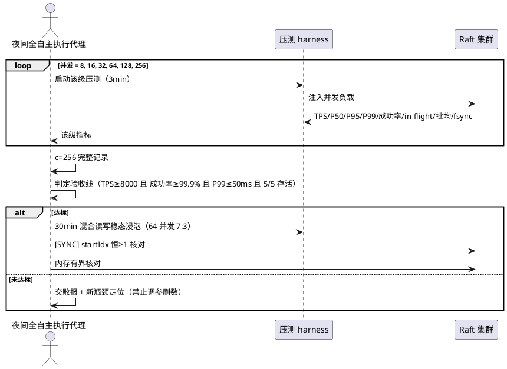

# **1. 组件定位**

## **1.1 核心职责**
本组件负责对 Raft AppendEntries RPC 往返进行耗时解剖并实现 pipeline 化，消除 quorum 往返串行等待（in-flight=1）瓶颈，达成 TPS≥8000 / 成功率≥99.9% / P99≤50ms / 5/5 存活的验收线。

前置背景：batch11 结论复核确认 fsync 已批量非瓶颈，真瓶颈为 quorum 往返串行等待（in-flight=1）。本批次先解剖往返、修便宜嫌疑，再上 pipeline。

复工前置：本批次为审计终审签发的夜间全自主复工。开工前须依次完成三项前置安全与基线统一工作——(1) git bundle 全量备份并验证可读；(2) 对三个未提交改动文件（raft.go / raft_batch11_test.go / tools/loadgen/main.go）逐文件验尸，判定来历后统一 stash，工作树回归 tag v2.4-post-batch11 干净态；(3) SDD 产物迁移入仓库 docs/specs/。三项前置完成后方从干净锚点开工执行任务一至任务四。

已知风险背景：(1) pipeline 存在已知 correctness bug——c=8 fresh cluster 请求全挂起，疑似 proposeBatchLoop 卡住（propose 入口阻塞），fireOnCommit/notifyCommit 均已证伪，须在任务二主体手术中排查修复；(2) loadgen 存在已知 bug——4/5 请求发往 follower 被拒但计为成功，历史 TPS 失真，须在任务四阶梯复测中修正 loadgen 仅发 leader 端点。

## **1.2 核心输入**
1. **阶梯压测负载**：来源压测 harness，内容为 8→16→32→64→128→256 并发，每级 3min 的负载序列。
2. **AppendEntries 单次往返**：来源 leader→follower 的 RPC 调用，内容为连接建立 / 序列化 / 网络 / 对端处理 / 应答各阶段耗时。
3. **batch11 成功率回归数据**：来源既有证据，内容为 99.40%~99.97% 的成功率区间及失败形态。
4. **batch10/11 阶梯对照基线**：来源既有证据，内容为两批次阶梯 TPS / P50 / P95 / P99 / 成功率 / in-flight 深度 / 批均条数 / fsync 每秒次数。
5. **三个未提交改动文件**：来源工作树 git diff，内容为 raft.go / raft_batch11_test.go / tools/loadgen/main.go 的未提交改动 hunk，用于逐文件验尸判定来历。
6. **batch11 验收态与 commit 552a247 已含内容**：来源版本控制历史与既有证据，用于验尸时对照判定未提交改动是遗留 WIP、漏提交残片还是 tag 之后的新改动。
7. **git bundle 备份产物**：来源 git bundle create 命令，内容为落盘仓库全量备份，须验证可读后方可继续。

## **1.3 核心输出**
1. **git bundle 全量备份**：落盘至仓库上级目录，开工前必须完成并验证可读，作为全量回滚安全垫。
2. **验尸记录**：落盘至 `tests\evidence\d3-batch12\decisions.md`，含三个未提交改动文件的逐 hunk 概述、来历判定（遗留 WIP / 漏提交残片 / tag 后新改动）、与 batch11 成功率回归相关性判定、stash 处置说明。
3. **SDD 产物迁移**：将 `.codeartsdoer/specs/raft_pipeline_append/` 下 spec.md / design.md / tasks.md 复制入仓库 `docs/specs/raft_pipeline_append/`，commit "D3-batch12-sdd-artifacts"。
4. **rpc-dissect.md**：落盘至 `tests\evidence\d3-batch12\`，含 AppendEntries 单次往返实测分解数据。
5. **batch10 vs 11 vs 12 三列对照表**：落盘至 `tests\evidence\d3-batch12\`，三批次阶梯指标逐级对照。
6. **阶梯原始数据 JSON**：落盘至 `tests\evidence\d3-batch12\`，逐级 TPS / P50 / P95 / P99 / 成功率 / in-flight 深度 / 批均条数 / fsync 每秒次数。
7. **decisions.md**：落盘至 `tests\evidence\d3-batch12\`，A/B/C 分级决策逐条落盘（含验尸记录）。
8. **heartbeat.log**：落盘至 `tests\evidence\d3-batch12\`，5分钟一行全时段。
9. **报告.md**：落盘至 `tests\evidence\d3-batch12\`，先结论后细节，败报照交不追责。
10. **spec.md 副本**：落盘至 `tests\evidence\d3-batch12\`。
11. **commit D3-batch12-pipeline + tag v2.4-post-batch12**：版本控制产物，签发后停机等晨间面审。

## **1.4 职责边界**
1. **不许牺牲正确性**：乱序应答必须按 term/index 对账；遇更高 term 立即停止在途批次转 follower；选举发生时在途 RPC 全部作废并重置 nextIdx。
2. **禁止去 fsync / 跳 quorum / 缩选举超时刷数**。
3. **禁止调参刷数**：未达标照交败报 + 新瓶颈定位，禁止调参刷数。
4. **禁止自行开始任何新优化**：commit + tag 后停机等晨间面审。
5. **pipeline 不强依赖 group commit 攒批层**：任务三可回滚 group commit 攒批层而不影响 pipeline。
6. **不负责晨间面审后的后续优化方向裁决**：本组件止于 batch12 产物签发与败报交付。
7. **D 盘仓库为唯一活仓库**：开工前 bundle 备份必须完成并验证；禁止在非 D 盘仓库执行任何改动操作。
8. **基线统一原则**：batch12 开工基线 = tag v2.4-post-batch11 干净态；任何存疑代码不进基线，验尸判定为可疑或来历不明者一律 stash 保存并标注说明，工作树回归 tag 干净态后从干净锚点开工。
9. **验尸不许 commit 不许丢弃**：三个未提交改动文件仅查看与判定，不许 commit 也不许丢弃，处置仅限 stash 保存并标注。
10. **已知 bug 须在对应任务中排查修复**：pipeline c=8 挂起 bug 须在任务二主体手术中排查修复；loadgen 4/5 误计 bug 须在任务四阶梯复测中修正为仅发 leader 端点。

# **2. 领域术语**

**pipeline**
: leader 对每个 follower 维护的流水线，允许上一批 AppendEntries 未收到应答也允许发下一批，多批 in-flight。

**in-flight 深度**
: 同一 follower 上同时在途未应答的 AppendEntries 批次数量，初始可配为 8。
: 备注：batch11 真瓶颈即 in-flight=1（串行等待）。

**quorum 往返串行等待**
: leader 每发一批 AppendEntries 必须等待 quorum 应答后才发下一批，导致往返 RTT 成为吞吐瓶颈。
: 备注：batch11 复核确认此为真瓶颈，fsync 已非瓶颈。

**prevLogIndex 链式衔接**
: pipeline 内每批 AppendEntries 以前一批的 prevLogIndex 链式衔接，利用日志匹配性质保证乱序到达时可判定有效性。

**matchIdx 滑动窗口**
: 应答乱序返回时按 index 对账，成功则滑动 matchIdx 窗口，用于 commit 推进。

**term/index 对账**
: 乱序应答必须按 term 与 index 进行对账的校验机制，保证 pipeline 不牺牲正确性。

**group commit 攒批层**
: 既有的请求攒批机制，pipeline 不强依赖它；任务三可回滚此层。
: 备注：batch11 成功率 99.40%~99.97% 的可能成因之一为攒批窗口空等。

**攒批窗口空等**
: group commit 攒批层在无请求到达时窗口空转等待，可能引入超时形态的失败。

**阶梯复测**
: 按 8→16→32→64→128→256 并发逐级压测、每级 3min 的固定复测协议，同 batch10/11。

**A/B/C 分级授权**
: 夜间全自主执行的决策分级：A级停机等面审 / B级记录绕行 / C级忽略记档。
: 备注：沿用既有分级体系；本批次 A 级追加一条：bundle 备份失败。

**验尸**
: 对三个未提交改动文件（raft.go / raft_batch11_test.go / tools/loadgen/main.go）逐文件查看 git diff，回答三个问题：改了什么、是否属于 batch11 已验证范围、是否可能与 batch11 成功率回归 99.40% 相关。
: 备注：验尸不许 commit 不许丢弃，处置仅限 stash 保存并标注说明。

**基线统一**
: batch12 开工基线 = tag v2.4-post-batch11 干净态；任何存疑代码不进基线，验尸后工作树回归 tag 干净态从干净锚点开工。
: 备注：确保 batch12 手术不混入来历不明代码。

**bundle 备份**
: 开工前执行 git bundle create 落盘仓库全量备份，并验证 bundle 可读，作为全量回滚安全垫。
: 备注：bundle 备份失败为 A 级停机项。

**干净锚点**
: tag v2.4-post-batch11 对应的工作树状态，无未提交改动，作为 batch12 所有任务的开工起点。

**已知 correctness bug（pipeline c=8 挂起）**
: pipeline 在 c=8 fresh cluster 下请求全挂起，疑似 proposeBatchLoop 卡住（propose 入口阻塞），fireOnCommit/notifyCommit 均已证伪。
: 备注：须在任务二主体手术中排查修复。

**已知 loadgen bug（4/5 误计）**
: loadgen 按 workerID % 5 分配端点，4/5 请求发往 follower 被拒但计为成功，历史 TPS 失真。
: 备注：须在任务四阶梯复测中修正为仅发 leader 端点。

# **3. 角色与边界**

## **3.1 核心角色**
1. **夜间全自主执行代理**：在 A/B/C 分级授权下执行任务一至任务四，逐条落盘 decisions.md。
2. **晨间面审人**：对 A 级停机项与最终败报/达标结论进行面审签发。

## **3.2 外部系统**
1. **Raft 集群（leader/follower）**：被解剖与改造的对象，提供 AppendEntries 往返、pipeline 语义、选举事件、commit 推进。
2. **压测 harness**：提供阶梯压测负载与 TPS / P50 / P95 / P99 / 成功率 / in-flight 深度 / 批均条数 / fsync 每秒次数采集。
3. **版本控制系统（git）**：接收 tag v2.4-pre-batch12、commit D3-batch12-pipeline、tag v2.4-post-batch12。

## **3.3 交互上下文**


# **4. DFX约束**

## **4.1 性能**
1. **TPS 下限**：验收线 TPS≥8000。
2. **尾延迟上限**：验收线 P99≤50ms。
3. **分级延迟必报**：P99 / P50 / P95 每级必报；缺席视为 A 级停机项，连续两批缺失则纪律升格。
4. **pipeline 深度**：in-flight 深度可配，初始 8。

## **4.2 可靠性**
1. **成功率下限**：验收线成功率≥99.9%。
2. **存活要求**：5/5 存活。
3. **乱序应答正确性**：乱序应答必须按 term/index 对账。
4. **更高 term 处置**：遇更高 term 立即停止在途批次转 follower。
5. **选举打断处置**：选举发生时在途 RPC 全部作废并重置 nextIdx。
6. **commit 推进不变**：commit 推进逻辑不变。
7. **崩溃恢复语义不变**：崩溃恢复语义不变。
8. **bundle 备份可靠性**：开工前 git bundle 全量备份必须完成并验证可读；bundle 备份失败为 A 级停机项，禁止在备份未验证前执行任何改动操作。
9. **D 盘仓库为唯一活仓库**：所有改动操作仅在 D 盘仓库执行；禁止在非 D 盘仓库执行任何改动操作。

## **4.3 安全性**
1. **正确性红线**：pipeline 不许牺牲正确性。
2. **禁止刷数手段**：禁止去 fsync / 跳 quorum / 缩选举超时刷数；禁止调参刷数。

## **4.4 可维护性**
1. **决策落盘**：A/B/C 分级决策全部逐条落盘 decisions.md。
2. **心跳日志**：heartbeat.log 5分钟一行全时段。
3. **报告规范**：报告.md 先结论后细节，败报照交不追责。
4. **回滚锚点**：开工前先打 tag v2.4-pre-batch12。
5. **基线统一原则**：batch12 开工基线 = tag v2.4-post-batch11 干净态；验尸后存疑代码一律 stash，工作树回归干净锚点后开工；任何来历不明代码不进基线。
6. **验尸记录可追溯**：三个未提交改动文件的验尸结论（改了什么 / 是否属于 batch11 已验证范围 / 是否与回归相关 / 处置方式）全部落盘 decisions.md，留待晨间面审。

## **4.5 兼容性**
1. **术式同源**：pipeline 术式采用 etcd 3.x 同源方案。
2. **commit 语义兼容**：commit 推进逻辑不变。
3. **崩溃恢复兼容**：崩溃恢复语义不变。
4. **攒批层解耦**：pipeline 不强依赖 group commit 攒批层，可独立回滚。

# **5. 核心能力**

## **5.0 前置安全与基线统一**

### **5.0.1 bundle 全量备份与验证**

#### **业务规则**
1. **备份规则**：开工前在 D 盘仓库执行 git bundle create 落盘仓库全量备份至仓库上级目录。
   a. 验收条件：当执行前置安全垫时，系统应当生成 bundle 文件且包含全量分支与 tag。
2. **验证规则**：备份完成后必须验证 bundle 可读（如 git bundle verify 或 clone 测试）。
   a. 验收条件：当 bundle 生成后，系统应当验证 bundle 可读并通过验证。
3. **前置门禁规则**：bundle 备份未完成或未验证前，禁止执行任何后续操作（验尸 / SDD 迁移 / 打 tag / 任务一至四）。
   a. 验收条件：当 bundle 未验证时，系统应当阻止后续所有操作。

#### **交互流程**
```plantuml
@startuml
actor "夜间全自主执行代理" as Agent
storage "D 盘仓库" as Repo
storage "bundle 文件" as Bundle

Agent -> Repo : 切换工作目录至 D 盘仓库
Agent -> Repo : git bundle create ../raftkv-v24-backup-pre-batch12.bundle --all
Repo -> Bundle : 落盘全量备份
Agent -> Bundle : 验证 bundle 可读（git bundle verify）
Bundle -> Agent : 验证通过
note over Agent : 前置门禁：未验证通过则禁止后续所有操作
@enduml
```

#### **异常场景**
1. **bundle 备份失败**
   a. 触发条件：git bundle create 执行失败或生成的 bundle 文件不可读。
   b. 系统行为：判定为 A 级停机项，落盘 decisions.md，停机等面审。
   c. 用户感知：A级停机等面审，不继续任何后续操作。

### **5.0.2 三个未提交改动验尸与处置**

#### **业务规则**
1. **验尸范围规则**：对 raft.go / raft_batch11_test.go / tools/loadgen/main.go 三个文件的未提交改动逐文件查看 git diff。
   a. 验收条件：当执行验尸时，系统应当逐文件输出 git diff 的逐 hunk 概述。
2. **三问规则**：每个文件回答三个问题：(1) 改了什么（逐 hunk 概述）；(2) 是否属于 batch11 已验证范围——对照 batch11 证据与 commit 552a247 已含内容，判定为遗留 WIP / 漏提交残片 / tag 之后的新改动；(3) 是否可能与 batch11 成功率回归 99.40% 相关。
   a. 验收条件：当每个文件验尸完成时，系统应当给出三个问题的明确结论。
3. **处置规则**：与 batch11 验收态无关/可疑 → stash 保存并标注说明；判定为 batch11 漏提交的组成且无害 → 也先 stash 留待面审，不让来历不明代码混入手术。所有处置后工作树回归 tag v2.4-post-batch11 干净态。
   a. 验收条件：当验尸处置完成时，工作树应当处于 tag v2.4-post-batch11 干净态（无未提交改动），所有 stash 已标注说明。
4. **不许 commit 不许丢弃规则**：验尸过程不许 commit 也不许丢弃未提交改动，处置仅限 stash。
   a. 验收条件：当验尸过程中，系统不应当执行任何 git commit 或丢弃操作。
5. **落盘规则**：全部验尸结论（改了什么 / 是否属于 batch11 已验证范围 / 是否与回归相关 / 处置方式）落盘 decisions.md。
   a. 验收条件：当验尸完成时，decisions.md 应当含三个文件的完整验尸记录。

#### **交互流程**
```plantuml
@startuml
actor "夜间全自主执行代理" as Agent
storage "工作树" as Worktree
storage "decisions.md" as Decisions

Agent -> Worktree : git diff raft.go
Agent -> Worktree : git diff raft_batch11_test.go
Agent -> Worktree : git diff tools/loadgen/main.go
loop 每个文件
  Agent -> Agent : 问1：改了什么（逐 hunk 概述）
  Agent -> Agent : 问2：是否属于 batch11 已验证范围（遗留WIP/漏提交残片/tag后新改动）
  Agent -> Agent : 问3：是否可能与 batch11 成功率回归 99.40% 相关
end
Agent -> Worktree : git stash 保存并标注说明（不许 commit 不许丢弃）
Agent -> Worktree : 工作树回归 tag v2.4-post-batch11 干净态
Agent -> Decisions : 落盘全部验尸结论
@enduml
```

#### **异常场景**
1. **无法判定来历**
   a. 触发条件：某文件改动无法明确判定属于遗留 WIP / 漏提交残片 / tag 后新改动中的哪一类。
   b. 系统行为：按 B 级记录绕行，保守 stash 保存并标注"来历不明"，落盘 decisions.md。
   c. 用户感知：B 级记录绕行，该改动不进基线，留待晨间面审。
2. **工作树无法回归干净态**
   a. 触发条件：stash 后工作树仍有未提交改动，无法回归 tag v2.4-post-batch11 干净态。
   b. 系统行为：判定为 A 级停机项，落盘 decisions.md，停机等面审。
   c. 用户感知：A级停机等面审，不继续后续任务。

### **5.0.3 SDD 产物迁移**

#### **业务规则**
1. **迁移规则**：将 `.codeartsdoer/specs/raft_pipeline_append/` 下 spec.md / design.md / tasks.md 复制入仓库 `docs/specs/raft_pipeline_append/`。
   a. 验收条件：当执行 SDD 迁移时，仓库 `docs/specs/raft_pipeline_append/` 下应当存在 spec.md / design.md / tasks.md 三个文件。
2. **提交规则**：迁移后 commit "D3-batch12-sdd-artifacts"。
   a. 验收条件：当迁移完成时，系统应当产生 commit "D3-batch12-sdd-artifacts" 且含三个 SDD 产物文件。

#### **交互流程**


#### **异常场景**
1. **SDD 产物文件缺失**
   a. 触发条件：`.codeartsdoer/specs/raft_pipeline_append/` 下缺少 spec.md / design.md / tasks.md 中任一文件。
   b. 系统行为：判定为 A 级停机项，落盘 decisions.md，停机等面审。
   c. 用户感知：A级停机等面审，不继续后续任务。

## **5.1 任务一：RPC 往返解剖（动刀前取证）**

### **5.1.1 业务规则**
1. **往返分解规则**：对 leader→follower 的 AppendEntries 单次往返做耗时分解，分解维度为连接建立 / 序列化 / 网络 / 对端处理 / 应答。
   a. 验收条件：当执行任务一时，系统应当输出含实测分解数据的 rpc-dissect.md。
2. **连接复用核查规则**：核对当前代码是否每次新建 HTTP 连接。
   a. 验收条件：当执行任务一时，系统应当明确判定连接是否每次新建。
3. **分支决策规则（B级自主）**：
   - 若发现每次新建连接：先修长连接池复用（keep-alive），修完先复测阶梯——若 TPS 已大幅提升，记录并继续任务二验证天花板。
   - 若连接已复用：瓶颈坐实为往返本身，直接进任务二。
   a. 验收条件：当连接每次新建时，系统应当先修 keep-alive 并复测阶梯；当连接已复用时，系统应当直接进入任务二。
4. **落盘规则**：rpc-dissect.md 含实测分解数据。
   a. 验收条件：当任务一完成时，系统应当落盘 rpc-dissect.md 且含实测分解数据。

### **5.1.2 交互流程**


### **5.1.3 异常场景**
1. **分解数据与模型对不上**
   a. 触发条件：任务一分解数据与模型对不上（瓶颈在已列嫌疑外）。
   b. 系统行为：判定为 A 级停机项，落盘 decisions.md，停机等面审。
   c. 用户感知：A级停机等面审，不继续后续任务。
2. **连接复用核查无法判定**
   a. 触发条件：代码结构无法明确判定是否每次新建连接。
   b. 系统行为：按 B 级记录绕行，落盘 decisions.md，选择保守路径执行。
   c. 用户感知：B 级记录绕行，继续执行。

## **5.2 任务二：pipeline AppendEntries（主体手术）**

### **5.2.1 业务规则**
1. **流水线允许规则**：leader 对每个 follower 维护流水线，上一批 AppendEntries 未收到应答也允许发下一批，多批 in-flight（深度可配，初始 8）。
   a. 验收条件：当 leader 向 follower 发送 AppendEntries 时，系统应当允许 in-flight 多批（初始深度 8）而不阻塞等待上一批应答。
2. **日志顺序保持规则**：每个 follower 的 pipeline 内保持日志顺序，按 prevLogIndex 链式衔接，利用日志匹配性质保证乱序到达时可判定有效性。
   a. 验收条件：当多批 AppendEntries 乱序到达 follower 时，系统应当能按 prevLogIndex 链式衔接判定各批有效性。
3. **乱序应答对账规则**：应答乱序返回时按 index 对账，成功则滑动 matchIdx 窗口，失败按拒绝语义回退并清空该 follower 在途批次。
   a. 验收条件：当应答乱序返回时，系统应当按 index 对账，成功滑动 matchIdx，失败回退并清空在途批次。
4. **commit 推进不变规则**：commit 推进逻辑不变。
   a. 验收条件：当 pipeline 上线后，系统应当保持与改造前一致的 commit 推进逻辑。
5. **更高 term 停止规则（红线）**：遇更高 term 立即停止在途批次转 follower。
   a. 验收条件：当系统遇到更高 term 时，应当立即停止在途批次并转 follower。
6. **选举打断作废规则（红线）**：选举发生时在途 RPC 全部作废并重置 nextIdx。
   a. 验收条件：当选举发生时，系统应当将在途 RPC 全部作废并重置 nextIdx。
7. **术式同源规则**：采用 etcd 3.x 同源方案。
   a. 验收条件：当实现 pipeline 时，系统应当遵循 etcd 3.x 同源方案。
8. **单测覆盖规则**：单测覆盖日志匹配链 / 乱序应答 / 批次部分成功 / 选举打断在途批次 / 崩溃恢复语义不变。
   a. 验收条件：当任务二完成时，系统应当通过上述全部单测。

### **5.2.2 交互流程**


### **5.2.3 异常场景**
1. **批次部分成功**
   a. 触发条件：同一 follower 的多批 in-flight 中部分应答成功、部分失败。
   b. 系统行为：成功批次滑动 matchIdx，失败批次按拒绝语义回退并清空该 follower 在途批次。
   c. 用户感知：pipeline 自动恢复，正确性不破坏。
2. **选举打断在途批次**
   a. 触发条件：pipeline 在途期间发生选举。
   b. 系统行为：在途 RPC 全部作废并重置 nextIdx。
   c. 用户感知：选举完成后按新 leader 重建 pipeline，正确性不破坏。
3. **遇更高 term**
   a. 触发条件：在途批次期间发现更高 term。
   b. 系统行为：立即停止在途批次转 follower。
   c. 用户感知：节点转 follower，正确性不破坏。
4. **崩溃恢复语义变化**
   a. 触发条件：单测发现崩溃恢复语义与改造前不一致。
   b. 系统行为：判定为正确性问题，按 A 级停机项处理。
   c. 用户感知：A级停机等面审。

## **5.3 任务三：成功率回归定性（还 batch11 的账）**

### **5.3.1 业务规则**
1. **失败形态定位规则**：定位 batch11 成功率 99.40%~99.97%（首破 99.9% 线）的级别与失败形态（超时？拒绝？攒批窗口空等？）。
   a. 验收条件：当执行任务三时，系统应当给出 batch11 成功率区间的失败形态定性。
2. **验尸证据纳入规则**：若前置验尸（5.0.2）发现 raft.go 未提交改动与 batch11 成功率回归 99.40% 相关，将该改动的验尸结论一并纳入任务三的定性证据。
   a. 验收条件：当验尸判定 raft.go 改动与回归相关时，任务三定性证据应当包含该改动的验尸结论。
3. **定位到则修复规则**：定位到原因 → 修复。
   a. 验收条件：当定位到失败原因时，系统应当实施修复。
4. **定位不到则回滚规则**：定位不到且回归复现 → 回滚 group commit 攒批层（pipeline 不强依赖它），decisions.md 写明去留决策及依据。
   a. 验收条件：当定位不到且回归复现时，系统应当回滚 group commit 攒批层并在 decisions.md 写明去留决策及依据。
5. **解耦规则**：pipeline 不强依赖 group commit 攒批层。
   a. 验收条件：当回滚 group commit 攒批层时，系统应当不影响 pipeline 主体功能。

### **5.3.2 交互流程**


### **5.3.3 异常场景**
1. **失败形态无法定性**
   a. 触发条件：既定位不到原因，也无法回归复现。
   b. 系统行为：按 B 级记录绕行，回滚 group commit 攒批层，decisions.md 写明决策及依据。
   c. 用户感知：B 级记录绕行，pipeline 主体继续验证。
2. **回滚后 pipeline 受影响**
   a. 触发条件：回滚 group commit 攒批层后 pipeline 主体功能受损。
   b. 系统行为：判定为解耦破坏，按 A 级停机项处理。
   c. 用户感知：A级停机等面审。

## **5.4 任务四：阶梯复测 + 对照验收**

### **5.4.1 业务规则**
1. **阶梯协议规则**：同 batch10/11 阶梯（8→16→32→64→128→256 并发，每级 3min）。
   a. 验收条件：当执行任务四时，系统应当按 8→16→32→64→128→256 并发、每级 3min 执行阶梯复测。
2. **逐级必报规则**：逐级报 TPS / P50 / P95 / P99 / 成功率 / in-flight 深度 / 批均条数 / fsync 每秒次数。
   a. 验收条件：当每级阶梯完成时，系统应当输出上述全部指标。
3. **c=256 完整记录规则**：c=256 必须完整记录。
   a. 验收条件：当并发=256 级执行时，系统应当完整记录该级全部指标。
4. **验收线规则**：TPS≥8000 且成功率≥99.9% 且 P99≤50ms 且 5/5 存活。
   a. 验收条件：当阶梯复测完成时，系统应当判定是否同时满足 TPS≥8000、成功率≥99.9%、P99≤50ms、5/5 存活。
5. **达标则稳态浸泡规则**：达标则追加 30min 混合读写稳态浸泡（64 并发 7:3）+ [SYNC] startIdx 恒>1 核对 + 内存有界核对。
   a. 验收条件：当验收线达标时，系统应当执行 30min 混合读写稳态浸泡（64 并发 7:3）、[SYNC] startIdx 恒>1 核对、内存有界核对。
6. **未达标败报规则**：未达标照交败报 + 新瓶颈定位，禁止调参刷数。
   a. 验收条件：当验收线未达标时，系统应当交付败报与新瓶颈定位且不调参刷数。
7. **分级延迟必报规则（红线）**：P99 / P50 / P95 每级必报；缺席视为 A 级停机项，连续两批缺失则纪律升格。
   a. 验收条件：当任一级阶梯缺少 P99/P50/P95 时，系统应当判为 A 级停机项。

### **5.4.2 交互流程**


### **5.4.3 异常场景**
1. **单级异常**
   a. 触发条件：某级阶梯压测出现异常（非 OOM/节点死亡/正确性问题）。
   b. 系统行为：按 B 级记录绕行，单级异常降级续跑。
   c. 用户感知：B 级记录绕行，阶梯继续。
2. **OOM / 节点死亡**
   a. 触发条件：压测期间发生 OOM 或节点死亡。
   b. 系统行为：判定为 A 级停机项，落盘 decisions.md，停机等面审。
   c. 用户感知：A级停机等面审。
3. **数据正确性问题**
   a. 触发条件：稳态浸泡或核对发现数据正确性问题。
   b. 系统行为：判定为 A 级停机项，落盘 decisions.md，停机等面审。
   c. 用户感知：A级停机等面审。
4. **[SYNC] startIdx 不恒>1**
   a. 触发条件：稳态浸泡期间 [SYNC] startIdx 出现不大于 1 的情况。
   b. 系统行为：判定为正确性问题，按 A 级停机项处理。
   c. 用户感知：A级停机等面审。
5. **内存无界**
   a. 触发条件：内存有界核对发现内存无界增长。
   b. 系统行为：判定为 OOM 风险，按 A 级停机项处理。
   c. 用户感知：A级停机等面审。
6. **P99/P50/P95 缺席**
   a. 触发条件：某级阶梯未报 P99 或 P50 或 P95。
   b. 系统行为：视为 A 级停机项；连续两批缺失则纪律升格。
   c. 用户感知：A级停机等面审。

# **6. 数据约束**

## **6.1 阶梯压测参数**
1. **并发序列**：8 → 16 → 32 → 64 → 128 → 256，严格递增，不许跳级。
2. **每级时长**：3min，固定。
3. **c=256**：必须完整记录，不许省略。

## **6.2 pipeline 参数**
1. **in-flight 深度**：可配，初始 8。
2. **prevLogIndex 链式衔接**：每批按前一批 prevLogIndex 链式衔接。
3. **matchIdx 窗口**：按 index 滑动。

## **6.3 验收线**
1. **TPS**：≥8000。
2. **成功率**：≥99.9%。
3. **P99**：≤50ms。
4. **存活**：5/5。
5. **达标后稳态浸泡**：30min 混合读写（64 并发 7:3）+ [SYNC] startIdx 恒>1 + 内存有界。

## **6.4 稳态浸泡参数**
1. **时长**：30min。
2. **并发**：64。
3. **读写比**：7:3。
4. **[SYNC] startIdx**：恒>1。
5. **内存**：有界。

## **6.5 分级授权（A/B/C）**
1. **A级停机等面审**：OOM / 节点死亡 / 数据正确性问题 / 任务一分解数据与模型对不上（瓶颈在已列嫌疑外）/ bundle 备份失败 / 工作树无法回归干净态 / SDD 产物文件缺失。
2. **B级记录绕行**：单级异常降级续跑 / flaky 单测重跑 / 分支决策按任务一路径执行 / 验尸无法判定来历（保守 stash）。
3. **C级忽略记档**：日志格式 / 统计小数等小毛病。
4. **落盘要求**：全部逐条落盘 decisions.md。

## **6.6 产物清单**
1. **目录**：`tests\evidence\d3-batch12\`。
2. **spec.md 副本**：存在。
3. **rpc-dissect.md**：含实测分解数据。
4. **batch10 vs 11 vs 12 三列对照表**：存在。
5. **阶梯原始数据 JSON**：存在。
6. **decisions.md**：A/B/C 分级逐条落盘。
7. **heartbeat.log**：5分钟一行全时段。
8. **报告.md**：先结论后细节，败报照交不追责。
9. **commit**：D3-batch12-pipeline。
10. **tag**：v2.4-post-batch12。

## **6.7 tag 锚点**
1. **基线统一锚点**：batch12 开工基线 = tag v2.4-post-batch11 干净态；验尸 stash 后工作树回归此锚点。
2. **回滚锚点**：从干净锚点开工后先打 tag v2.4-pre-batch12，作为 batch12 全量回滚点。
3. **签发锚点**：commit D3-batch12-pipeline + tag v2.4-post-batch12，停机等晨间面审。
4. **终止约束**：禁止自行开始任何新优化。

## **6.8 验尸处置规则**
1. **验尸对象**：raft.go / raft_batch11_test.go / tools/loadgen/main.go 三个文件的未提交改动。
2. **验尸三问**：(1) 改了什么（逐 hunk 概述）；(2) 是否属于 batch11 已验证范围（遗留 WIP / 漏提交残片 / tag 后新改动）；(3) 是否可能与 batch11 成功率回归 99.40% 相关。
3. **处置方式**：一律 stash 保存并标注说明（不许 commit 不许丢弃）；与 batch11 验收态无关/可疑 → stash；判定为 batch11 漏提交且无害 → 也先 stash 留待面审。
4. **基线回归**：所有 stash 完成后工作树必须回归 tag v2.4-post-batch11 干净态。
5. **落盘要求**：三个文件的验尸结论全部落盘 decisions.md，留待晨间面审。